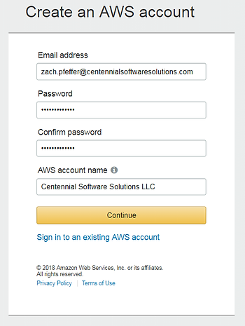
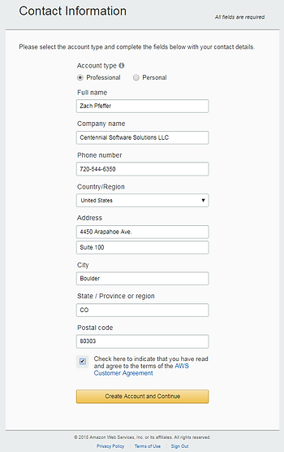
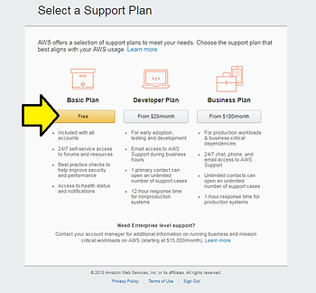
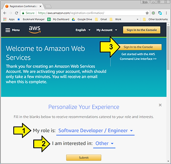
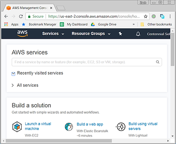
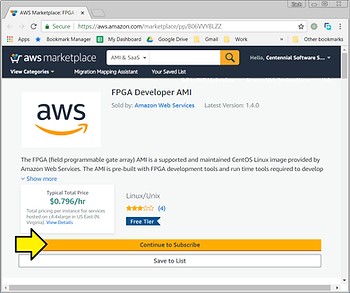
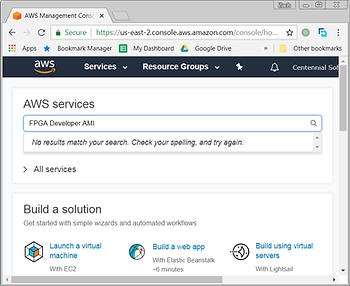

# $0.796 / Hour to Try Xilinx FPGA Accelerated OpenCL on AWS

A walk-through of setting up an AWS account to use Xilinx FPGA accelerated OpenCL (SDAccel) as shown in the _quick start guide_ at https://github.com/aws/aws-fpga/blob/master/SDAccel/README.md and the cost of the instance: $0.796 per hour.

**<u>Create an AWS Account</u>**

**Credit Card Required**

To get an AWS (even a free) account you will need to enter your contact info and a credit card.

**Phone Verification Required**

You will also be asked to phone verify with a [CAPTCHA](https://en.wikipedia.org/wiki/CAPTCHA) form. When I filled it out, it presented a 4 digit code that I needed to enter during an automated voice call. After entering in the 4 digits I was shown a green check box in my Chrome browser.

**Steps**

1\. Setup a free AWS account \[[link](https://portal.aws.amazon.com/billing/signup?redirect_url=https%3A%2F%2Faws.amazon.com%2Fregistration-confirmation#/start)\] (more account types at \[[link](https://aws.amazon.com/free/)\])

2\. Set up your contact info

3\. Provide your credit card and phone verify

4\. Select the _Basic Plan_

5\. (1,2) Personalize your Experience and (3) Sign In

6\. You should see the AWS service console

**<u>Launch the FPGA Developer AMI</u>**

**Access the FPGA Developer AMI**

Click on \[[link](https://aws.amazon.com/marketplace/pp/B06VVYBLZZ)\] to access the FPGA Developer AMI. Then click on **Continue to Subscribe**.

<u>Notes</u>

AMI stands for Amazon Machine Image

Typing **FPGA Developer AMI** into the AWS services search box brings up **No results match your search. Check your spelling, and try again**.

**<u>How Much Does it Cost?</u>**

On the **FPGA Developer AMI** page its lists that there's no-charge for the AMI (see \[[link](https://aws.amazon.com/marketplace/server/procurement?productId=40257ab5-6688-4c95-97d1-e251a40fd1fc)\]).

<u>However...</u>

\[[link](https://github.com/aws/aws-fpga/blob/master/SDAccel/README.md)\] says that you need to launch the **FPGA Developer AMI** on a machine with 30GiB. \[[link](https://aws.amazon.com/free/)\] says that the free Linux t2.micro instance has 1 GiB of memory. To get 30GiB you need to use a t2.2xlarge instance (see \[[link](https://aws.amazon.com/ec2/instance-types/)\]) which is $0.3712 per Hour with on-demand pricing (see \[[link](https://aws.amazon.com/ec2/pricing/on-demand/)\], yearly costs given at \[[link](https://aws.amazon.com/ec2/pricing/reserved-instances/pricing/)\]).

Amazon has another page that lists the AMI + AWS cost at \[[link](https://aws.amazon.com/marketplace/pp/B06VVYBLZZ)\]. So you'll need to budget around 2k per year to use Amazon's instance.

**<u>Vendor Recommendation</u>**

A c4.4xlarge instance is recommended (see \[[link](https://aws.amazon.com/marketplace/pp/B06VVYBLZZ)\]). This instance costs $0.796 per hour.

**<u>References</u>**

-   Quick Start Guide to Accelerating your C/C++ application on an AWS F1 FPGA Instance with SDAccel \[[link](https://github.com/aws/aws-fpga/blob/master/SDAccel/README.md)\]
    
-   SDAccel GUI Guide \[[link](https://github.com/aws/aws-fpga/blob/master/SDAccel/docs/README_GUI.md)\]
    
-   Amazon's Sept 5th 2017 OpenCL on FPGA availability announcement \[[link](https://aws.amazon.com/about-aws/whats-new/2017/09/use-opencl-development-environment-with-amazon-ec2-f1-fpga-instances-to-accelerate-your-c-c-plus-plus-applications-also-f1-instances-are-now-available-in-us-west-oregon-and-eu-ireland-regions/)\] and further details \[[link](https://github.com/aws/aws-fpga/blob/master/sdk/SDAccel/README.md)\]
    

**<u>Support Questions</u>**

**Can I use the d2.8xlarge FPGA Developer AMI instance for free?**

Under **Contact Us** at \[[link](https://aws.amazon.com/marketplace/help/contact-us?ref_=footer_nav_contact_us)\]

_Regarding: Account and Billing Support_

_Service: Marketplace_

_Category: Maketplace Buyer Request_

_Subject: Can I use the d2.8xlarge FPGA Developer AMI instance for free?_

_Description:_

_I would like to use the FPGA Developer AMI instance listed at:_

_https://aws.amazon.com/marketplace/server/procurement?productId=40257ab5-6688-4c95-97d1-e251a40fd1fc_

_I am currently in the "free tier."_

_From https://aws.amazon.com/s/dm/optimization/server-side-test/free-tier/free\_o/ I see that a Free Tier qualifies for:_

_"750 hours of Amazon EC2 Linux t2.micro instance usage (1 GiB of memory and 32-bit and 64-bit platform support) – enough hours to run continuously each month\*"_

_On_

_https://aws.amazon.com/marketplace/server/procurement?productId=40257ab5-6688-4c95-97d1-e251a40fd1fc_

_...all of the tiers are listed as $0 Software/hr._

_So can I use any of these for free? How many hours can I use them for free?_

<u>Answer</u>

_Hi there,_

_I understand you'd like to use the FPGA Developer AMI, and I'm happy to provide more information about the costs. With Marketplace AMIs, the software charges are billed separately from the AWS Infrastructure charges._

_Since the FPGA AMI has a software charge of $0, that means you will not be charged for the AMI regardless of instance type, however, there are still charges for the instance itself. Your account is covered by the Free Tier, which means that you could run the FPGA AMI on a t2.micro instance for 750 hours a month for free._

_If you used a d2.8xlarge instance, this would not be covered under the Free Tier, so you would accrue charges for the d2.8xlarge instance, but not for the FPGA AMI itself._

_Please let us know if you have any questions!_

_Best regards,_

_Jude Y._

_Amazon Web Services_

**Follow Up**

_Judy,_

_Thank you for the clear and concise answer. That makes sense (cents?) to me._

_Where would I find that information? Would you list a link?_

_\-Zach_

<u>Answer</u>

_Hi Zach!_

_You can see detailed pricing information for the different instance types at the link below:_

_https://aws.amazon.com/marketplace/pp/B06VVYBLZZ_

_Under the "Pricing" tab, there is a table on the right hand side that will show the details for each instance type in the selected region, as well as details about the Free Tier._

_I hope this helps, and please let me know if you have any other questions._