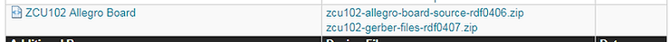
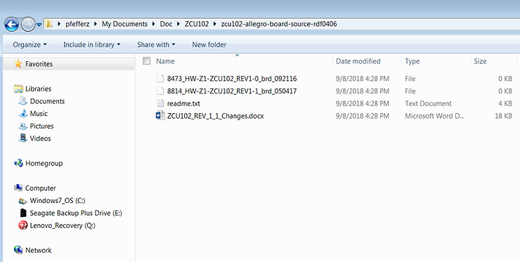
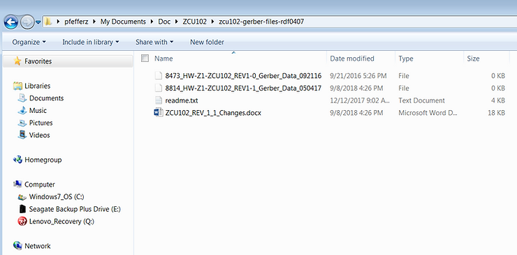

# 0 KB ZCU102 Board and Gerber File Archives Sept 8th 2018

As of Sept 8th 2018 I'm seeing 0 length allegro (board) and gerber files at the links posted by Xilinx at \[[<u>link</u>](https://www.xilinx.com/support/documentation-navigation/design-hubs/dh0048-zcu102-evaluation-kit-hub.html)\]:

zcu102-allegro-board-source-rdf0406.zip \[[<u>link</u>](https://www.xilinx.com/member/forms/download/design-license.html?cid=473362&filename=zcu102-allegro-board-source-rdf0406.zip)\]

zcu102-gerber-files-rdf0407.zip \[[<u>link</u>](https://www.xilinx.com/member/forms/download/design-license.html?cid=473363&filename=zcu102-gerber-files-rdf0407.zip)\]

**0 KB**

Is anyone else seeing this? Please let me know in the comments.

**<u>Reference</u>**

Xilinx logo found via [<u>https://twitter.com/xilinxinc</u>](https://twitter.com/xilinxinc) at \[[<u>link</u>](https://pbs.twimg.com/profile_images/535545777020338176/pEWdIYq__400x400.png)\]