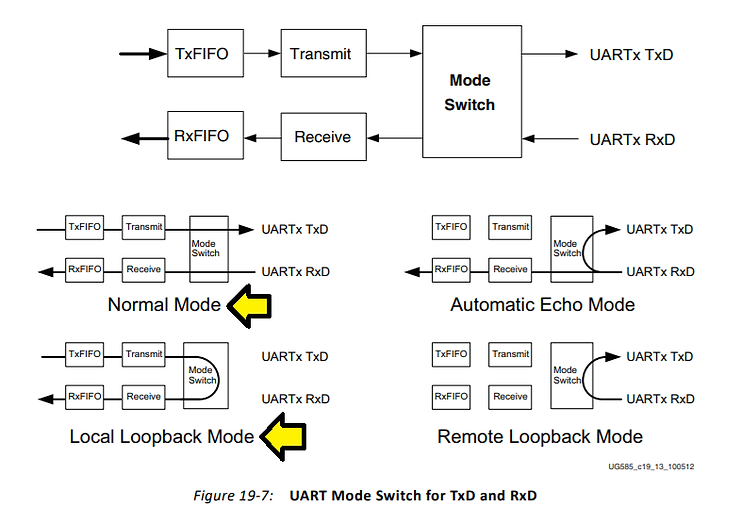

# 2016.4 xuartps_polled_example.c Annotated With Comments and Explanation

This post lists additional comments and explanation on the 2016.4 release of **xuartps_polled_example.c** from:  https://github.com/Xilinx/embeddedsw/blob/xilinx-v2016.4/XilinxProcessorIPLib/drivers/uartps/examples/xuartps_polled_example.c 

**Need Help?**

Click https://www.centennialsoftwaresolutions.com/post/import-xuartps_polled_example-c-into-a-xilinx-sdk-project if you need help bringing this example into and SDK project

**Comments and Additional Explanation**

/******************************************************************************

*

\* Copyright (C) 2010 - 2014 Xilinx, Inc.  All rights reserved.

*

\* Permission is hereby granted, free of charge, to any person obtaining a copy

\* of this software and associated documentation files (the "Software"), to deal

\* in the Software without restriction, including without limitation the rights

\* to use, copy, modify, merge, publish, distribute, sublicense, and/or sell

\* copies of the Software, and to permit persons to whom the Software is

\* furnished to do so, subject to the following conditions:

*

\* The above copyright notice and this permission notice shall be included in

\* all copies or substantial portions of the Software.

*

\* Use of the Software is limited solely to applications:

\* (a) running on a Xilinx device, or

\* (b) that interact with a Xilinx device through a bus or interconnect.

*

\* THE SOFTWARE IS PROVIDED "AS IS", WITHOUT WARRANTY OF ANY KIND, EXPRESS OR

\* IMPLIED, INCLUDING BUT NOT LIMITED TO THE WARRANTIES OF MERCHANTABILITY,

\* FITNESS FOR A PARTICULAR PURPOSE AND NONINFRINGEMENT. IN NO EVENT SHALL

\* XILINX  BE LIABLE FOR ANY CLAIM, DAMAGES OR OTHER LIABILITY,

\* WHETHER IN AN ACTION OF CONTRACT, TORT OR OTHERWISE, ARISING FROM, OUT OF

\* OR IN CONNECTION WITH THE SOFTWARE OR THE USE OR OTHER DEALINGS IN THE

\* SOFTWARE.

*

\* Except as contained in this notice, the name of the Xilinx shall not be used

\* in advertising or otherwise to promote the sale, use or other dealings in

\* this Software without prior written authorization from Xilinx.

*

******************************************************************************/

/****************************************************************************/

/**

*

\* @file     xuartps_polled_example.c

*

\* This file contains an example using the XUartPs driver in polled mode.

*

\* This function sends data and expects to receive the data thru the device

\* using the local loopback mode.

*

\* @note

\* If the device does not work properly, the example may hang.

*

\* MODIFICATION HISTORY:

\* <pre>

\* Ver   Who    Date     Changes

\* ----- ------ -------- -----------------------------------------------

\* 1.00a  drg/jz 01/13/10 First Release

\* 1.03a  sg     07/16/12 Modified the device ID to use the first Device Id

*			Removed the printf at the start of the main

\* </pre>

******************************************************************************/

/***************************** Include Files *********************************/

[#include](https://www.centennialsoftwaresolutions.com/blog/hashtags/include) "xparameters.h"

[#include](https://www.centennialsoftwaresolutions.com/blog/hashtags/include) "xuartps.h"

[#include](https://www.centennialsoftwaresolutions.com/blog/hashtags/include) "xil_printf.h"

/************************** Constant Definitions *****************************/

/*

 \* The following constants map to the XPAR parameters created in the

 \* xparameters.h file. They are defined here such that a user can easily

 \* change all the needed parameters in one place.

 */

[#define](https://www.centennialsoftwaresolutions.com/blog/hashtags/define) UART_DEVICE_ID              XPAR_XUARTPS_0_DEVICE_ID

**Where is XPAR_XUARTPS_0_DEVICE_ID defined?**

**XPAR_XUARTPS_0_DEVICE_ID** comes from **xparameters.h** in the **ps7_cortexa9_0/include/** directory of the BSP project used in the Xilinx SDK project.  

In xparameters.h you'll see:

/* Canonical definitions for peripheral PS7_UART_0 */

**[#define](https://www.centennialsoftwaresolutions.com/blog/hashtags/define) XPAR_XUARTPS_0_DEVICE_ID** XPAR_PS7_UART_0_DEVICE_ID

[#define](https://www.centennialsoftwaresolutions.com/blog/hashtags/define) XPAR_XUARTPS_0_BASEADDR 0xE0000000

[#define](https://www.centennialsoftwaresolutions.com/blog/hashtags/define) XPAR_XUARTPS_0_HIGHADDR 0xE0000FFF

[#define](https://www.centennialsoftwaresolutions.com/blog/hashtags/define) XPAR_XUARTPS_0_UART_CLK_FREQ_HZ 100000000

[#define](https://www.centennialsoftwaresolutions.com/blog/hashtags/define) XPAR_XUARTPS_0_HAS_MODEM 0

**Where is XPAR_PS7_UART_0_DEVICE_ID defined?**

**XPAR_PS7_UART_0_DEVICE_ID** is defined right above:

 

/* Definitions for peripheral PS7_UART_0 */

[#define](https://www.centennialsoftwaresolutions.com/blog/hashtags/define) **XPAR_PS7_UART_0_DEVICE_ID** 0

[#define](https://www.centennialsoftwaresolutions.com/blog/hashtags/define) XPAR_PS7_UART_0_BASEADDR 0xE0000000

[#define](https://www.centennialsoftwaresolutions.com/blog/hashtags/define) XPAR_PS7_UART_0_HIGHADDR 0xE0000FFF

[#define](https://www.centennialsoftwaresolutions.com/blog/hashtags/define) XPAR_PS7_UART_0_UART_CLK_FREQ_HZ 100000000

[#define](https://www.centennialsoftwaresolutions.com/blog/hashtags/define) XPAR_PS7_UART_0_HAS_MODEM 0

**Steps to Find where the Include Path is Specified**

Step [#1](https://www.centennialsoftwaresolutions.com/blog/hashtags/1): Right-click on your SDK project 

Step [#2](https://www.centennialsoftwaresolutions.com/blog/hashtags/2): Select **C/C++ Build Settings**

Step [#3](https://www.centennialsoftwaresolutions.com/blog/hashtags/3): Select **ARM v7 gcc compiler**

The include path is specified in the **All options:** window

/*

 \* The following constant controls the length of the buffers to be sent

 \* and received with the device, this constant must be 32 bytes or less since

 \* only as much as FIFO size data can be sent or received in polled mode.

 */

[#define](https://www.centennialsoftwaresolutions.com/blog/hashtags/define) TEST_BUFFER_SIZE 32

/**************************** Type Definitions *******************************/

/***************** Macros (Inline Functions) Definitions *********************/

/************************** Function Prototypes ******************************/

int UartPsPolledExample(u16 DeviceId);

/************************** Variable Definitions *****************************/

XUartPs Uart_PS;		/* Instance of the UART Device */

**Where is XUartPs defined?**

**XUartPs** is defined in **xuartps.h** in the **ps7_cortexa9_0/include/** directory of the BSP project used in the Xilinx SDK project.  

**How is XUartPs defined?**

**/\****

 *** The XUartPs driver instance data structure. A pointer to an instance data**

 *** structure is passed around by functions to refer to a specific driver**

 *** instance.**

 ***/**

**typedef struct {**

​	**XUartPs_Config Config;	/\* Configuration data structure \*/**

​	**u32 InputClockHz;	/\* Input clock frequency \*/**

​	**u32 IsReady;		/\* Device is initialized and ready \*/**

​	**u32 BaudRate;		/\* Current baud rate \*/**

​	**XUartPsBuffer SendBuffer;**

​	**XUartPsBuffer ReceiveBuffer;**

​	**XUartPs_Handler Handler;**

​	**void \*CallBackRef;	/\* Callback reference for event handler \*/**

​	**u32 Platform;**

​	**u8 is_rxbs_error;**

**} XUartPs;**

/*

 \* The following buffers are used in this example to send and receive data

 \* with the UART.

 */

static u8 SendBuffer[TEST_BUFFER_SIZE];	/* Buffer for Transmitting Data */

static u8 RecvBuffer[TEST_BUFFER_SIZE];	/* Buffer for Receiving Data */

**Why are these buffers 32 bytes?**

I'm not sure. The receive FIFO is 64 bytes and the transmit FIFO is 64 bytes as listed on page 590 of the Zynq-7000 TRM [[link](https://www.xilinx.com/support/documentation/user_guides/ug585-Zynq-7000-TRM.pdf)]. 

/*****************************************************************************/

/**

*

\* Main function to call the Uart Polled mode example.

*

\* @param	None

*

\* @return	XST_SUCCESS if succesful, otherwise XST_FAILURE

*

\* @note		None

*

******************************************************************************/

[#ifndef](https://www.centennialsoftwaresolutions.com/blog/hashtags/ifndef) TESTAPP_GEN

int main(void)

{

​	int Status;

​	/*

​	 * Run the Uart_PS polled example , specify the the Device ID that is

​	 * generated in xparameters.h

​	 */

​	Status = UartPsPolledExample(UART_DEVICE_ID);

​	if (Status != XST_SUCCESS) {

​		xil_printf("UART Polled Mode Example Test Failed\r\n");

​		return XST_FAILURE;

​	}

​	xil_printf("Successfully ran UART Polled Mode Example Test\r\n");

**Does the xil_printf still work?**

There appears to be a problem here, but there isn't. **xil_printf()** uses UART0 in Normal Mode (see page 598 of the Zynq-7000 TRM [[link](https://www.xilinx.com/support/documentation/user_guides/ug585-Zynq-7000-TRM.pdf)]). **UartPsPolledExample()** also uses UART0 and places UART0 into **Local Loopback Mode**. It appears that xil_printf() wouldn't work. However, xil_printf() does still work because **UartPsPolledExample()** restores UART0 to **Normal Mode.**

​	return XST_SUCCESS;

}

[#endif](https://www.centennialsoftwaresolutions.com/blog/hashtags/endif)

/*****************************************************************************/

/**

*

\* This function does a minimal test on the XUartPs device in polled mode.

*

\* This function sends data and expects to receive the data thru the UART

\* using the local loopback mode.

*

*

\* @param	DeviceId is the unique device id from hardware build.

*

\* @return	XST_SUCCESS if successful, XST_FAILURE if unsuccessful

*

\* @note

\* This function polls the UART, it may hang if the hardware is not

\* working correctly.

*

****************************************************************************/

int UartPsPolledExample(u16 DeviceId)

{

​	int Status;

​	XUartPs_Config *Config;

​	unsigned int SentCount;

​	unsigned int ReceivedCount;

​	u16 Index;

​	u32 LoopCount = 0;

​	/*

​	 * Initialize the UART driver so that it's ready to use.

​	 * Look up the configuration in the config table, then initialize it.

​	 */

​	Config = XUartPs_LookupConfig(DeviceId);

​	if (NULL == Config) {

​		return XST_FAILURE;

​	}

**Where is XUartPs_LookupConfig() and what does it do?**

**XUartPs_LookupConfig()** is located in **xuart_sint.c** which is located in the **ps7_cortexa9_0/libsrc/uartps_v3_3/src/** directory of the BSP project used in the Xilinx SDK project.  

It performs the following operations:

**/\**\**\**\**\**\**\**\**\**\**\**\**\**\**\**\**\**\**\**\**\**\**\**\**\**\**\**\**\**\**\**\**\**\**\**\**\**\**/**

**/\****

*****

*** Looks up the device configuration based on the unique device ID. The table**

*** contains the configuration info for each device in the system.**

*****

*** @param	DeviceId contains the ID of the device**

*****

*** @return	A pointer to the configuration structure or NULL if the**

***		specified device is not in the system.**

*****

*** @note		None.**

*****

***\**\**\**\**\**\**\**\**\**\**\**\**\**\**\**\**\**\**\**\**\**\**\**\**\**\**\**\**\**\**\**\**\**\**\**\**\**\**\*/**

**XUartPs_Config \*XUartPs_LookupConfig(u16 DeviceId)**

**{**

​	**XUartPs_Config \*CfgPtr = NULL;**

​	**u32 Index;**

​	**for (Index = 0U; Index < (u32)XPAR_XUARTPS_NUM_INSTANCES; Index++) {**

​		**if (XUartPs_ConfigTable[Index].DeviceId == DeviceId) {**

​			**CfgPtr = &XUartPs_ConfigTable[Index];**

​			**break;**

​		**}**

​	**}**

​	**return (XUartPs_Config \*)CfgPtr;**

**}**

**Where is XUartPs_ConfigTable[] defined and what does it contain?**

**XUartPs_ConfigTable[]** is defined in **xuartps_g.c** which is included in  **ps7_cortexa9_0/libsrc/uartps_v3_3/src/** and generated by HSI from the HDF.

Here's an example of how **XUartPs_ConfigTable[]** is defined:

**/\**\**\**\**\**\**\**\**\**\**\**\**\**\**\**\**\**\**\**\**\**\**\**\**\**\**\**\**\**\**\**\**\**\***

*****

*** CAUTION: This file is automatically generated by HSI.**

*** Version:** 

*** DO NOT EDIT.**

*****

*** Copyright (C) 2010-2019 Xilinx, Inc. All Rights Reserved.\***

***Permission is hereby granted, free of charge, to any person obtaining a copy**

***of this software and associated documentation files (the Software), to deal**

***in the Software without restriction, including without limitation the rights**

***to use, copy, modify, merge, publish, distribute, sublicense, and/or sell**

***copies of the Software, and to permit persons to whom the Software is**

***furnished to do so, subject to the following conditions:**

*****

***The above copyright notice and this permission notice shall be included in**

***all copies or substantial portions of the Software.**

***** 

*** Use of the Software is limited solely to applications:**

***(a) running on a Xilinx device, or**

***(b) that interact with a Xilinx device through a bus or interconnect.**

*****

***THE SOFTWARE IS PROVIDED AS IS, WITHOUT WARRANTY OF ANY KIND, EXPRESS OR**

***IMPLIED, INCLUDING BUT NOT LIMITED TO THE WARRANTIES OF MERCHANTABILITY,**

***FITNESS FOR A PARTICULAR PURPOSE AND NONINFRINGEMENT. IN NO EVENT SHALL** 

***XILINX BE LIABLE FOR ANY CLAIM, DAMAGES OR OTHER LIABILITY,**

***WHETHER IN AN ACTION OF CONTRACT, TORT OR OTHERWISE, ARISING FROM, OUT**

***OF OR IN CONNECTION WITH THE SOFTWARE OR THE USE OR OTHER DEALINGS IN THE SOFTWARE.**

*****

***Except as contained in this notice, the name of the Xilinx shall not be used**

***in advertising or otherwise to promote the sale, use or other dealings in**

***this Software without prior written authorization from Xilinx.**

*****

***** 

*** Description: Driver configuration**

*****

***\**\**\**\**\**\**\**\**\**\**\**\**\**\**\**\**\**\**\**\**\**\**\**\**\**\**\**\**\**\**\**\**\**/**

**[#include](https://www.centennialsoftwaresolutions.com/blog/hashtags/include) "xparameters.h"**

**[#include](https://www.centennialsoftwaresolutions.com/blog/hashtags/include) "xuartps.h"**

**/\***

*** The configuration table for devices**

***/**

**XUartPs_Config XUartPs_ConfigTable[] =**

**{**

​	**{**

​		**XPAR_PS7_UART_0_DEVICE_ID,**

​		**XPAR_PS7_UART_0_BASEADDR,**

​		**XPAR_PS7_UART_0_UART_CLK_FREQ_HZ,**

​		**XPAR_PS7_UART_0_HAS_MODEM**

​	**}**

**};**

​	Status = XUartPs_CfgInitialize(&Uart_PS, Config, Config->BaseAddress);

​	if (Status != XST_SUCCESS) {

​		return XST_FAILURE;

​	}

**Where is XUartPs_CfgInitialize() and what does it do?**

**XUartPs_CfgInitialize()** is located in **xuartps.c** which is located in the **ps7_cortexa9_0/libsrc/uartps_v3_3/src/** directory of the BSP project used in the Xilinx SDK project.  

**XUartPs_CfgInitialize() performs the following function:**

**/\**\**\**\**\**\**\**\**\**\**\**\**\**\**\**\**\**\**\**\**\**\**\**\**\**\**\**\**\**\**\**\**\**\**\**\**\**\**/**

**/\****

*****

*** Initializes a specific XUartPs instance such that it is ready to be used.**

*** The data format of the device is setup for 8 data bits, 1 stop bit, and no**

*** parity by default. The baud rate is set to a default value specified by**

*** Config->DefaultBaudRate if set, otherwise it is set to 19.2K baud. The**

*** receive FIFO threshold is set for 8 bytes. The default operating mode of the**

*** driver is polled mode.**

*****

*** @param	InstancePtr is a pointer to the XUartPs instance.**

*** @param	Config is a reference to a structure containing information**

***		about a specific XUartPs driver.**

*** @param	EffectiveAddr is the device base address in the virtual memory**

***		address space. The caller is responsible for keeping the address**

***		mapping from EffectiveAddr to the device physical base address**

***		unchanged once this function is invoked. Unexpected errors may**

***		occur if the address mapping changes after this function is**

***		called. If address translation is not used, pass in the physical**

***		address instead.**

*****

*** @return**

*****

***		- XST_SUCCESS if initialization was successful**

***		- XST_UART_BAUD_ERROR if the baud rate is not possible because**

***		  the inputclock frequency is not divisible with an acceptable**

***		  amount of error**

*****

*** @note**

*****

*** The default configuration for the UART after initialization is:**

*****

*** - 19,200 bps or XPAR_DFT_BAUDRATE if defined**

*** - 8 data bits**

*** - 1 stop bit**

*** - no parity**

*** - FIFO's are enabled with a receive threshold of 8 bytes**

*** - The RX timeout is enabled with a timeout of 1 (4 char times)**

*****

***   All interrupts are disabled.**

*****

***\**\**\**\**\**\**\**\**\**\**\**\**\**\**\**\**\**\**\**\**\**\**\**\**\**\**\**\**\**\**\**\**\**\**\**\**\**\**/**

​	/* Check hardware build. */

​	Status = XUartPs_SelfTest(&Uart_PS);

​	if (Status != XST_SUCCESS) {

​		return XST_FAILURE;

​	}

**XUartPs_SelfTest() performs a test very similar to the current test being documented. It only differs in sending and receiving data one byte at a time as opposed to 32 bytes at a time. Like the test calling it (this test) XUartPs_SelfTest also places the UART in local loopback. Before the XUartPs_SelfTest() function ends it restores the mode and saves the interrupt state and restores the mode.** 

**It specifically:**

​	**/\* Disable all interrupts in the interrupt disable register \*/**

​	**IntrRegister = XUartPs_ReadReg(InstancePtr->Config.BaseAddress,**

​				   **XUARTPS_IMR_OFFSET);**

**>>> InstancePtr->Config.BaseAddress is 0xE0000000 as listed above**

**>>> XUARTPS_IMR_OFFSET is 0x10. This is  the** **Interrupt Mask Register** **as listed on page 1774 of the TRM [**[**link**](https://www.xilinx.com/support/documentation/user_guides/ug585-Zynq-7000-TRM.pdf)**]. So here the** **Interrupt Mask Register** **is getting saved.**

​	**XUartPs_WriteReg(InstancePtr->Config.BaseAddress, XUARTPS_IDR_OFFSET,**

​		**XUARTPS_IXR_MASK);**

**>>> Writes 0x00003FFF (XUARTPS_IXR_MASK) to 0xC (XUARTPS_IDR_OFFSET aka  the** **Interrupt Disable Register****) which turns off all of the interrupts UART0 can send.**

​	**/\* Setup for local loopback \*/**

​	**ModeRegister = XUartPs_ReadReg(InstancePtr->Config.BaseAddress,**

​				   **XUARTPS_MR_OFFSET);**

**>>> Saves the current mode of the UART. XUARTPS_MR_OFFSET is at 0x4 and is documented on pages 1776 and 1777 in the TRM.**

​	**XUartPs_WriteReg(InstancePtr->Config.BaseAddress, XUARTPS_MR_OFFSET,**

​			   **((ModeRegister & (u32)(~XUARTPS_MR_CHMODE_MASK)) |**

​				**(u32)XUARTPS_MR_CHMODE_L_LOOP));**

**>>> This call is the modify and write part of a read, modify and write to the XUARTPS_MR_OFFSET register. It clears the 2 bit mode field and writes a mode of 2 which is local loopback.**

​	**/\* Send a number of bytes and receive them, one at a time. \*/**

​	**for (Index = 0U; Index < XUARTPS_TOTAL_BYTES; Index++) {**

​		**/\***

​		 *** Send out the byte and if it was not sent then the failure**

​		 *** will be caught in the comparison at the end**

​		 ***/**

​		**(void)XUartPs_Send(InstancePtr, &TestString[Index], 1U);**

**>>> XUartPs_Send() is located in xuartps.c in ps7_cortexa9_0/libsrc/uartps_v3_3/src/. It does** 

*** This functions sends the specified buffer using the device in either**

*** polled or interrupt driven mode. This function is non-blocking, if the device**

*** is busy sending data, it will return and indicate zero bytes were sent.**

*** Otherwise, it fills the TX FIFO as much as it can, and return the number of**

*** bytes sent.**

*****

*** In a polled mode, this function will only send as much data as TX FIFO can**

*** buffer. The application may need to call it repeatedly to send the entire**

*** buffer.**

*****

*** In interrupt mode, this function will start sending the specified buffer,**

*** then the interrupt handler will continue sending data until the entire**

*** buffer has been sent. A callback function, as specified by the application,**

*** will be called to indicate the completion of sending.**

​		**/\***

​		 *** Wait until the byte is received. This can hang if the HW**

​		 *** is broken. Watch for the FIFO empty flag to be false.**

​		 ***/**

​		**ReceiveDataResult = Xil_In32((InstancePtr->Config.BaseAddress) + XUARTPS_SR_OFFSET) &**

​				**XUARTPS_SR_RXEMPTY;**

​		**while (ReceiveDataResult == XUARTPS_SR_RXEMPTY ) {**

​			**ReceiveDataResult = Xil_In32((InstancePtr->Config.BaseAddress) + XUARTPS_SR_OFFSET) &**

​					**XUARTPS_SR_RXEMPTY;**

​		**}**

**>>> These lines wait for bit 1 aka** **Receiver FIFO Full continuous status** **(****0: Rx FIFO is not empty, 1: Rx FIFO is empty) of XUARTPS_SR_OFFSET aka the** **Channel Status Register** **the @ 0x2C to become not 1 indicating that the Rx FIFO is not empty.**

​		**/\* Receive the byte \*/**

​		**(void)XUartPs_Recv(InstancePtr, &ReturnString[Index], 1U);**

​	**}**

**>>> Receive the byte**

​	**/\***

​	 *** Compare the bytes received to the bytes sent to verify the exact data**

​	 *** was received**

​	 ***/**

​	**for (Index = 0U; Index < XUARTPS_TOTAL_BYTES; Index++) {**

​		**if (TestString[Index] != ReturnString[Index]) {**

​			**Status = XST_UART_TEST_FAIL;**

​		**}**

​	**}**

​	**/\***

​	 *** Restore the registers which were altered to put into polling and**

​	 *** loopback modes so that this test is not destructive**

​	 ***/**

​	**XUartPs_WriteReg(InstancePtr->Config.BaseAddress, XUARTPS_IER_OFFSET,**

​			   **IntrRegister);**

​	**XUartPs_WriteReg(InstancePtr->Config.BaseAddress, XUARTPS_MR_OFFSET,**

​			   **ModeRegister);**

​	/* Use local loopback mode. */

​	XUartPs_SetOperMode(&Uart_PS, XUARTPS_OPER_MODE_LOCAL_LOOP);

**XUartPs_SetOperMode() sets the previously mentioned Local Loopback Mode.**

​	/*

​	 * Initialize the send buffer bytes with a pattern and zero out

​	 * the receive buffer.

​	 */

​	for (Index = 0; Index < TEST_BUFFER_SIZE; Index++) {

​		SendBuffer[Index] = '0' + Index;

​		RecvBuffer[Index] = 0;

​	}

​	/* Block sending the buffer. */

​	SentCount = XUartPs_Send(&Uart_PS, SendBuffer, TEST_BUFFER_SIZE);

​	if (SentCount != TEST_BUFFER_SIZE) {

​		return XST_FAILURE;

​	}

​	/*

​	 * Wait while the UART is sending the data so that we are guaranteed

​	 * to get the data the 1st time we call receive, otherwise this function

​	 * may enter receive before the data has arrived

​	 */

​	while (XUartPs_IsSending(&Uart_PS)) {

​		LoopCount++;

​	}

​	/* Block receiving the buffer. */

​	ReceivedCount = 0;

​	while (ReceivedCount < TEST_BUFFER_SIZE) {

​		ReceivedCount +=

​			XUartPs_Recv(&Uart_PS, &RecvBuffer[ReceivedCount],

​				      (TEST_BUFFER_SIZE - ReceivedCount));

​	}

**Note: in a real application you'd want to transmit the number of bytes you're going to send first. The number of bytes used for the number of bytes sent should be known apriori (like 4 bytes) and the order of the bytes should be known apriori.** 

​	/*

​	 * Check the receive buffer against the send buffer and verify the

​	 * data was correctly received

​	 */

​	for (Index = 0; Index < TEST_BUFFER_SIZE; Index++) {

​		if (SendBuffer[Index] != RecvBuffer[Index]) {

​			return XST_FAILURE;

​		}

​	}

​	/* Restore to normal mode. */

​	XUartPs_SetOperMode(&Uart_PS, XUARTPS_OPER_MODE_NORMAL);

**Restore the original mode of the UART**

​	return XST_SUCCESS;

}

**References**

Xilinx logo from https://twitter.com/xilinxinc 