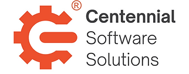

 

# What We Do and How to Contact Us

**Centennial Software Solutions LLC** provides expert **PetaLinux Tools** support.

Call **720-912-6065** or email **help@centennialsoft.com** to get help today! 

We’re available for face-to-face meetings at our shared office and shipping address: **4845 Pearl East Cir, Suite 101, Boulder, CO 80301**.

# Why Chose Us

- **Deep Expertise** – We solve PetaLinux Tools issues daily, so we know the pitfalls and fixes.
- **Lasting Value** – We document solutions so your team can use them after we’re gone.
- **Knowledge Transfer** – We explain as we go, helping your team learn to solve future issues independently.
- **Flexible Support** – We offer **ad-hoc support hours** without long-term commitments.

# Rates & Pricing

Rates vary by project scope, urgency, hours purchased, and whether work is ad hoc or continuous. Rush requests, small orders, or projects requiring extra insurance may cost more.

# Our Process

1. **Free Call** – Talk with us; there is no obligation.
2. **Discovery** – NDA + deeper understanding.
3. **Proposal** – Clear plan, hours, and rate (free).
4. **Agreement** – Sign + kickoff.
5. **Billing** – Monthly Net-30, detailed logs, pay only for used time.

# Other Help

In addition to **PetaLinux Tools**, we also support:

- **Linux**
- **Yocto**
- **General embedded systems**
- **Board bring-up**

# Complimentary Help and Community Contributions
We post free HOWTOs on our blog and GitHub and contribute to the AMD/Xilinx Community Forums and FPGA Reddit.
