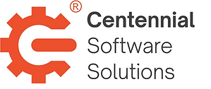

 

Expert support for **PetaLinux Tools** and embedded systems.

📞 [720-912-6065](tel:720-912-6065) \| ✉️ [help@centennialsoft.com](mailto:help@centennialsoft.com?subject=Support%20Request)

------

## Why Choose Us

- **Proven Expertise** – We solve **PetaLinux Tools** issues every day.
- **Practical Value** – We document solutions so your team can reuse them.
- **Flexible Support** – Ad-hoc hours, no long-term commitment required.

------

## What We Offer

- **Linux** and **Yocto** development
- **Embedded** systems and driver support
- **Board** bring-up and debugging
- Software & HDL development (**C/C++**, **Verilog**, **VHDL**, **Python**, and more)

------

Learn more about [our process and the services we offer](/about/).

