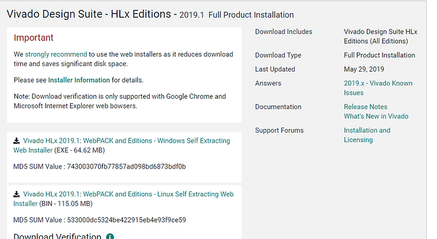
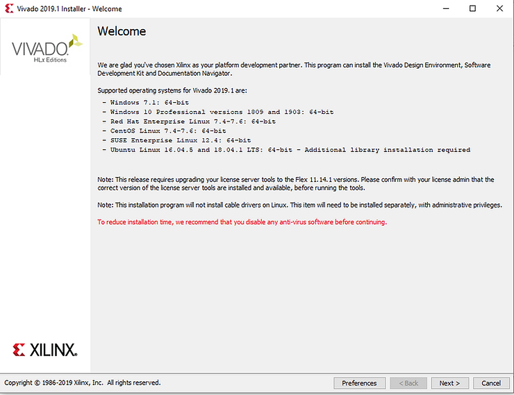
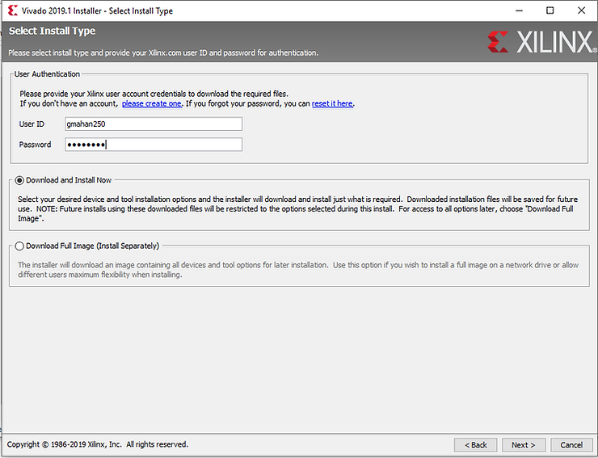
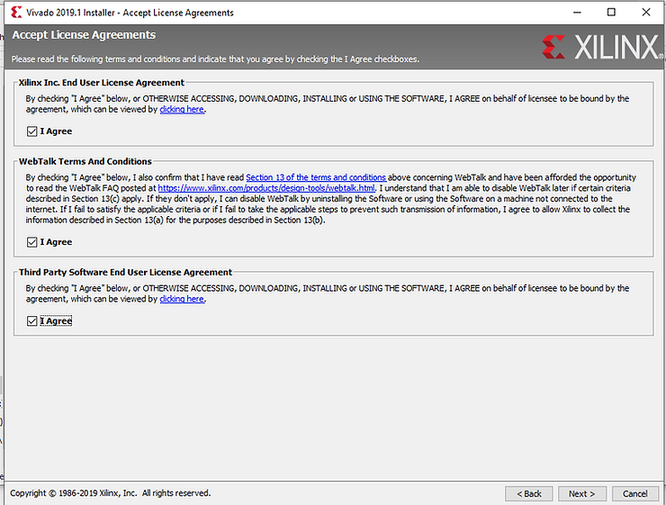
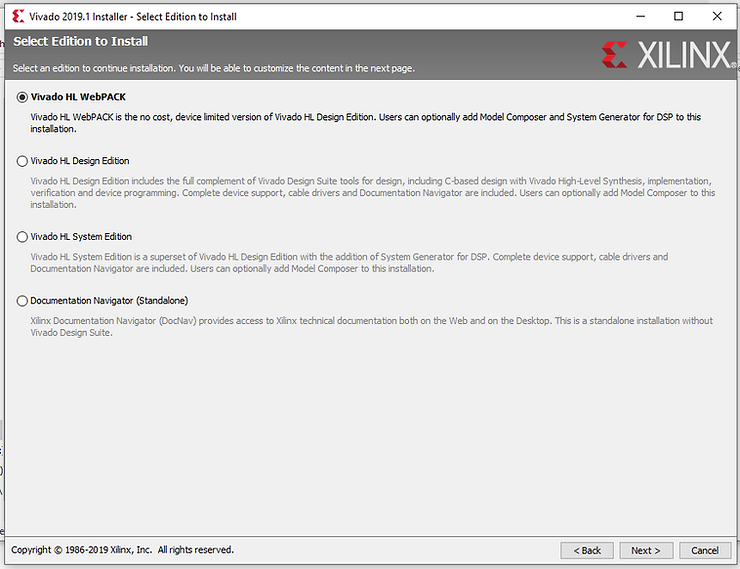
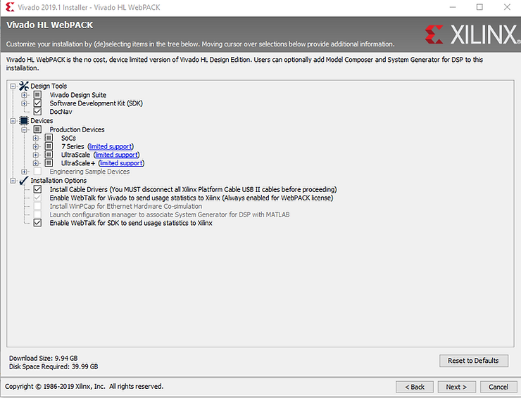
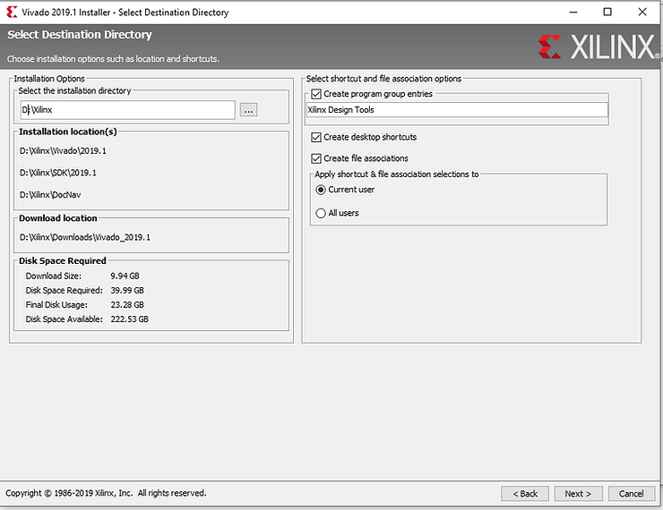
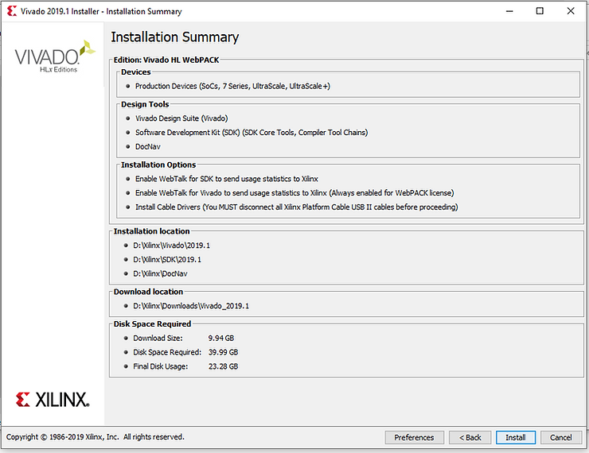
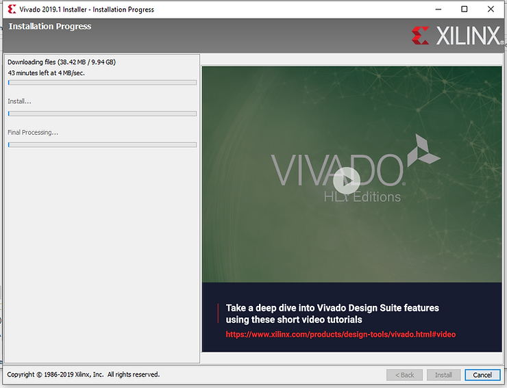

# A Dummies Guide to Ultra96-V2 Initial Setup (No License Key Required)

This guide is meant to supplement the excellent "Ultra96-V2 Hardware and Tools Initial Setup" blog entry by Brian Davis, which will be referred to as "Brians's Guide (BG)." The big difference seems to be in the license setup, which doesn't seem to be required with the method I will be describing. Only the Windows install will be described.

Brians Ultra96-V2 Hardware and Tools Initial Setup

 https://www.centennialsoftwaresolutions.com/post/ultra96-v2-hardware-and-tools-initial-setup?gclid=EAIaIQobChMI8dyz9KPe5AIVYhh9Ch0aiAaAEAAYASAAEgIj9fD_BwE 

1.) Follow BG Steps 1-2 to order the hardware.

2.) Per BG Step 3, click on the download link, which should prompt you to create an account.

3.) Download the Vivado HLx 2019.1 WebPACK and Editions

4.) Run the downloaded file

5.) You will be prompted to enter your Xilinx UserID and Password created during the download process.

6.) Next are the user agreements

7.) Install the Vivado HL WebPACK

8.) Use the default items

9.) Select your destination directory (I changed mine from default)

10.) You should then see an Installation Summary

11.) Click on Install to start the install process; it typically takes 20 minutes to download and about 20 minutes to install.

12.) Scroll down to the zedboard URLS in the BG guide and download any files you might need (note that none of the available files are needed to complete this guide; it just references stuff you might find useful)

13.) Follow steps 1-5 in the BG guide following the zedboard URLs (step 3 is very important!)

<u>Reference</u>

-   Xilinx logo clipped from [<u>xilinx.com</u>](http://xilinx.com/)