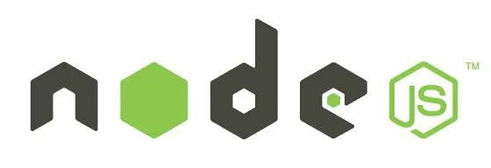
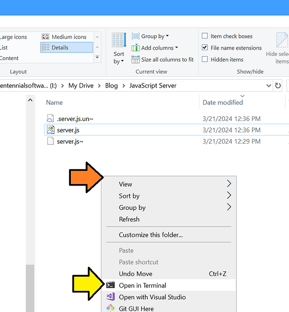
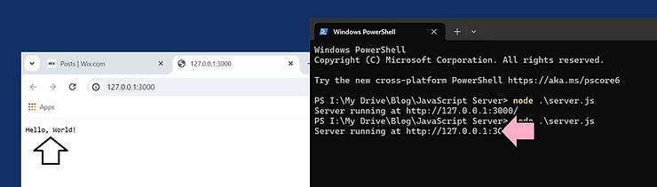

# A Hello, World! Node.js Server on Windows 10



This post shows how to write, start, and stop a Node.js HTTP server that prints Hello, World!

## A Hello, World! Node.js Server on Windows 10

1\. Put this into a file called **server.js** (or click [<u><span>here</span></u>](https://drive.google.com/file/d/1f7sKnbDkHDR6dKZKp8FBXEa3pphW05RZ/view?usp=sharing) to download one).

```
const http = require('http');

const hostname = '127.0.0.1';
const port = 3000;

const server = http.createServer((req, res) =&gt; {  
  res.statusCode = 200;
  res.setHeader('Content-Type', 'text/plain');
  res.end('Hello, World!\n');
});

server.listen(port, hostname, () =&gt; {
  console.log(`Server running at http://${hostname}:${port}/`);
});
```

2\. Open the folder and right-click on **Open in Terminal**



3\. Type **node .\\server.js**

4\. Ctrl-click on the link or open a browser and type http://127.0.0.1:3000/ or click [here](http://127.0.0.1:3000/)



5\. Type Ctrl-c to quit

## Other

Node.js logo clipped from https://nodejs.org/ 

The version posted at https://nodejs.org/en

```
// server.mjs
import { createServer } from 'node:http';
const server = createServer((req, res) =&gt; {
  res.writeHead(200, { 'Content-Type': 'text/plain' });
  res.end('Hello World!\n');
});
// starts a simple http server locally on port 3000
server.listen(3000, '127.0.0.1', () =&gt; {
  console.log('Listening on 127.0.0.1:3000');
});
// run with `node server.mjs`
```