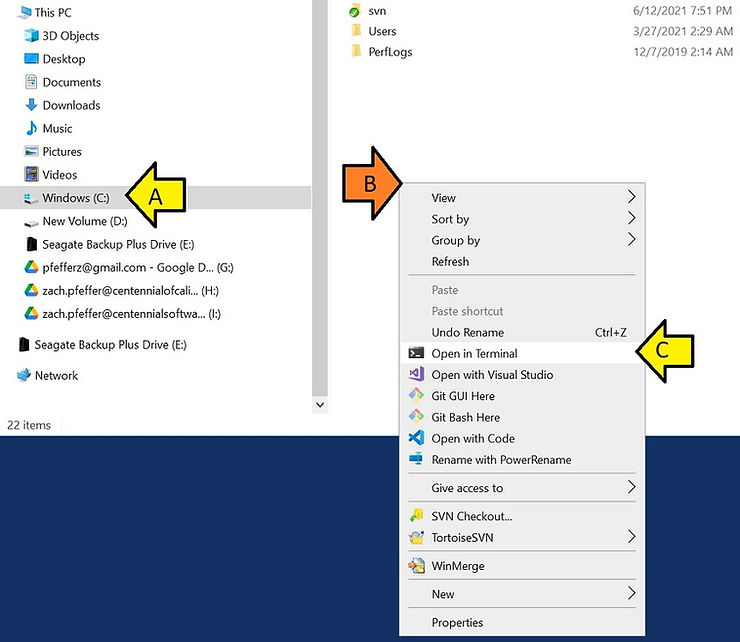

# A Node.js URL Scraper on Windows 10

This post shows how to build a Node.js URL scraper on Windows 10.

1\. If you haven't, [Install and Test Node.js on Windows 10](https://www.centennialsoftwaresolutions.com/post/install-and-test-node-js-on-windows-10)

2\. Open a terminal in C:\\:

a. Click on C:

b. Right-click

c. Click **Open in Terminal**

Node can't handle paths with spaces, so working at the top of the C drive helps.



3\. Paste:

```
mkdir link-extractor
cd link-extractor
npm init -y  # Initializes a new Node.js project
npm install axios # Installs axios for HTTP requests
npm install cheerio  # Installs cheerio for HTML parsing
npm install robots-parser # Install robots-parser to parse robots.txt
```

4\. Paste:

```
notepad extractLinks.js
```

5\. Paste:

```
const axios = require('axios');
const cheerio = require('cheerio');
const robotsParser = require('robots-parser');

async function fetchRobotsTxt(url) {
    const robotsUrl = new URL('/robots.txt', url).href;
    try {
        const response = await axios.get(robotsUrl);
        return response.data;
    } catch (error) {
        console.error('Error fetching robots.txt:', error);
        return null;
    }
}

async function isCrawlAllowed(url, userAgent) {
    const robotsTxt = await fetchRobotsTxt(url);
    if (!robotsTxt) return true; // No robots.txt found, assume allowed
    const robots = robotsParser(new URL('/robots.txt', url).href, robotsTxt);
    return robots.isAllowed(url, userAgent);
}

async function fetchLinks(url, userAgent = 'Node.js-bot') {
    if (!await isCrawlAllowed(url, userAgent)) {
        console.log('Crawling not allowed by robots.txt');
        return [];
    }
    try {
        const response = await axios.get(url);
        const html = response.data;
        const $ = cheerio.load(html);
        const links = [];
        $('a').each((i, link) =&gt; {
            const href = $(link).attr('href');
            const text = $(link).text().trim();
            if (href) {
                links.push({ href, text });
            }
        });
        return links;
    } catch (error) {
        console.error('Error fetching or parsing the page:', error);
        return [];
    }
}

const url = "</span><a target="_blank" href="https://www.centennialsoftwaresolutions.com/post/a-nodejs-url-scraper-on-windows-10" rel="noopener" data-hook="WebLink"><u><span>https://www.centennialsoftwaresolutions.com/post/a-nodejs-url-scraper-on-windows-10</span></u></a><span>"; 
fetchLinks(url).then(links =&gt; {
    console.log('Links found:', links);
});
```

6\. Paste:

```
node .\extractLinks.js
```

7\. You should see:

```
PS C:\link-extractor&gt; node .\extractLinks.js
Links found: [
  { href: 'https://www.centennialsoftwaresolutions.com', text: 'Home' },
  {
    href: 'https://www.centennialsoftwaresolutions.com/services',
    text: 'Services'
  },
  {
    href: 'https://www.centennialsoftwaresolutions.com/about',
    text: 'About'
  },
  {
    href: 'https://www.centennialsoftwaresolutions.com/blog',
    text: 'Blog'
  },
...
```