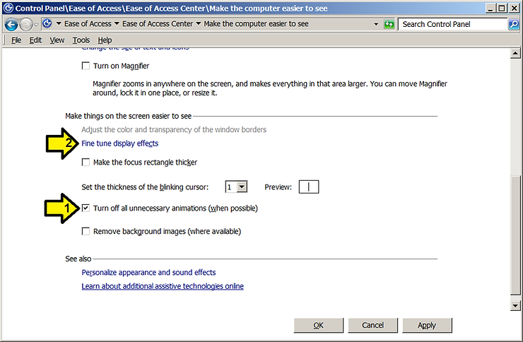
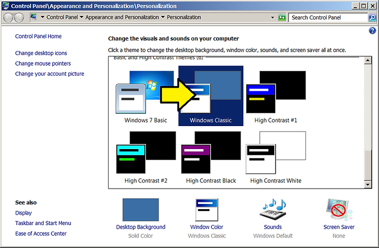

# A Way to Disable Cursor Movement Animation in Word 2016 by Using the Windows Classic Theme

This post shows \_a\_ way to disable cursor animation in Word by enabling the Windows Classic theme.

**Aug 8th 2018 Update**: This post has been superseded by: http://www.zachpfeffer.com/single-post/Disable-Microsoft-Office-Excel-Cell-Movement-Animations-and-Word-Cursor-Animations

**April 1st 2018 Update**: after rebooting, I found that the cursor was animated. I checked the theme. It was still on Windows Classic. I selected Windows 7 Basic then re-selected Windows Classic and the animation went away again.

**Steps to Enable Windows Classic after Turning off unnecessary animation**

**1.** Fine tune display effects

On **Make the computer easier to see page**

After clicking the (1) **Turn off all unnecessary animations (when possible)** box

Click on (2) **Fine tune display effects**

2\. Click on **Windows Classic**

**References**

-   Word image from [link](http://www.microsoft.com/en-us/store/d/word-2016/cfq7ttc0k5d7?activetab=pivot%3aoverviewtab)