# "About Vitis IDE" - a Wealth of Information

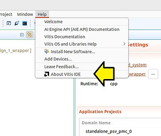

After clicking **About Vitis IDE**, this post shows examples of all the information available in each sub-menu. The info at [<u>Installation Details - Configuration - Text</u>](https://www.centennialsoftwaresolutions.com/post/about-vitis-ide-a-wealth-of-information#viewer-exc7926749) and [<u>Installation Details - Configuration - View Error Log - Text</u>](https://www.centennialsoftwaresolutions.com/post/about-vitis-ide-a-wealth-of-information#viewer-rgjue27512) sections are especially helpful. For example, some info shows where all Vitis components are installed and which Vitis driver versions are used.Why is this useful?

# Why is this useful?

If you're having an issue, talking to serial ports, for example, you can ID the software component that may be at fault and debug it. This info can also identify changes between Vitis IDE releases, which may help debug a problem.

## "About Vitis IDE"

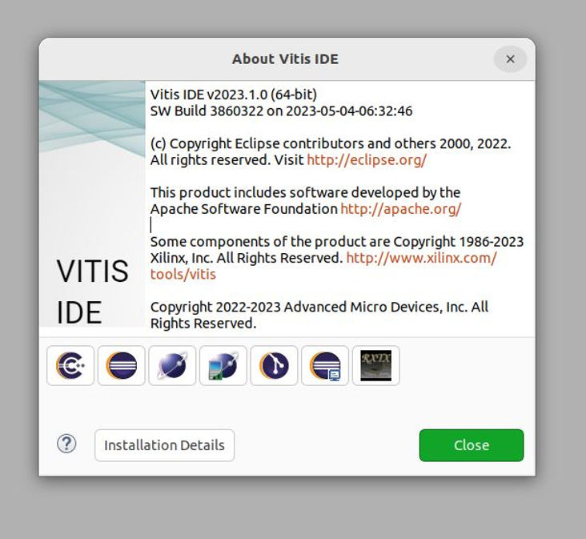

### Text:

Vitis IDE v2023.1.0 (64-bit)

SW Build 3860322 on 2023-05-04-06:32:46

(c) Copyright Eclipse contributors and others 2000, 2022. All rights reserved. Visit [http://eclipse.org/](http://eclipse.org/)

This product includes software developed by the

Some components of the product are Copyright 1986-2023 Xilinx, Inc. All Rights Reserved. http://www.xilinx.com/tools/vitis

Copyright 2022-2023 Advanced Micro Devices, Inc. All Rights Reserved.

## Eclipse CDT

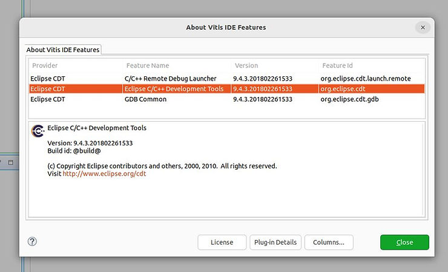

### Text:

Eclipse C/C++ Development Tools

Version: 9.4.3.201802261533

Build id: @build@

(c) Copyright Eclipse contributors and others, 2000, 2010. All rights reserved.

Visit http://www.eclipse.org/cdt

## Eclipse.org

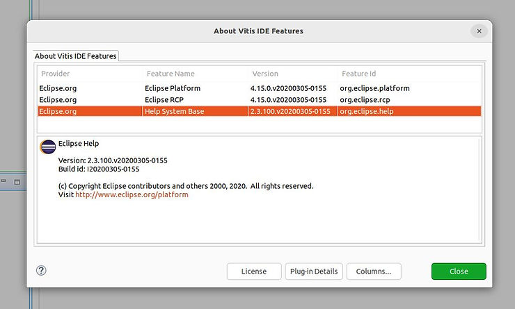

### Text:

Eclipse Help

Version: 2.3.100.v20200305-0155

Build id: I20200305-0155

(c) Copyright Eclipse contributors and others 2000, 2020. All rights reserved.

Visit http://www.eclipse.org/platform

## Eclipse Modeling Project

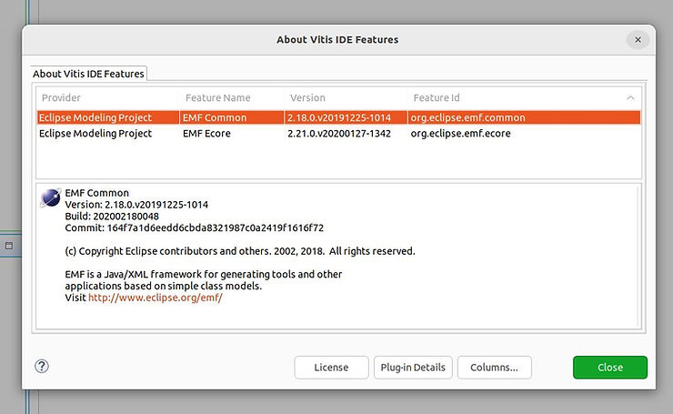

Text:

EMF Common

Version: 2.18.0.v20191225-1014

Build: 202002180048

Commit: 164f7a1d6eedd6cbda8321987c0a2419f1616f72

(c) Copyright Eclipse contributors and others. 2002, 2018. All rights reserved.

EMF is a Java/XML framework for generating tools and other

applications based on simple class models.

Visit http://www.eclipse.org/emf/

## Eclipse TM Project

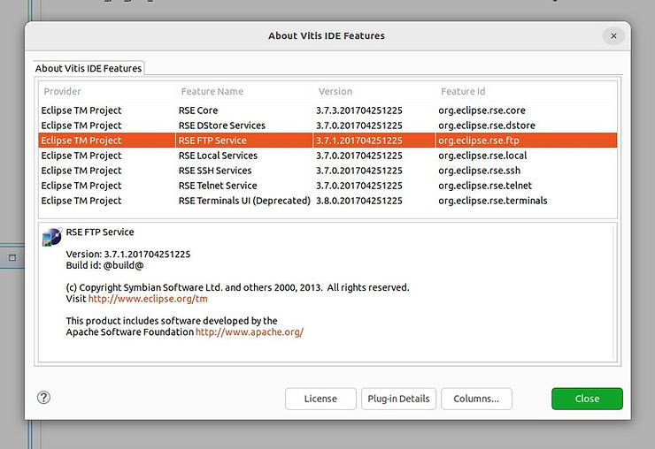

### Text:

RSE FTP Service

Version: 3.7.1.201704251225

Build id: @build@

(c) Copyright Symbian Software Ltd. and others 2000, 2013. All rights reserved.

This product includes software developed by the

Apache Software Foundation http://www.apache.org/

## Eclipse EGit

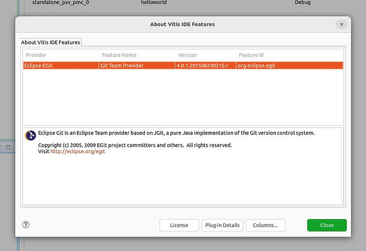

Text:

Eclipse Git is an Eclipse Team provider based on JGit, a pure Java implementation of the Git version control system.

Copyright (c) 2005, 2009 EGit project committers and others. All rights reserved.

Visit http://eclipse.org/egit

## Eclipse.org - Target Management

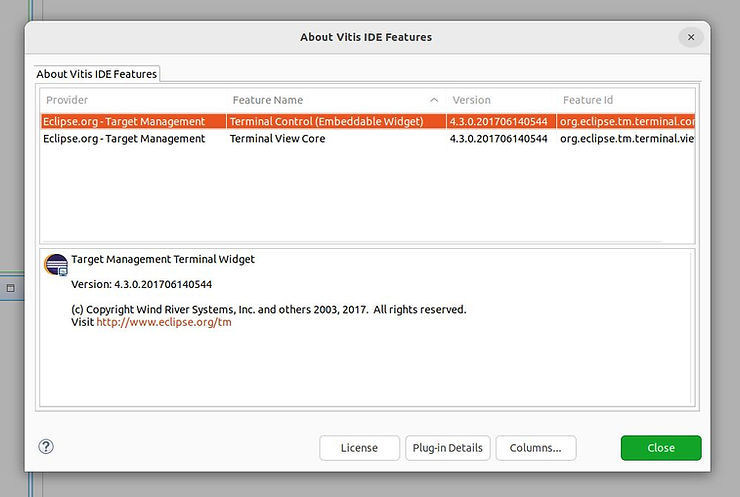

### Text:

Target Management Terminal Widget

Version: 4.3.0.201706140544

(c) Copyright Wind River Systems, Inc. and others 2003, 2017. All rights reserved.

Visit http://www.eclipse.org/tm

## RXTX.org

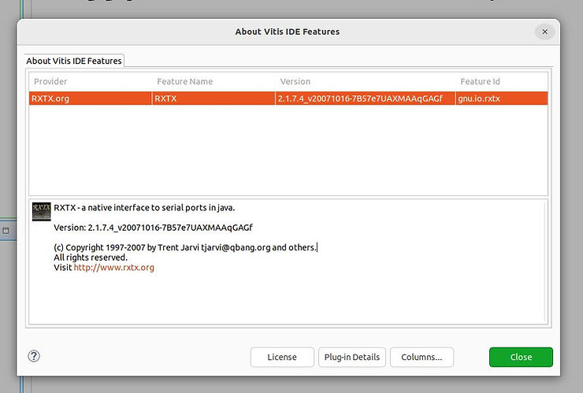

### Text:

RXTX - a native interface to serial ports in java.

Version: 2.1.7.4\_v20071016-7B57e7UAXMAAqGAGf

(c) Copyright 1997-2007 by Trent Jarvi tjarvi@qbang.org and others.

All rights reserved.

Visit [http://www.rxtx.org](http://www.rxtx.org/)

## Installation Details

The error log and configuration detail screens available after clicking Installation Details are very helpful to ID specific install paths and driver versions.

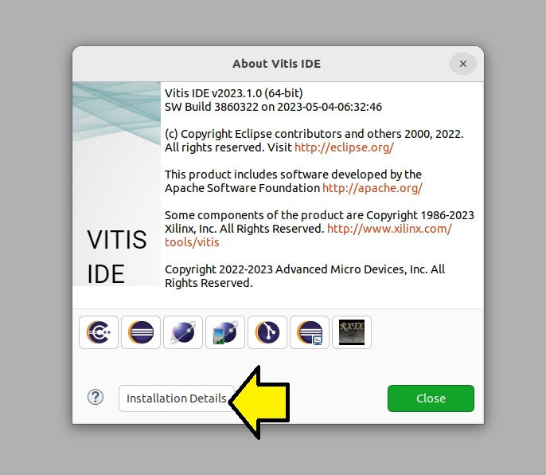

## Installation Details - Installed Software

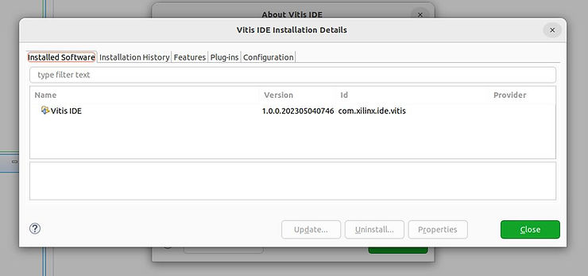

## Installation Details - Installation History

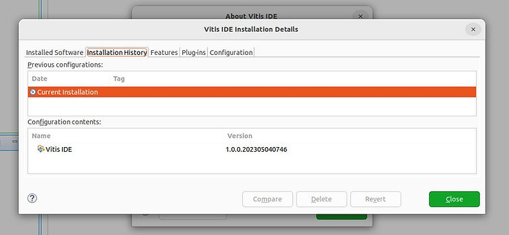

## Installation Details - Features

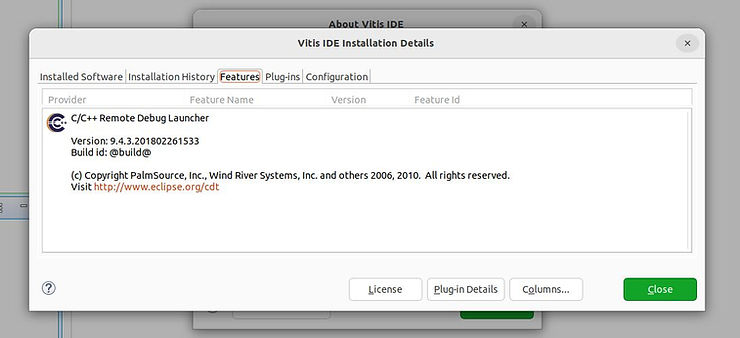

## Installation Details - Plug-ins

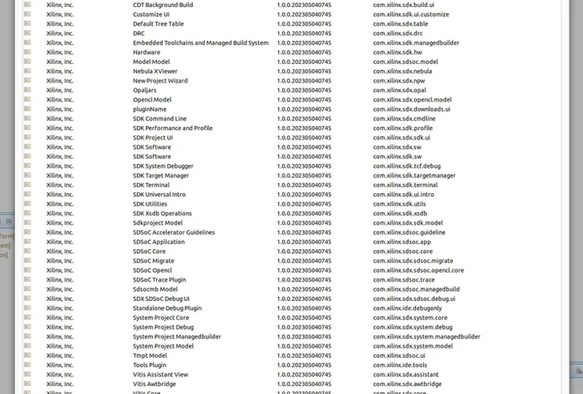

## Installation Details - Configuration

### Installation Details - Configuration - Text

https://docs.google.com/document/d/126rpGN9b8A945pt2A8kET7H9Me4bvK1TjKB9yla2fMY/edit?usp=sharing

### Installation Details - Configuration - View Error Log

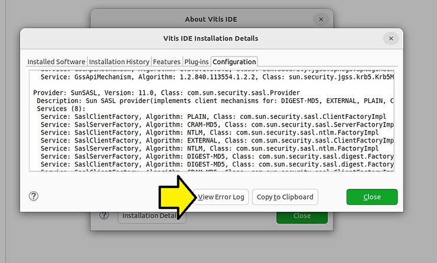

### Installation Details - Configuration - View Error Log - Text

https://docs.google.com/document/d/1sB2dHT7IlPtQi2fdhkBZ2_96b7eYJyZ4NxQ7r6Ed2C0/edit?usp=sharing