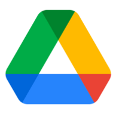

# Access a file on Google Drive from a Linux Command Line using drive

**# Get GO**

\# From: https://golang.org/doc/install 

mkdir ~/Downloads

cd ~/Downloads

wget https://golang.org/dl/go1.15.3.linux-amd64.tar.gz

mkdir -p ~/tools

cd ~/Downloads

tar -C ~/tools -xzf go1.15.3.linux-amd64.tar.gz

export PATH=$PATH:$HOME/tools/go/bin

mkdir ~/gopath

export GOPATH=$HOME/gopath

go version

\# I saw: go version go1.15.3 linux/amd64

**# Install drive**

\# From: https://github.com/odeke-em/drive#installing 

cd ~/tools

go get -u -v github.com/odeke-em/drive/cmd/drive

\# This ^^ took a bit

ls $GOPATH/bin

\# I saw: drive

mkdir ~/gdrive

export PATH=$GOPATH:$GOPATH/bin:$PATH

which drive

\# I see: ~/gopath/bin/drive

**# Get credentials**

\# For OAuth2.0 credentials

drive init ~/gdrive

\# Visit the site to get the code

\# Click Allow

\# Copy and paste the code

**# Get your file**

cd ~/gdrive

gdrive pull -id <id from file>

**References** 

Drive logo from [[link](https://ssl.gstatic.com/images/branding/product/2x/hh_drive_96dp.png)] 