# Add a disk to an Ubuntu VirtualBox VM

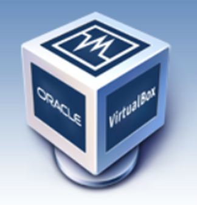

This post shows you how to add a new SATA disk to a Oracle VirtualBox Version 5.1.30 r118389 (Qt5.6.2) VM and install it in Ubuntu 16.04.2.

**Steps**

Create Disk File

1\. Right-click on the VM you'd like to add a disk to:

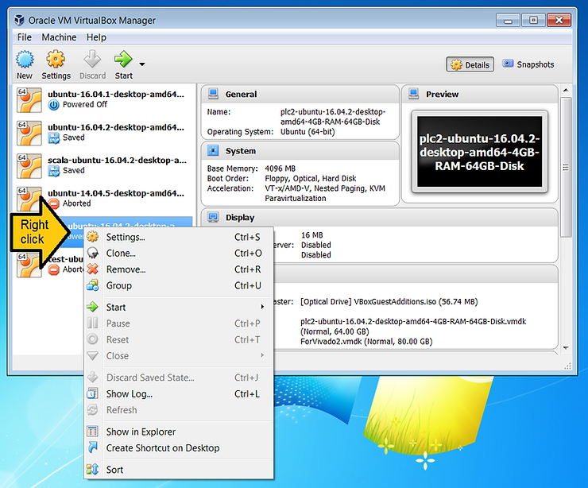

2\. Click **Settings...**

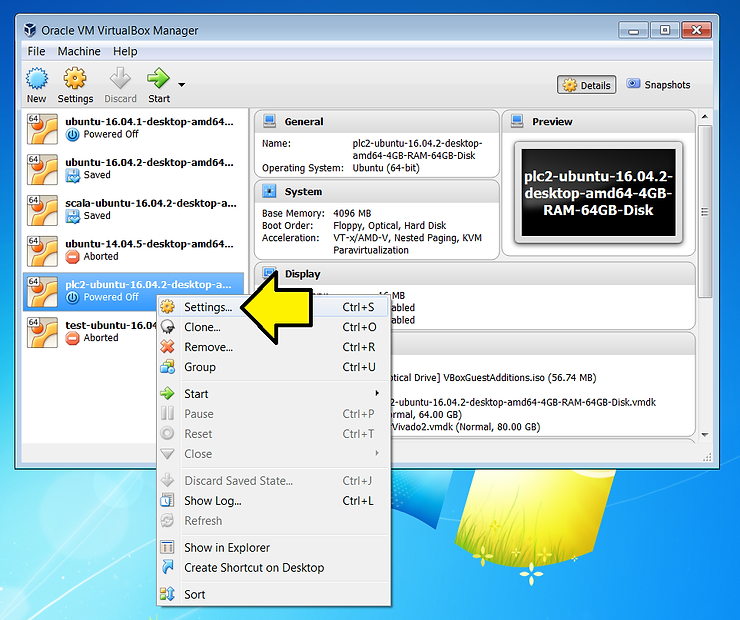

3\. Click **Storage**

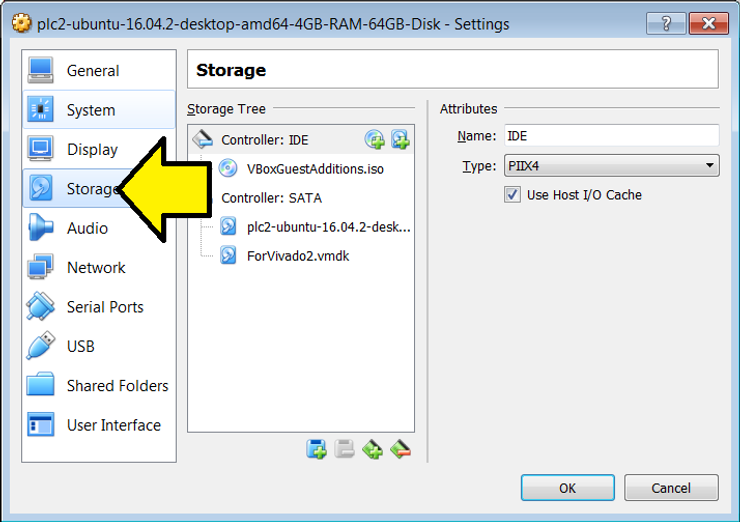

4\. (1) Click on **Controller: SATA** and (2) click on the the **'+' disk icon**

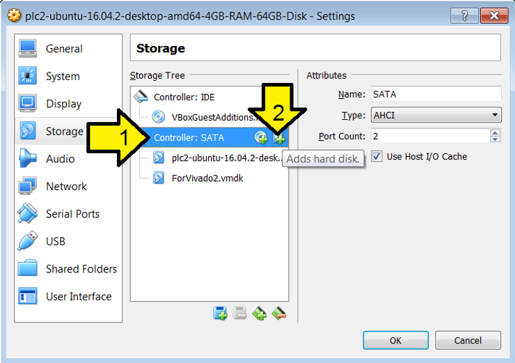

5\. Click **Create new disk**

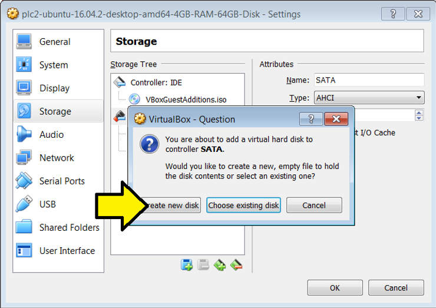

6\. Select **VMDK (Virtual Machine Disk)**


**VMDK** description below.

7\. (1) Click on **Dynamically allocated** and (2) click **Next**

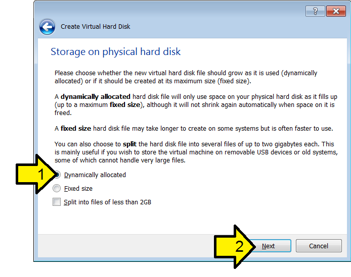

8\. (1) Name the disk, (2) Select a size and (2) click **Create**

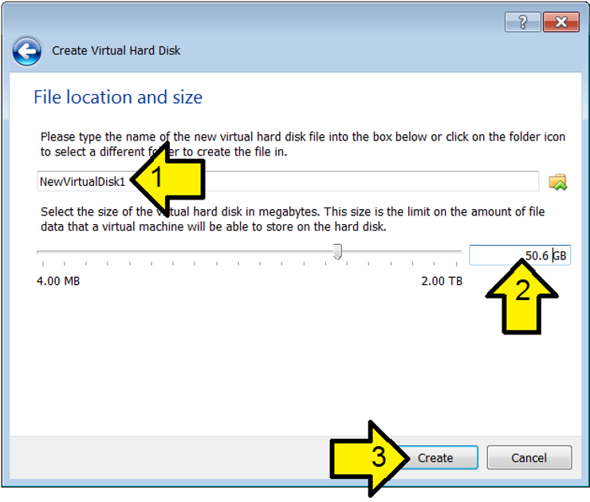

9\. Click OK

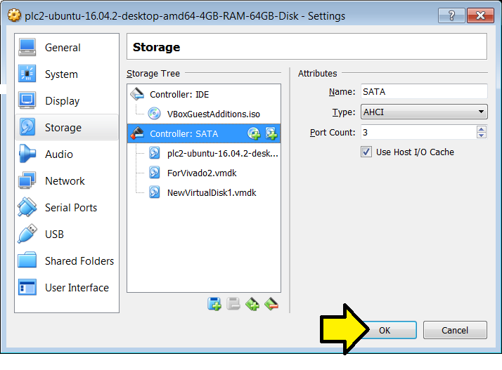

10\. Note the SATA Port the disk is on:

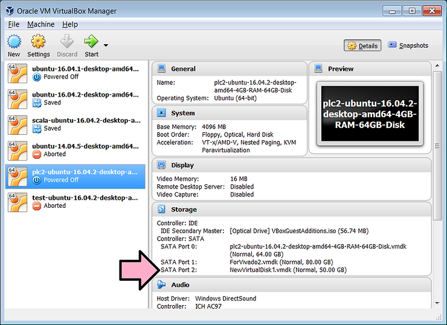

11\. Click **Start** to start the VM

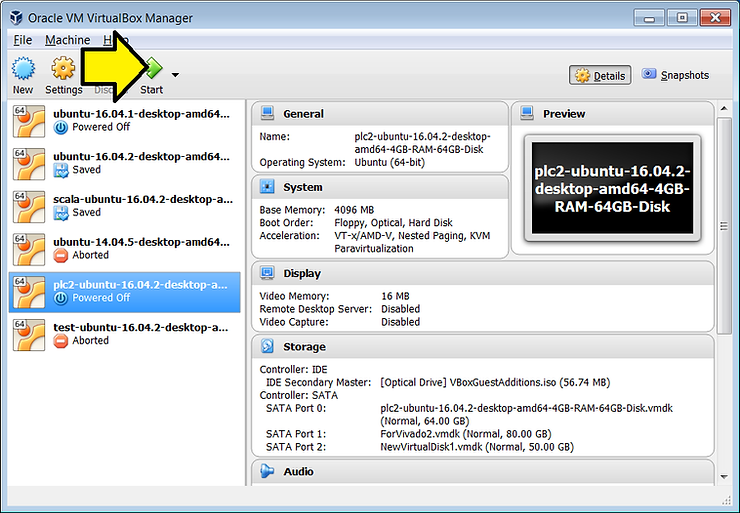

Partition

12\. In Ubuntu, (1) right click on the desktop and (2) click **Open Terminal**

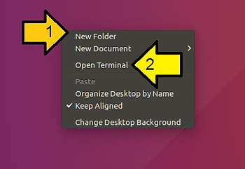

13\. Type

```
dmesg | grep sd
```

Look for the **sd** that matches the size of the disk you created; its **sdc** here:

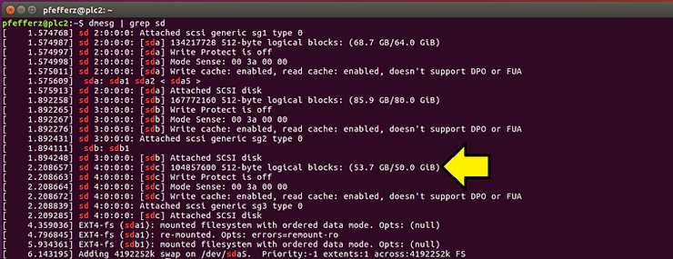

14\. Install gparted. At the command line type:

```
sudo apt-get install gparted
```

Type 'Y' when prompted.

Note: this command is safe to run if its already installed. If its installed you'll see:

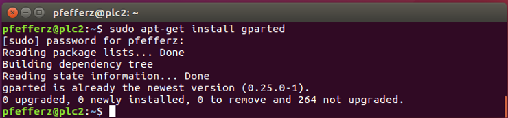

15\. Install gksu. At the command line type:

```
sudo apt install gksu
```

If you need to install it, type 'Y' when prompted.

You'll see something similar to:

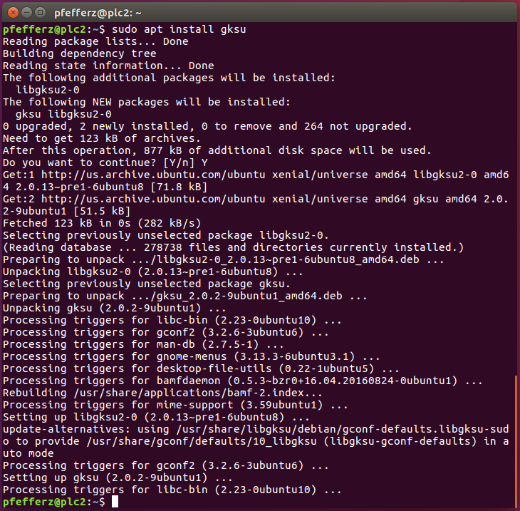

16\. At the command line type this to start GParted:

```
gksudo gparted
```

17\. (1) Enter your sudo password and (2) click OK

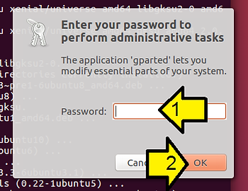

18\. Click the **/dev/sda** drop down


19\. Click what you saw in dmesg (sdc here)

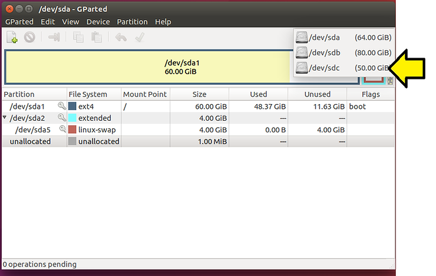

20\. (1) Click **Device** and (2) **Create Partition Table...**

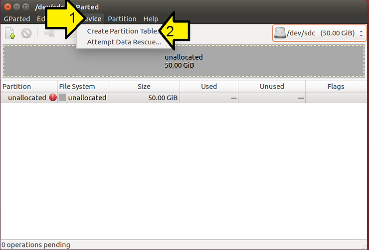

21\. (1) Leave as msdos and (2) click Apply

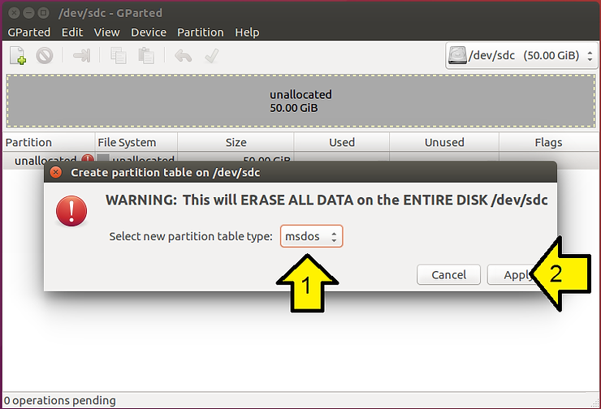

22\. Click the Create a new partition in the selected unallocated space **'+' file icon**


23\. Leave everything as is and click **Add**

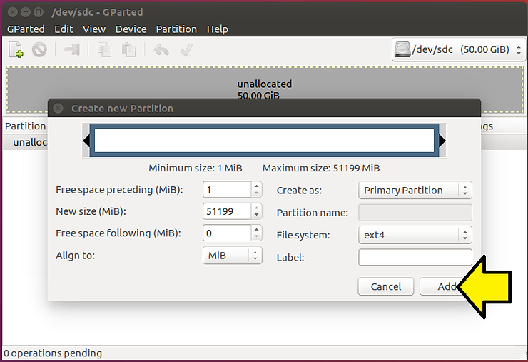

24\. Click the **Apply All Operations** green checkbox

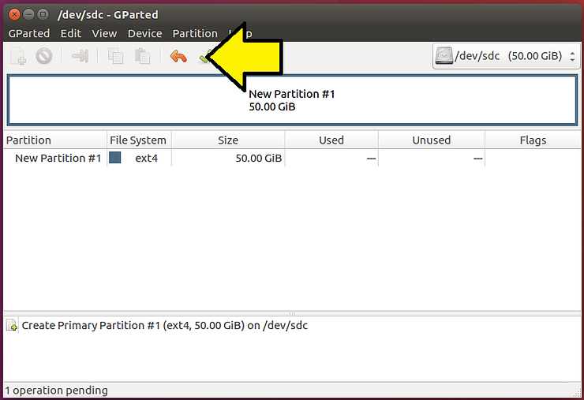

25\. Click **Apply** again

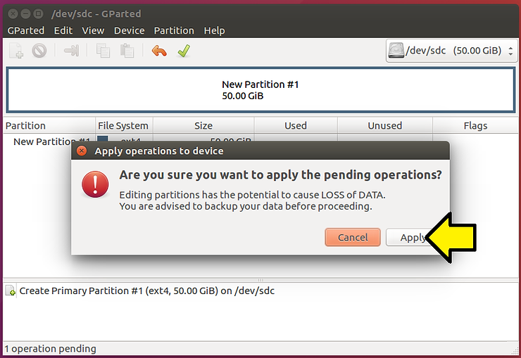

You should see **All operations successfully completed**

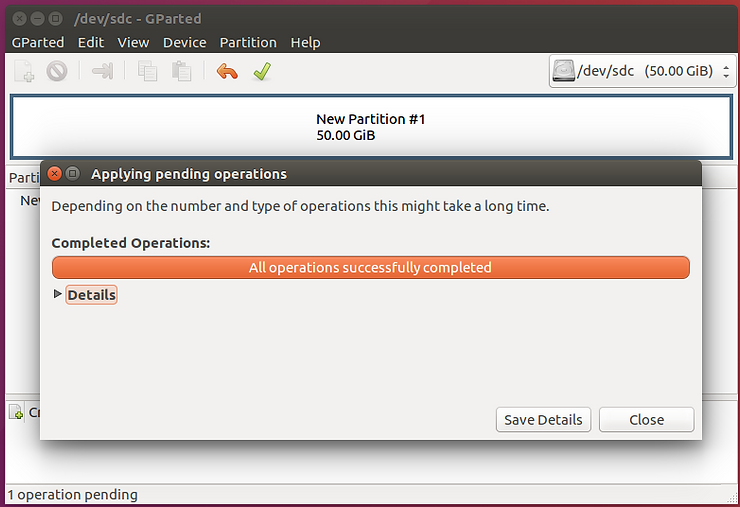

26\. Click **Close**

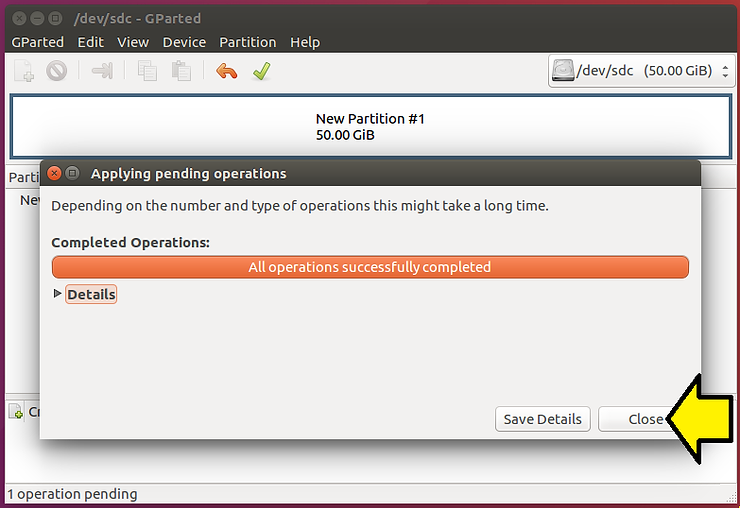

27\. Quit GParted: (1) Select **GParted** and click (2) **Quit**

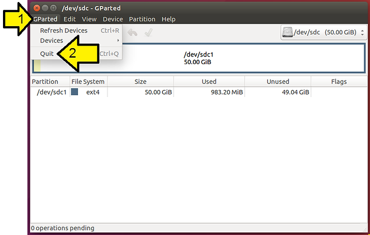

Mounting

28\. Create a mount point

At the command line type:

```
sudo mkdir /hdd2
```

At the command line type:

```
gksu gedit /etc/fstab
```

30\. (1) Enter your sudo password and (2) click OK:

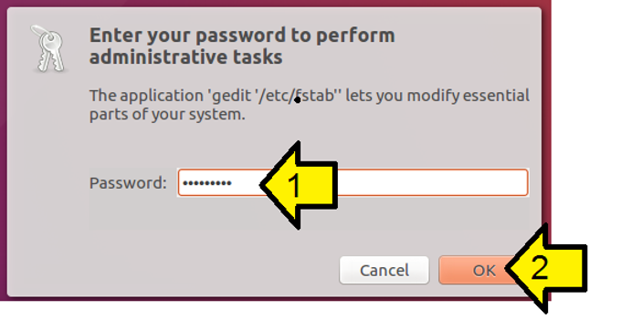

31\. Enter this as the last line:

```
/dev/sdc1    /hdd2    ext4    defaults    0    0
```

It should look similar to:

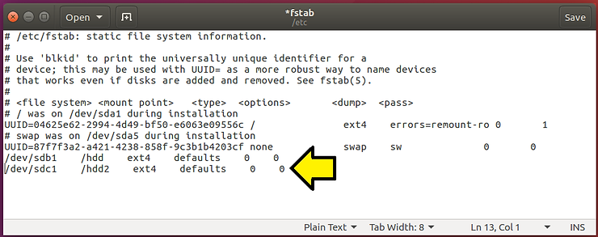

32\. Click Save

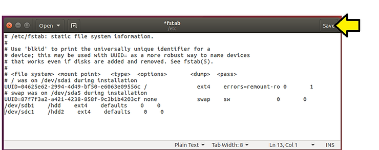

33\. Click the 'x' to close

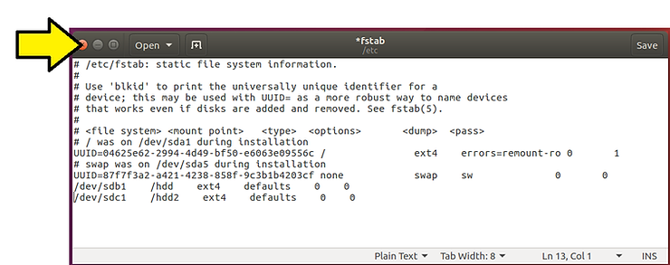

34\. Mount now

At the command line type:

```
sudo mount -a
```

35\. Change the user so you can read/write:

At the command line type:

```
sudo chown -R pfefferz:pfefferz /hdd2
```

36\. Test it

At the command line type:

```
touch /hdd2/test.txt
```

Then at the command line type:

```
ls /hdd2
```

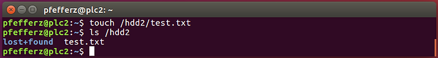

Test Mount at Boot

37\. Reboot: (1) click the **gear** and (2) click **Shut Down...**

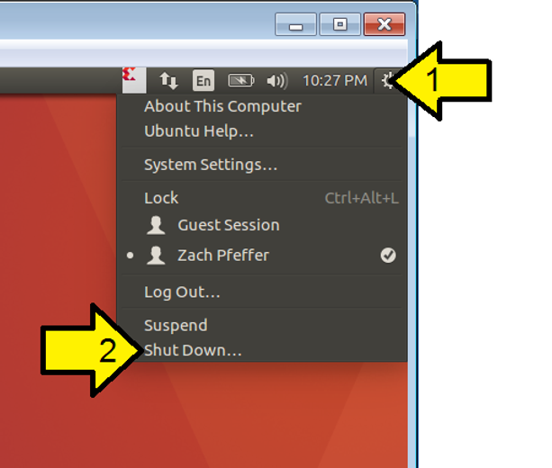

38\. Click the reboot button:

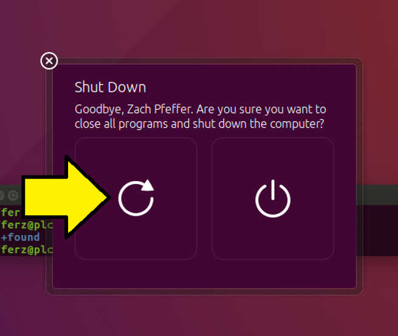

39\. After rebooting, test it

At the command line type:

```
touch /hdd2/test-after-reboot.txt
```

Then at the command line type:

```
ls /hdd2
```

You should see your test.txt:

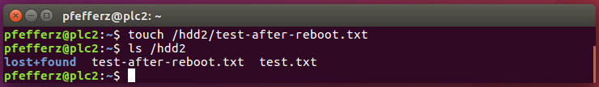

**References**

-   The VirtualBox logo is from [https://www.virtualbox.org/](http://www.virtualbox.org/)
    
-   "5.2. Disk image files (**VDI**, **VMDK**, **VHD**, **HDD**)" @ [link](http://www.virtualbox.org/manual/ch05.html)
    
-   InstallingANewHardDrive from Ubuntu @ [link](http://help.ubuntu.com/community/InstallingANewHardDrive)
    

**Supporting Excerpts**

From Ch5 of the VirtualBox online manual:

_VirtualBox supports four variants of disk image files:_

-   _Normally, VirtualBox uses its own container format for guest hard disks -- Virtual Disk Image (_**_VDI_**_) files. In particular, this format will be used when you create a new virtual machine with a new disk._
    
-   _VirtualBox also fully supports the popular and open_ **_VMDK_** _container format that is used by many other virtualization products, in particular, by VMware.\[26\]_
    
-   _VirtualBox also fully supports the_ **_VHD_** _format used by Microsoft._
    
-   _Image files of Parallels version 2 (_**_HDD_** _format) are also supported.\[27\] For lack of documentation of the format, newer formats (3 and 4) are not supported. You can however convert such image files to version 2 format using tools provided by Parallels._
    

_There are two options of how to create a disk image:_ **_fixed-size_** _or_ **_dynamically_** _allocated._

-   _If you create a_ **_fixed-size_** _image, an image file will be created on your host system which has roughly the same size as the virtual disk's capacity. So, for a 10G disk, you will have a 10G file. Note that the creation of a fixed-size image can take a long time depending on the size of the image and the write performance of your hard disk._
    
-   _For more flexible storage management, use a_ **_dynamically_** _allocated image. This will initially be very small and not occupy any space for unused virtual disk sectors, but will grow every time a disk sector is written to for the first time, until the drive reaches the maximum capacity chosen when the drive was created. While this format takes less space initially, the fact that VirtualBox needs to expand the image file consumes additional computing resources, so until the disk file size has stabilized, write operations may be slower than with fixed size disks. However, after a time the rate of growth will slow and the average penalty for write operations will be negligible._