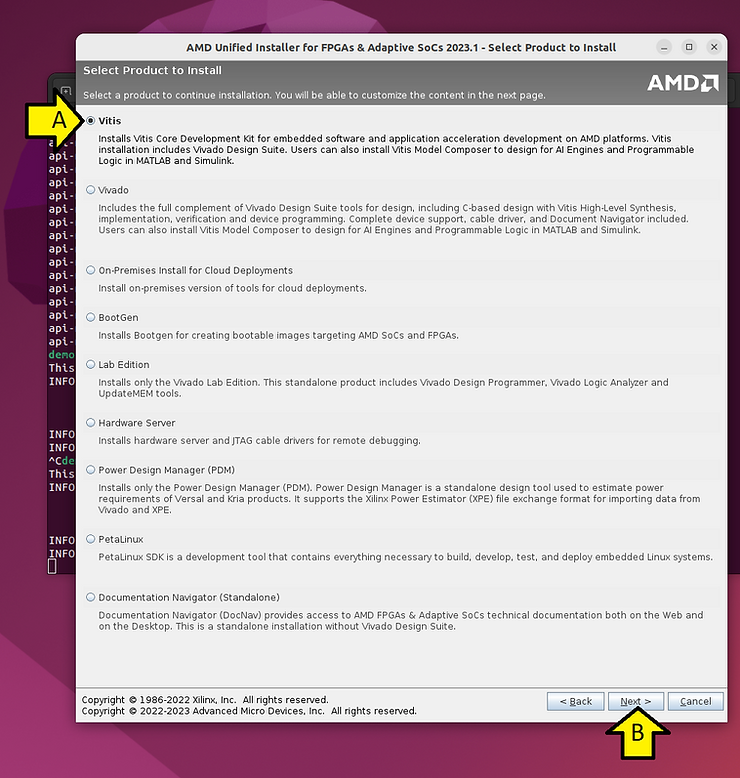
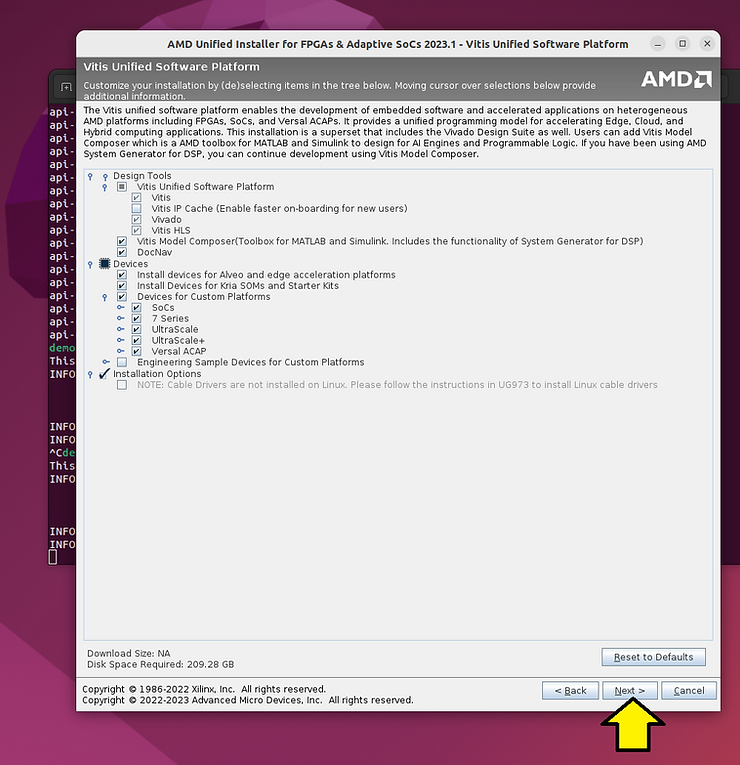
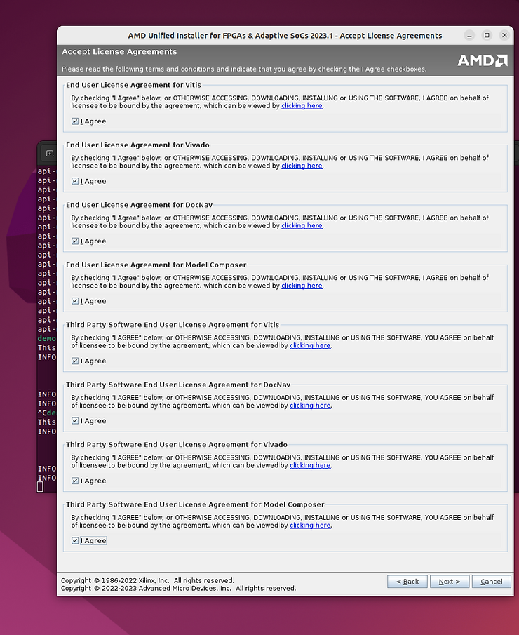
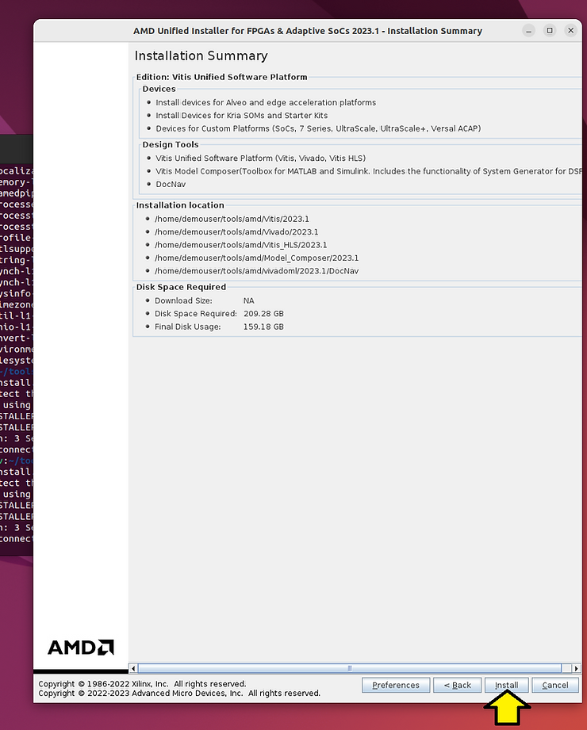
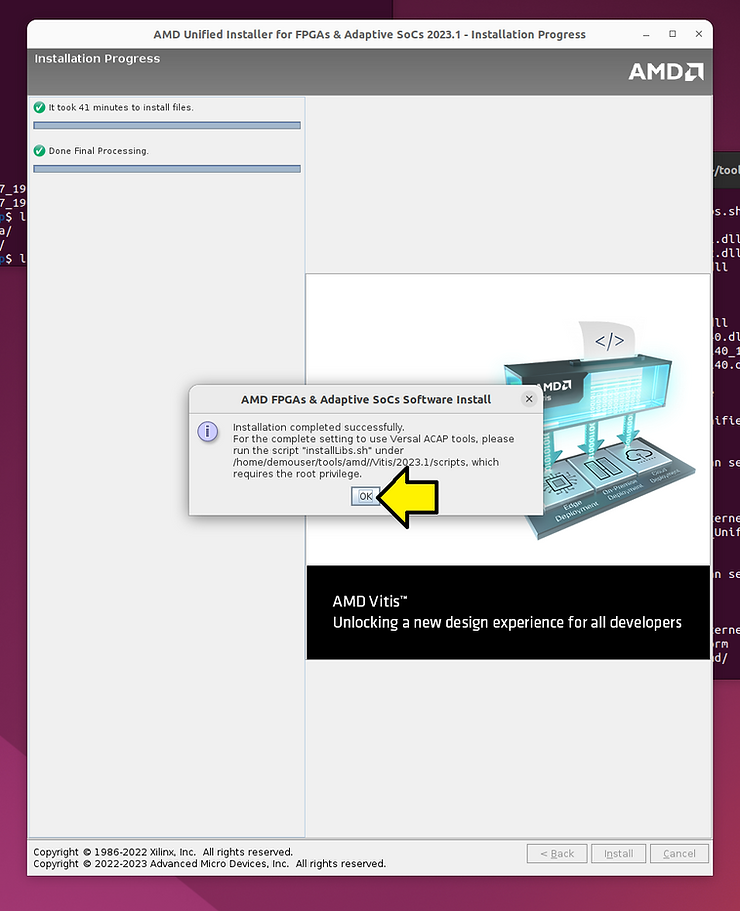
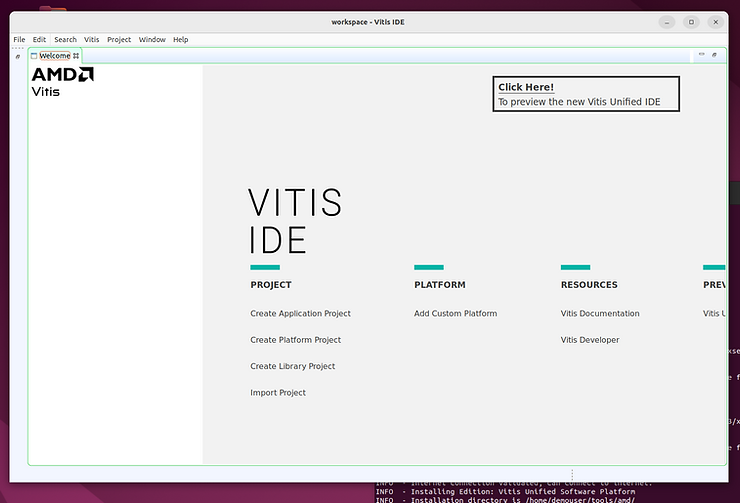
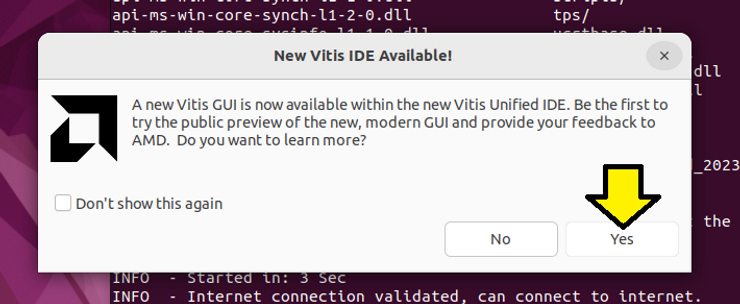

# Add Vitis 2023.1 to an Existing Vivado Install


This post shows step-by-step how to add Vitis 2023.1 to an existing Vivado install. It also contains links to all of the license agreements you'll need to agree to so you can view them outside of the installer.

## <u><span>Notes</span></u>

Vivado was installed in this directory:

```
~/tools/amd/vivadoml/2023.1
```

We'll install Vitis to:

```
~/tools/amd/
```

This post is the continuation of:

https://www.centennialsoftwaresolutions.com/post/install-2023-1-vivado-ml-enterprise-on-ubuntu-22-04-1 

## <u><span>Requirements</span></u>

209.28 GB disk needed

Run the installer

```
~/Xilinx_Unified_2023.1_0507_1903/xsetup
```

Select Vitis and click **Next >**.



Leave the defaults selected and click **Next >**:



Agree to all and click **Next >**



Copies of the agreements

End User License Agreement for Vitis

https://docs.google.com/document/d/17T08wNEfwoogH36Hw1Z5MBJdVBfnqLTud07rKezp--4/edit?usp=drive_link 

End User License Agreement for Vivado

https://docs.google.com/document/d/1xGPLXSnHc5D80wxQ0yP-cGj2Tfoqgx-Kcmm-zp4PYRQ/edit?usp=sharing 

End User License Agreement for DocNav

https://docs.google.com/document/d/1VRF2rpShNnmFL9OGu-OjPLFfzX91MTtZKZwVcKxZHS8/edit?usp=sharing 

End User License Agreement for Model Composer

https://docs.google.com/document/d/11C5P2pTDUT7V4B1hRV8BELkjp7wJ9cnVORsmqUrsP5c/edit?usp=sharing 

Third Party Software End User License Agreement for Vitis

https://docs.google.com/document/d/1VMFxLCrALTJ4f7UEkSPEsmDozKVXl6Ew3jBI2KpW9BY/edit?usp=sharing 

Third Party Software End User License Agreement for DocNav

https://docs.google.com/document/d/1JgLEJ1u_bJM_6JfMdY-7Yqagbn-gly9ixzn68DvixTM/edit?usp=sharing 

Third Party Software End User License Agreement for Vivado

https://drive.google.com/file/d/1N18Gn5n0feV4S0vQtD56H0W5Q1dN0n86/view?usp=sharing 

Third Party Software End User License Agreement for Model Composer

https://docs.google.com/document/d/1HeDiG3ArcRLYjK8cCxWNdWOFtBH2zG0w22PdidmVmtA/edit?usp=sharing 

Use **/home/demouser/tools/amd** as the installation directory, deselectoff **Create program group entries**, click **Next >**


Click **Install**



This took 41 minutes on my computer.

Note the additional installation prompt and click **OK**



Source the environment

```
source ~/tools/amd/Vitis/2023.1/settings64.sh
```

Run vitis

```
vitis
```

Note: If you see a small clipped window, close Vitis and relaunch it.

Here's the IDE



If you want to try and see the new IDE, click **Yes**



Note: I clicked this and did not see the new IDE.

### This post showed how to add Vitis 2023.1 to an existing Vivado install.

## <u><span>References</span></u>

Logo

https://library.amd.com/media/?mediaId=84C3498C-1B51-4965-93729CC284CD2DC2