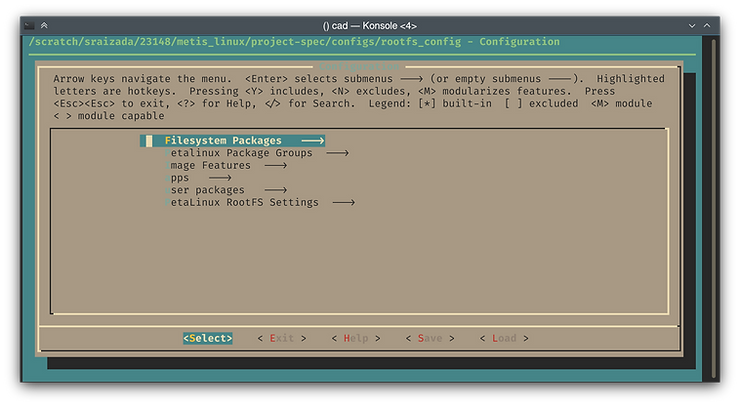
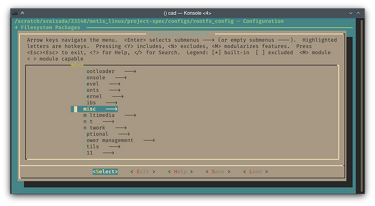
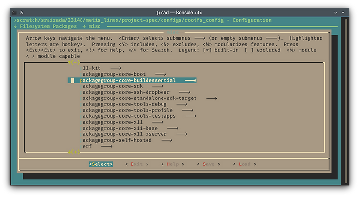
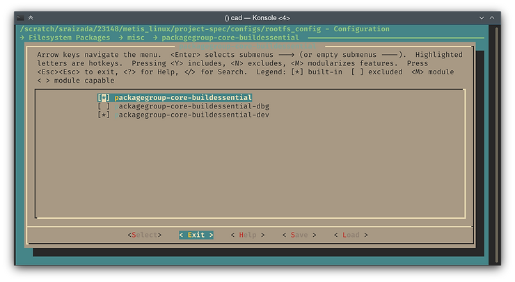
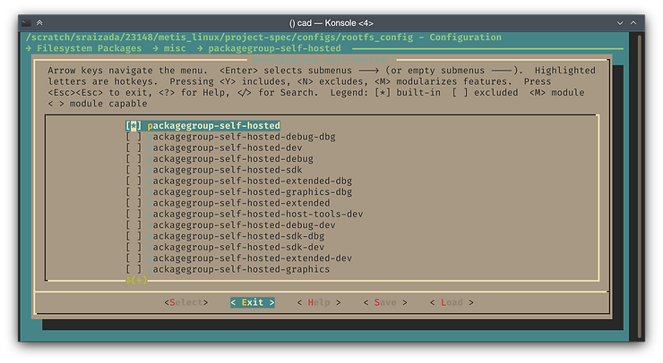

# Adding GCC to PetaLinux builds (compiling code on FPGA PS)

This quick guide will show you how to add GCC and other development tools (make, etc.) to a PetaLinux build, allowing you to compile code on the FPGA itself. This can allow for a quicker edit-build-test loop compared to creating a Petalinux application and cross compiling through Petalinux.

Inside your PetaLinux project, run \`petalinux-config -c rootfs\`

In the TUI menu that appears, go into the "Filesystem packages" category and then into the "misc" category:





Inside the misc category scroll down to the 'p' section and use Enter to go into the "packagegroup-core-buildessential" menu.



Within this menu, use Space to select the "packagegroup-core-buildessential" and "packagegroup-core-buildessential-dev" packages.

That'll get you a basic C development environment.



Optionally, if you want to add a lot more dev tools (see bottom of article for a description), use Tab to select Exit and enter to go back to the previous menu. Scroll down a bit to the "petalinux-self-hosted" menu and enter it. In here, select just the "packagegroup-self-hosted" package.



Use Tab to Save your changes into the default file, and then Exit all the way out of the configuration interface.

Finally, run \`petalinux-build\` to rebuild the project. It now has a bunch of dev tools included!

What exactly do these packages contain? You can inspect their files within your PetaLinux installation folder. Within your PetaLinux installation, go to this folder:

```
components/yocto/source/arm/layers/core/meta/recipes-core/packagegroups
```

For example, if you have PetaLinux installed at "/opt/Xilinx/Petalinux/2019.1/", then you can cd to:

```
/opt/Xilinx/Petalinux/2019.1/components/yocto/source/arm/layers/core/meta/recipes-core/packagegroups
```

Within here, you can view the files "petalinux-core-buildessentials.bb" and "petalinux-self-hosted.bb". They contain a list of all the programs that the packages will pull in.

The buildessentials package contains basic C(++) development tools like gcc, g++, binutils, and make.  

The self-hosted package group contains a huge number of various things such as: man, gdb, various compression utilities (tar, bzip, gzip, lzo, zip/unzip, etc.), git/svn, curl/wget, rsync, screen, mc etc. It also drags in a bunch of dependencies you probably don't need, such as sudo and some graphics-related toolkits/libraries. Your build will be a lot bigger with this included.

Thanks to these Xilinx forum posts by sandeepg and rfs613:

https://forums.xilinx.com/t5/Embedded-Linux/gcc-in-petalinux-kernel/m-p/853966/highlight/true#M25866 

https://forums.xilinx.com/t5/Embedded-Linux/Add-quot-make-quot-command-to-Petalinux/m-p/1164918/highlight/true#M46149 