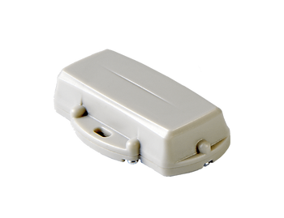

# All Guppy Setup Steps: Device, MessageQ, AWS, API Access

This post lists all the steps to bring up a Guppy LoRaWAN sensor.

**<u>Set Up the Guppy</u>**

1\. Setup a Digital Matter LoRaWAN Guppy Orientation Reference at \[[<u>link</u>](https://www.centennialsoftwaresolutions.com/blog/setup-a-digital-matter-lorawan-guppy-orientation-reference)\]

2\. Install and Run the Guppy LoRaWAN Configuration Tool at \[[<u>link</u>](https://www.centennialsoftwaresolutions.com/blog/install-and-uninstall-the-guppy-lorawan-configuration-tool)\]

**<u>Set Up the MachineQ Gateway</u>**

1\. MachineQ Gateway Setup at \[[<u>link</u>](https://www.centennialsoftwaresolutions.com/blog/machineq-gateway-setup)\]

2\. Add the Guppy to the MachineQ Gateway and run some initial tests using \[[<u>link</u>](https://www.centennialsoftwaresolutions.com/blog/lora-guppy-care-and-feeding)\] - see \[[<u>link</u>](https://www.centennialsoftwaresolutions.com/blog/the-guppy-lorawan-configuration-tool-ver-1-9)\] for Guppy LoRaWAN Configuration Tool documentation

**<u>Register with AWS IoT Core and Connect the MessageQ Gateway</u>**

1\. Follow \[[<u>link</u>](https://www.centennialsoftwaresolutions.com/blog/connect-a-device-to-aws-through-a-machineq-gateway-run-through)\]