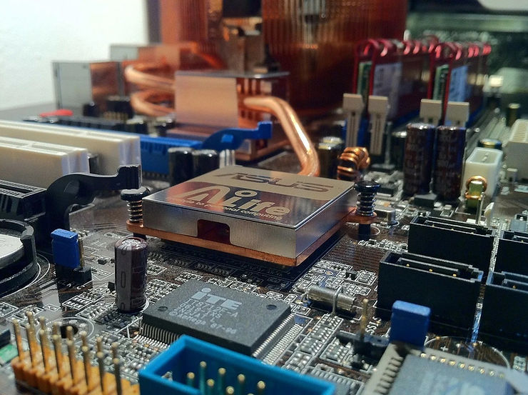

# Aluminum-Core PCBs For LED Applications

This post presents some thoughts on the use of aluminum in PCBs to mitigate LED heat dissipation.

In previous posts, we looked at how to light up [<u>LEDs on a ZC706 using VHDL</u>](https://www.centennialsoftwaresolutions.com/post/light-up-zc706-leds-using-push-buttons-with-vhdl). In that post, we looked at the software required to light up LEDs. Software is only part of the story. In this post, we look at potential heating issues.

As Giles Humpston states in his post [<u>LED thermal management</u>](https://www.ledsmagazine.com/leds-ssl-design/article/16696052/led-thermal-management-predict-and-measure-performance-magazine), “electrical energy that is not converted to photons is converted to heat in LEDs.” Furthermore, he states that this heat reduces the efficiency of LEDs, producing less light.

Various design methods can be used to mitigate this problem, including printed circuit board material that can conduct heat more efficiently. Unfortunately, most PCBs are typically made of epoxy and various glass and plastic hybrids, none of which are particularly effective at managing excess heat.

This has lead to the [<u>use of aluminum PCBs</u>](https://www.altium.com/solution/aluminum-pcb). These PCBs are ordinary printed circuit boards built onto aluminum cores. These cores provide both more mechanical strength and greater thermal conductivity. This allows heat from LEDs on the board to disperse through the metal and not substantially affect the amount of light.

Why is aluminum a good material? Availability, affordability, and conductivity. Among the [<u>most conductive metals</u>](https://www.thoughtco.com/the-most-conductive-element-606683), aluminum ranks behind only silver, copper, and gold.

However, aluminum is not a perfect conductor; the three metals above it on this scale are particularly efficient; copper, in particular, can actually be used in some cases to make PCBs for LED applications. However, as mentioned, affordability also comes into play. Copper can be more expensive than aluminum, so that it may be less feasible as a mainstream solution to PCBs' thermal conductivity issues.

Given that aluminum may meet your heat dissipation needs, you may want to consider a PCB with an aluminum core when building LED applications.