# Android SDK Amplify Getting Started Run-Through


This post is a work-in-progress. It runs through satisfying the prerequisites of the Android Amplify Getting Started, and steps 1,2 and 3. I'm not sure how this is supposed to connect to the device shadows in IoT core so I've deferred the rest of the post.

**<u><span>Satisfy the Prerequisites</span></u>**

1\. Visit [[link](https://aws-amplify.github.io/docs/android/start)]

2\. For follow instructions at \[[<u><span>link</span></u>](https://www.centennialsoftwaresolutions.com/blog/install-and-configure-the-aws-amplify-cli-on-windows-7)\] for:


3\. For ^^^^ follow instructions at \[[<u><span>link</span></u>](https://www.centennialsoftwaresolutions.com/blog/upgrade-android-studio-to-3-1-or-higher-and-install-android-sdk-for-api-level-28-android-9-0)\] for:

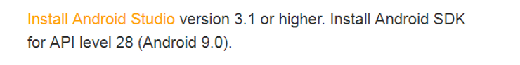

4\. For ^^^^ follow instructions at \[[<u><span>link</span></u>](https://www.centennialsoftwaresolutions.com/blog/create-an-android-project-and-run-the-project-with-android-studio)\] for:

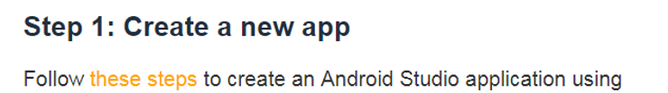

5\. For this step:

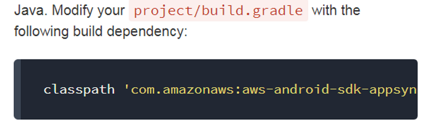

...the string is:

classpath 'com.amazonaws:aws-android-sdk-appsync-gradle-plugin:2.7.+'

...the addition is:

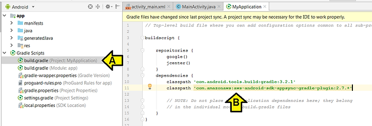

then click **Build > Make Project**

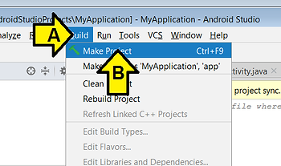

You should see the following in the **Sync** window:

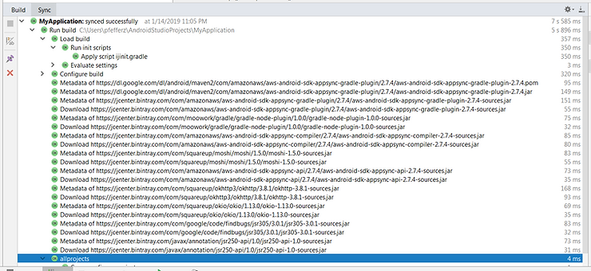

6\. For this step:

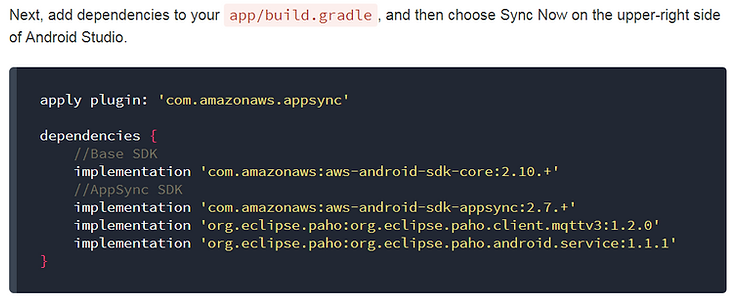

...(A) double-click **build.gradle (Module: app)**,

(B) paste: **apply plugin: 'com.amazonaws.appsync'**

(C) paste:

**dependencies {**

**//Base SDK**

**implementation 'com.amazonaws:aws-android-sdk-core:2.10.+'**

**//AppSync SDK**

**implementation 'com.amazonaws:aws-android-sdk-appsync:2.7.+'**

**implementation 'org.eclipse.paho:org.eclipse.paho.client.mqttv3:1.2.0'**

**implementation 'org.eclipse.paho:org.eclipse.paho.android.service:1.1.1'**

**}**

and (D) click **Sync Now**

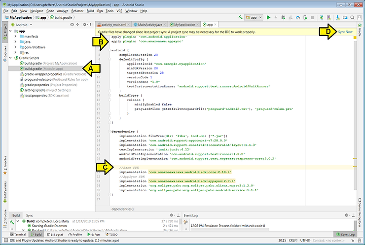

7\. For this step:

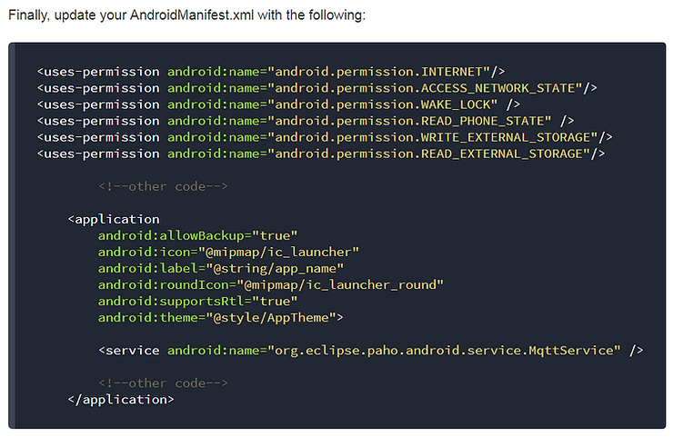

...(A) click on AndroidManifest,xml,

(B) paste:

**<uses-permission android:name="android.permission.INTERNET"/>**

**<uses-permission android:name="android.permission.ACCESS\_NETWORK\_STATE"/>**

**<uses-permission android:name="android.permission.WAKE\_LOCK" />**

**<uses-permission android:name="android.permission.READ\_PHONE\_STATE" />**

**<uses-permission android:name="android.permission.WRITE\_EXTERNAL\_STORAGE"/>**

**<uses-permission android:name="android.permission.READ\_EXTERNAL\_STORAGE"/>**

, and (C) paste: **<service android:name="org.eclipse.paho.android.service.MqttService" />**

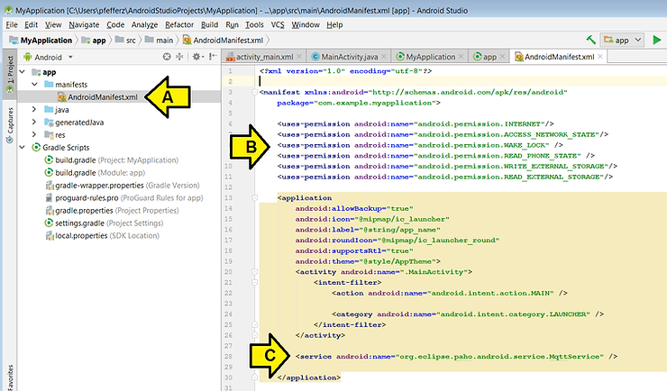

...and click **Build > Make Project**

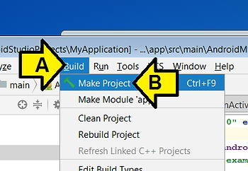

8\. For this step:

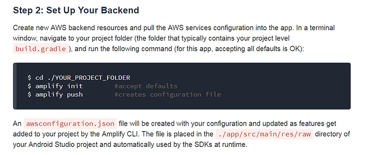

...(A) right-click on **build.gradle (Project: MyApplication)** and (B) click **Open in terminal**

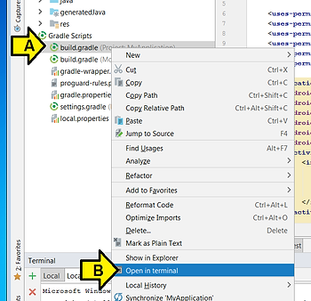

...then type **amplify init** and **amplify push**

I saw:

```
C:\Users\pfefferz\AndroidStudioProjects\MyApplication>amplify init
Note: It is recommended to run this command from the root of your app directory
? Choose your default editor: Sublime Text
? Choose the type of app that you're building android
Describe your project:
? Where is your Res directory:  app/src/main/res
Using default provider awscloudformation

For more information on AWS Profiles, see:
https://docs.aws.amazon.com/cli/latest/userguide/cli-multiple-profiles.html

? Do you want to use an AWS profile? Yes
? Please choose the profile you want to use default
- Initializing project in the cloud...

CREATE_IN_PROGRESS UnauthRole       AWS::IAM::Role  Tue Jan 15 2019 00:00:52 GMT-0700 (
Mountain Standard Time)
CREATE_IN_PROGRESS DeploymentBucket AWS::S3::Bucket Tue Jan 15 2019 00:00:52 GMT-0700 (
Mountain Standard Time)
CREATE_IN_PROGRESS AuthRole         AWS::IAM::Role  Tue Jan 15 2019 00:00:52 GMT-0700 (
Mountain Standard Time)
CREATE_IN_PROGRESS UnauthRole       AWS::IAM::Role  Tue Jan 15 2019 00:00:53 GMT-0700 (
Mountain Standard Time) Resource creation Initiated
CREATE_IN_PROGRESS AuthRole         AWS::IAM::Role  Tue Jan 15 2019 00:00:53 GMT-0700 (
Mountain Standard Time) Resource creation Initiated
CREATE_IN_PROGRESS DeploymentBucket AWS::S3::Bucket Tue Jan 15 2019 00:00:53 GMT-0700 (
Mountain Standard Time) Resource creation Initiated
\ Initializing project in the cloud...

CREATE_COMPLETE UnauthRole AWS::IAM::Role Tue Jan 15 2019 00:01:06 GMT-0700 (Mountain S
tandard Time)
CREATE_COMPLETE AuthRole   AWS::IAM::Role Tue Jan 15 2019 00:01:06 GMT-0700 (Mountain S
tandard Time)
- Initializing project in the cloud...

CREATE_COMPLETE DeploymentBucket           AWS::S3::Bucket            Tue Jan 15 2019 0
0:01:13 GMT-0700 (Mountain Standard Time)
CREATE_COMPLETE ypplication-20190115000050 AWS::CloudFormation::Stack Tue Jan 15 2019 0
0:01:16 GMT-0700 (Mountain Standard Time)
√ Successfully created initial AWS cloud resources for deployments.

Your project has been successfully initialized and connected to the cloud!

Some next steps:
"amplify status" will show you what you've added already and if it's locally configured
 or deployed
"amplify  add" will allow you to add features like user login or a backend AP
I
"amplify push" will build all your local backend resources and provision it in the clou
d
"amplify publish" will build all your local backend and frontend resources (if you have
 hosting category added) and provision it in the cloud

Pro tip:
Try "amplify add api" to create a backend API and then "amplify publish" to deploy ever
ything


C:\Users\pfefferz\AndroidStudioProjects\MyApplication>amplify push
| Category | Resource name | Operation | Provider plugin |
| -------- | ------------- | --------- | --------------- |
? Are you sure you want to continue? Yes
√ All resources are updated in the cloud
```

9\. For this step:

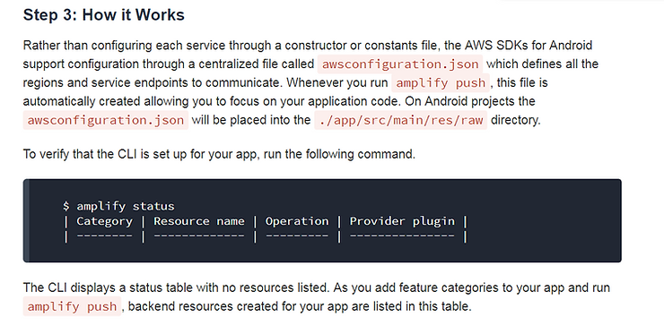

...type **amplify status**

I saw:

```
C:\Users\pfefferz\AndroidStudioProjects\MyApplication>amplify status
| Category | Resource name | Operation | Provider plugin |
| -------- | ------------- | --------- | --------------- |
```

Stopping here for the moment (or for good, since I'm not sure how this ties into the device shadows).