# Arduino IDE WeMos D1 Mini Board Support Install & Blink LED Instructions


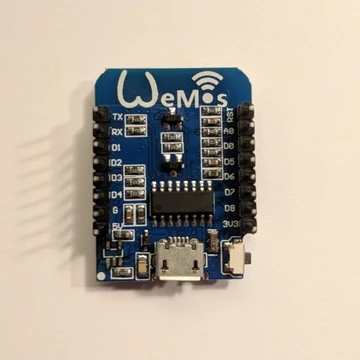

This post describes how to install the board support package for the WeMos D1 Mini board into the Arduino IDE and blink the board's LED.

**<u><span>Note</span></u>**

A **WeMos D1 Mini** clone: "IZOKEE D1 Mini NodeMcu Lua 4M Bytes WLAN WIFI Internet Development Board Base on ESP8266 ESP-12F for Arduino, 100% Compatible with WeMos D1 Mini" from \[[amazon](https://www.amazon.com/gp/product/B076F52NQD)\] was used in this example.

Description from Amazon:

-   This D1 mini module is a mini WIFI board based on ESP-8266EX.
    
-   This WLAN board contains 11 digital input / output pins, all pins have interrupt / pwm / I2C / 1-wire and a micro-USB connection.
    
-   Our D1 mini development board is 100% compatible with Arduino WeMos and can be programmed in the Arduino IDE. (Verified)
    

**<u><span>Prerequisites</span></u>**

-   Installed the Arduino IDE on Ubuntu 16.04.3 following \[[instructions](https://www.centennialsoftwaresolutions.com/blog/get-and-install-the-64-bit-arduino-1-8-7-ide-on-ubuntu-16-04-3)\]
    
-   A USB 2.0 A-Male to Micro B Cable \[[amazon](https://www.amazon.com/AmazonBasics-Male-Micro-Cable-Black/dp/B0711PVX6Z/ref=asc_df_B0711PVX6Z/?tag=hyprod-20&linkCode=df0&hvadid=198093101467&hvpos=1o1&hvnetw=g&hvrand=16144677478581511559&hvpone=&hvptwo=&hvqmt=&hvdev=c&hvdvcmdl=&hvlocint=&hvlocphy=1014452&hvtargid=pla-359221356227&psc=1)\]
    

**<u><span>Steps</span></u>**

1\. Double click the Arduino IDE icon to run the Arduino IDE

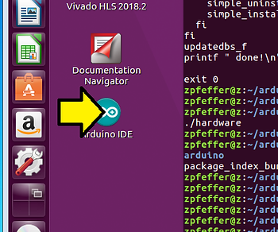

2\. (A) Click **File** and (B) click **Preferences**

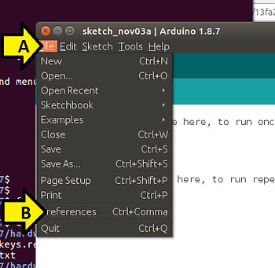

3\. (A) Enter http://arduino.esp8266.com/versions/2.3.0/package\_esp8266com\_index.json into the **Additional Boards Manager URLs**: field (comma separate multiple URLs) and (B) click **OK**


4\. (A) Click **Tools**, (B) **Board: ....** and (C) **Boards Manager...**

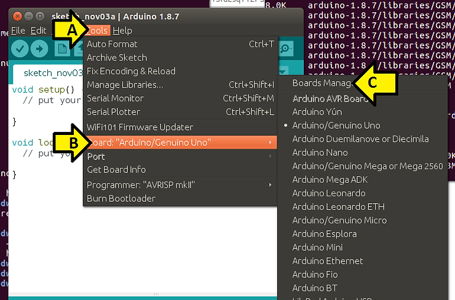

5\. (A) Type **esp8266** and (B) click **Install**

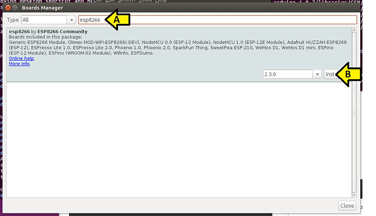

You should see:

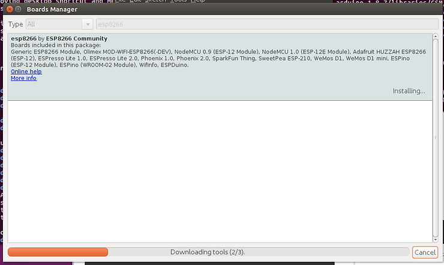

6\. (A) check that it is **INSTALLED** and click (B) **Close**

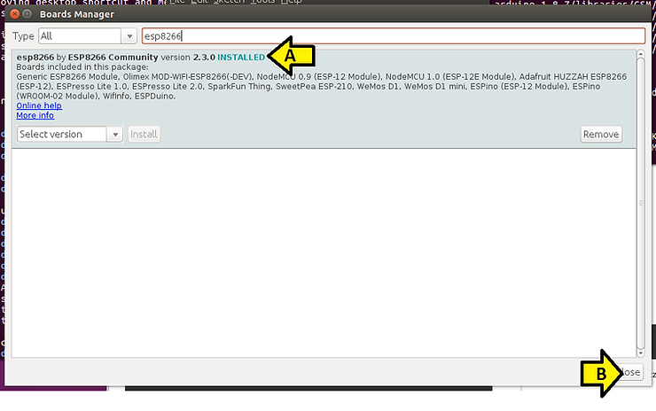

7\. (A) Click **Tools**, (B) **Board: ...** and (C) **WeMos D1 R2 & mini**

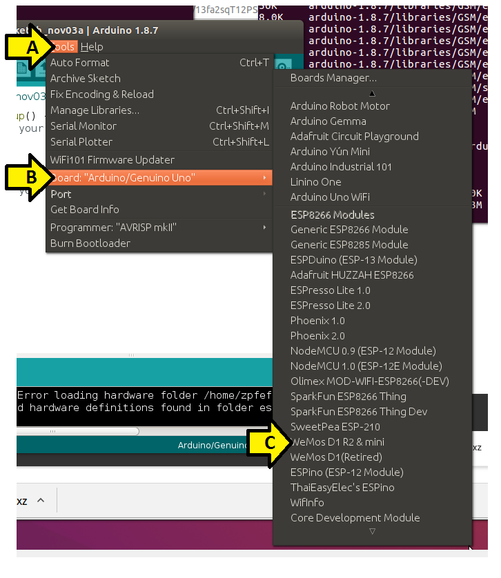

8\. Plug the USB cable in to the WeMos D1 Mini board and the computer

9\. Type (replace zpfeffer with your username) **sudo usermod -a -G dialout zpfeffer**

10\. Unplug the USB from the computer, close all programs, log out, log in and start the Arduino IDE again.

11\. Plug the USB cable into the computer.

12\. (A) Click Tools, (B) Port and (C) /dev/ttyUSB0

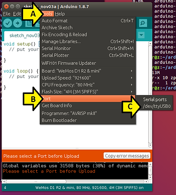

You should see:

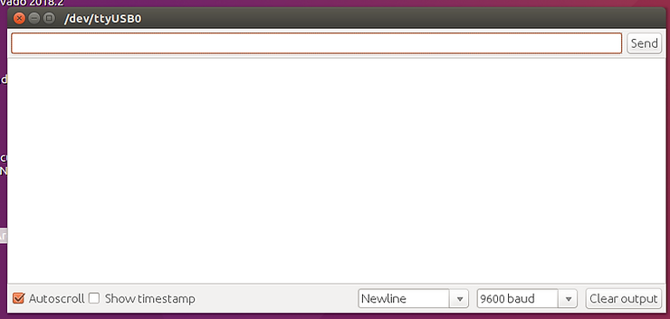

13\. Paste the following code (from \[[link](https://raw.githubusercontent.com/wemos/D1_mini_Examples/master/examples/02.Special/DeepSleep/Blink/Blink.ino)\]) into **sketch\_nov03a**:

```
/* Deep Sleep - Blink
 *
 * Blinks the onboard LED, sleeps for 10 seconds and repeats
 *
 * Connections:
 * D0 -- RST
 *
 * If you cant reprogram as the ESP is sleeping, disconnect D0 - RST and try again
 */

// sleep for this many seconds
const int sleepSeconds = 5;

void setup() {
  Serial.begin(9600);
  Serial.println("\n\nWake up");

  pinMode(BUILTIN_LED, OUTPUT);

  // Connect D0 to RST to wake up
  pinMode(D0, WAKEUP_PULLUP);

  // LED: LOW = on, HIGH = off
  Serial.println("Start blinking");
  for (int i = 0; i < 20; i++)
  {
    digitalWrite(BUILTIN_LED, LOW);
    delay(100);
    digitalWrite(BUILTIN_LED, HIGH);
    delay(100);
  }
  Serial.println("Stop blinking");

  Serial.printf("Sleep for %d seconds\n\n", sleepSeconds);

  // convert to microseconds
  ESP.deepSleep(sleepSeconds * 1000000);
}

void loop() {
}
```

14\. Click **Upload**

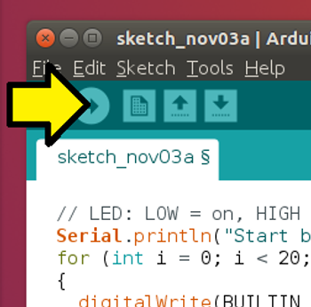

Click **Save**

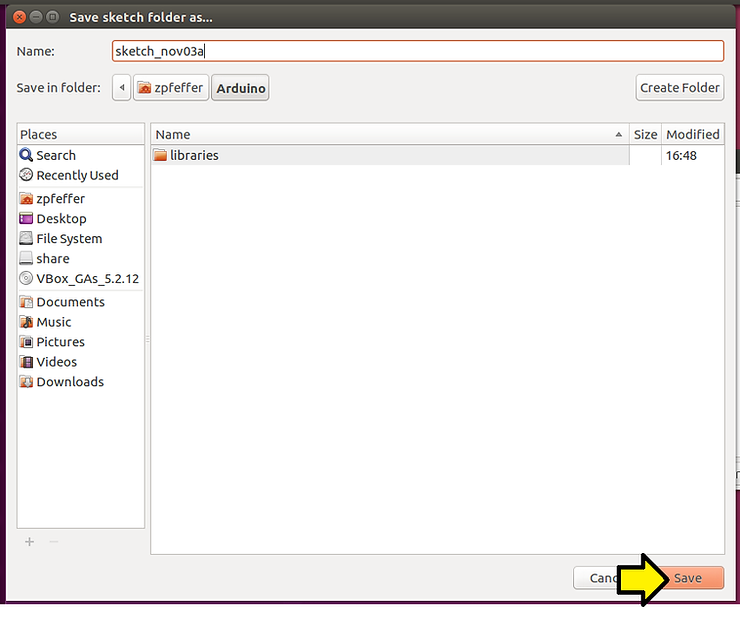

15\. Click **Upload**

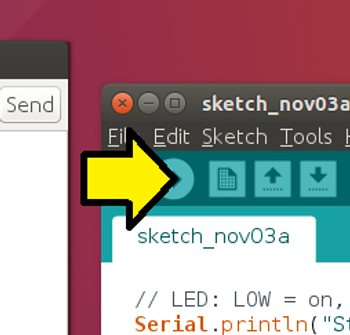

You should see compiled output:

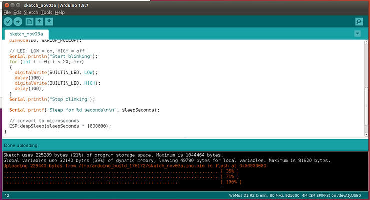

...and:

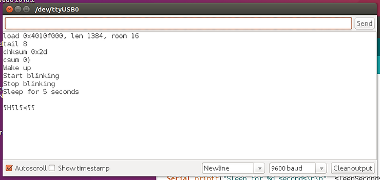

Here's a video of the compile:

(Video_unavailable)

Here's a video of the serial port output:

(Video_unavailable)

And here's the board blinking:

(Video_unavailable)

**<u><span>References</span></u>**

WEMOS D1 Mini at \[[link](https://wiki.wemos.cc/products:d1:d1_mini)\]

WEMOS D1 Mini / Get started in Arduino at \[[link](https://wiki.wemos.cc/tutorials:get_started:get_started_in_arduino)\]

WEMOS' store at \[[link](https://lolin.aliexpress.com/store/1331105)\]

ESP8266 Community Forum at \[[link](https://www.esp8266.com/index.php)\]

Wemos D1 Mini, ESP8266 Getting Started Guide With Arduino at \[[link](https://www.hackster.io/innovativetom/wemos-d1-mini-esp8266-getting-started-guide-with-arduino-727098)\]

Arduino at \[[link](https://www.arduino.cc/)\]

Arduino IDE at \[[link](https://www.hackster.io/arduino/products/arduino-ide)\]

Arduino core for the ESP32 at \[[link](https://github.com/espressif/arduino-esp32)\]

Deep Sleep - Blink at \[[link](https://github.com/wemos/D1_mini_Examples/blob/master/examples/02.Special/DeepSleep/Blink/Blink.ino)\]

**<u><span>Other Related References</span></u>**

Things4U - Internet of Things for You at \[[link](http://things4u.github.io/)\]

Charles's Blog at \[[link](https://hallard.me/)\]