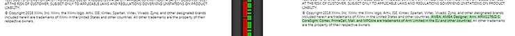

# Are HDF Files Going Away?

This post looks at statements made in the 2018.1 and 2018.2 versions of the **PetaLinux Tools Reference Guide** that seem to indicate that Xilinx decided against removing HDF files.

**<u>Warnings Removed?</u>**

The 2018.2 version of the **PetaLinux Tools Reference Guide** contains this:

**<u>What does DSA stand for?</u>**

From page 20:

**_Note_**_:_ Device Support Archive (DSA) is hardware description format introduced in Vivado. DSA is super set of HDF holding additional configurations that can be changed by XSCT/XSDK.

**<u>"Removed DSA warning and recommendations throughout the book"</u>**

I compared the 2018.1 and 2018.2 versions of the **PetaLinux Tools Reference Guide**. Here were the differences of substance:

**Note**: In the following differences, 2018.1 is on the left and 2018.2 is on the right.

**[#1](https://www.centennialsoftwaresolutions.com/blog/hashtags/1) (page 20,21):**

Highlighted: In **2018.1** it says: **the HDF file will be deprecated in the future releases of Vivado and PetaLinux. Currently, PetaLinux supports both HDF and DSA files**. In **2018.2,** this warning is not present.

**[#2](https://www.centennialsoftwaresolutions.com/blog/hashtags/2) (page 24):**

**[#3](https://www.centennialsoftwaresolutions.com/blog/hashtags/3) (page 127):**

Highlighted: 2018.1 is missing the line: AMBA, AMBA Designer, Arm, ARM1176JZ-S, CoreSight, Cortex, PrimeCell, Mali, and MPCore are trademarks of Arm Limited in the EU and other countries

**<u>Commentary</u>**

A Google search for **site:xilinx.com HDF deprecated** turned up no other relevant info, like an announcement from Xilinx.

**<u>Call to Action</u>**

Do you know what the story is with the DSA vs. HDF? If so, post a comment.

**<u>References</u>**

-   The 2018.1 \[[link](https://www.xilinx.com/support/documentation/sw_manuals/xilinx2018_1/ug1144-petalinux-tools-reference-guide.pdf)\] and 2018.2 \[[link](https://www.xilinx.com/support/documentation/sw_manuals/xilinx2018_2/ug1144-petalinux-tools-reference-guide.pdf)\] versions of _ug1144-petalinux-tools-refence-guide.pdf_ were compared using [https://draftable.com](https://draftable.com/).
    
-   Xilinx logo found via [https://twitter.com/xilinxinc](https://twitter.com/xilinxinc) at \[[link](https://pbs.twimg.com/profile_images/535545777020338176/pEWdIYq__400x400.png)\]
    

**<u>Other Info</u>**

**What is a CR update?**

**CR update** is not defined in the document.