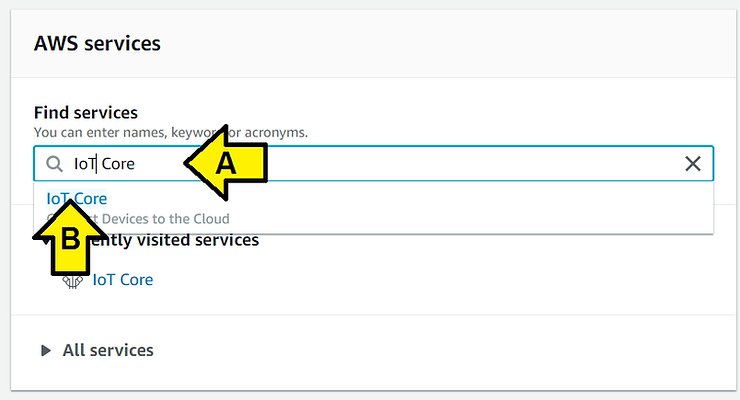
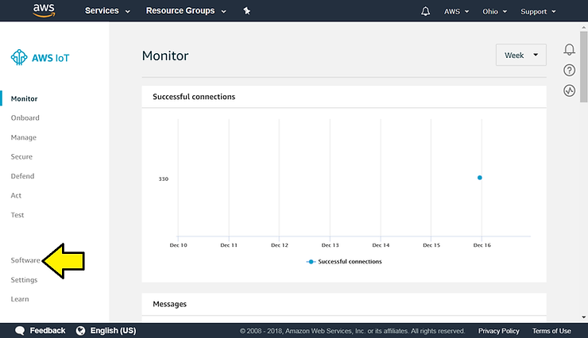
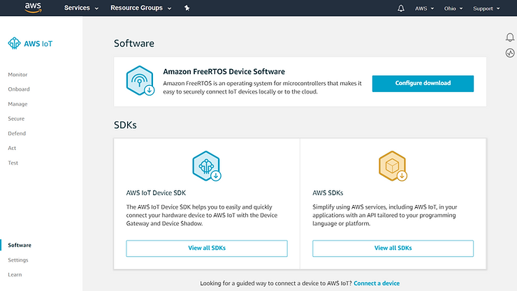
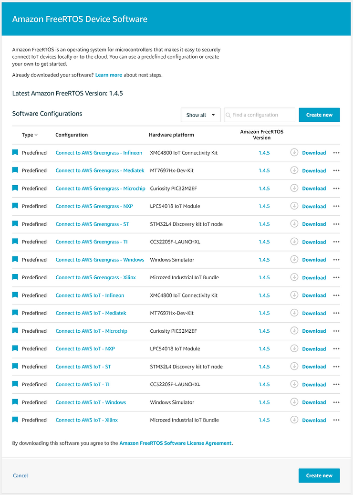
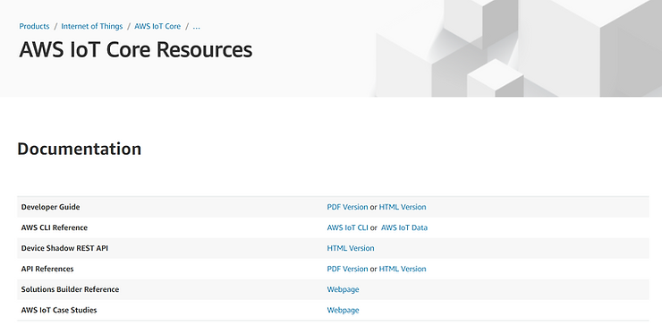
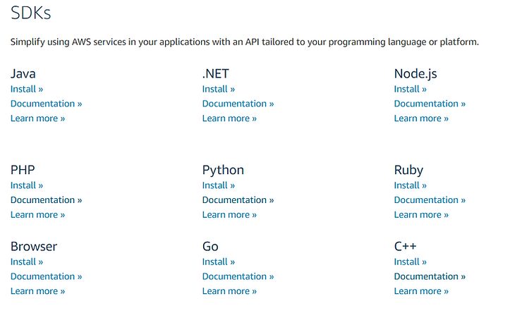

# AWS IoT Core Software Quick Reference

This post lists the AWS IoT software options. I wrote it so I would have a quick reference to the info and links on the various IoT Core pages.

**Steps to Access AWS IoT** **<u>Software</u>** **Info**

1\. Go to [[https://aws.amazon.com](https://aws.amazon.com/)]

2\. Click the **Sign In to the Console** button in the upper right-hand corner

3\. (A) Type **IoT Core** and (B) click **IoT Core**, brings me to \[[link](https://us-east-2.console.aws.amazon.com/iot/home?region=us-east-2#/dashboard)\]

4\. Click on **Software**

I see:

**Links**

Amazon FreeRTOS Device Software **Configure download** \[[link](https://us-east-2.console.aws.amazon.com/iot/home?region=us-east-2#/software/freertos)\]

AWS IoT Device SDK **View all SDKs** \[[link](https://aws.amazon.com/iot-core/resources/)\]

AWS SDKs **View all SDKs** \[[link](https://aws.amazon.com/tools/#sdk)\]

**Amazon FreeRTOS Device Software**

**AWS IoT Device SDK**

**AWS SDKs**

### **Links** 

### Java

[Install »](https://sdk-for-java.amazonwebservices.com/latest/aws-java-sdk.zip) [Documentation »](https://aws.amazon.com/documentation/sdkforjava/) [Learn more »](https://aws.amazon.com/sdkforjava/) 

### .NET

[Install »](https://sdk-for-net.amazonwebservices.com/latest/AWSToolsAndSDKForNet.msi) [Documentation »](https://aws.amazon.com/documentation/sdkfornet/) [Learn more »](https://aws.amazon.com/sdkfornet/) 

### Node.js

[Install »](http://docs.aws.amazon.com/AWSJavaScriptSDK/guide/node-intro.html) [Documentation »](https://aws.amazon.com/documentation/sdk-for-javascript/) [Learn more »](https://aws.amazon.com/sdkfornodejs/) 

### PHP

[Install »](http://docs.aws.amazon.com/aws-sdk-php/v3/guide/getting-started/installation.html) [Documentation »](https://aws.amazon.com/documentation/sdk-for-php/) [Learn more »](https://aws.amazon.com/sdk-for-php/) 

### Browser

[Install »](https://github.com/aws/aws-sdk-js/#aws-sdk-for-javascript) [Documentation »](https://docs.aws.amazon.com/sdk-for-javascript/v2/developer-guide/getting-started-browser.html) [Learn more »](https://aws.amazon.com/sdk-for-browser/) 

### Python

[Install »](https://github.com/boto/boto3#quick-start) [Documentation »](https://boto3.readthedocs.org/en/latest/) [Learn more »](http://aws.amazon.com/sdk-for-python/) 

### Go

[Install »](https://github.com/aws/aws-sdk-go/wiki) [Documentation »](https://aws.amazon.com/documentation/sdk-for-go/) [Learn more »](https://aws.amazon.com/sdk-for-go/) 

### Ruby

[Install »](http://docs.aws.amazon.com/sdk-for-ruby/latest/DeveloperGuide/aws-ruby-sdk-getting-started.html) [Documentation »](https://aws.amazon.com/documentation/sdkforruby/) [Learn more »](https://aws.amazon.com/sdkforruby/) 

### C++

[Install »](https://github.com/aws/aws-sdk-cpp) [Documentation »](https://aws.amazon.com/documentation/sdk-for-cpp/) [Learn more »](https://aws.amazon.com/sdk-for-cpp/)

**<u>Other Resources</u>**

**Getting Started with AWS IoT Core** at \[[link](https://aws.amazon.com/iot-core/getting-started/)\] describes the:

-   **AWS Management Console** \[[link](https://console.aws.amazon.com/iot/home)\] - web based resource management,
    
-   **AWS SDK** \[[link](https://aws.amazon.com/tools/)\] - for working with IoT Core,
    
-   **AWS IoT Device SDK** \[[link](https://aws.amazon.com/iot-core/resources/)\] - for connecting your IoT device and the
    
-   **AWS Partner Device Catalog** \[[link](https://devices.amazonaws.com/search?sv=iot)\] - for devices that work & **AWS Device Qualification Program** \[[link](https://aws.amazon.com/partners/dqp/)\] - for qualifying that your device works.
    

**<u>References</u>**

AWS icon from \[[link](https://goo.gl/images/4jUMSB)\]