# Bare-Metal Application Boot from Flash on the Xilinx Zynq-7000 of the ZC702


This post lists how to create a complete bare-metal application that boots from the Micron Quad SPI and what happens during boot.

The ZC702 Rev 1.1 board \[[<u><span>schematic</span></u>](https://drive.google.com/open?id=1hRAtRQfoyh0noK0whHXCsUEcgLtGKYNv)\]\[[<u><span>user guide</span></u>](https://drive.google.com/open?id=1plkXsr34N11zWXykGncRNYA_a7l18Vl8)\] has a XC7Z020CLG484 Zynq-7000 \[[<u><span>TRM</span></u>](https://drive.google.com/open?id=1uXjQCUHOGveHTlX-8Q1q9Hl7i8ZqSCM6)\] which can boot from a N25Q128A (Micron Serial NOR Flash Memory 1.8V, Multiple I/O, 4KB Sector Erase) Quad SPI \[[<u><span>datasheet</span></u>](https://drive.google.com/open?id=1qop4pSXJwwL3ZY2Q7umPQ6o5hQhsVnzA)\].

**Note**: AR# 50991 **Zynq-7000 SoC - What devices are supported for configuration?** at \[[<u><span>link</span></u>](https://www.xilinx.com/support/answers/50991.html)\] covers this and the other flash devices supported by the Zynq-7000:

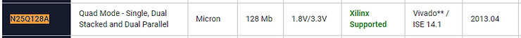

Note 2: 2016.4 was used to create this write up.

**<u><span>Build the FSBL and an App</span></u>**

1\. Run Xilinx SDK 2016.4

2\. Create a workspace called FSBLandAppDemo

3\. Select File > New > Application Project

Use Project name: **DemoFSBL**

...and the following settings and click **Next**:

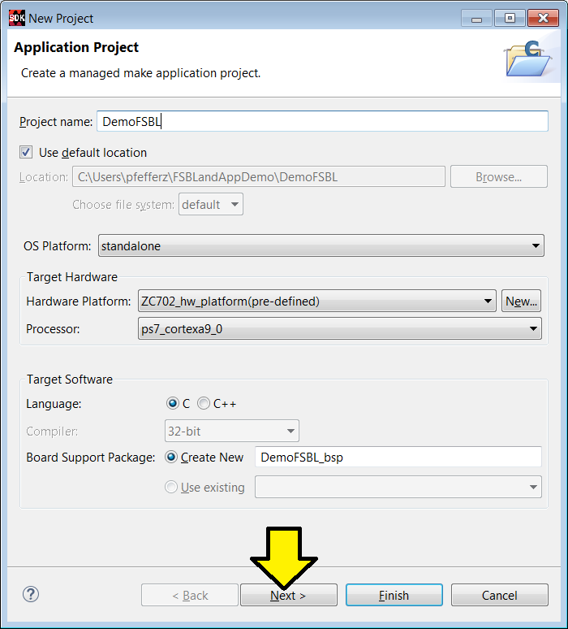

4\. Select **Zynq FSBL** and click **Finish**

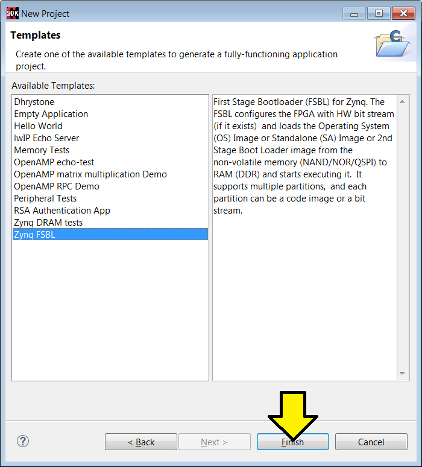

5\. Again, select File > New > Application Project

Use Project name: **HelloWorld**

Select **Use existing DemoFSBL\_bsp**

...and the following settings and click **Next**:

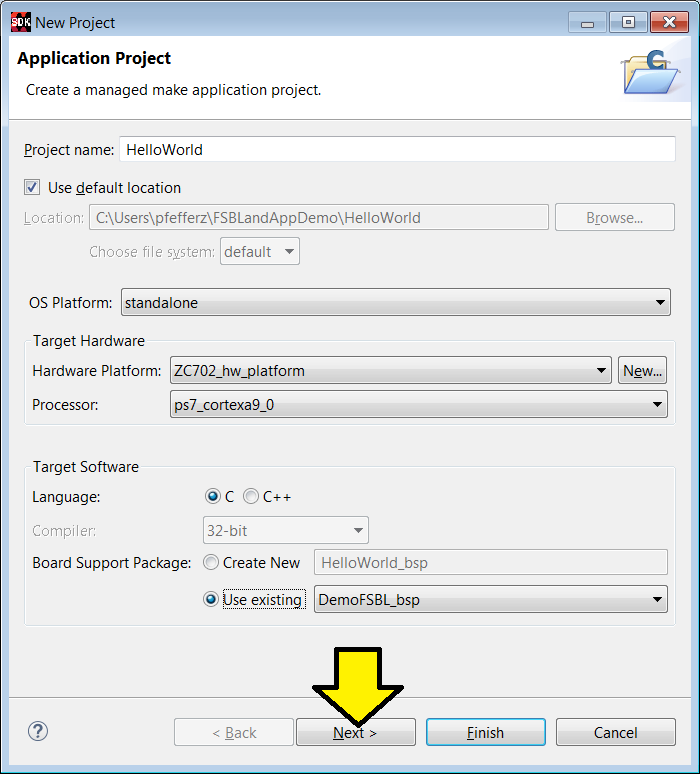

6\. Leave **Hello World** selected and click **Finish**

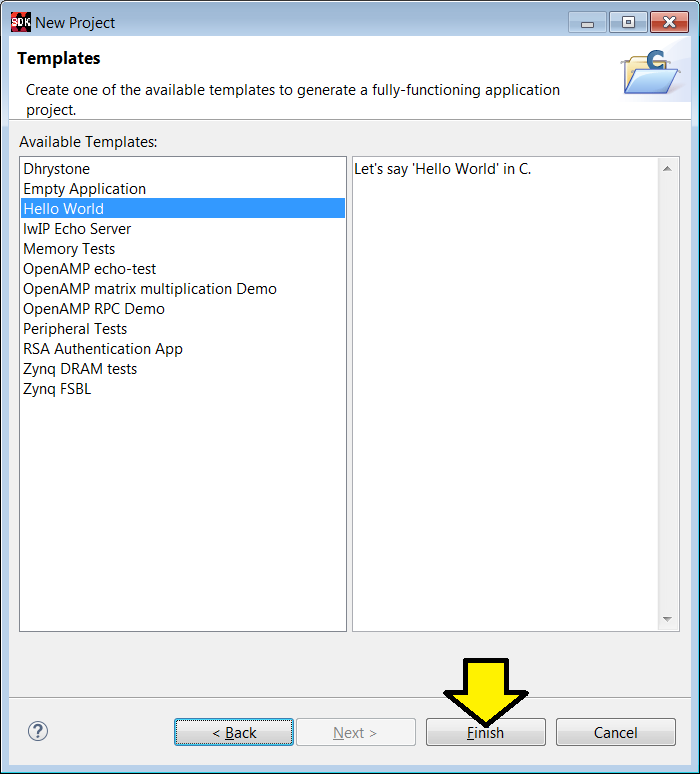

7\. Select **Project** \> **Build All**

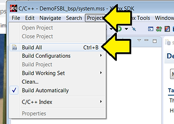

8\. Select **Xilinx Tools > Create Boot Image**

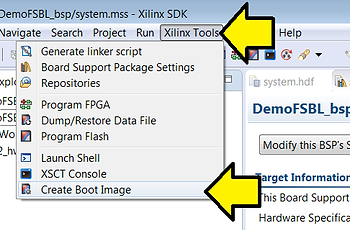

Set **Output BIF file path** to **C:\\Users\\pfefferz\\FSBLandAppDemo\_out\\DemoFSBL.bif**

Set **Output path** to **C:\\Users\\pfefferz\\FSBLandAppDemo\_out\\BOOT.bin**

Click **Add**

Find **C:\\Users\\pfefferz\\FSBLandAppDemo\\DemoFSBL\\Debug\\DemoFSBL.elf**

Set **Partition type** to **bootloader**

Click **OK**

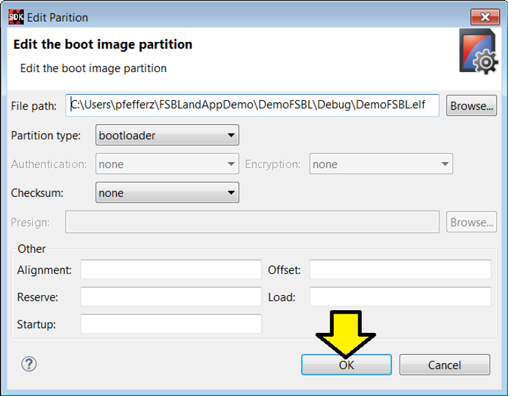

Click **Add**

Find **C:\\Users\\pfefferz\\FSBLandAppDemo\\Helloworld\\Debug\\HelloWorld.elf**

Set **Partition type** to **datafile**

Click **OK**

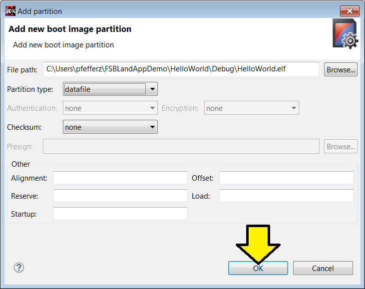

Click **Create Image**

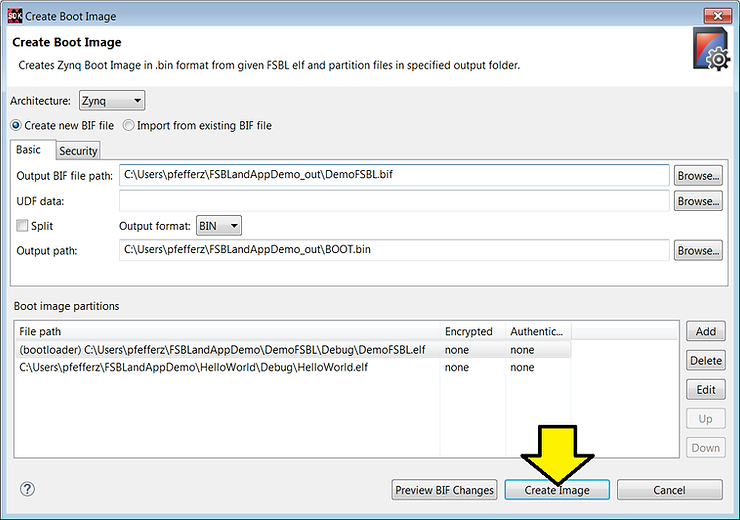

9\. Click **Xilinx Tools > Program Flash**

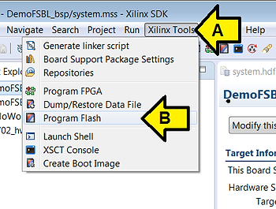

10\. Plug the USB UART and USB JTAG Cables in

11\. Set the window as follows and click **Program**

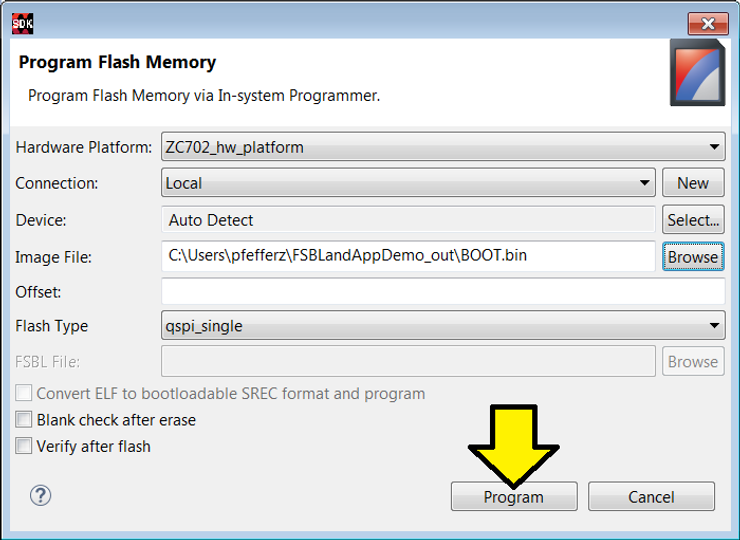

You should see:

```
cmd /C program_flash -f C:\Users\pfefferz\FSBLandAppDemo_out\BOOT.bin -offset 0 \
-flash_type qspi_single -cable type xilinx_tcf url TCP:127.0.0.1:3121 

****** Xilinx Program Flash
****** Program Flash v2016.4 (64-bit)
  **** SW Build 1756540 on Mon Jan 23 19:11:23 MST 2017
    ** Copyright 1986-2016 Xilinx, Inc. All Rights Reserved.

Connecting to hw_server @ TCP:127.0.0.1:3121

WARNING: Failed to connect to hw_server at TCP:127.0.0.1:3121
Attempting to launch hw_server at TCP:127.0.0.1:3121

Connected to hw_server @ TCP:127.0.0.1:3121
Available targets and devices:
Target 0 : jsn-JTAG-SMT1-210203858733A
	Device 0: jsn-JTAG-SMT1-210203858733A-4ba00477-0

Retrieving Flash info...

Initialization done, programming the memory
BOOT_MODE REG = 0x00000001
WARNING: [Xicom 50-100] The current boot mode is QSPI.
If flash programming fails, configure device for JTAG boot mode and try again.
f probe 0 0 0
Performing Erase Operation...
Erase Operation successful.
INFO: [Xicom 50-44] Elapsed time = 3 sec.
Performing Program Operation...
0%...100%
Program Operation successful.
INFO: [Xicom 50-44] Elapsed time = 1 sec.

Flash Operation Successful
```

**<u><span>Background</span></u>**

1\. Power is applied to the Zynq-7000 and the first instruction of the BootROM is executed at 0x0 (the BootROM cannot be changed).

2\. The BootROM reads the boot-mode pins (via the Boot Mode Register) to figure out which device holds the first stage boot loader (FSBL) it should load via the memory controller to the OCM to run. It also initializes essential clocks and the device that holds the next code to run.

For the ZC702 to boot from Quad SPI SW16 should be set to:

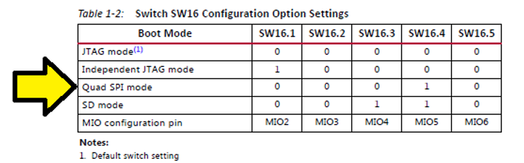

...which corresponds to the following physical switch settings

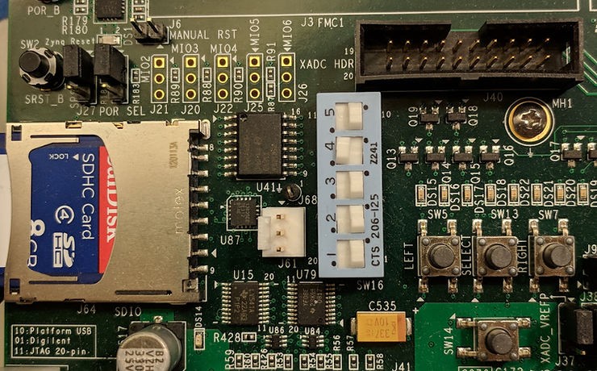

3\. The BootROM reads the BootROM Header and performs two checks to verify that the header is valid. It looks to see that the Image Identification parameter contains 0x584C4E58 ( XLNX at 0x024) and that the Header Checksum parameter (0x048) matches the checksum calculated by the BootROM. If either of these tests fail, then the BootROM Header address increments by 32 KB and the tests are repeated.

Note:

The **Boot Header** defines characteristics of the FSBL partition. The image ID and Header Checksum fields in the Boot Header allow the BootROM code to run integrity checks. The Encryption Status field specifies whether the FSBL is non-secure or secure, and if secure, whether the key source is eFUSE or BBRAM.

The **Boot Header** aka **BootROM Header** aka **Boot Image Header**

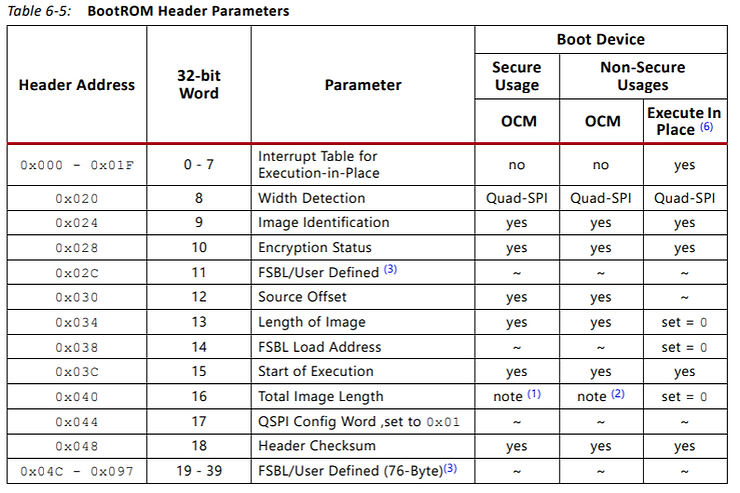

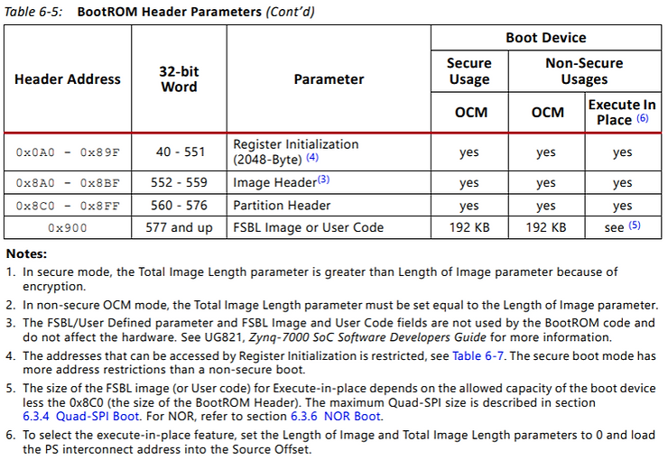

4\. In this case, once the BootROM loads the FSBL into OCM from the QSPI it jumps to the FSBL running in OCM.

The FSBL:

I) Initializes the PS using the PS7 Init data that is generated by Vivado tools (MIO, DDR, etc.)

II) Programs the PL using a bitstream if a bitstream is included in the BOOT.bin built with bootgen.

III) Loads the bare-metal application code into DDR memory.

IV) Jumps to the bare-metal application

**<u><span>Reference</span></u>**

-   **Secure Boot of Zynq-7000 All Programmable SoC** at \[[<u><span>link</span></u>](https://www.xilinx.com/support/documentation/application_notes/xapp1175_zynq_secure_boot.pdf)\]
    
-   **SDK Doc: Creating a Zynq Boot Image for an Application** at \[[<u><span>link</span></u>](https://www.xilinx.com/html_docs/xilinx2016_4/SDK_Doc/index.html?q=/html_docs/xilinx2016_4/SDK_Doc/SDK_tasks/sdk_t_create_zynq_boot_image.html)\]
    
-   **Zynq-7000 Boot Process** at \[[<u><span>link</span></u>](https://www.centennialsoftwaresolutions.com/blog/zynq-7000-boot-process)\]
    
-   Xilinx logo found via [<u><span>https://twitter.com/xilinxinc</span></u>](https://twitter.com/xilinxinc) at \[[<u><span>link</span></u>](https://pbs.twimg.com/profile_images/535545777020338176/pEWdIYq__400x400.png)\]