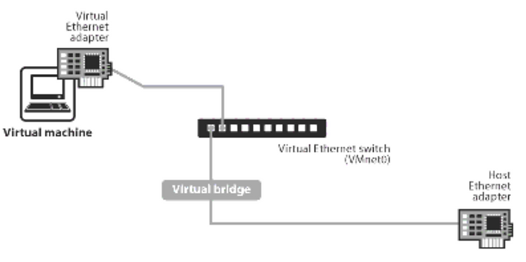
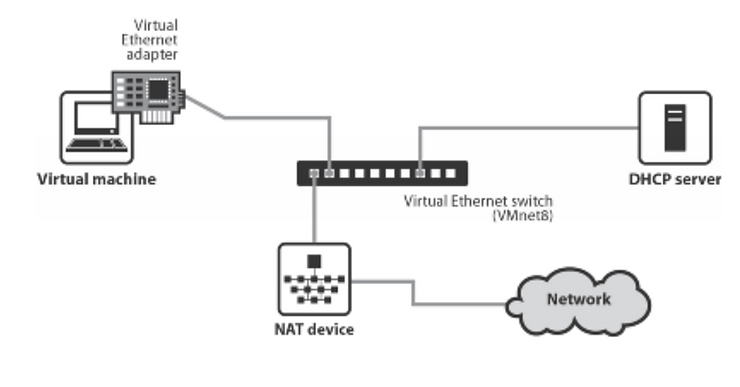
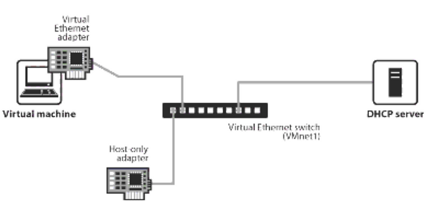
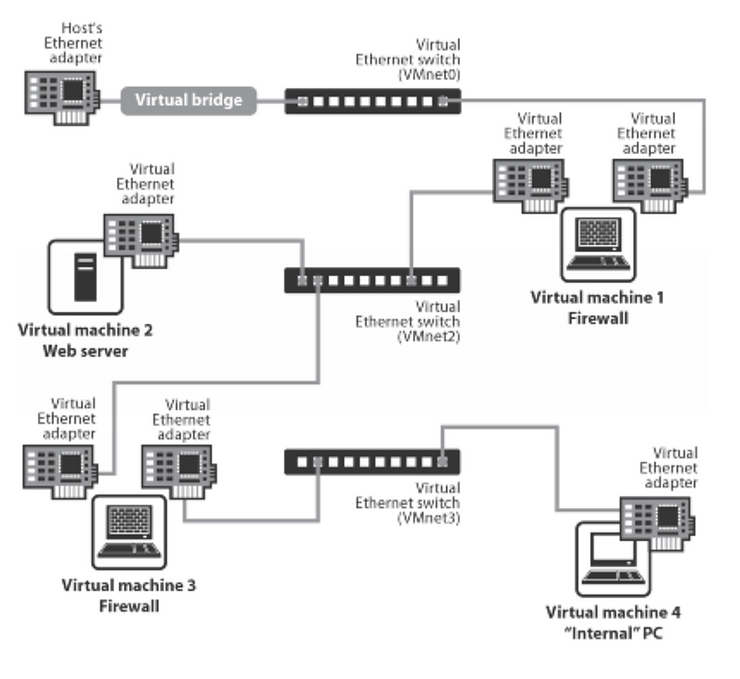

# "Bridged, NAT, Host-only or Custom" VMWare

This post brings together the diagrams and links from the Bridged, NAT, Host-only or Custom network diagrams found on various [<u>vmware.com</u>](http://vmware.com/) pages.

**<u>Bridged Networking</u>**

https://www.vmware.com/support/ws4/doc/network_bridged_ws.html 

"Bridged networking connects a virtual machine to a network using the host computer's Ethernet adapter."

"If you use bridged networking, your virtual machine needs to have its own identity on the network."

"If you use bridged networking, the virtual machine is a full participant in the network."

**Related**:

-   Adding and Modifying Virtual Network Adapters at \[[<u>link</u>](https://www.vmware.com/support/ws5/doc/ws_net_configurations_changing_vadapters.html)\]
    
-   Configuring Bridged Networking Options on a Windows Host at \[[<u>link</u>](https://www.vmware.com/support/ws5/doc/ws_net_configurations_changing_bridged_windows.html)\]
    
-   Enabling, Disabling, Adding and Removing Host Virtual Adapters at \[[<u>link</u>](https://www.vmware.com/support/ws5/doc/ws_net_configurations_changing_hostadapter.html)\]
    

**<u>Network Address Translation (NAT)</u>**

https://www.vmware.com/support/ws5/doc/ws_net_configurations_nat.html 

"If you want to connect to the Internet or other TCP/IP network using the host computer's dial-up networking or broadband connection and you are not able to give your virtual machine an IP address on the external network, NAT is often the easiest way to give your virtual machine access to that network."

**<u>Host-Only Networking</u>**

https://www.vmware.com/support/ws3/doc/ws32_network6.html 

"Host-only networking creates a network that is completely contained within the host computer."

**<u>Customer Networking Configurations</u>**

https://www.vmware.com/support/ws5/doc/ws_net_configurations_custom.html 

"The virtual networking components provided by VMware Workstation make it possible for you to create sophisticated virtual networks. The virtual networks can be connected to one or more external networks, or they may run entirely on the host computer."

**<u>Reference</u>**

From [https://en.wikipedia.org](https://en.wikipedia.org/wiki/VMware_Workstation_Player): VMWare Workstation Player Icon @ [[link](https://en.wikipedia.org/wiki/VMware_Workstation_Player)] 