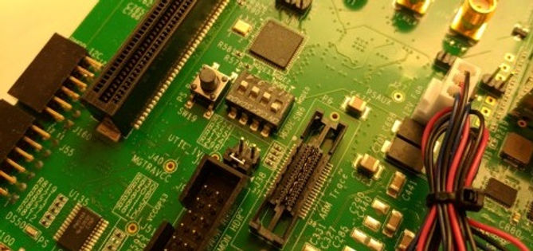
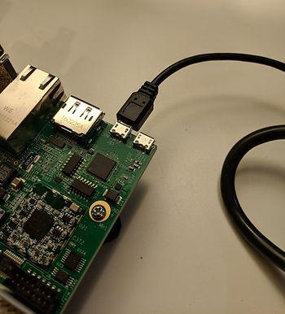
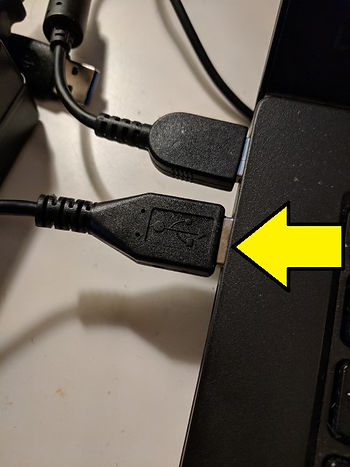
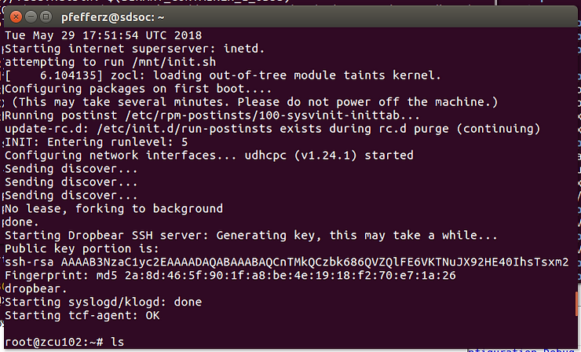
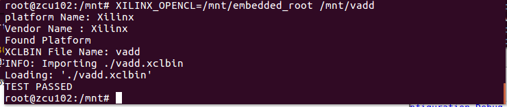

# Build and Run Xilinx's Vector Addition (CL) OpenCL Example

This post shows all the steps to get, build and run the Vector Addition (CL) OpenCL example from Xilinx.

**<u>Prerequisites</u>**

-   Have a ZCU102 board
    
-   Install SDSoC 2018.2 on Ubuntu 16.04.3 (see \[[<u>link</u>](https://www.centennialsoftwaresolutions.com/blog/lab-1-sdsoc-build-and-load)\] for instructions)
    
-   Know how to connect an SD card reader/writer (see \[[<u>link</u>](https://www.centennialsoftwaresolutions.com/blog/sd-card-access-from-ubuntu-16-04-3-on-virtualbox-on-windows-7)\] for instructions)
    
-   How to configure and run minicom (see step 10. \[[<u>link</u>](https://www.centennialsoftwaresolutions.com/blog/lab-1-sdsoc-build-and-load)\] for instructions)
    

**<u>Note</u>**

I could not get this to work through the 2018.2 SDx Eclipse GUI. See \[[<u>underconstruction</u>](https://www.centennialsoftwaresolutions.com/blog/xilinx-fpga-opencl-vector-addition)\].

**<u>Steps</u>**

1\. Get source

A. Type **cd ~**

B. Type **git clone** [**https://github.com/Xilinx/SDSoC_Examples.git**](mailto:bhaskar.vishnuvardhan.chebrolu@xilinx.com)

2\. Build it

A. Type **cd ~/SDSoC\_Examples/ocl/getting\_started/hello\_vadd\_ocl**

B. Type **git log**

You should see:

_commit 368305ee44f0610cf97328f4feadb3750a96ae68_

*Author: Bhaskar VishnuVardhan Chebrolu <*[*bhaskar.vishnuvardhan.chebrolu@xilinx.com*](mailto:bhaskar.vishnuvardhan.chebrolu@xilinx.com)*>*

_Date: Thu Jun 28 09:55:14 2018 +0530_

_Update the readme and json file to remove the naming inconsistency in GUI_

C. Type **XILINX\_SDX=/opt/Xilinx/SDx/2018.2 PATH=/opt/Xilinx/SDK/2018.2/gnu/aarch64/lin/aarch64-linux/bin:$PATH CPPFLAGS="-I/opt/Xilinx/SDx/2018.2/runtime/include/1\_2" make PLATFORM=zcu102**

Notes:

-   This took 0h 38m 14s on a virtual machine running Ubuntu 16.04.3 hosted by VirtualBox 5.2.12 r122591 (Qt5.6.2) running on Windows 7 SP1 on \[[<u>link</u>](http://www.zachpfeffer.com/single-post/2017/01/28/New-T460-System-Information)\] machine.
    
-   The full log is \[[<u>here</u>](https://docs.google.com/document/d/1uYcXP_BYPBo74Hfn9YO3sXg1jxcylErOtBgwb6JM904/edit?usp=sharing)\]
    

3\. Load it (replace **/media/pfefferz/3661-3361** with your directory)

A. Type **cd ~/SDSoC\_Examples/ocl/getting\_started/hello\_vadd\_ocl**

B. Type **cp -rf build/zcu102\_hw/sd\_card/\* /media/pfefferz/3661-3361**

4\. Run it on the target

A. Eject the SD card from the reader

B. Insert in the ZCU102

C. Set SW6 to to boot from the SD card:

5\. Connect the USB UART to the computer and start minicom

6\. Start the ZCU102

In the minicom window you should see output, ending with:

7\. Run the example

In the minicom window type **XILINX\_OPENCL=/mnt/embedded\_root /mnt/vadd**

You should see:

Full minicom output \[[<u>here</u>](https://docs.google.com/document/d/1jkusAt6uGio8B9ynF7i8YotgPIxOarvs9hvDzoHdzjY/edit?usp=sharing)\]. Source \[[<u>here</u>](https://github.com/Xilinx/SDSoC_Examples/blob/master/ocl/getting_started/hello_vadd_ocl/src/host.cpp)\] (to check what happens up to TEST PASSED).

**<u>Reference</u>**

SDSoC logo from \[[<u>link</u>](https://www.origin.xilinx.com/content/xilinx/en/products/boards-and-kits/ek-u1-zcu102-g/_jcr_content/mainParsys/xilinxtabs2/tab-hardware/xilinxcolumns_325b/column2/xilinxincludedproduc.img.jpg/1528405722461.jpg)\]