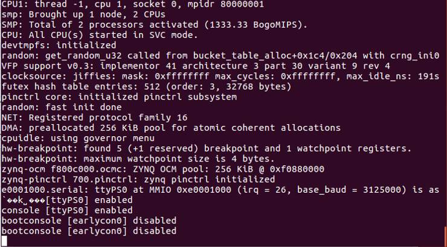

# Can't Boot to a Login, the Linux Kernel Appears to Hang at: bootconsole [earlycon0] disabled

This post provides a quick solution to a problem you may see booting the Linux kernel built using PetaLinux Tools 2018.2 on the Zynq-7000 of the ZC706.

## <u>Symptom</u>

After running:

**petalinux-boot --jtag --kernel --hw\_server-url TCP:localhost:3121**

The kernel log stops at **bootconsole \[earlycon0\] disabled**

**Example:**

## <u>Solution</u>

You need to program your FPGA. Using this command to boot:

**petalinux-boot --jtag --fpga --kernel --hw\_server-url TCP:localhost:3121**

## <u>Reference</u>

Xilinx logo found via [<u>https://twitter.com/xilinxinc</u>](https://twitter.com/xilinxinc) at \[[<u>link</u>](https://pbs.twimg.com/profile_images/535545777020338176/pEWdIYq__400x400.png)\]