# Columnize a List of Fields Using Excel 2016 on Windows 7


This post shows you how to columnize a list of fields using Excel 2016 on Windows 7. It covers a method using a macro to do one row, then covers a method that works for all rows, and finally covers a method that allows users to make "the all" row implementation a little more generic.

This post uses the following data:

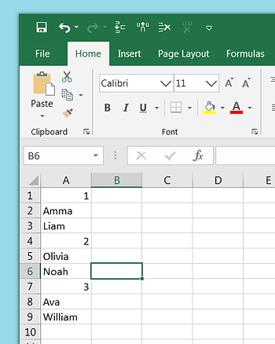

...and transforms it into:

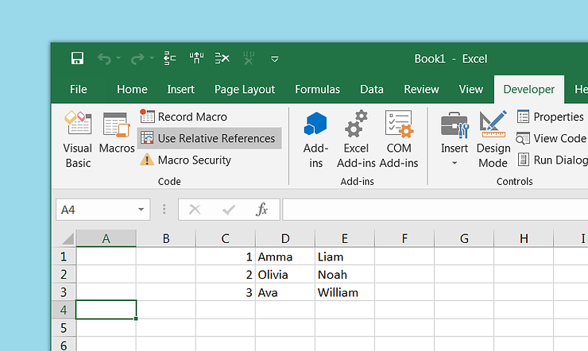

**Before you Start**

Make sure you have enabled the Developer tab in Excel. Click \[[link](http://www.zachpfeffer.com/single-post/2020/07/06/Turn-On-the-Developer-Tab-in-Excel-2016-on-Windows-7)\] for help if you need it.

**Steps**

Step 1: Note how many rows there are and how many fields per entry, **9 rows** and **3 entries** per row in our example.

Step 2: Click the **Developer** tab

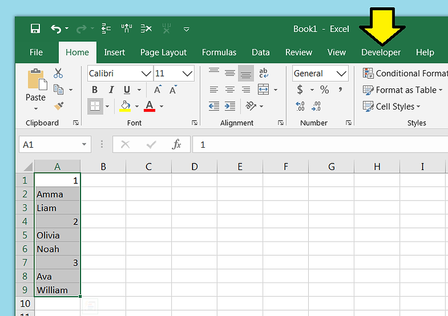

Step 3: Click Use **Relative References**

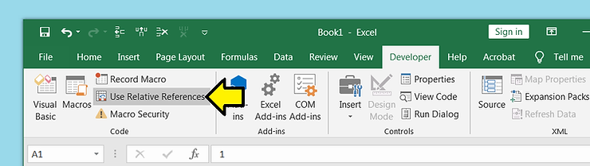

Step 4: Click **A1**

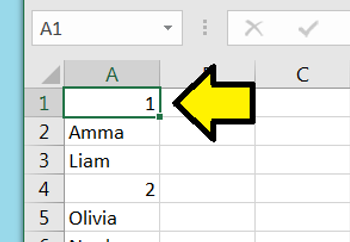

Step 5: Click **Record Macro**

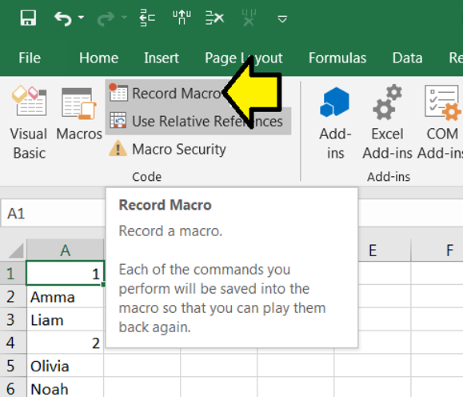

Step 6:

A. Set Macro name: to **ColumnizeFields**

B. Set the Shortcut key: to **a** (note: this has to be a letter not a number)

C. Set the Description: to **Columnizes fields.**

D. Click **OK**

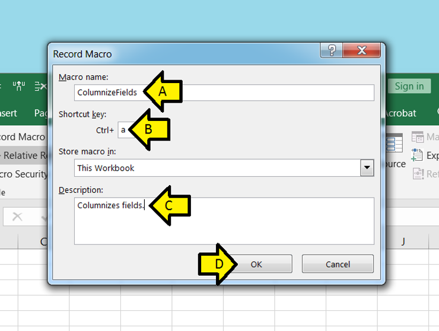

Step 7:

A. Click and hold on the green line around A1

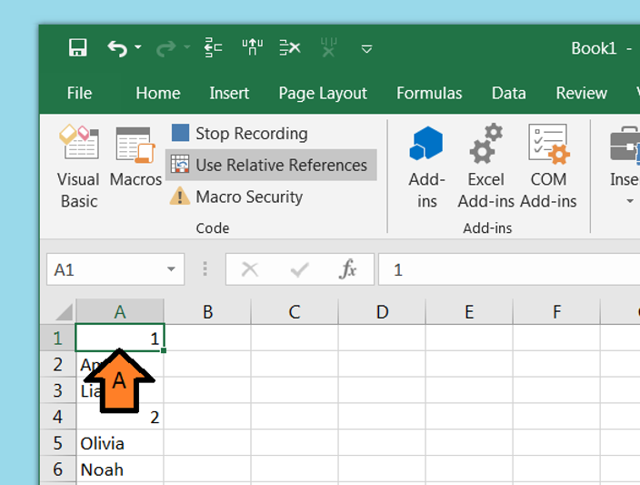

B. Drag to C1 and release

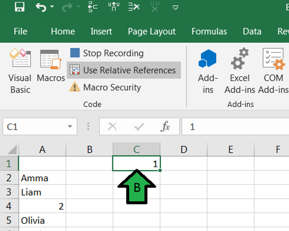

C. Drag A2 to D1 and A3 to E1 using the same method. You should see:

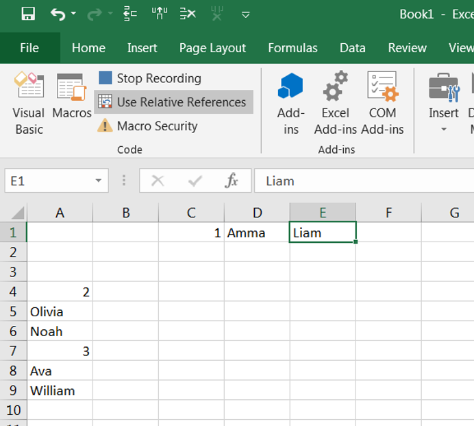

D. Right click on **2**

E. Click **Delete**

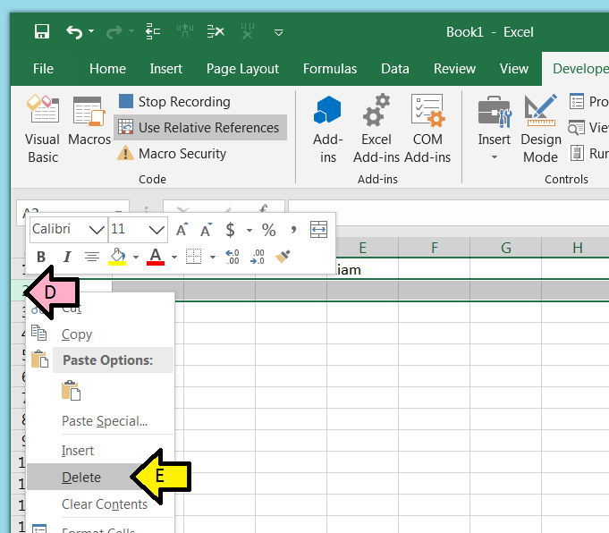

You should see:

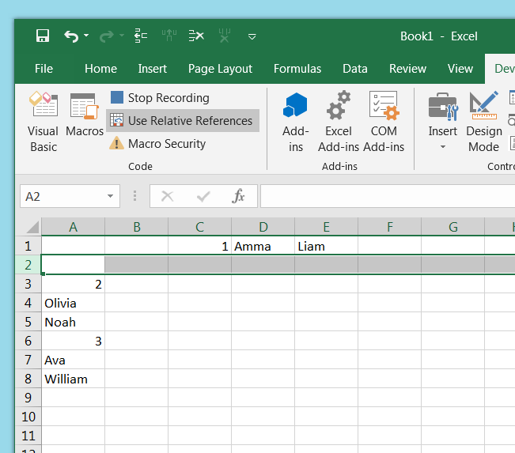

F. Repeat: Right click on **2** and click **Delete**

You should see:

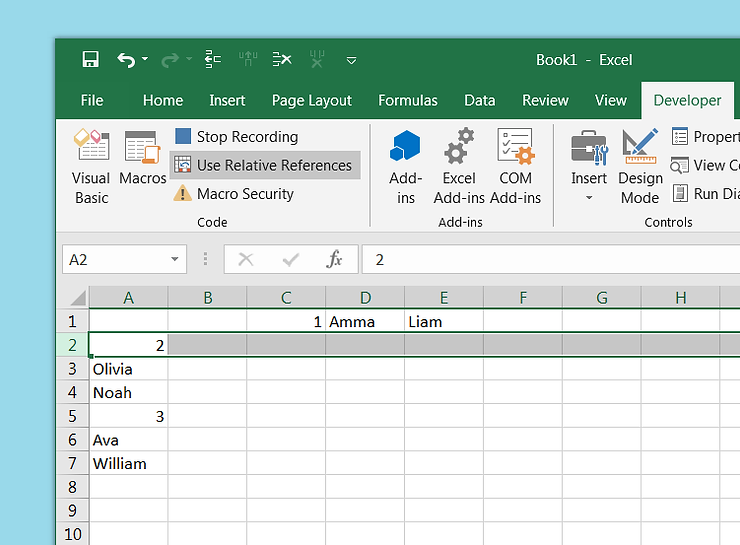

G. Click on **A2**

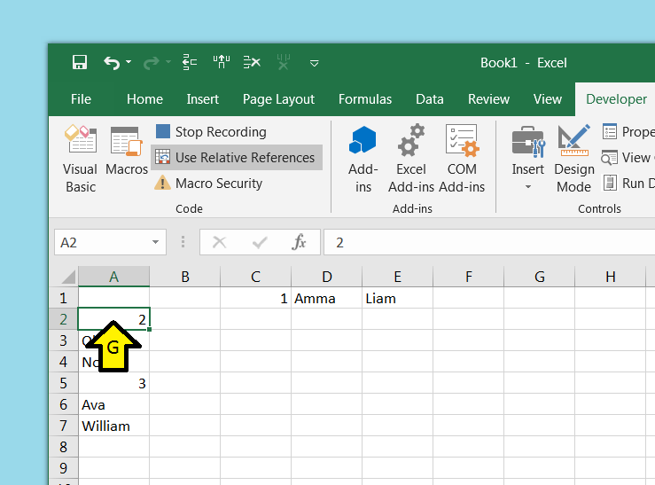

H. Click **Stop Recording**

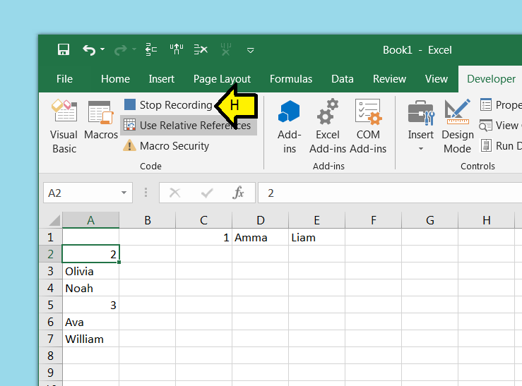

Step 8: With the cursor on A2, type **Control-a**

You should see:

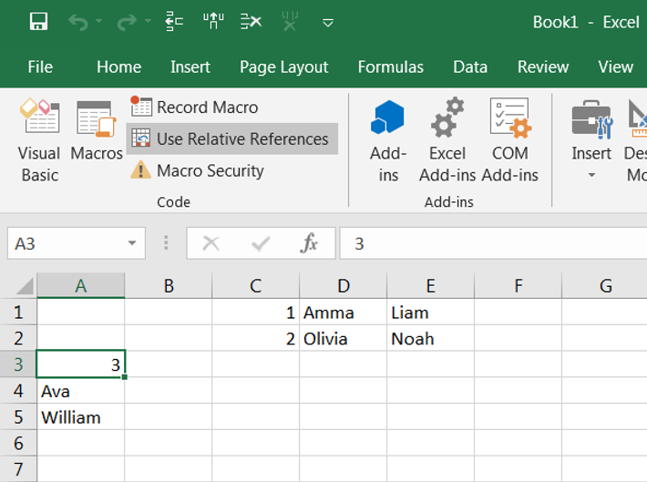

Step 9: Type **Control-a** again to complete the work

You should see:


Here is the resulting macro:

```
Sub ColumnizeFields()
'
' ColumnizeFields Macro
' Columnizes fields.
'
' Keyboard Shortcut: Ctrl+a
'
    Selection.Cut Destination:=ActiveCell.Offset(0, 2).Range("A1")
    ActiveCell.Offset(0, 2).Range("A1").Select
    Application.Left = 259.6
    Application.Top = -546.2
    ActiveCell.Offset(1, -2).Range("A1").Select
    Selection.Cut Destination:=ActiveCell.Offset(-1, 3).Range("A1")
    ActiveCell.Offset(1, 0).Range("A1").Select
    Selection.Cut Destination:=ActiveCell.Offset(-2, 4).Range("A1")
    ActiveCell.Offset(-2, 4).Range("A1").Select
    Application.WindowState = xlNormal
    ActiveCell.Offset(1, 0).Rows("1:1").EntireRow.Select
    Selection.Delete Shift:=xlUp
    Application.WindowState = xlNormal
    Selection.Delete Shift:=xlUp
    ActiveCell.Select
    Application.WindowState = xlNormal
End Sub
```

You can use this as is. You can also use this macro in the VB editor and have it loop through your data.

**Loop Through All Your Data**

Step 1: Reset your data. You should see:

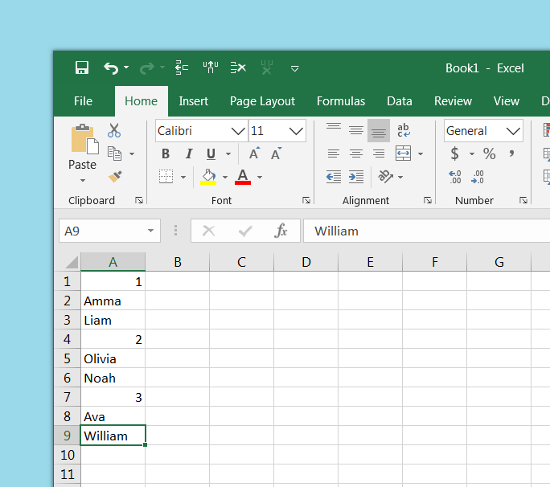

Step 2: Click **Macros**

Step 3: Click **ColumnizeFields** and click **Edit**

Step 4: Copy and paste the following below ColumnizeFields() use the number of rows (9) and the number of fields in a row (3) noted above.

```
Sub ColumnizeAllFields()
   Dim i As Integer
   NumRows = 9 / 3
   For i = 1 To NumRows
    Call ColumnizeFields
   Next i
End Sub
```

Step 5: Put the cursor on **A1**

Step 6: Click **Macros**

Step 7: Click **ColumnizeAllFields**

Step 8: Click **Run**

You should see all of your data is columnized like before.

Note 2: You can be a little more clever about sensing the number of rows and prompting the user for the number of fields per row which would make the implementation more generic. This is shown next.

**Sense the Number of Rows and Prompt the User for Number of Fields**

Use the following code for ColumnizeAllFields()

```
Sub ColumnizeAllFields()
   Dim i As Integer
   Dim fieldsPerRow As Variant
   Dim lastRow As Long
   lastRow = Cells.Find(What:="*", _
                        After:=Range("A1"), _
                        LookAt:=xlPart, _
                        LookIn:=xlFormulas, _
                        SearchOrder:=xlByRows, _
                        SearchDirection:=xlPrevious, _
                        MatchCase:=False).Row
   fieldsPerRow = InputBox("Enter fields per row")
   NumRows = lastRow / fieldsPerRow
   For i = 1 To NumRows
    Call ColumnizeFields
   Next i
End Sub
```

Then run the ColumnizeAllFields macro as demonstrated above.

Note 3: There should be a way to make the implementation more generic to sense the number of fields which would allow the implementation to handle arbitrary field data.

**Reference**

-   Example data from \[[link](http://www.ssa.gov/oact/babynames/)\] (top 3 girl and boy baby names for 2018 as reported by the U.S. Social Security Administration).
    
-   HTML escape tool at \[[link](http://www.freeformatter.com/html-escape.html)\] used
    
-   Referenced "InputBox Function" at \[[link](http://www.excel-easy.com/vba/examples/inputbox-function.html)\]
    
-   lastRow method found at \[[link](http://www.excelcampus.com/vba/find-last-row-column-cell/)\]