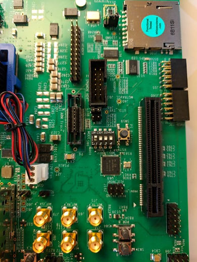
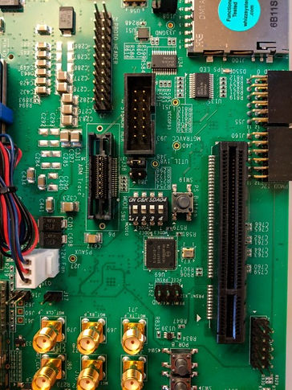

# Command Line 2019.1 Xilinx FSBL Rebuild and Test

This post demonstrates how to create and build a 2019.1 FSBL from the command line, package it Into a BOOT.BIN and run it on a ZCU102, then boot the FSBL over JTAG after adding a "Hello, World!" line.

**Assumptions**

A built 2019.1 ZCU102 BSP exists

2019.1 Xiinx SDK is installed  

\# A lightweight Xilinx SDK installer is at https://www.xilinx.com/member/forms/download/xef.html?filename=Xilinx_SDK_2019.1_0524_1430_Lin64.bin 

\# To install the 2019.1 XSDK run:

**chmod +x ~/Downloads/Xilinx_SDK_2019.1_0524_1430_Lin64.bin**

**~/Downloads/Xilinx_SDK_2019.1_0524_1430_Lin64.bin**

**# Installed to:** 

**~/xsdk/**

**Create and Build a 2019.1 FSBL From the Command Line**

\# Open a terminal and run

**PATH=~/xsdk/SDK/2019.1/bin/:$PATH**

**WS=~/plxprjs/fsbl-2019.1**

**HDF=~/plxprjs/xilinx-zcu102-2019.1/project-spec/hw-description/system.hdf**

\# Create the workspace directory 

**mkdir -p $WS**

\# Create HW from the HDF

**xsct -eval "setws $WS; createhw -name hw0 -hwspec $HDF"**

\# Create the FSBL

**xsct -eval "setws $WS; createapp -name fsbl -app {Zynq MP FSBL} -proc psu_cortexa53_0 -hwproject hw0 -os standalone"**

\# Build the FSBL

**xsct -eval "setws $WS; projects -build"**

\# Find it

**find $WS/ -name "\*.elf"**

\# Example output 

\# /home/demo/plxprjs/fsbl-2019.1/fsbl/Debug/fsbl.elf

**Package it Into a BOOT.BIN and Run it On a ZCU102**

\# Package it:

\# Run inside a petalinux project: 

**petalinux-package --boot --u-boot --dtb --fsbl /home/demo/plxprjs/fsbl-2019.1/fsbl/Debug/fsbl.elf --force**

\# Copy to an SD Card:

**cp images/linux/BOOT.BIN /media/demo/BDFD-EDD6/**

\# Change ZCU102 to 

Boot Mode: SD1 LS (3.0) Mode Pins[3:0]: 1110

\# Start screen to see the output

**screen /dev/ttyUSB0 115200**

\# Use Ctrl-a d to quit

\# Boot

\# You should see when you built this

\# Xilinx Zynq MP First Stage Boot Loader

\# Release 2019.1   **Sep  6 2021 -  13:21:07**

**Boot Using JTAG**

\# Power off the ZCU102

\# Change ZCU102 to PS JTAG Mode

Boot Mode: PS JTAG

Mode Pins[3:0]: 0000

- \# Plug in the USB to JTAG cable

  \# From ~/plxprjs/xilinx-zcu102-2019.1 

  **petalinux-boot --jtag --u-boot -v**

  \# Copy the output, save it as:  

  \# ~/plxprjs/xilinx-zcu102-2019.1/boot_u-boot.tcl

  \# Update the path to the FSBL elf in boot_u-boot.tcl to:

  \# ~/plxprjs/fsbl-2019.1/fsbl/Debug/fsbl.elf

  \# Open XSCT

  **PATH=~/xsdk/SDK/2019.1/bin/:$PATH**

  **xsct**

  \# Run in xsct:

  **connect**

  **targets**

  \# Run 

  **source ~/plxprjs/xilinx-zcu102-2019.1/boot_u-boot.tcl**

  \# Make a change in the FSBL code:

  **vi +364 ~/plxprjs/fsbl-2019.1/fsbl/src/xfsbl_main.c**

  \# Add **Hello, World!** after **Xilinx Zynq MP First Stage Boot**

  ​       XFsbl_Printf(DEBUG_PRINT_ALWAYS,

  ​                "Xilinx Zynq MP First Stage Boot Loader \n\r");

  ​       **XFsbl_Printf(DEBUG_PRINT_ALWAYS,**

  ​                **"Hello, World! \n\r");**

  \# Build it:

  **xsct -eval "setws $WS; projects -build"**

  \# Power on the ZCU102 in JTAG bode 

  \# Run in xsct:

  **connect**

  **targets**

  **source ~/plxprjs/xilinx-zcu102-2019.1/boot_u-boot.tcl**

  \# You should now see:

  Xilinx Zynq MP First Stage Boot Loader 

  Hello, World! 

  Release 2019.1   Sep  6 2021 -  13:54:48

  **Reference**

  - The Xilinx graphic is from [[link](http://pbs.twimg.com/profile_images/535545777020338176/pEWdIYq__400x400.png)]