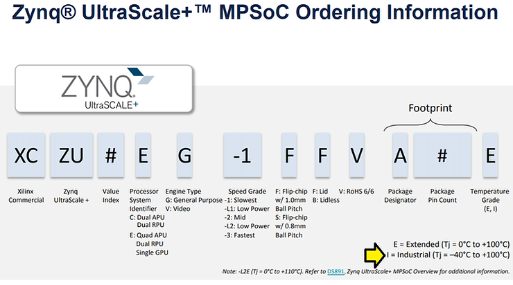

# Commercial vs. Industrial Ultra96-V2 Zynq UltraScale+ ZU3EG Single Board Computer

This short post lists the cost, part # and temperature differences between the commercial and industrial Ultra96-V2. It also includes an MPSoC ordering reference to help decode the part numbers.

**Commercial Ultra96-V2**

[[docs](http://www.avnet.me/ultra96-v2)] [[buycommercial](https://www.newark.com/avnet/aes-ultra96-v2-g/single-board-computer-64bit-arm/dp/99AC7784)]

Cost: **$313.28**

Avnet Manufacturer Part #: AES-ULTRA960V2-G 

Zynq UltraScale+ MPSoC: **XCZU3EG-1SBVA484E**

Temperature range of 0°C to 60°C

**Industrial Ultra96-V2**

[[buyindustrial](https://www.newark.com/avnet/aes-ultra96-v2-i-g/single-board-computer-zynq-ultrascale/dp/52AH8549)]

Cost: **$463.44**

Avnet Manufacturer Part #: AES-ULTRA96-V2-I-G 

Zynq UltraScale+ MPSoC: **XCZU3EG-1SBVA484I**. 

Temperature range of -40°C to +85°C

**MPSoC Ordering** **Reference**

From [[link](https://www.xilinx.com/support/documentation/selection-guides/zynq-ultrascale-plus-product-selection-guide.pdf)]

**<u>Reference</u>**

Logo created from elements in [[link](https://www.avnet.com/opasdata/d120001/medias/docus/193/5365-pb-ultra96-v2-v4a.pdf)] 
