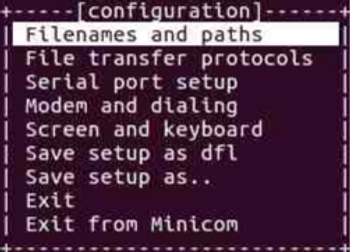
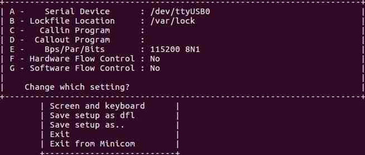
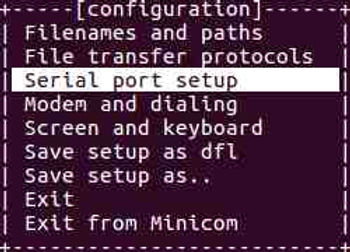
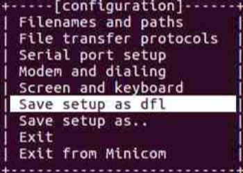
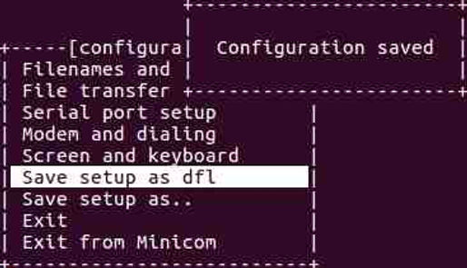
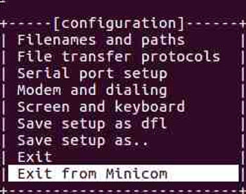
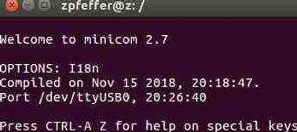
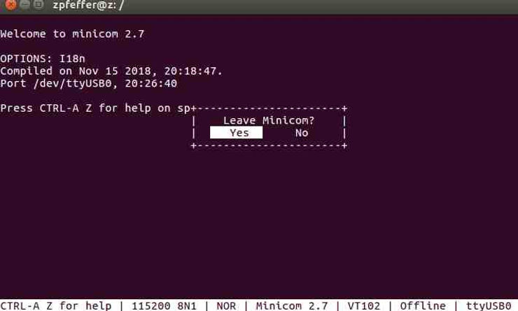

# Configure minicom for a USB-to-Serial Converter

This post shows you how to configure minicom for a USB-to-Serial Converter, run it, and exit it.

**<u>Note</u>**

You will need to log out and log back in again.

**<u>Do These Steps Once</u>**

**No sudo**

These steps ensure that you don't have to run minicom with sudo. Do these steps one time.

1\. Type **sudo usermod -a -G dialout USERNAME** (replace USERNAME with your username)

2\. Log out and log in

**Configure minicom**

These steps ensure that minicom is configured

1\. Type **sudo minicom -s**

You should see:

**Note**

You need to run \_this\_ step with sudo so that you can **Save setup as dfl** later

2\. Press the down arrow twice

You should see:

3\. Press Enter

You should see:

4\. Press **A**, and set the serial device to **/dev/ttyUSB0** and press **Enter**

5\. Press **E** and set the **Bps/Par/Bits** to **115200 8N1** and press **Enter**

6\. Press **F** until **Hardware Flow Control** in **No**

7\. Press **G** until **Software Flow Control** is **No**

8\. Press **Enter**

You should see this again:

9\. Press the **down arrow** 3 times

You should see:

10\. Press **Enter**

You should see:

11\. Press the **down arrow** 3 times

You should see:

12\. Press **Enter**

Minicom is now configured

**<u>Run minicom</u>**

1\. Plug your USB-to-Serial cable in

2\. Type **ls -l /dev/ttyUSB0**

You should see:

crw-rw---- 1 root dialout 188, 0 Nov 18 21:06 /dev/ttyUSB0

3\. Type **minicom**

You should see:

**<u>Exit minicom</u>**

1\. Type **Control-a x**

You should see:

2\. Press **Enter**

**<u>Reference</u>**

Install the Arduino Software (IDE) on Linux at \[[link](https://www.arduino.cc/en/Guide/Linux)\]