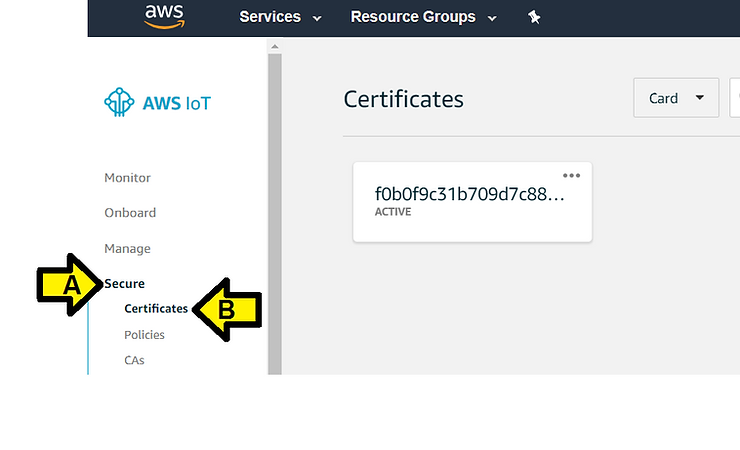

# Connect a Device to AWS through a MachineQ Gateway Run-through

This post is a run-through of the "Connect your MachineQ device through a MachineQ Output Profile directly to Amazon Web Services (AWS)." doc located at \[[<u>link</u>](https://docs.dev.machineq.net/docs/mq-central/aws.html)\]. Using a **Guppy** from digital Matter and **MachineQ Multi-Tech MultiConnect® Conduit™** Access Point.

**<u>Before you Start</u>**

Connect your Guppy to your MachineQ Multi-Tech MultiConnect® Conduit™ Access Point using \[[<u>these</u>](https://www.centennialsoftwaresolutions.com/blog/lora-guppy-care-and-feeding)\] instructions.

**<u>Steps</u>**

> **Create a Thing on AWS**

> 1\. Navigate to, and sign in to your AWS account.

I. Sign in at \[[<u>link</u>](https://signin.aws.amazon.com/)\]

**Note**: if you don't have an account you can create one on the same page. A **Free** account is fine.

II. (A) Enter your **AWS Email address** and click (B) **Next**

III. (A) Enter your **Password** and click (B) **Next**

> 2\. Enter the IoT home page by either selecting IoT Core from the AWS services menu, or by searching IoT Core.

I. (A) Enter **IoT Core** and (B) click **IoT Core**

II. You may see this page. If you do click **Get started**

> 3\. On the left hand side, there will be a menu. Choose **Manage** to expand the menu, and then **Things**.

(A) Click **Manage** then (B) **Things**

> 4\. If this is your first time on AWS, you will see that you do not have any things. Choose **Register a Thing**. If you have created a thing before, choose Create from the top right. Choose Create a single thing.

I. Click **Register a thing**

II. Click the **Create a single thing** button

> 5\. Enter a name for the thing, and choose **Next**.

I. Name your device **myDevice\_Guppy**

II. Leave **Apply a type to this thing** unset,

**Add this thing to a group** unset and

**Set searchable thing attributes (optional)** unset

3\. Click the **Next** button

> 6\. Choose Create certificate.

> Click on the links to download the **x509 certificate**, **public key**, and **private key**. Save these files to a location you can remember, you will need to enter them into MachineQ. Also download the **root CA for AWS**. Choose **Activate**, and then **Attach a policy**.

I. Create a folder on your PC called **c:\\awscerts**

II. (A) Click to download the **certificate for the thing**, (B) the **public key** and (C) the **private key** to the folder

III. Click **Download** to select a root CA for AWS IoT (takes you to \[[<u>this</u>](https://docs.aws.amazon.com/iot/latest/developerguide/managing-device-certs.html#server-authentication)\] page) (skipping this step)

...then click RSA 2048 bit key: Amazon Root CA

You'll see:

Save this file (AmazonRootCA1.pem at \[[<u>link</u>](https://www.amazontrust.com/repository/AmazonRootCA1.pem)\]) to **c:\\awscerts**

IV. Click **Activate**

You'll see:

...then the Activation notification disappears:

Note: you can click **Deactivate** then **Activate** again. You'll see notifications each time.

V. Click **Attach a policy**

Neither 7 or 8 apply for me (yet):

> 7\. Once on the policy screen, choose Create a new policy. 8\. On the Create a policy page, in the Name field, type a name for the policy. In the Action field, type iot:\*. In the Resource ARN field, type \*. Select the Allow check box. This allows your MachineQ Device to publish messages to AWS IoT.

...instead I see:

Click **Register Thing**

I see:

Back to 7 and 8:

> 7\. Once on the policy screen, choose Create a new policy. 8\. On the Create a policy page, in the Name field, type a name for the policy. In the Action field, type iot:\*. In the Resource ARN field, type \*. Select the Allow check box. This allows your MachineQ Device to publish messages to AWS IoT.

I. (A) Click **Secure**, (B) click **Policies** and (C) **Create a policy**

II. Do this:

(A) Name the policy **myDevice\_Guppy\_Policy**

(B) Set **Action** to **iot:\***

(C) Set **Resource ARN** to **\***

(D) Set **Effect** to **Allow**

(E) Click the **Create** button

I saw:

> 9\. In the menu on the left, choose Secure, and then Certificates.

> 10\. In the box for the certificate you created, choose ... to open a drop-down menu, and then choose Attach policy.

Click the **3 dots** and click **Attach policy**

> 13\. In the Attach things to certificate(s) dialog box, select the check box next to the thing you created to represent your MachineQ Device, and then choose Attach.

(A) Click the checkbox by **myDevice\_Guppy\_Policy** the click (B) **Attach**

I see:

> 14\. In the left menu, click on Manage. Click on the newly created device. You will see your device information here.

I. (A) Click **Manage** and (B) click **myDevice\_Guppy**

I see:

II. Save the **Amazon Resource Name** in a Notepad and save it to **c:\\awskeys** at **ARN.txt**

> 15\. In the left menu, choose Interact. Your Endpoint is found under the HTTPS section. Keep a note if this, you will need to enter it into your MachineQ Output Profile.

I. Click **Interact**

I see:

II. Save this string to **https.txt** in **c:\\awskeys**. This will be what you use in the **Endpoint** field.

> **Connect Your AWS Thing to MachineQ**

> Navigate back to Creating an Output Profile from MachineQ.

I. Sign into https://mqcentral.machineq.net/

II. Click **LOG IN**

III. Enter your **Username** and **Password** and click **SUBMIT**

IV. Click **Integrations**

V. Click **ADD OUTPUT PROFILE**

VI. Click **add aws profile**

VII. Enter **test-aws** for the **Output Profile Name**

Steps 3,4,5,6 distill down into:

> 3\. Find your certificate and private key files. They will likely be in your Downloads folder, and be titled like this (certificate number)-certificate.pem.cert, and (certificate number)-private.pem.key. 4\. Right click on your certificate file, and choose Open With. Open with your favorite text editor (for example, Notepad or TextEdit). 5\. Copy all text into the x509 Certificate prompt. This includes the header and footer dashes. created 6\. Open the private key with the text editor, and copy all text into the PrivateKey prompt.

> 7\. This is an example of a completed profile. Click Submit at the bottom of the screen.

Click **Submit**

I see:

There is one more instruction missing.

I. Click Devices

II. Find your Guppy and click **Details**

III. Click **Edit**

IV. (A) Click the **Output Profile** drop down, (B) click **test-aws** and (C) click **SUBMIT**

> **Confirm Your Data Through AWS**

> 1\. Confirm that your data is being sent to AWS by navigating back to AWS. 2\. Choose Test on the left hand side.

> 3\. Go to Subscribe to a topic. Enter # in the Subscription Topic field, and click Subscribe to topic.

(A) Enter **#** and (B) click **Subscribe to topic**

I see:

In a few seconds (seen this take a few minutes) I see (Chrome window zoomed out):

See it working here:

(video_unavalible)

**<u>References</u>**

-   machineQ MultiConnect Conduit Access Point at \[[<u>link</u>](https://store.machineq.com/store/products/multiconnect-conduit-ap?taxon_id=10)\] - $200.00 for Ethernet backhaul, $260.00 for AT&T LTE
    
-   Guppy from digital Matter at \[[<u>link</u>](https://www.digitalmatter.com/Devices/Lorawan-IOT/Guppy-LoRaWAN)\]
    
-   mQCentral docs at \[[<u>link</u>](https://docs.dev.machineq.net/docs/mq-central/)\]
    
-   machineQ Dashboard at \[[<u>link</u>](https://mqcentral.machineq.net/dashboard)\]
    
-   machineQ Store at \[[<u>link</u>](https://store.machineq.com/)\]