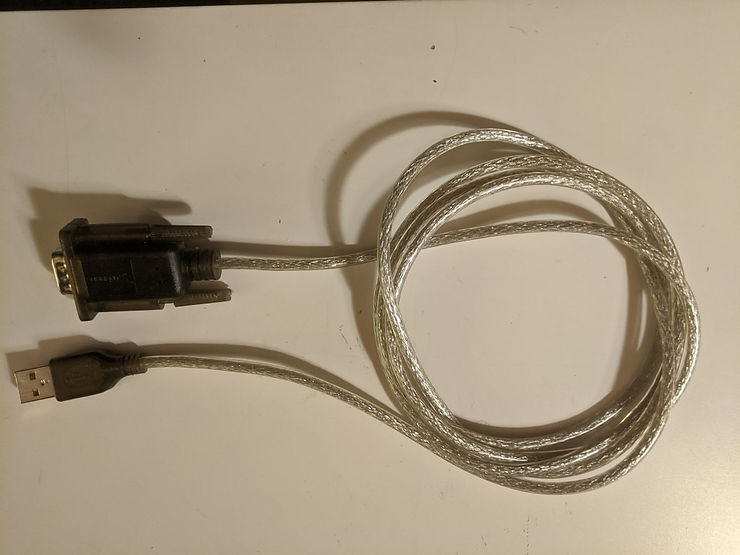
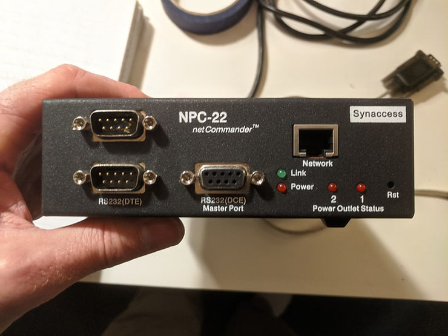
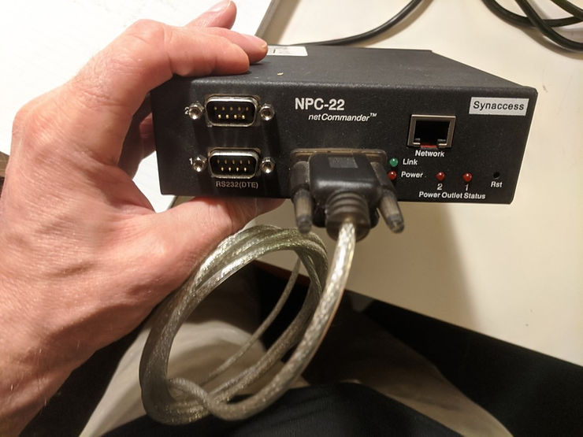
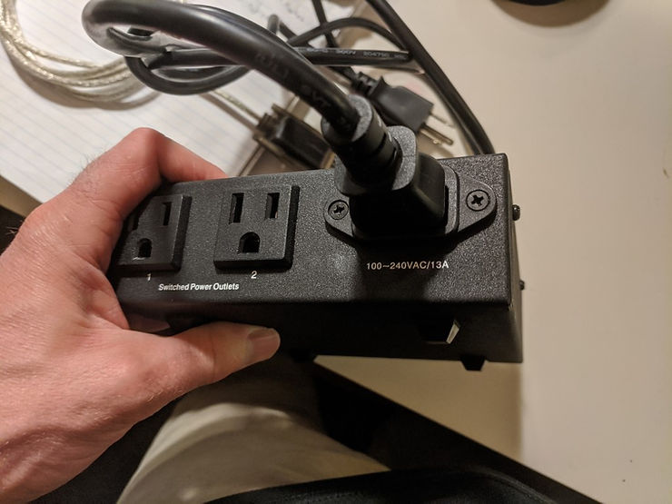
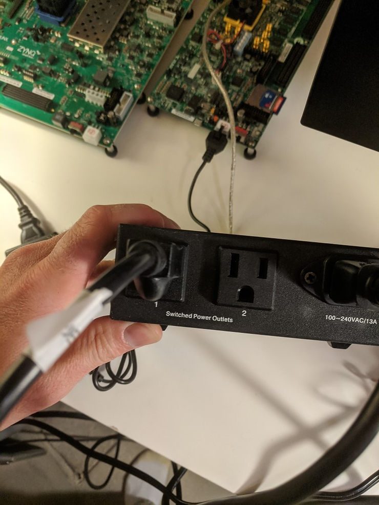
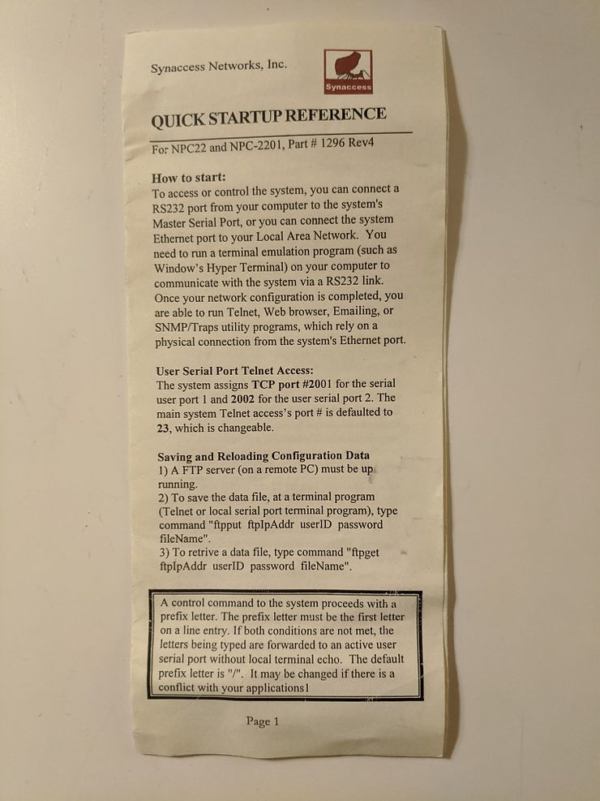
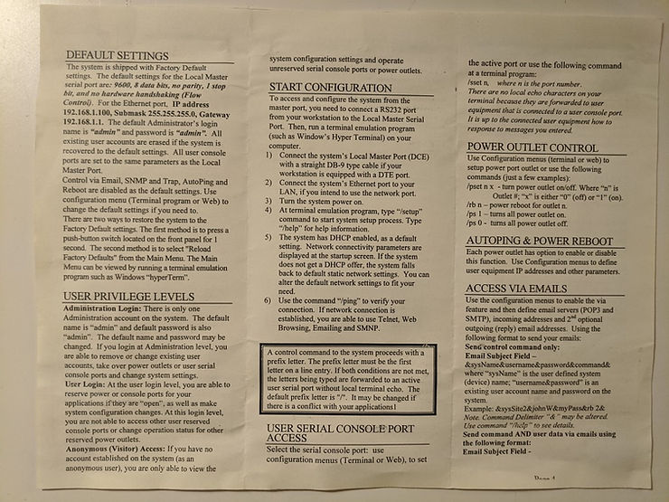
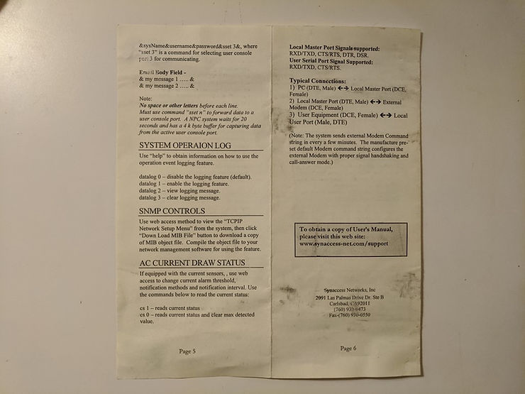

# Connect to and Control a Synaccess NPC-22 netCommander from Ubuntu 16.04.3 Running in a VirtualBox V


This post demonstrates how to connect to and control a Synaccess NPC-22 netCommander (Rev 4) from Ubuntu 16.04.5 running in a VirtualBox managed VM via a Prolific Technology Inc. USB-to-serial port converter to turn a target on and off. It also shows you how to simultaneously connect to a USB-to-UART converter connected to a target and the Prolific Tech converter with minicom. The target in this case is a ZC706 from Xilinx. I also include a copy of the original docs for Rev4 NPC-22.The post also shows how to create a script that will power cycle the target using minicom.

**Steps**

**Step 1**: Connect the female DB9 plug of the Prolific Technology Inc. USB-to-serial port converter to the **RS232 DCE Master Port on the NPC-22**







**Step 2**: Connect the USB plug of the Prolific Technology Inc. USB-to-serial port converter to a USB hub.

**Step 3**: Connect the USB-to-serial port of the target to the USB hub

**Step 4**: Connect the power supply of the NPC-22



**Step 5**: Connect the target to port 1 of the NPC-22



**Step 6**: In Ubuntu type **dmesg**

You should see something like:

```
[ 5215.223938] usb 1-2: new high-speed USB device number 8 using xhci_hcd
[ 5215.516571] usb 1-2: New USB device found, idVendor=0403, idProduct=6014
[ 5215.516573] usb 1-2: New USB device strings: Mfr=1, Product=2, SerialNumber=3
[ 5215.516574] usb 1-2: Product: Digilent USB Device
[ 5215.516575] usb 1-2: Manufacturer: Digilent
[ 5215.516576] usb 1-2: SerialNumber: 210251A07C1B
[ 5215.551668] ftdi_sio 1-2:1.0: FTDI USB Serial Device converter detected
[ 5215.551737] usb 1-2: Detected FT232H
[ 5215.553716] usb 1-2: FTDI USB Serial Device converter now attached to ttyUSB0
[ 5215.971175] usb 1-3: new full-speed USB device number 9 using xhci_hcd
[ 5216.278479] usb 1-3: New USB device found, idVendor=10c4, idProduct=ea60
[ 5216.278481] usb 1-3: New USB device strings: Mfr=1, Product=2, SerialNumber=3
[ 5216.278482] usb 1-3: Product: CP2103 USB to UART Bridge Controller
[ 5216.278483] usb 1-3: Manufacturer: Silicon Labs
[ 5216.278484] usb 1-3: SerialNumber: 0001
[ 5216.311008] cp210x 1-3:1.0: cp210x converter detected
[ 5216.317982] usb 1-3: cp210x converter now attached to ttyUSB1
[ 5216.573297] ftdi_sio ttyUSB0: FTDI USB Serial Device converter now disconnected from ttyUSB0
[ 5216.573310] ftdi_sio 1-2:1.0: device disconnected
[ 5227.674848] usb 1-4: new full-speed USB device number 10 using xhci_hcd
[ 5227.969598] usb 1-4: New USB device found, idVendor=067b, idProduct=2303
[ 5227.969600] usb 1-4: New USB device strings: Mfr=1, Product=2, SerialNumber=0
[ 5227.969601] usb 1-4: Product: USB-Serial Controller
[ 5227.969602] usb 1-4: Manufacturer: Prolific Technology Inc.
[ 5228.001625] pl2303 1-4:1.0: pl2303 converter detected
[ 5228.013169] usb 1-4: pl2303 converter now attached to ttyUSB0
```

**Step 6.1**: Note down that the Digilent device is connected to ttyUSB1 and the Prolific Technology Inc. connector connected to the Synaccess is connected to **ttyUSB0**.

**Step 7**: Follow the instructions listed at \[[link](http://www.centennialsoftwaresolutions.com/post/configure-minicom-for-a-usb-to-serial-converter)\] to set up **minicom** (don't skip)

**Step 8**: Open a terminal window and type **minicom -b 9600 -D /dev/ttyUSB0** to talk to the Synaccess.

This ^^^ will use the default set up from the instructions above, but use 9600 for the baud. -D isn't needed since its been set up in the config, but it is listed for clarity.

**Step 8.1**: Press **Enter** once.

You should see:

**\>**

If you don't see a prompt press the **Reset** button for about 5 secs, until the lights blink:

**Step 8.2:** Type **/help**

You should see

```
>/help


************************************************************
*                                                          *
*                                                          *
*     Help Menu                                            *
*                                                          *
*                                                          *
************************************************************
>
>
  /apVbs    n  Displays AutoPing run-time info(0-disable,1-enable).             
  /date        Displays current date.                                           
  /emailvbs n  Displays Emailing run time info(0-disable,1-basic,2-detailed).   
  /emailget    Starts email reading immediately.                                
  /emailsend   Sends a test email message immediately                           
  /ecmd        Sets email command delimitor(Select: &,-,+,~,$,*,>,|,<, or ?).   
  /ftpget ip id pwd fileName - Get system data file from a FTP server.          
  /ftpput ip id pwd fileName - Put system data file to a FTP server.            
  /login       Enters user login.                                               
  /logout      Exits current login.                                             
  /mac         Displays Ethernet port Mac address.                              
  /nwset       Restarts Ethernet network interface.                             
  /nwshow      Displays network Status.                                         
  /ping        Pings a host. E.g.: ping 192.168.0.1, or ping yahoo.com.         
  /pm v        Sets TCP port(2001/2002) to Telnet(v-'t') or Binary mode(v-'b')  
  /prsv n      Reserves power outlet #n for current login user.                 
  /pset n v    Sets power outlet #n to v(value 1-on, 0-off).                    
  /ps v        Sets all power outlets to v(value 1-on, 0-off).                  
  /pshow       Displays power outlet status.                                    
  /pTmshow     Displays power outlet timer information.                         
  /punrsv n    Unreserves power outlet #n from current login user.              
  /rb n        Reboots power outlet #n.                                         
  /save        Saves configuration data.                                        
  /setup       Starts system configuration menu.                                
  /sshow       Displays console ports configuration status.                     
  /srsv n      Reserves console port #n to current login user.                  
  /sset n      Sets active user serial port #n.                                 
  /sunrsv n    Unreserves console port from the current login user.             
  /sysshow     Displays system information.                                     
  /time        Displays current time.                                           
  /usershow    Displays all users.                                              
  /whoami      Displays current login user.                                     
  /ver         Displays hardware and software versions                          
  /wol n       Sends a WoL packet specified by power outlet #n settings.        
  /!           Repeats previous command                                         
 !!! Important: a control command must proceed with the symbol "/"              
>      at the beginning of a command line input. To change it, type "/setup".   
> !!! Use TCP port # 2001 & 2002 for accessing serial port 1 & 2. 
```

**Step 9**: Open another terminal and type **minicom -D /dev/ttyUSB1**

This ^^^ will use the default, but connect to /dev/ttyUSB1

**Step 10**: Turn the target on and off with:

Off:

\>/pset 1 0

On: \>/pset 1 1

**A Script to Turn the Target On and Off and Exit minicom**

Create a file called **offon.txt** with:

send /pset 1 0 sleep 1 send /pset 1 1 sleep 1 ! killall -9 minicom

...and call minicom with:

**minicom -b 9600 -D /dev/ttyUSB0 -S offon.txt**

This is "runscript" see \[[link](http://linux.die.net/man/1/runscript)\] (this had the tip about **! killall -9 minicom**). I also consulted \[[link](http://sites.google.com/site/francescosblogg/blog/scriptingoverseriallinkwithminicom)\].

**Original NPC-22 Documentation**







**References**

-   Synaccess web site \[[link](http://www.synaccess-net.com/)\]
    
-   The NPC-22T \[[link](http://www.synaccess-net.com/npc-22t)\] for $269.00 (they don't seem to sell the NPC-22 anymore)
    
-   Synaccess log clipped from \[[link](http://images.squarespace-cdn.com/content/54d27fb4e4b024eccdd9e569/1573487630010-8EX286XA4UCOHZDR8D20/banner-long.png?format=1500w&content-type=image%2Fpng)\]