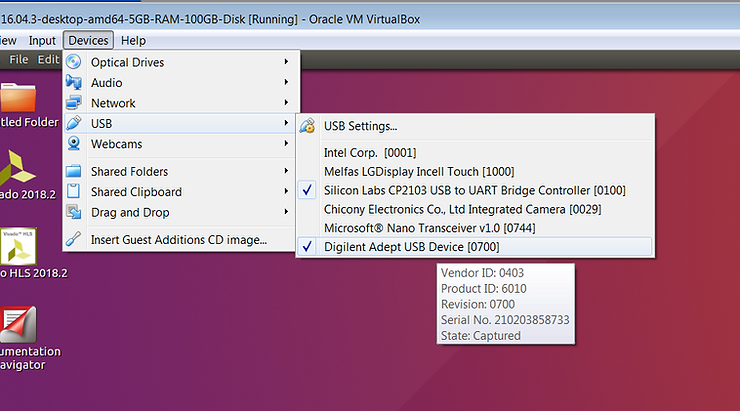

# Connecting Vivado to Digilent's USB-to-JTAG through VirtualBox


This post shows how to configure VirtualBox to allow Vivado and other Xilinx tools running on Ubuntu 16.04.3 in the VirtualBox managed virtual machine to communicate with Digilent's USB-to-JTAG and the USB UART.

**<u><span>Prerequisites</span></u>**

-   This post assumes you've installed Vivado. See \[[<u><span>link</span></u>](https://www.centennialsoftwaresolutions.com/blog/zcu102-development-using-2018-2-on-a-linux-vm-running-on-windows)\] for instructions.
    
-   You'll need 2 open USB ports: one for the JTAG-to-USB and one for the USB UART
    

**<u><span>Versions Used</span></u>**

-   Ubuntu 16.04.3
    
-   Vivado 2018.2
    
-   VirtualBox 5.2.12
    
-   Windows 7 SP 1
    
-   ZC706 REV 1.1
    

**<u><span>Configure VirtualBox</span></u>**

1\. Save your work and close all programs on your Ubuntu 16.04.3 desktop

2\. Shut down Ubuntu by (A) clicking the gear and (B) selecting **Shut Down...**


...then selecting the shutdown button:


**Note**: you must shut down Ubuntu in this way for this to work.

3\. Open settings by (A) selecting the virtual machine, (B) right-clicking and (C) clicking **Settings...**


4\. (A) Select **USB**, (B) select **USB 3.0 (xHCI) Controller** and (C) select **OK**


5\. Start the virtual machine that has the **USB 3.0 (xHCI) Controller** selected


**<u><span>Install the Drivers</span></u>**

1\. Type **cd /opt/Xilinx/Vivado/2018.2**

2\. Type **cd ./data/xicom/cable\_drivers/lin64/install\_script/install\_drivers**

3\. Type **sudo ./install\_drivers**

You should see:

```
INFO: Installing cable drivers.
INFO: Script name = ./install_drivers
INFO: HostName = z
INFO: Current working dir = /opt/Xilinx/Vivado/2018.2/data/xicom/cable_drivers/lin64/install_script/install_drivers
INFO: Kernel version = 4.10.0-28-generic.
INFO: Arch = x86_64.
Successfully installed Digilent Cable Drivers
--File /etc/udev/rules.d/52-xilinx-ftdi-usb.rules does not exist.
--File version of /etc/udev/rules.d/52-xilinx-ftdi-usb.rules = 0000.
--Updating rules file.
--File /etc/udev/rules.d/52-xilinx-pcusb.rules does not exist.
--File version of /etc/udev/rules.d/52-xilinx-pcusb.rules = 0000.
--Updating rules file.

INFO: Digilent Return code = 0
INFO: Xilinx Return code = 0
INFO: Xilinx FTDI Return code = 0
INFO: Return code = 0
INFO: Driver installation successful.
CRITICAL WARNING: Cable(s) on the system must be unplugged then plugged back in order for the driver scripts to update the cables.
```

Note the line: **INFO: Driver installation successful.**

**<u><span>Connect to the Hardware</span></u>**

1\. Ensure the board's power is off

2\. Plug the USB B micro end of a USB cable into the JTAG-to-USB port and the USB A end into your computer

3\. Plug the USB B micro (or mini) end of a USB cable into the USB UART port and the USB A end into your computer

4\. Power on the board

5\. In the VirtualBox management window (A) click **Devices** then (B) click **USB**.

You should see (C) **Silicon Labs CP2103 USB to UART Bridge Controller \[0100\]** and (D) **Digilent Adept USB Device**


6\. In the VirtualBox management window:

A) Click **Devices** then

B) Click **USB**, then

C) Select **Silicon Labs CP2103 USB to UART Bridge Controller \[0100\]** and


Note: hover over the selection to bring up the pop up

You should see:


If you don't, try selecting it again.

Open a terminal and type **dmesg.** You should see the following at the end of the dmesg:

```
[ 2341.323630] usb 1-2: new full-speed USB device number 3 using xhci_hcd
[ 2341.710407] usb 1-2: New USB device found, idVendor=10c4, idProduct=ea60
[ 2341.710409] usb 1-2: New USB device strings: Mfr=1, Product=2, SerialNumber=3
[ 2341.710410] usb 1-2: Product: CP2103 USB to UART Bridge Controller
[ 2341.710410] usb 1-2: Manufacturer: Silicon Labs
[ 2341.710411] usb 1-2: SerialNumber: 0001
[ 2342.788513] usbcore: registered new interface driver usbserial
[ 2342.788808] usbcore: registered new interface driver usbserial_generic
[ 2342.788825] usbserial: USB Serial support registered for generic
[ 2342.791950] usbcore: registered new interface driver cp210x
[ 2342.792124] usbserial: USB Serial support registered for cp210x
[ 2342.792146] cp210x 1-2:1.0: cp210x converter detected
[ 2342.798925] usb 1-2: cp210x converter now attached to ttyUSB0
```

Note **ttyUSB0**

D) Select **Digilent Adept USB Device**


You should see:



Open a terminal and type **dmesg.** You should see the following at the end of the dmesg:

```
[ 2588.236466] usb 1-3: New USB device found, idVendor=0403, idProduct=6010
[ 2588.236467] usb 1-3: New USB device strings: Mfr=1, Product=2, SerialNumber=3
[ 2588.236468] usb 1-3: Product: Digilent Adept USB Device
[ 2588.236469] usb 1-3: Manufacturer: Digilent
[ 2588.236470] usb 1-3: SerialNumber: 210203858733
[ 2588.314345] usbcore: registered new interface driver ftdi_sio
[ 2588.314590] usbserial: USB Serial support registered for FTDI USB Serial Device
[ 2588.314619] ftdi_sio 1-3:1.0: FTDI USB Serial Device converter detected
[ 2588.314708] usb 1-3: Detected FT2232H
[ 2588.316622] usb 1-3: FTDI USB Serial Device converter now attached to ttyUSB1
[ 2588.316642] ftdi_sio 1-3:1.1: FTDI USB Serial Device converter detected
[ 2588.316701] usb 1-3: Detected FT2232H
[ 2588.319494] usb 1-3: FTDI USB Serial Device converter now attached to ttyUSB2
```

**<u><span>Configure VirtualBox USB Auto Connect</span></u>**

1\. (A) Click **Devices**, (B) click **USB** and (C) click **USB Settings...**


2\. Click the **USB+** icon


3\. Click **Silicon Labs CP2103 USB to UART Bridge Controller \[0100\]**


4\. Click **Digilent Adept USB Device \[0700\]**


5\. If you see the following, click **OK**


6\. Test by unplugging the USB-to-JTAG cable and seeing the USB device come back:

A) Unplug

B) Click **OK**


**<u><span>Test JTAG</span></u>**

1\. Run Vivado


2\. (A) Click **Flow** then (B) click **Open Hardware Manager**


3\. Click **Open target**


4\. Click Auto Connect


You should see:


Text of **TCL Console**

```
start_gui
open_hw
INFO: [IP_Flow 19-234] Refreshing IP repositories
INFO: [IP_Flow 19-1704] No user IP repositories specified
INFO: [IP_Flow 19-2313] Loaded Vivado IP repository '/opt/Xilinx/Vivado/2018.2/data/ip'.
open_hw: Time (s): cpu = 00:00:08 ; elapsed = 00:00:11 . Memory (MB): peak = 6042.531 ; gain = 158.926 ; free physical = 2011 ; free virtual = 8560
connect_hw_server
INFO: [Labtools 27-2285] Connecting to hw_server url TCP:localhost:3121
INFO: [Labtools 27-2222] Launching hw_server...
INFO: [Labtools 27-2221] Launch Output:

****** Xilinx hw_server v2018.2
  **** Build date : Jun 14 2018-20:18:37
    ** Copyright 1986-2018 Xilinx, Inc. All Rights Reserved.


open_hw_target
INFO: [Labtoolstcl 44-466] Opening hw_target localhost:3121/xilinx_tcf/Digilent/210203858733A
open_hw_target: Time (s): cpu = 00:00:02 ; elapsed = 00:00:06 . Memory (MB): peak = 6592.738 ; gain = 544.031 ; free physical = 1404 ; free virtual = 7967
current_hw_device [get_hw_devices xc7z020_1]
refresh_hw_device -update_hw_probes false [lindex [get_hw_devices xc7z020_1] 0]
INFO: [Labtools 27-1434] Device xc7z020 (JTAG device index = 1) is programmed with a design that has no supported debug core(s) in it.
WARNING: [Labtools 27-3361] The debug hub core was not detected.
Resolution: 
1. Make sure the clock connected to the debug hub (dbg_hub) core is a free running clock and is active.
2. Make sure the BSCAN_SWITCH_USER_MASK device property in Vivado Hardware Manager reflects the user scan chain setting in the design and refresh the device.  To determine the user scan chain setting in the design, open the implemented design and use 'get_property C_USER_SCAN_CHAIN [get_debug_cores dbg_hub]'.
```

**<u><span>Test Serial</span></u>**

Note: See \[[<u><span>link</span></u>](http://www.zachpfeffer.com/single-post/Arg-Nothing-I-type-shows-up-in-the-Minicom-console)\] for setting up and running minicom

**<u><span>Reboot Ubuntu</span></u>**

Once everything has been shown to work:

A) Power off the board,

B) Reboot Ubuntu

C) Power on the board

D) Verify dmesg messages

E) Run Vivado to set up the hardware connection

**<u><span>Uninstall the Drivers</span></u>**

If you need to you can uninstall the drivers using the following stepspwd

1\. Unplug the serial and JTAG-to-USB cables

2\. Type **sudo rm -f /etc/udev/rules.d/52-xilinx-digilent-usb.rules**

3\. Type **sudo rm -f /etc/udev/rules.d/52-xilinx-ftdi-usb.rules**

4\. Type **sudo rm -f /etc/udev/rules.d/52-xilinx-pcusb.rules**

**<u><span>References</span></u>**

-   UG973 2018.2 Vivado Design Suite User Guide: Release Notes, Installation, and Licensing at \[[<u><span>link</span></u>](https://www.xilinx.com/support/documentation/sw_manuals/xilinx2018_2/ug973-vivado-release-notes-install-license.pdf)\]
    
-   Xilinx logo found via [<u><span>https://twitter.com/xilinxinc</span></u>](https://twitter.com/xilinxinc) at \[[<u><span>link</span></u>](https://pbs.twimg.com/profile_images/535545777020338176/pEWdIYq__400x400.png)\]