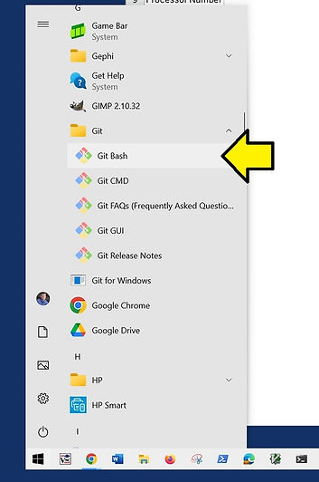
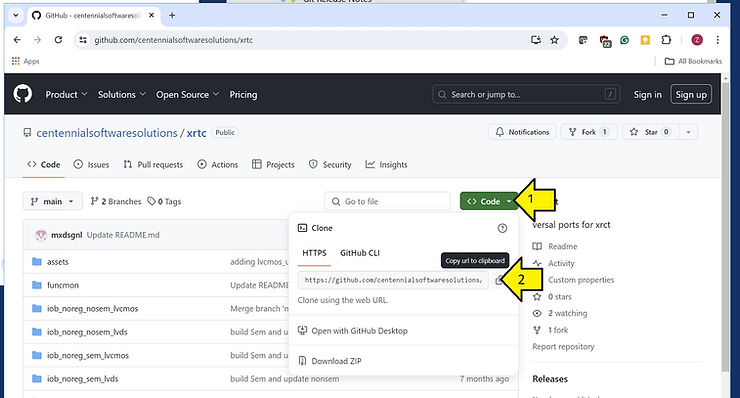
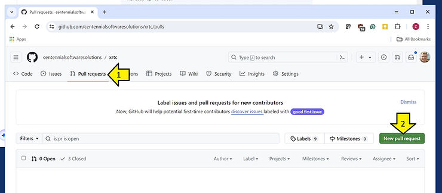
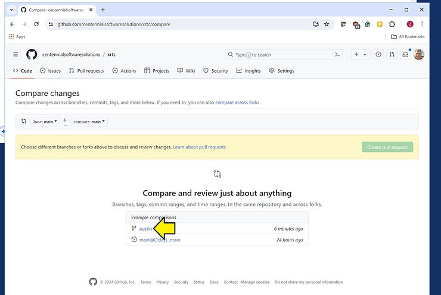
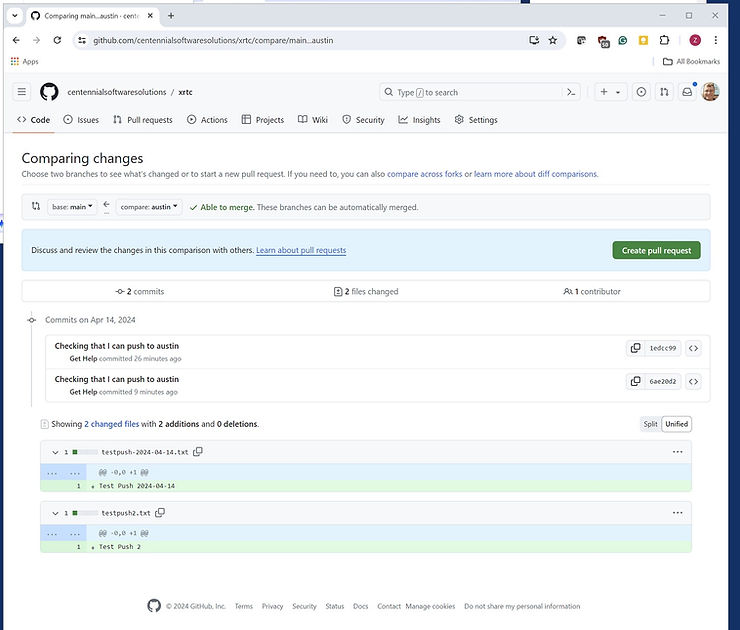
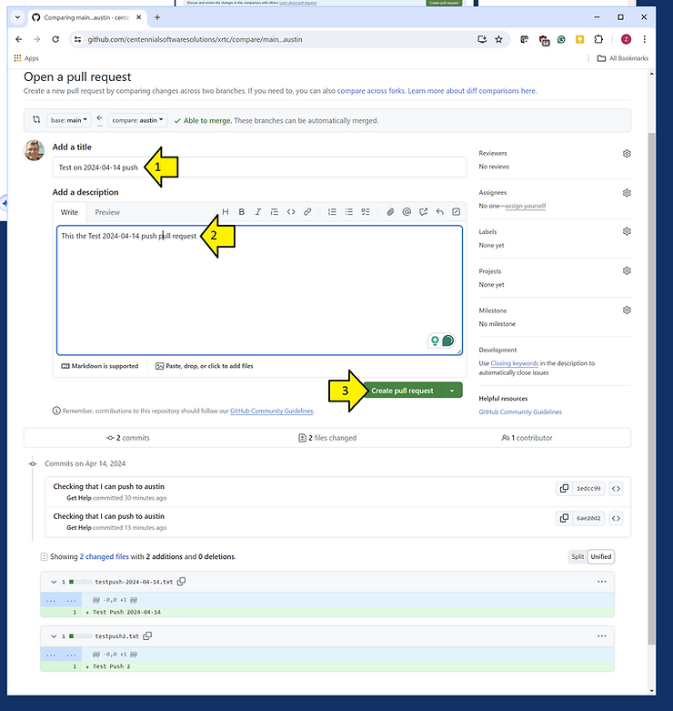
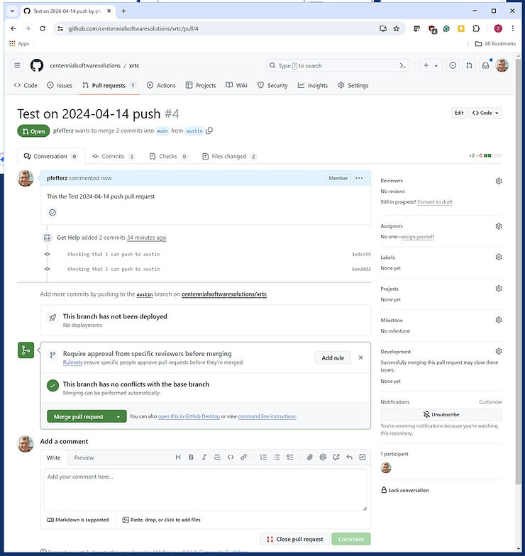

# How To Clone, Create a Branch, and Contribute it to a GitHub Repository Using Git Bash on Windows

This post shows how to Clone, Create a Branch, and Contribute it to a GitHub Repository Using Git Bash on Windows. It answers:

-   How do I launch Git Bash?
    
-   How do I get a repo, aka how do I clone a repo?
    
-   How do I switch to a branch?
    
-   How do I commit to a branch?
    
-   How do I create a pull request?
    

## How do I launch Git Bash?

**Launch Git Bash**:



## How do I get a repo, aka how do I clone a repo?

1\. **In Git Bash:**

```
cd /c
```

2\. **Clone Using the Web URL**



3\. **In Git Bash:**

Output:

```
Cloning into 'xrtc'...
remote: Enumerating objects: 238, done.
remote: Counting objects: 100% (238/238), done.
remote: Compressing objects: 100% (179/179), done.
remote: Total 238 (delta 111), reused 150 (delta 50), pack-reused 0
Receiving objects: 100% (238/238), 4.20 MiB | 8.96 MiB/s, done.
Resolving deltas: 100% (111/111), done.
```

## How do I switch to a branch?

1\.**In Git Bash:**

```
cd xrtc
git status
```

**Output:**

```
On branch main
Your branch is up to date with 'origin/main'.

nothing to commit, working tree clean
```

2\. **List Local Branches**

```
git branch # Lists local branches
```

**Output:**

```
Zach Pfeffer@LAPTOP-3MCNKKJO MINGW64 /c/xrtc (main)
$ git branch # Lists local branches
* main
```

3\. **List all Remote Branches**

```
git branch -r   # Lists all remote branches
```

**Output:**

```
origin/HEAD -&gt; origin/main
origin/austin
origin/main
```

4\. **Show What Origin Points To:**

```
git remote show origin
```

**Output:**

```
* remote origin
  Fetch URL: https://github.com/centennialsoftwaresolutions/xrtc.git
  Push  URL: https://github.com/centennialsoftwaresolutions/xrtc.git
  HEAD branch: main
  Remote branches:
    austin tracked
    main   tracked
  Local branch configured for 'git pull':
    main merges with remote main
  Local ref configured for 'git push':
    main pushes to main (up to date)
```

5\. **List Remote Branches:**

```
git branch -a # Lists all branches, including remote ones
```

**Output:**

```
* main
  remotes/origin/HEAD -&gt; origin/main
  remotes/origin/austin
  remotes/origin/main
```

6\. **Check Out a Remote Branch:**

```
git checkout -b austin origin/austin
```

**Output:**

```
Switched to a new branch 'austin'
Branch 'austin' set up to track remote branch 'austin' from 'origin'.
```

7\. **Check You're on the Branch:**

```
git status
```

**Output:**

```
On branch austin
Your branch is up to date with 'origin/austin'.
nothing to commit, working tree clean
```

## How do I Commit to a Branch, aka Contribute it to a GitHub Repository?

1\. **Commit and Push:**

```
cd /c/xrtc
echo 'Test Push 2024-04-14' > testpush-2024-04-14.txt
cat testpush-2024-04-14.txt
git config --global user.email "help@centennialsoft.com"
git config --global user.name "Get Help"
git add testpush-2024-04-14.txt
git status
git add .
git status
git commit -m "Checking that I can push to austin"
git pull origin austin
git push origin austin
```

**Output:**

```
Zach Pfeffer@LAPTOP-3MCNKKJO MINGW64 /c/xrtc (austin)
$ cd /c/xrtc

Zach Pfeffer@LAPTOP-3MCNKKJO MINGW64 /c/xrtc (austin)
$ echo 'Test Push 2024-04-14' &gt; testpush-2024-04-14.txt

Zach Pfeffer@LAPTOP-3MCNKKJO MINGW64 /c/xrtc (austin)
$ cat testpush-2024-04-14.txt
Test Push 2024-04-14

Zach Pfeffer@LAPTOP-3MCNKKJO MINGW64 /c/xrtc (austin)
$ git config --global user.email "help@centennialsoft.com"

Zach Pfeffer@LAPTOP-3MCNKKJO MINGW64 /c/xrtc (austin)
$ git config --global user.name "Get Help"

Zach Pfeffer@LAPTOP-3MCNKKJO MINGW64 /c/xrtc (austin)
$ git add testpush-2024-04-14.txt

Zach Pfeffer@LAPTOP-3MCNKKJO MINGW64 /c/xrtc (austin)
$ git status
On branch austin
Your branch is up to date with 'origin/austin'.

Changes to be committed:
  (use "git restore --staged &lt;file&gt;..." to unstage)
        new file:   testpush-2024-04-14.txt


Zach Pfeffer@LAPTOP-3MCNKKJO MINGW64 /c/xrtc (austin)
$ git add .
```

```

Zach Pfeffer@LAPTOP-3MCNKKJO MINGW64 /c/xrtc (austin)
$ git status
On branch austin
Your branch is up to date with 'origin/austin'.

Changes to be committed:
  (use "git restore --staged &lt;file&gt;..." to unstage)
        new file:   testpush-2024-04-14.txt


Zach Pfeffer@LAPTOP-3MCNKKJO MINGW64 /c/xrtc (austin)
$ git commit -m "Checking that I can push to austin"
[austin 6ae20d2] Checking that I can push to austin
 1 file changed, 1 insertion(+)
 create mode 100644 testpush-2024-04-14.txt

Zach Pfeffer@LAPTOP-3MCNKKJO MINGW64 /c/xrtc (austin)
$ git pull origin austin
From https://github.com/centennialsoftwaresolutions/xrtc
 * branch            austin     -&gt; FETCH_HEAD
Already up to date.

Zach Pfeffer@LAPTOP-3MCNKKJO MINGW64 /c/xrtc (austin)
$ git push origin austin
Enumerating objects: 4, done.
Counting objects: 100% (4/4), done.
Delta compression using up to 12 threads
Compressing objects: 100% (2/2), done.
Writing objects: 100% (3/3), 315 bytes | 315.00 KiB/s, done.
Total 3 (delta 1), reused 0 (delta 0), pack-reused 0
remote: Resolving deltas: 100% (1/1), completed with 1 local object.
To https://github.com/centennialsoftwaresolutions/xrtc.git
   1edcc99..6ae20d2  austin -&gt; austin
```

## How do I create a pull request?

1\. **Create a Pull Request**



2\. **Click the Branch**



3\. **Click the 'Create pull request' Button**



4\. **Add the Title and a Description and Click 'Create pull request'**



Output:

