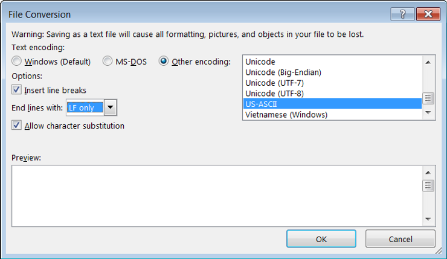

# Convert .docx to .txt for Linux

This post lists the settings you should use to convert a .docx Microsoft Word file to a .txt for Linux.

Use the following options to cleanly work with the contents of a Word doc in an editor like Vim.

**<u>References</u>**

-   Windows logo from \[[<u>link</u>](https://support.microsoft.com/en-us)\]
    
-   Tux logo from \[[<u>link</u>](https://en.wikipedia.org/wiki/Tux_(mascot))\]