# Create a BOOT.bin, Program an SD Card and Boot a ZC706 using Windows 7

This post shows you how to create a BOOT.bin with a Hello World bare-metal application and a bitstream created in \[[<u>Run Hello World on a ZC702</u>](https://www.centennialsoftwaresolutions.com/blog/run-hello-world-on-a-zc702)\], how to program the BOOT.bin onto the SD Card using Windows (copy it to the SD card) and how to boot the ZC702 from the SD card and see output from the serial port.

**<u>Before you Start</u>**

**_A. Generate bitstreams, Hello World Binaries and Test Everything_**

This post assumes you've generated the bitstreams, Hello World binaries and have tested everything as listed in \[[<u>Run Hello World on a ZC702</u>](https://www.centennialsoftwaresolutions.com/blog/run-hello-world-on-a-zc702)\], but on the on the ZC706. All of the instructions are the same except 2 things:

1\. You select the **ZC706** board instead of the ZC702

2\. You need to connect the UART-to-USB and JTAG-to-USB cables to:

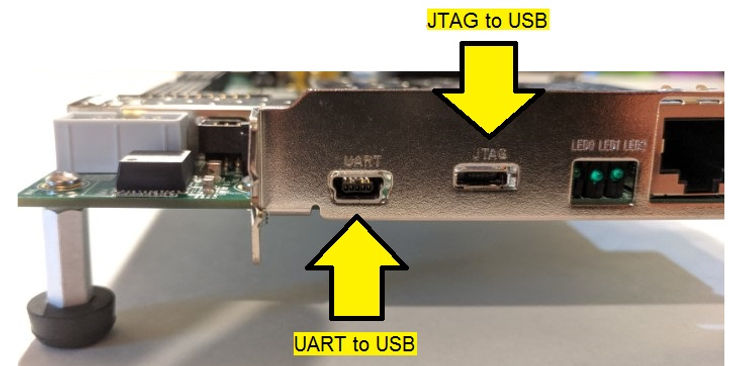

**_B. Get a License_**

The ZC706 has a XC7Z045-2FFG900 C SoC. This chip is not support in WebPACK ( see \[[<u>link</u>](https://www.xilinx.com/products/design-tools/vivado/vivado-webpack.html#architecture)\]) like the chip on the ZC702. You can get a 30-day license at \[[<u>link</u>](https://www.xilinx.com/support/licensing_solution_center.html)\].

**<u>Versions Used</u>**

-   2018.2 Vivado and SDK
    
-   Windows 7 SP1
    
-   Rufus 3.5 @ \[[<u>link</u>](https://github.com/pbatard/rufus/releases/download/v3.5/rufus-3.5.exe)\]
    

**<u>Create Boot Image</u>**

The following picks up after the last step listed in [[Run Hello World on a ZC702](https://www.centennialsoftwaresolutions.com/blog/run-hello-world-on-a-zc702)]

Step 1: Create the first stage boot loader (FSBL) that will load the bitstream and the helloworld.elf.

A. Click **File**

B. Click **New**

C. Click **Application Project**

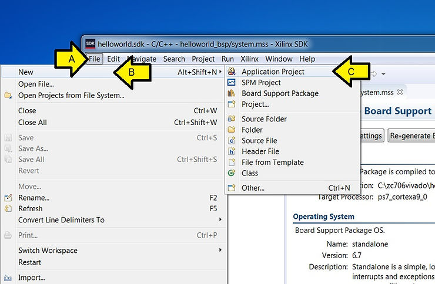

D. Type **fsbl**

E. Ensure the rest of the fields match the picture and click **Next >**

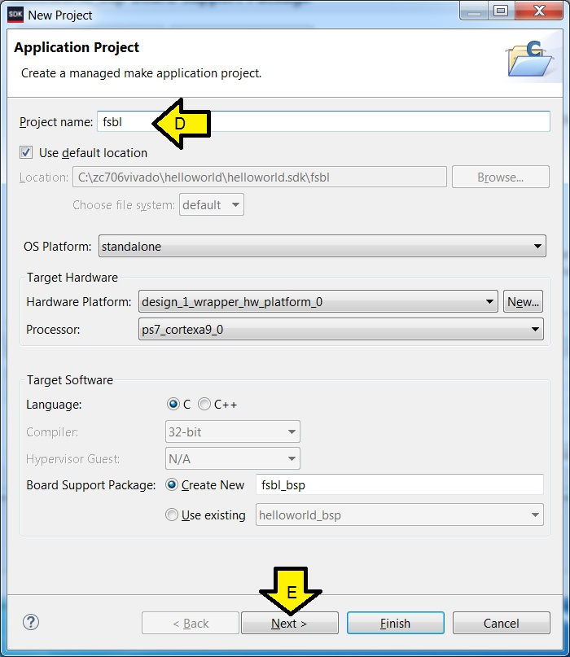

F. Click **Zynq FSBL**

G. Click **Finish**

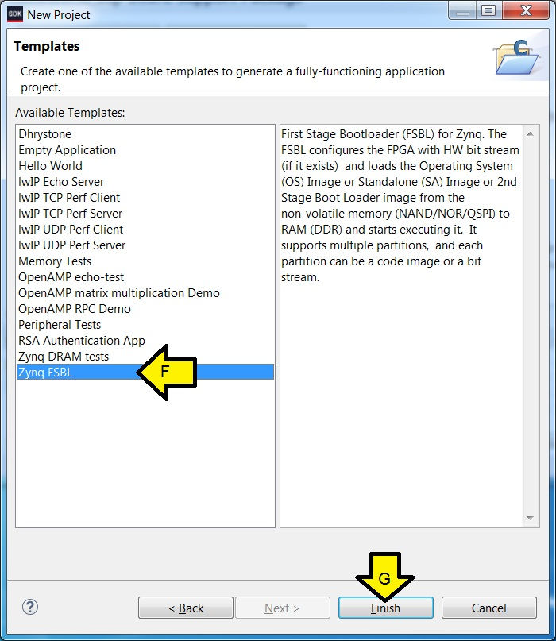

Step 2: Create the BOOT.bin

A. Select **fsbl**

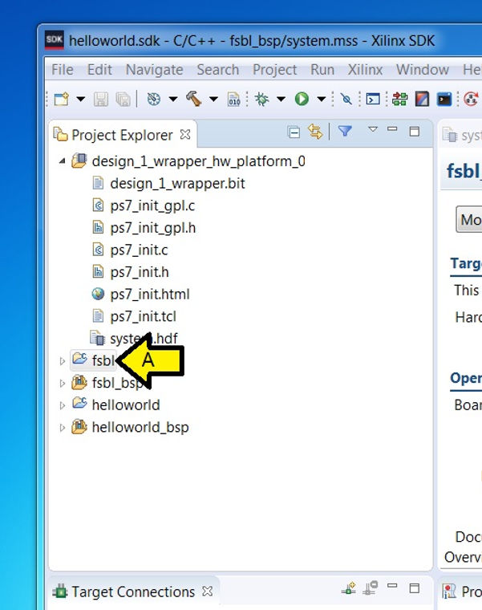

B. Click **Xilinx**

C. Click **Create Boot Image**

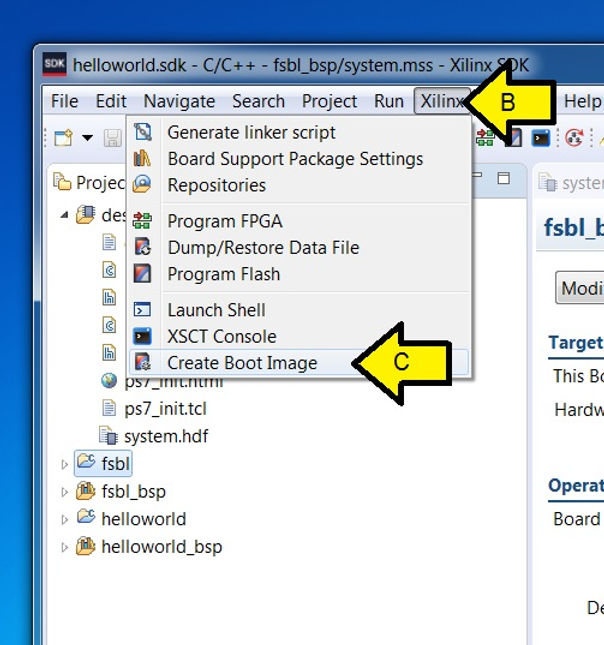

D. Ensure that the picture below matches (your paths may be different) and click **Add**

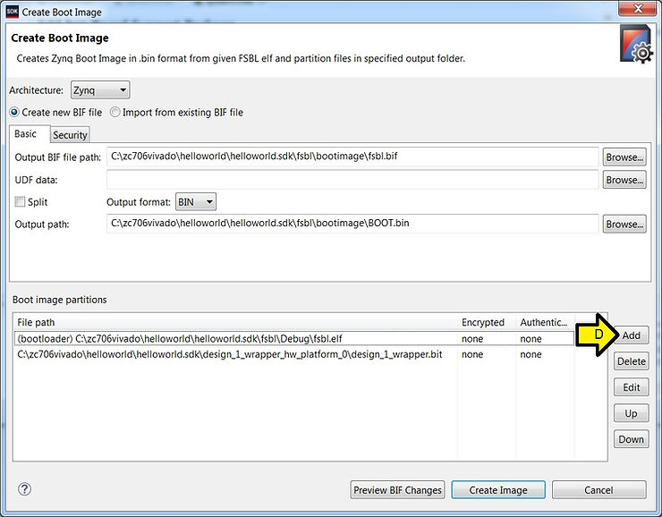

E. Browse to **helloworld.elf** in C:\\zc706vivado\\helloworld\\helloworld.sdk\\helloworld\\Debug or similar and **select it**

F. Click **Open**

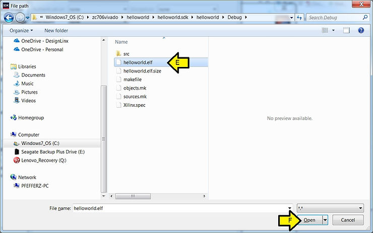

G. Ensure that this image matches yours (again paths may be a little different) and click **OK**

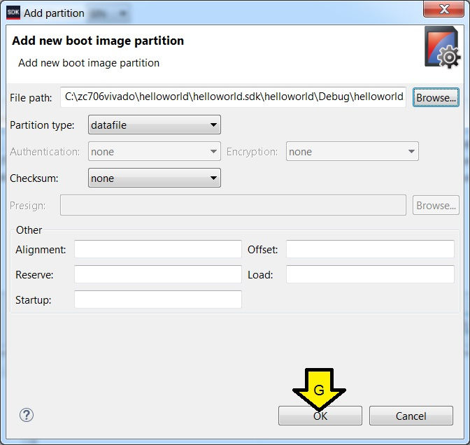

H. Click **Create Image**

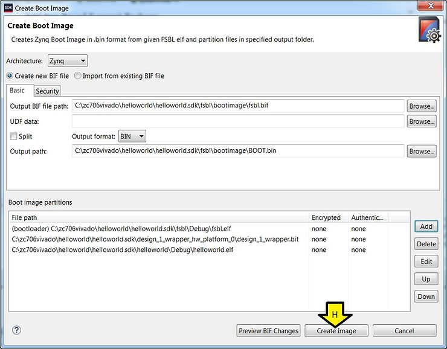

I. You should see Build Finished (took ...ms)

J. ...and Bootgen command execution is done.

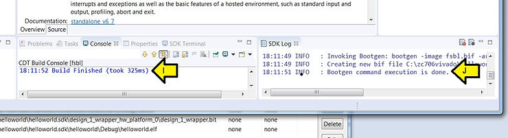

**<u>Prepare the SD Card and Copy the BOOT.bin</u>**

Step 1: Insert into a SD card reader/writer on your PC the SD card that came with the ZC706 (see \[[<u>link</u>](https://www.centennialsoftwaresolutions.com/blog/zc706-unboxing)\]) or find an 8 GB SanDisk class 4 card:

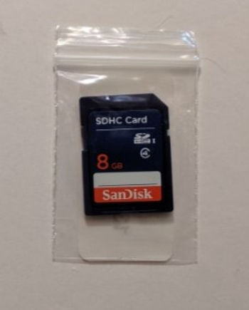

Step 2: Format the SD card

A. Right-click the **SD card**

B. Select **Format...**

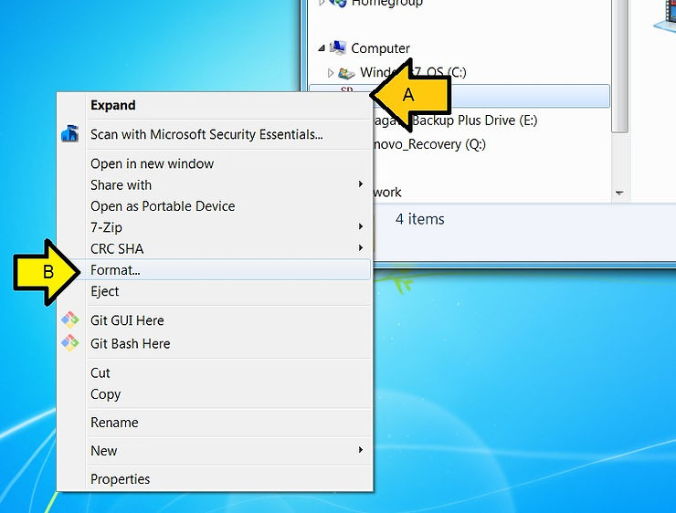

C. Click **Start**

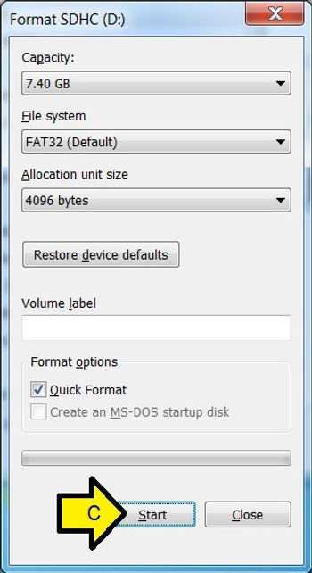

D. Click **OK**

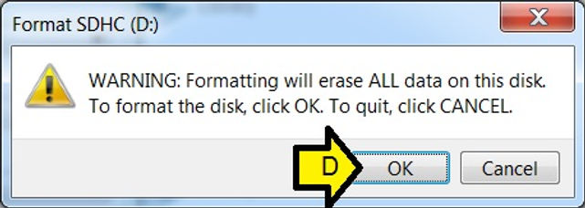

E. Click **OK** again

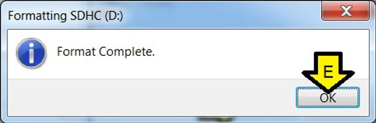

F. Click **Close**

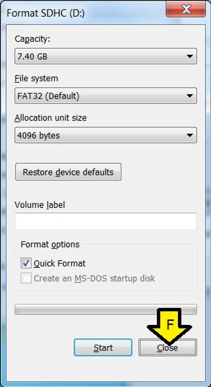

Step 3: Copy the BOOT.bin to the SD card

A. Browse to the **BOOT.bin**

B. Right-click on **BOOT.bin**

C. Select **Copy**

D. Click the **SD card**

E. Right-click in the **empty area of the SD explorer**

F. Click **Paste**

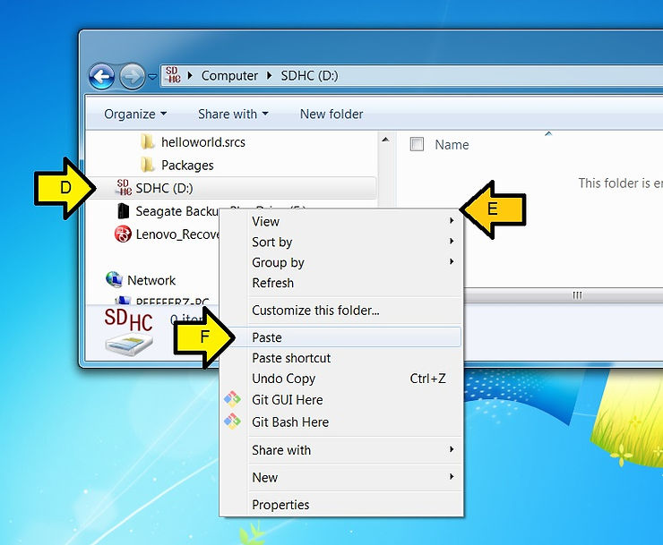

G. You should see:

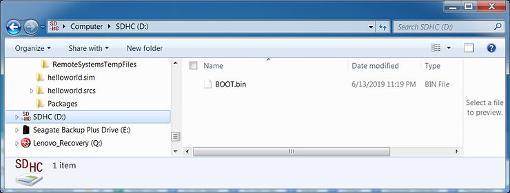

Step 4: Eject the SD card

A. Right-click on the **SD card**

B. Click **Eject**

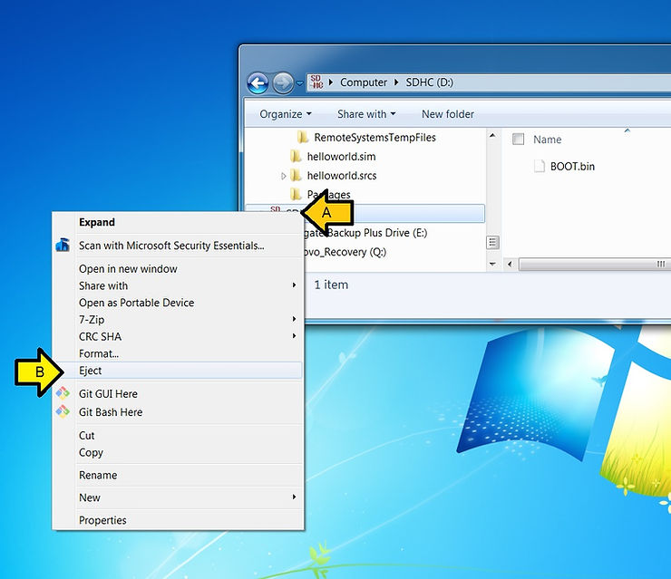

Step 5: Make sure the ZC706 is off and plug the SD card into the ZC706

A. Off:

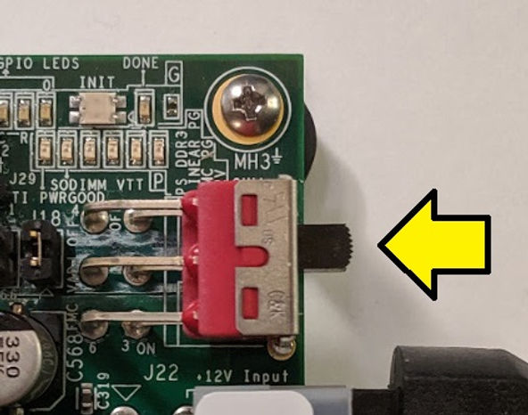

Step 6: Set the board to SD boot mode

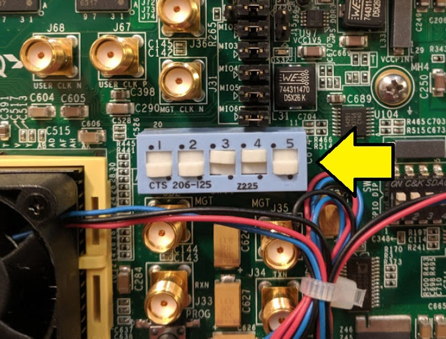

Step 7: Ensure the UART connection is connected to the computer

A. Connect the Mini-B port of Mini-B to Type-A USB cable to the port marked "UART"

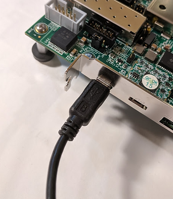

B. Connect the Type-A port of Mini-B to Type-A USB cable to the port marked "UART"

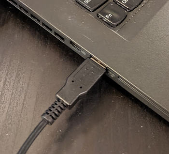

Step 8: Set up the terminal on the SDK

This was covered in [[Run Hello World on a ZC702](https://www.centennialsoftwaresolutions.com/blog/run-hello-world-on-a-zc702)]

Step 9: Power on the ZC706

A. Move the switch from:

B. To:

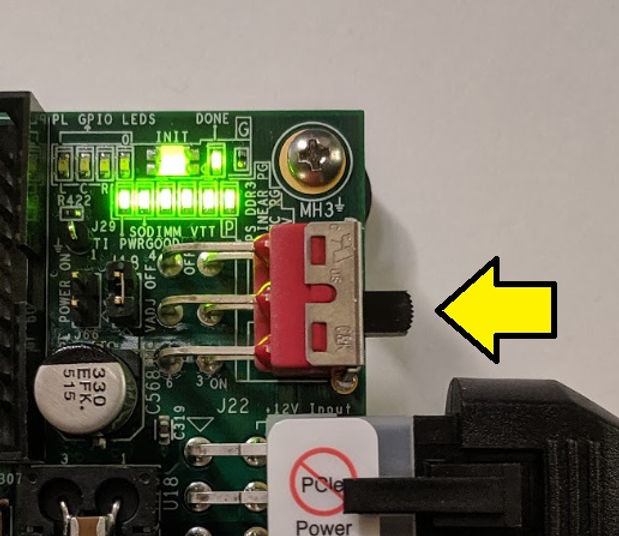

You should see **Hello World** on the console:

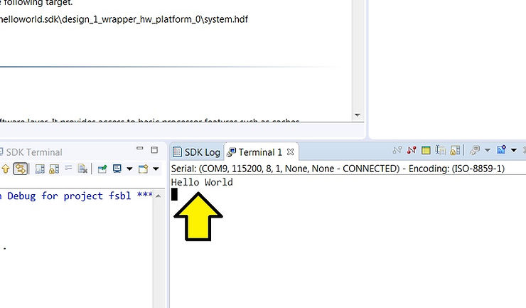

...and the DONE LED green which indicates that the FPGA was successfully programmed by the FSBL

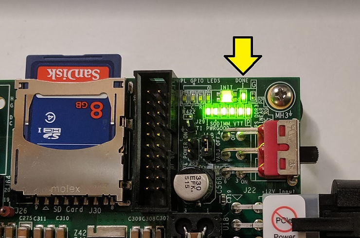

**<u>References</u>**

-   Zynq-7000 All Programmable SoC ZC706 Evaluation Kit Getting Started Guide UG961 (v6.0.1) January 28, 2015 @ \[[<u>link</u>](https://www.xilinx.com/support/documentation/boards_and_kits/zc706/2014_4/ug961-zc706-GSG.pdf)\]
    
-   ZC706 Evaluation Board for the Zynq-7000 XC7Z045 SoC User Guide UG954 (v1.7) July 1, 2018 @ \[[<u>link</u>](https://www.xilinx.com/support/documentation/boards_and_kits/zc706/ug954-zc706-eval-board-xc7z045-ap-soc.pdf)\]
    
-   Xilinx logo found via [<u>https://twitter.com/xilinxinc</u>](https://twitter.com/xilinxinc) at \[[<u>link</u>](https://pbs.twimg.com/profile_images/535545777020338176/pEWdIYq__400x400.png)\]