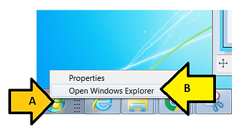
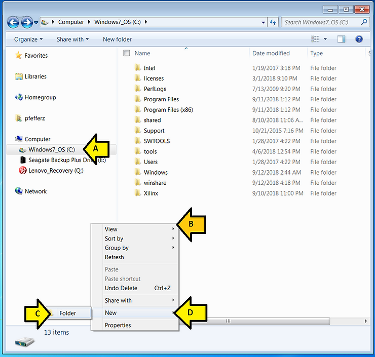
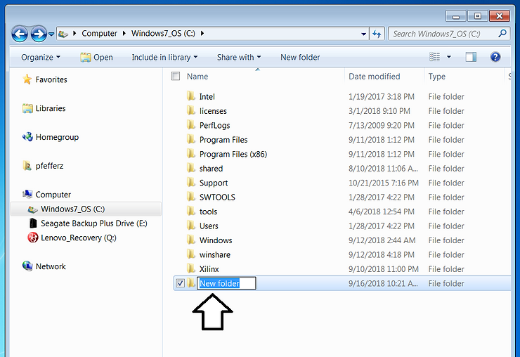
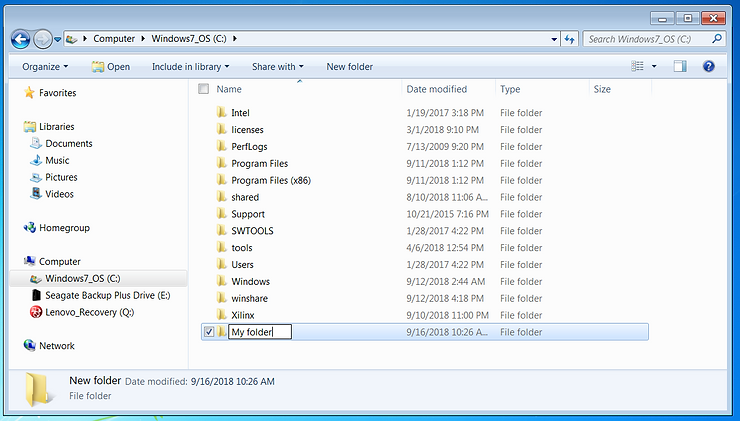
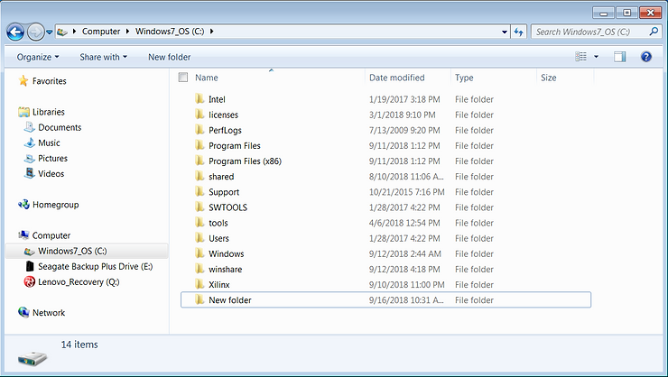
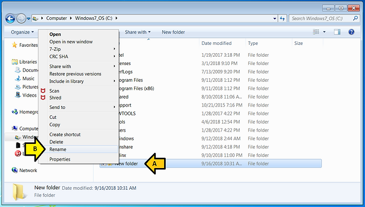

# Create a Folder in C:\ in Windows 7 SP1

This post shows you how to create a folder in C:\\ in Windows 7 SP1.

**<u>Steps</u>**

**Note**

"Click" refers to clicking the left mouse button.

**1.** Open Windows Explorer

A) Right click on the Window's icon and

B) Click Open Windows Explorer

**2.** Create New folder

A) Select the (C:) drive

B) Right-click below the other folders

C) Click Folder

D) Click New

At this point you'll see **New folder**. Notice that **New folder** is selected. If it doesn't look like this you may have clicked somewhere else. See step **3-b** for for how to handle this.

**3-a.** If **New folder** is selected, then type in the new folder name: **My folder**

**4-a.** You're done

**3-b.** If **New folder** is no longer selected...

...follow these steps:

A) Right-click on **New folder**

B) Click **Rename**

**4-b.** Type **My folder**

This is the same picture used in 3-b.

**5-b.** You're done with the alternative instructions.

**<u>Share and Like</u>**

**Share** and **like** this if you think other people would find it useful!

**<u>Reference</u>**

Windows 7 logo from \[[link](http://logos.wikia.com/wiki/File:Windows_7_logo.png)\]