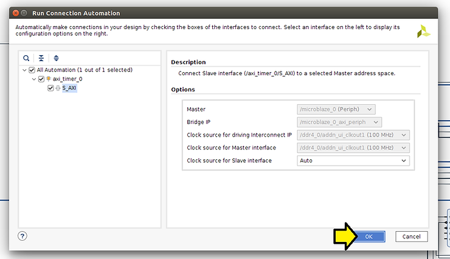
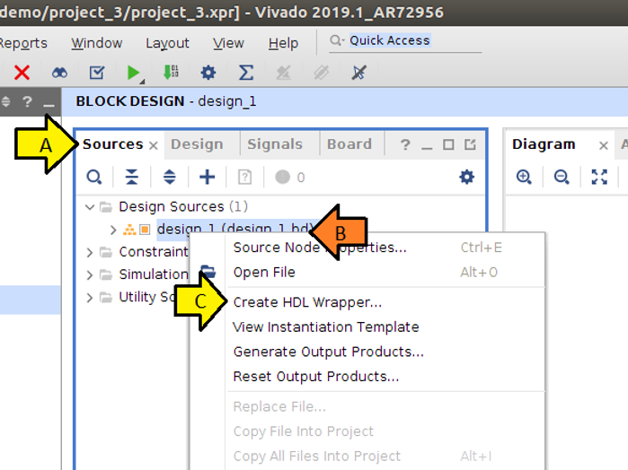

# Create a MicroBlaze, Test the UART in SDK, and Boot Linux using 2019.1 Vivado and PetaLinux Tools


This post contains everything needed to create a MicroBlaze design and boot Linux on it over JTAG. It also contains links to all the IP documentation and how to smoke-test a design before using it.

## Versions Used

2019.1 Vivado, PetaLinux Tools, and XSDK

VMWare Workstation 14 Player running Ubuntu 16.04.5 LTS running on Windows 10

## Update Vivado 2019.1

### Note

I needed this patch to build the bitstream.

### Steps

<u><span><span>Step </span><a href="https://www.centennialsoftwaresolutions.com/blog/hashtags/1" target="__blank"><span>#1</span></a></span></u>: Download the patch at:

https://www.xilinx.com/support/answers/72956.html#:~:text=You%20will%20see%20a%20MIG,will%20not%20generate%20a%20response.

<u><span><span>Step </span><a href="https://www.centennialsoftwaresolutions.com/blog/hashtags/2" target="__blank"><span>#2</span></a></span></u>: Exit Vivado 2019.1

Note: commands assume Vivado is installed at:

/tools/Xilinx/Vivado/2019.1/bin/vivado

<u><span><span>Step </span><a href="https://www.centennialsoftwaresolutions.com/blog/hashtags/3" target="__blank"><span>#3</span></a></span></u>: Run

```
mkdir /tools/Xilinx/Vivado/2019.1/patches
mkdir /tools/Xilinx/Vivado/2019.1/patches/AR72956
pushd /tools/Xilinx/Vivado/2019.1/patches/AR72956
unzip ~/Downloads/AR72956_vivado_2019_1_preliminary_rev1.zip
```

<u><span><span>Step </span><a href="https://www.centennialsoftwaresolutions.com/blog/hashtags/4" target="__blank"><span>#4</span></a></span></u>: Restart Vivado 2019.1

<u><span><span>Step </span><a href="https://www.centennialsoftwaresolutions.com/blog/hashtags/5" target="__blank"><span>#5</span></a></span></u>: Check that the Patch Applied


## Enter in the Design

### Notes

For Linux to boot on MicroBlaze

Page 19 of https://www.xilinx.com/support/documentation/sw_manuals/xilinx2019_1/ug1144-petalinux-tools-reference-guide.pdf lists the requirements to run Linux on a MicroBlaze. I've left out both the Non-volatile memory and Ethernet in this design. Also, I use an AXI Timer, not a  Dual channel timer.


### Steps

<u><span><span>Step </span><a href="https://www.centennialsoftwaresolutions.com/blog/hashtags/1" target="__blank"><span>#1</span></a></span></u>: Run Vivado 2019.1

<u><span><span>Step </span><a href="https://www.centennialsoftwaresolutions.com/blog/hashtags/2" target="__blank"><span>#2</span></a></span></u>: File > Project > New

<u><span><span>Step </span><a href="https://www.centennialsoftwaresolutions.com/blog/hashtags/3" target="__blank"><span>#3</span></a></span></u>: Click **Next** on the **Create New Vivado Project** window


<u><span>Step # 3.1</span></u>: Click **Next** in the **Project Name** window


<u><span><span>Step </span><a href="https://www.centennialsoftwaresolutions.com/blog/hashtags/3" target="__blank"><span>#3</span></a><span>.2</span></span></u>: (A) Click **RTL Project** and (B) click **Next**


<u><span>Step # 3.3</span></u>: (A) Click **Boards**, (B) enter **zcu102**, (C) click on the line, and (D) click **Next**


<u><span><span>Step </span><a href="https://www.centennialsoftwaresolutions.com/blog/hashtags/3" target="__blank"><span>#3</span></a><span>.4</span></span></u>: Click **Finish**


## Create the Block Design

### Steps

<u><span><span>Step </span><a href="https://www.centennialsoftwaresolutions.com/blog/hashtags/1" target="__blank"><span>#1</span></a></span></u>: Click **Create Block Design**


<u><span><span>Step </span><a href="https://www.centennialsoftwaresolutions.com/blog/hashtags/1" target="__blank"><span>#1</span></a><span>.1</span></span></u>: Click **OK**


<u><span><span>Step </span><a href="https://www.centennialsoftwaresolutions.com/blog/hashtags/2" target="__blank"><span>#2</span></a></span></u>: (A) Click **Board**, (B) Pull **DDR4 SDRAM** to the Diagram, and (C) click **OK**


<u><span><span>Step </span><a href="https://www.centennialsoftwaresolutions.com/blog/hashtags/3" target="__blank"><span>#3</span></a></span></u>: Click **Run Connection Automation**


<u><span><span>Step </span><a href="https://www.centennialsoftwaresolutions.com/blog/hashtags/3" target="__blank"><span>#3</span></a><span>.1</span></span></u>: (A) Check all checkboxes and (B) click OK


You should see:


<u><span><span>Step </span><a href="https://www.centennialsoftwaresolutions.com/blog/hashtags/4" target="__blank"><span>#4</span></a></span></u>: (A) Click **+**, (B) type **micro**, and (C) double-click MicroBlaze


<u><span><span>Step </span><a href="https://www.centennialsoftwaresolutions.com/blog/hashtags/5" target="__blank"><span>#5</span></a></span></u>: Click **Run Block Automation**


<u><span><span>Step </span><a href="https://www.centennialsoftwaresolutions.com/blog/hashtags/6" target="__blank"><span>#6</span></a></span></u>: (A) Check the **Interrupt Controller** checkbox and (B) click **OK**

Note: we select **Linux with MMU** later during IP customization

Note 2: this ^^^ step is how you get **microblaze\_0\_local\_memory**


<u><span><span>Step </span><a href="https://www.centennialsoftwaresolutions.com/blog/hashtags/7" target="__blank"><span>#7</span></a></span></u>: Click **Run Connection Automation**


<u><span><span>Step </span><a href="https://www.centennialsoftwaresolutions.com/blog/hashtags/7" target="__blank"><span>#7</span></a><span>.1</span></span></u>: (A) Select all checkboxes and (B) click OK


You should see:


<u><span><span>Step </span><a href="https://www.centennialsoftwaresolutions.com/blog/hashtags/7" target="__blank"><span>#7</span></a><span>.2</span></span></u>: (A) Click Board, (B) click and drag UART, (C) click OK, and (D) click Run Connection Automation


<u><span><span>Step </span><a href="https://www.centennialsoftwaresolutions.com/blog/hashtags/7" target="__blank"><span>#7</span></a><span>.3</span></span></u>: Click **OK**



You should see:


<u><span><span>Step </span><a href="https://www.centennialsoftwaresolutions.com/blog/hashtags/8" target="__blank"><span>#8</span></a></span></u>: (A) Click +, (B) Type AXI Timer, and (C) click AXI Timer


<u><span><span>Step </span><a href="https://www.centennialsoftwaresolutions.com/blog/hashtags/8" target="__blank"><span>#8</span></a><span>.1</span></span></u>: Click **Run Connection Automation**


<u><span>Step # 8.2</span></u>: Click **OK**


You should see:


<u><span><span>Step </span><a href="https://www.centennialsoftwaresolutions.com/blog/hashtags/9" target="__blank"><span>#9</span></a></span></u>: Connect the **axi\_timer\_0 interrupt** and the **axi\_uartlite\_0 interrupt** pins to the **microblaze\_0\_xlconcat**

Note: you will still see the UART output in XSDK without this, and Linux will run, but you won't see any UART output.


## Customize the MicroBlaze IP

### Steps

<u><span><span>Step </span><a href="https://www.centennialsoftwaresolutions.com/blog/hashtags/1" target="__blank"><span>#1</span></a></span></u>: Double click on the **microblaze\_0** instance of the MicroBlaze


<u><span><span>Step </span><a href="https://www.centennialsoftwaresolutions.com/blog/hashtags/1" target="__blank"><span>#1</span></a><span>.1</span></span></u>: (A) Select **Linux with MMU** and (B) click **OK**


You only need to set **Linux with MMU**. Here are the other pages as a reference.

Page 1


Page 2


Page 3


Page 4


Page 5


Page 6


Page 7


## Get Ready to Create the Bitstream

### Steps

<u><span><span>Step </span><a href="https://www.centennialsoftwaresolutions.com/blog/hashtags/1" target="__blank"><span>#1</span></a></span></u>: Check the Board


<u><span><span>Step </span><a href="https://www.centennialsoftwaresolutions.com/blog/hashtags/2" target="__blank"><span>#2</span></a></span></u>: Check the full design


<u><span><span>Step </span><a href="https://www.centennialsoftwaresolutions.com/blog/hashtags/2" target="__blank"><span>#2</span></a><span>.1</span></span></u>: Zoom into the left side


<u><span><span>Step </span><a href="https://www.centennialsoftwaresolutions.com/blog/hashtags/2" target="__blank"><span>#2</span></a><span>.2</span></span></u>: Zoom into the right side


<u><span><span>Step </span><a href="https://www.centennialsoftwaresolutions.com/blog/hashtags/3" target="__blank"><span>#3</span></a></span></u>: Check the **Address Editor**


<u><span><span>Step </span><a href="https://www.centennialsoftwaresolutions.com/blog/hashtags/4" target="__blank"><span>#4</span></a></span></u>: Check the **Project Summary**

<u><span><span>Step </span><a href="https://www.centennialsoftwaresolutions.com/blog/hashtags/4" target="__blank"><span>#4</span></a><span>.1</span></span></u>: Click **PROJECT MANAGER** to get the Project Summary


You should see something like:


## Create the Bitstream

### Steps

<u><span><span>Step </span><a href="https://www.centennialsoftwaresolutions.com/blog/hashtags/1" target="__blank"><span>#1</span></a></span></u>: Create the HDL Wrapper

<u><span><span>Step </span><a href="https://www.centennialsoftwaresolutions.com/blog/hashtags/1" target="__blank"><span>#1</span></a><span>.1</span></span></u>: (A) Click **Sources**, (B) right-click **design\_1 (design\_1\_hd)**, and (C) click **Create HDL Wrapper...**



<u><span><span>Step </span><a href="https://www.centennialsoftwaresolutions.com/blog/hashtags/1" target="__blank"><span>#1</span></a><span>.2</span></span></u>: Leave **Let Vivado manage wrapper and auto-**update selected and click **OK**


You should see:


<u><span><span>Step </span><a href="https://www.centennialsoftwaresolutions.com/blog/hashtags/2" target="__blank"><span>#2</span></a></span></u>: Click **Generate Bitstream**


<u><span><span>Step </span><a href="https://www.centennialsoftwaresolutions.com/blog/hashtags/2" target="__blank"><span>#2</span></a><span>.1</span></span></u>: Click **Save**


<u><span><span>Step </span><a href="https://www.centennialsoftwaresolutions.com/blog/hashtags/2" target="__blank"><span>#2</span></a><span>.2</span></span></u>: Click **Yes** on the **No Implementation Results Available** notification box


<u><span><span>Step </span><a href="https://www.centennialsoftwaresolutions.com/blog/hashtags/2" target="__blank"><span>#2</span></a><span>.3</span></span></u>: Select as many cores as you can and click **OK**

Note: this can take 1 to 2 hours to run


Note 2: You should see a status indicator in the upper right-hand corner


## Program the Bitstream

### Steps

<u><span><span>Step </span><a href="https://www.centennialsoftwaresolutions.com/blog/hashtags/1" target="__blank"><span>#1</span></a></span></u>: (A) Select **Open Hardware Manager** and (B) click OK


<u><span><span>Step </span><a href="https://www.centennialsoftwaresolutions.com/blog/hashtags/2" target="__blank"><span>#2</span></a></span></u>: Plug the UART and JTAG USB cables into the board...


<u><span><span>Step </span><a href="https://www.centennialsoftwaresolutions.com/blog/hashtags/2" target="__blank"><span>#2</span></a><span>.1</span></span></u>: ...and into a hub...


<u><span><span>Step </span><a href="https://www.centennialsoftwaresolutions.com/blog/hashtags/2" target="__blank"><span>#2</span></a><span>.2</span></span></u>: ...which is plugged into the computer


Important note: using a hub is a good way to connect the JTAG and UART USB devices to a VM. It has worked for VMWare and VirtualBox.

<u><span><span>Step </span><a href="https://www.centennialsoftwaresolutions.com/blog/hashtags/3" target="__blank"><span>#3</span></a></span></u>: Make sure the SW6 is set to JTAG boot the ZCU102


<u><span><span>Step </span><a href="https://www.centennialsoftwaresolutions.com/blog/hashtags/4" target="__blank"><span>#4</span></a></span></u>: Turn on the ZCU102

<u><span><span>Step </span><a href="https://www.centennialsoftwaresolutions.com/blog/hashtags/5" target="__blank"><span>#5</span></a></span></u>: Ensure that the Cygnal Integrated CP2108 Quad USB to UART Bridge Controller is enabled and Future Devices Digilent USB Device is enabled.


<u><span><span>Step </span><a href="https://www.centennialsoftwaresolutions.com/blog/hashtags/6" target="__blank"><span>#6</span></a></span></u>: Click **Open target**


<u><span><span>Step </span><a href="https://www.centennialsoftwaresolutions.com/blog/hashtags/7" target="__blank"><span>#7</span></a></span></u>: Click **Auto Connect**


<u><span><span>Step </span><a href="https://www.centennialsoftwaresolutions.com/blog/hashtags/8" target="__blank"><span>#8</span></a></span></u>: Click **Program device**


<u><span><span>Step </span><a href="https://www.centennialsoftwaresolutions.com/blog/hashtags/9" target="__blank"><span>#9</span></a></span></u>: Click **Program**


You should see:


## Export the Design for UART Smoke Test with XSDK and Creating a Linux Build with PetaLinux

### Steps

<u><span><span>Step </span><a href="https://www.centennialsoftwaresolutions.com/blog/hashtags/1" target="__blank"><span>#1</span></a></span></u>: (A) Click **File**, (B) **Export**, and (C) **Export Hardware...**


<u><span><span>Step </span><a href="https://www.centennialsoftwaresolutions.com/blog/hashtags/1" target="__blank"><span>#1</span></a><span>.1</span></span></u>: Click **OK**


## Create a Hello World test App to Test the UART Works Before Creating a Linux Build

### Steps

<u><span><span>Step </span><a href="https://www.centennialsoftwaresolutions.com/blog/hashtags/1" target="__blank"><span>#1</span></a></span></u>: (A) Click **File** and (B) click **Launch SDK**


<u><span><span>Step </span><a href="https://www.centennialsoftwaresolutions.com/blog/hashtags/1" target="__blank"><span>#1</span></a><span>.1</span></span></u>: Click **OK**


<u><span><span>Step </span><a href="https://www.centennialsoftwaresolutions.com/blog/hashtags/2" target="__blank"><span>#2</span></a></span></u>: (A) Click the drop-down and (B) click **Application Project**


<u><span><span>Step </span><a href="https://www.centennialsoftwaresolutions.com/blog/hashtags/2" target="__blank"><span>#2</span></a><span>.1</span></span></u>: (A) Use **Hello\_world** for the **Project name:** and (B) click **Next**

Important Note: never use spaces; the SDK cannot handle spaces


<u><span><span>Step </span><a href="https://www.centennialsoftwaresolutions.com/blog/hashtags/2" target="__blank"><span>#2</span></a><span>.2</span></span></u>: (A) Click **Hello World** and (B) **Finish**


<u><span><span>Step </span><a href="https://www.centennialsoftwaresolutions.com/blog/hashtags/3" target="__blank"><span>#3</span></a></span></u>: Open a terminal and start screen using:

```
screen /dev/ttyUSB2 9600
```

Note 1: Type Ctrl-a d to detach, Ctrl-a k to kill

Note 2: After detaching, reattached with:

```
screen -r 
```

Note 3: if someone else has attached, reattach with:

```
screen -x
```

Note 4: to clear what's in a screen, type Ctrl-a C. To get more commands, type Ctrl-a ?

<u><span><span>Step </span><a href="https://www.centennialsoftwaresolutions.com/blog/hashtags/4" target="__blank"><span>#4</span></a></span></u>: (A) Right-click on Hello\_world, (B) click Debug As, and (C) click Launch on Hardware (System Debugger)


<u><span><span>Step </span><a href="https://www.centennialsoftwaresolutions.com/blog/hashtags/5" target="__blank"><span>#5</span></a></span></u>: Click Yes to Confirm Perspective Switch


You will likely not see anything because the target is stuck at:

```
void XUartLite_SendByte(UINTPTR BaseAddress, u8 Data)
{
 while (XUartLite_IsTransmitFull(BaseAddress));   /* <<<<< stuck */

 XUartLite_WriteReg(BaseAddress, XUL_TX_FIFO_OFFSET, Data);
}
```

...and the memory load from the UART returned:

xsct% mrd 0x40600000

xsct% Memory read error at 0x40600000. Memory access exception

**0xdec0ce1c**

We'll fix that next by ensuring we click the Reset entire system check box in the Debug configuration.

<u><span><span>Step </span><a href="https://www.centennialsoftwaresolutions.com/blog/hashtags/6" target="__blank"><span>#6</span></a></span></u>: (A) Click the debug drop down and (B) click **Debug Configurations....**


<u><span><span>Step </span><a href="https://www.centennialsoftwaresolutions.com/blog/hashtags/6" target="__blank"><span>#6</span></a><span>.1</span></span></u>: (A) Check the **Reset entire system** checkbox, (B) click **Apply**, and (C) click **Debug**


<u><span><span>Step </span><a href="https://www.centennialsoftwaresolutions.com/blog/hashtags/6" target="__blank"><span>#6</span></a><span>.2</span></span></u>: Click **OK**


<u><span><span>Step </span><a href="https://www.centennialsoftwaresolutions.com/blog/hashtags/7" target="__blank"><span>#7</span></a></span></u>:Click **Step Over**


<u><span><span>Step </span><a href="https://www.centennialsoftwaresolutions.com/blog/hashtags/7" target="__blank"><span>#7</span></a><span>.1</span></span></u>: Click **Step Over** again


<u><span><span>Step </span><a href="https://www.centennialsoftwaresolutions.com/blog/hashtags/7" target="__blank"><span>#7</span></a><span>.2</span></span></u>: ...and one more time observing **Hello World** on your screen session


Note: To restart debugging, click the **Bug**...


...and click **OK**...


## Create and Build MicroBlaze Linux

### Steps

<u><span><span>Step </span><a href="https://www.centennialsoftwaresolutions.com/blog/hashtags/1" target="__blank"><span>#1</span></a></span></u>: Type the following to create a PetaLinux project and build it

```
cd plxprjs/
source ~/petalinux/2019.1/settings.sh
petalinux-create --type project --template microblaze --name zcu102mb
cd zcu102mb
petalinux-config --get-hw-description=/home/demo/project_3/project_3.sdk
# Accept defaults and exit (just select Exit in the autoconfig)
petalinux-build
```

<u><span><span>Step </span><a href="https://www.centennialsoftwaresolutions.com/blog/hashtags/2" target="__blank"><span>#2</span></a></span></u>: Reset the ZCU102

<u><span><span>Step </span><a href="https://www.centennialsoftwaresolutions.com/blog/hashtags/3" target="__blank"><span>#3</span></a></span></u>: Download the FPGA using xsct

```
cd /home/demo/petalinux/2019.1/tools/xsct/bin/
 ./xsct
 connect -url tcp:localhost:3121
 targets
 # Select the PL
 targets 3
 fpga -no-revision-check /home/demo/plxprjs/zcu102mb/images/linux/system.bit
```

Note 1:

I needed to use xsct flow because I got a

```
WARNING: [Xicom 50-99] Incorrect bitstream assigned to device. Bitstream was generated for part xczu9eg-ffvb1156-2-e, target device (with IDCODE revision 1) is compatible with es2 revision bitstreams.
```

Note 2: You can download the bit file using HARDWARE MANAGER by running:

```
set_param xicom.use_bitstream_version_check false
```

...in Vivado

<u><span><span>Step </span><a href="https://www.centennialsoftwaresolutions.com/blog/hashtags/4" target="__blank"><span>#4</span></a></span></u>: Back in PetaLinux type:

```
petalinux-boot --jtag --kernel -v
```

Note: Consider always using -v to see what the command actually does

<u><span><span>Step </span><a href="https://www.centennialsoftwaresolutions.com/blog/hashtags/5" target="__blank"><span>#5</span></a></span></u>: Examine build output:

```
INFO: sourcing build tools
XSDB Script:
INFO: Launching XSDB for file download and boot.
INFO: This may take a few minutes, depending on the size of your image.

connect
targets -set -nocase -filter {name =~ "microblaze*#0"}
puts stderr "INFO: Downloading ELF file: /home/demo/plxprjs/zcu102mb/images/linux/image.elf to the target."
dow "/home/demo/plxprjs/zcu102mb/images/linux/image.elf"
after 2000
con
exit
rlwrap: warning: your $TERM is 'xterm-256color' but rlwrap couldn't find it in the terminfo database. Expect some problems.: Inappropriate ioctl for device
INFO: Downloading ELF file: /home/demo/plxprjs/zcu102mb/images/linux/image.elf to the target.
Downloading Program -- /home/demo/plxprjs/zcu102mb/images/linux/image.elf
 section, .text: 0xc0000000 - 0xc043d427
 section, __fdt_blob: 0xc043d428 - 0xc044d427
 section, .rodata: 0xc044e000 - 0xc0565adf
 section, .pci_fixup: 0xc0565ae0 - 0xc056767f
 section, __ksymtab: 0xc0567680 - 0xc056ddbf
 section, __ksymtab_gpl: 0xc056ddc0 - 0xc0572717
 section, __ksymtab_strings: 0xc0572718 - 0xc058bf6c
 section, __param: 0xc058bf70 - 0xc058c537
 section, __modver: 0xc058c538 - 0xc058cfff
 section, __ex_table: 0xc058d000 - 0xc058e53f
 section, .notes: 0xc058e540 - 0xc058e57b
 section, .sdata2: 0xc058e57c - 0xc058efff
 section, .data: 0xc058f000 - 0xc05b557f
 section, .init.text: 0xc05b6000 - 0xc05d9c1f
 section, .init.data: 0xc05d9c20 - 0xc05db6b3
 section, .init.ivt: 0xc05db6b4 - 0xc05db6db
 section, .init.setup: 0xc05db6dc - 0xc05dba8f
 section, .initcall.init: 0xc05dba90 - 0xc05dbe07
 section, .con_initcall.init: 0xc05dbe08 - 0xc05dbe0b
 section, .init.ramfs: 0xc05dbe0c - 0xc1283013
 section, .bss: 0xc1284000 - 0xc1310533
100% 18MB 0.2MB/s 01:52 
Setting PC to Program Start Address 0x80000000
Successfully downloaded /home/demo/plxprjs/zcu102mb/images/linux/image.elf
```

<u><span><span>Step </span><a href="https://www.centennialsoftwaresolutions.com/blog/hashtags/6" target="__blank"><span>#6</span></a></span></u>: Examine console output

Note 1: it looks like the console hangs, but it eventually came up (after a few minutes)

Note 2: Use **root** for the username and **root** for the password

```
Ramdisk addr 0x00000000,
Compiled-in FDT at (ptrval)
Linux version 4.19.0-xilinx-v2019.1 (oe-user@oe-host) (gcc version 8.2.0 (GCC)) #1 Sun Mar 7 18:29:2
2 UTC 2021
setup_memory: max_mapnr: 0x20000
setup_memory: min_low_pfn: 0x80000
setup_memory: max_low_pfn: 0xa0000
setup_memory: max_pfn: 0xa0000
Zone ranges:
 DMA [mem 0x0000000080000000-0x000000009fffffff]
 Normal empty
 HighMem empty
Movable zone start for each node
Early memory node ranges
 node 0: [mem 0x0000000080000000-0x000000009fffffff]
Initmem setup node 0 [mem 0x0000000080000000-0x000000009fffffff]
On node 0 totalpages: 131072
 DMA zone: 1024 pages used for memmap
 DMA zone: 0 pages reserved
 DMA zone: 131072 pages, LIFO batch:31
setup_cpuinfo: initialising
setup_cpuinfo: Using full CPU PVR support
wt_msr_noirq
pcpu-alloc: s0 r0 d32768 u32768 alloc=1*32768
pcpu-alloc: [0] 0
Built 1 zonelists, mobility grouping on. Total pages: 130048
Kernel command line: console=ttyUL0,9600 earlyprintk
Dentry cache hash table entries: 65536 (order: 6, 262144 bytes)
Inode-cache hash table entries: 32768 (order: 5, 131072 bytes)
Memory: 499716K/524288K available (4341K kernel code, 153K rwdata, 1276K rodata, 13108K init, 561K b
ss, 24572K reserved, 0K cma-reserved, 0K highmem)
Kernel virtual memory layout:
 * 0xfffea000..0xfffff000 : fixmap
 * 0xff800000..0xffc00000 : highmem PTEs
 * 0xff800000..0xff800000 : early ioremap
 * 0xf0000000..0xff800000 : vmalloc & ioremap
NR_IRQS: 64, nr_irqs: 64, preallocated irqs: 0
irq-xilinx: /amba_pl/interrupt-controller@41200000: num_irq=2, edge=0x1
/amba_pl/timer@41c00000: irq=1
clocksource: xilinx_clocksource: mask: 0xffffffff max_cycles: 0xffffffff, max_idle_ns: 6370868154 ns
xilinx_timer_shutdown
xilinx_timer_set_periodic
sched_clock: 32 bits at 300MHz, resolution 3ns, wraps every 7158278654ns
Calibrating delay loop... 49.35 BogoMIPS (lpj=246784)
pid_max: default: 4096 minimum: 301
Mount-cache hash table entries: 1024 (order: 0, 4096 bytes)
Mountpoint-cache hash table entries: 1024 (order: 0, 4096 bytes)
devtmpfs: initialized
random: get_random_u32 called from bucket_table_alloc+0xa0/0x23c with crng_init=0
clocksource: jiffies: mask: 0xffffffff max_cycles: 0xffffffff, max_idle_ns: 19112604462750000 ns
futex hash table entries: 16 (order: -4, 448 bytes)
NET: Registered protocol family 16
audit: initializing netlink subsys (disabled)
PCI: Probing PCI hardware
audit: type=2000 audit(0.200:1): state=initialized audit_enabled=0 res=1
vgaarb: loaded
clocksource: Switched to clocksource xilinx_clocksource
NET: Registered protocol family 2
tcp_listen_portaddr_hash hash table entries: 256 (order: 0, 6144 bytes)
TCP established hash table entries: 4096 (order: 2, 16384 bytes)
TCP bind hash table entries: 4096 (order: 4, 81920 bytes)
TCP: Hash tables configured (established 4096 bind 4096)
UDP hash table entries: 256 (order: 1, 12288 bytes)
UDP-Lite hash table entries: 256 (order: 1, 12288 bytes)
NET: Registered protocol family 1
RPC: Registered named UNIX socket transport module.
RPC: Registered udp transport module.
RPC: Registered tcp transport module.
RPC: Registered tcp NFSv4.1 backchannel transport module.
PCI: CLS 0 bytes, default 32
random: fast init done
Skipping unavailable RESET gpio -2 (reset)
workingset: timestamp_bits=30 max_order=17 bucket_order=0
romfs: ROMFS MTD (C) 2007 Red Hat, Inc.
io scheduler noop registered
io scheduler deadline registered
io scheduler cfq registered (default)
io scheduler mq-deadline registered
io scheduler kyber registered
Serial: 8250/16550 driver, 4 ports, IRQ sharing disabled
40600000.serial: ttyUL0 at MMIO 0x40600000 (irq = 2, base_baud = 0) is a uartlite
console [ttyUL0] enabled
brd: module loaded
libphy: Fixed MDIO Bus: probed
NET: Registered protocol family 17
Key type encrypted registered
Warning: unable to open an initial console.
Freeing unused kernel memory: 13108K
This architecture does not have kernel memory protection.
Run /init as init process
random: dd: uninitialized urandom read (512 bytes read)
random: dropbearkey: uninitialized urandom read (32 bytes read)
random: dropbearkey: uninitialized urandom read (32 bytes read)
random: crng init done
 
PetaLinux 2019.1 zcu102mb /dev/ttyUL0

zcu102mb login:
```

## Example of Checking the Pins and How the Pins Map to a Part

Once the bitstream has completed, check package pins

To get to the **Package Pins**

<u><span><span>Step </span><a href="https://www.centennialsoftwaresolutions.com/blog/hashtags/1" target="__blank"><span>#1</span></a></span></u>: Click **Open Implemented Design**


<u><span><span>Step </span><a href="https://www.centennialsoftwaresolutions.com/blog/hashtags/2" target="__blank"><span>#2</span></a></span></u>: A) Click **Window**, B) click **I/O Ports**


<u><span><span>Step </span><a href="https://www.centennialsoftwaresolutions.com/blog/hashtags/3" target="__blank"><span>#3</span></a></span></u>: Turn off Group by Interface and Bus to get a linear tale


Package Pins:


**<u><span>USER_SI570</span></u>**

**Schematic**

AL7 USER\_SI570\_N

AL8 USER\_SI570\_P


SI570


**BOM**

Ref Des: U42

Device: Oscillator

Package: SI570

Value: 10MHZ\_TO\_810MHZ

Voltage: N/A

Tolerance: 50PPM

Dielectric: N/A

Power: N/A

Manf: SILABS

Manf P/N: 570BAB001614DG

Dist: Silicon Labs

Dist P/N: 570BAB001614DG

Alternate P/N: N/A

Barcode: 600047

**Datasheet**

https://www.silabs.com/documents/public/data-sheets/si570.pdf 

**<u><span>UART2_TXD_O_FPGA_RXD &amp; UART2_RXD_I_FPGA_TXD</span></u>**

**Schematic**

F13 UART2\_TXD\_O\_FPGA\_RXD

E13 UART2\_RXD\_I\_FPGA\_TXD


**BOM**

CP2108

Item#: 268

Qty: 1

Ref Des: U40

Device: IC Bridge

Package: 64\_VFQFN

Value: CP2108

Voltage: 3.3V

Tolerance: N/A

Dielectric: N/A

Power: N/A

Manf: SILICON LABS

Manf P/N: CP2108-B02-GM

Dist: Digikey

Dist P/N: 336-3020-ND

Alternate P/N: N/A

Barcode: 500404

**Datasheet**

https://www.silabs.com/documents/public/data-sheets/cp2108-datasheet.pdf 

## Core Docs

mdm_0

MicroBlaze Debug Module (MDM) (3.2)

MicroBlaze Debug Module v3.2 LogiCORE IP Product Guide Vivado Design Suite

PG115 (v3.2) January 21, 2021

https://www.xilinx.com/support/documentation/ip_documentation/mdm/v3_2/pg115-mdm.pdf

ddr4_0

DDR4 SDRAM (MIG) (2.2)

https://www.xilinx.com/support/documentation/ip_documentation/ultrascale_memory_ip/v1_4/pg150-ultrascale-memory-ip.pdf

microblaze_0

MicroBlaze (11.0)

https://www.xilinx.com/support/documentation/sw_manuals/xilinx2019_1/ug984-vivado-microblaze-ref.pdf

rst_ddr4_0_300M

Processor System Reset (5.0)

Processor System Reset Module v5.0 LogiCORE IP Product Guide PG164 November 18, 2015

https://www.xilinx.com/support/documentation/ip_documentation/proc_sys_reset/v5_0/pg164-proc-sys-reset.pdf

axi_uartlite_0

AXI Uartlite (2.0)

AXI UART Lite v2.0 LogiCORE IP Product Guide Vivado Design Suite PG142 April 5, 2017

https://www.xilinx.com/support/documentation/ip_documentation/axi_uartlite/v2_0/pg142-axi-uartlite.pdf

axi_smc

AXI SmartConnect (1.0)

SmartConnect v1.0 LogiCORE IP Product Guide Vivado Design Suite PG247 February 3, 2020

https://www.xilinx.com/support/documentation/ip_documentation/smartconnect/v1_0/pg247-smartconnect.pdf

rst_ddr4_0_100M

Processor System Reset

Processor System Reset (5.0)

Processor System Reset Module v5.0 LogiCORE IP Product Guide PG164 November 18, 2015

https://www.xilinx.com/support/documentation/ip_documentation/proc_sys_reset/v5_0/pg164-proc-sys-reset.pdf

microblaze_0_axi_periph

AXI Interconnect

AXI Interconnect (2.1)

AXI Interconnect v2.1 LogiCORE IP Product Guide Vivado Design Suite PG059 December 20, 2017

https://www.xilinx.com/support/documentation/ip_documentation/axi_interconnect/v2_1/pg059-axi-interconnect.pdf

microblaze_0_xlconcat

Concat

Concat (2.1)

microblaze_0_axi_intc

AXI Interrupt Controller

AXI Interrupt Controller (4.1)

AXI Interrupt Controller (INTC) v4.1 LogiCORE IP Product Guide Vivado Design Suite PG099 June 24, 2020

https://www.xilinx.com/support/documentation/ip_documentation/axi_intc/v4_1/pg099-axi-intc.pdf

microblaze_0_local_memory

dlmb_v10

Local Memory Bus (LMB) 1.0

Local Memory Bus (LMB) v3.0 LogiCORE IP Product Guide Vivado Design Suite PG113 April 6, 2016

https://www.xilinx.com/support/documentation/ip_documentation/lmb_v10/v3_0/pg113-lmb-v10.pdf

dlmb_bram_if_cntlr

LMB BRAM Controller

LMB BRAM Controller (4.0)

LMB BRAM Interface Controller v4.0 LogiCORE IP Product Guide Vivado Design Suite PG112 January 21, 2021

https://www.xilinx.com/support/documentation/ip_documentation/lmb_bram_if_cntlr/v4_0/pg112-lmb-bram-if-cntlr.pdf

lmb_bram

Block Memory Generator

Block Memory Generator (8.4)

Block Memory Generator v8.4 LogiCORE IP Product Guide Vivado Design Suite PG058 December 9, 2019

https://www.xilinx.com/support/documentation/ip_documentation/blk_mem_gen/v8_4/pg058-blk-mem-gen.pdf

## References

Zynq UltraScale+ MPSoC ZCU102 Evaluation Kit

https://www.xilinx.com/products/boards-and-kits/ek-u1-zcu102-g.html 

PetaLinux Tools Documentation Reference Guide UG1144 (v2019.1) May 22, 2019

https://www.xilinx.com/support/documentation/sw_manuals/xilinx2019_1/ug1144-petalinux-tools-reference-guide.pdf 

MicroBlaze Processor Reference Guide UG984 (v2019.1) May 22, 2019:

https://www.xilinx.com/support/documentation/sw_manuals/xilinx2019_1/ug984-vivado-microblaze-ref.pdf

MicroZed Chronicles: Building PetaLinux for MicroBlaze — Part One

https://www.hackster.io/news/microzed-chronicles-building-petalinux-for-microblaze-part-one-6258b21fbd51

MicroZed Chronicles: Building PetaLinux for MicroBlaze — Part 2

https://www.hackster.io/news/microzed-chronicles-building-petalinux-for-microblaze-part-2-ced17ae4ca67

Running Hello World on Microblaze + ZCU102

https://www.youtube.com/watch?v=66kYoCOoIc4

Utilizing PS memory to execute Microblaze application on Zynq Ultrascale

https://xilinx-wiki.atlassian.net/wiki/spaces/A/pages/18841793/Utilizing+PS+memory+to+execute+Microblaze+application+on+Zynq+Ultrascale

Vivado Design Suite User Guide Embedded Processor Hardware Design UG898 (v2019.1) June 4, 2019

https://www.xilinx.com/support/documentation/sw_manuals/xilinx2019_1/ug898-vivado-embedded-design.pdf

Vivado Design Suite User Guide Designing IP Subsystems Using IP Integrator UG994 (v2019.1) May 22, 2019

https://www.xilinx.com/support/documentation/sw_manuals/xilinx2019_1/ug994-vivado-ip-subsystems.pdf

Generating Basic Software Platforms Reference Guide

UG1138 (v2018.2) July 16, 2018

UG1138 (v2019.2) October 30, 2019

https://www.xilinx.com/content/dam/xilinx/support/documentation/sw_manuals/xilinx2020_1/ug1138-generating-basic-software-platforms.pdf

Xilinx logo from [[link](https://twitter.com/xilinxinc)]