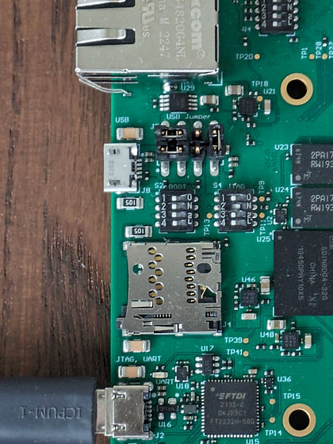

# Create a Versal boot image and launch PLM on hardware

Once you’ve created a PLM elf ([<u><span>with XSCT</span></u>](https://www.centennialsoftwaresolutions.com/post/create-a-versal-plm-project-and-build-it) or [<u><span>with Vitis</span></u>](https://www.centennialsoftwaresolutions.com/post/create-a-versal-plm-project-and-built-it-with-vitis-classic)), the next step is to create a boot image from it, and then boot it on hardware (using JTAG in this example).

In this post, we’ll use the Trenz TE0950 board as the target hardware, though the same instructions will work for a VCK190 or other Versal board as long as you have the prerequisite images (PDI and PSM firmware).

Trenz distributes a pre-built hello world boot image for the TE0950. This image contains a baremetal program that continually prints hello onto serial. It includes a pre-built PDI, PLM, PSM firmware, and a baremetal hello program for A72 [#0](https://www.centennialsoftwaresolutions.com/blog/hashtags/0).

We will create a new boot image with those pre-built components and our own PLM. If you’re doing this on another board, you’ll only need the PDI, PSM firmware, and the PLM you built. The baremetal program for the A72 is not required.

For the TE0950, download their reference design package from https://shop.trenz-electronic.de/Download/?path=Trenz_Electronic/Development_Boards/TE0950/Reference_Design/2023.2/test_board. Use the “TE0950-test_board-vivado_2023.2-build_4_20240118225059.zip” file (238 MB). Unzip it to get a "test_board" folder.

Create a new folder for the boot image creation:

```
mkdir bootimage
cd bootimage
```

Create the boot image definition file:

```
vim boot.bif

Contents:

the_ROM_image:
{
  image
  {
    { type=bootimage, file=pdi.pdi }
    { type=bootloader, file=plm.elf }
    { core=psm, file=psmfw.elf }
  }
  image
  {
    id = 0x1c000000, name=apu_subsystem
    { core = a72-0, file=hello_a72.elf }
  }
}
```

If you don’t have a baremetal A72 program, leave the second "image {}" block out of the boot.bif.

Copy over the files required to build the boot image

Copy the TE0950 pre-built files from its "test\_board" folder to this folder (note – for early TE0950 revisions with ES silicon, you may need to use the 23\_1lse\_8gb\_es1 folder instead):

```
cp ../test_board/prebuilt/hardware/23_1lse_8gb/test_board_23_1lse_8gb.pdi pdi.pdi
cp ../test_board/prebuilt/software/23_1lse_8gb/psmfw.elf .
cp ../test_board/prebuilt/software/23_1lse_8gb/hello_te0950.elf hello_a72.elf
```

Also copy your own plm.elf into this folder.

```
$ ls
=&gt; pdi.pdi   plm.elf   psmfw.elf   hello_a72.elf
```

Build the boot image:

```
source /tools/Xilinx/Vitis/2023.2/settings64.sh
bootgen -arch versal -image boot.bif -w -o BOOT.BIN<span>=&gt; [INFO] &nbsp;&nbsp;: Bootimage generated successfully
```

The file BOOT.BIN now exists

Ensure your board is in JTAG boot mode – here’s what the dip switch configuration should look like on a TE0950: S2 BOOT has all pins to the left, S1 JTAG has all pins except [#2](https://www.centennialsoftwaresolutions.com/blog/hashtags/2) to the left.



Finally, program it to the device.

```
xsct
% &lt;connect to hw_server&gt;
% targets 1 (select 1 &nbsp;Versal xcve2302)
% rst -system (needed if not a cold boot)
% device program BOOT.BIN
```

In the serial port, the device boots through your PLM (including printing the “This is my custom PLM” message added in the last post), and the baremetal A72 program (if provided) starts executing.

References:

https://xilinx-wiki.atlassian.net/wiki/spaces/A/pages/2037088327/Versal+Platform+Loader+and+Manager

Header image from https://www.xilinx.com/products/silicon-devices/acap/versal-ai-core.html#video