# Create a ZC706 Vivado Project

This post lists the steps to create a Vivado project for a ZC706 and to check the version of the ZC706 you're using.

**<u>Versions Used</u>**

-   Vivado 2018.2
    
-   ZC706 Rev 2.0 Board
    

**<u>Steps</u>**

Step 1: Create a directory called **c:\\vivprjs**

Step 2: Launch **Vivado 2018.2**

Step 3: Click **Create Project**

Step 4: At the **Create a New Vivado Project** click **Next >**

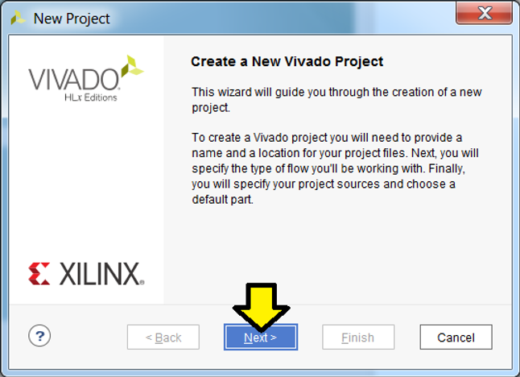

Step 5:

A) Use **Project name: vhdl1**

B) Use **Project location: c:/vivadoprjs.**

C) Leave the **Create project subdirectory** check-box **checked**.

D) The wizard page should list: **Project will be created at: C:/vivadoprjs/vhdl1.**

E) Click **Next >**

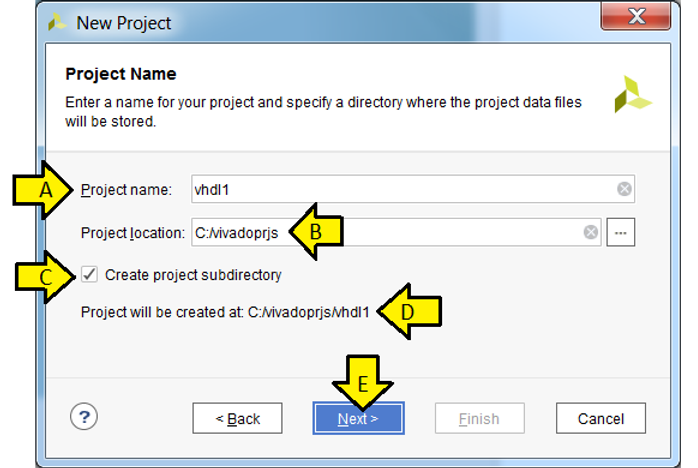

Step 6:

A) Leave **RTL Project selected**

B) Leave **Do not specify sources at this time checked**

C) Click **Next >**

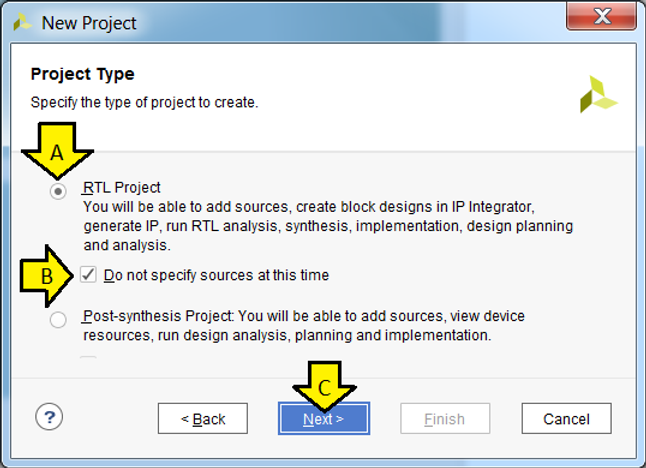

Step 7:

A) Click **Boards**

B) Select [**xilinx.com**](http://xilinx.com/) 

C) Select **Latest**

D) Type **ZC706**

E) Click on the **ZYNQ-7 ZC706 Evaluation Board box** to select the ZYNQ-7 ZC706

F) Click **Next >**

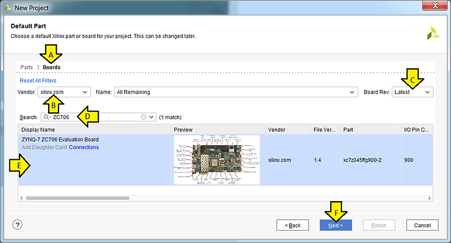

Note on **Board Rev**:

You should ensure that the Board Rev listed on the board (see \[[<u>link</u>](https://www.xilinx.com/support/answers/62325.html)\] to answer **How can I determine what Board Revision I am using?**). On the 2.0 version of the ZC706 board the rev number is here:

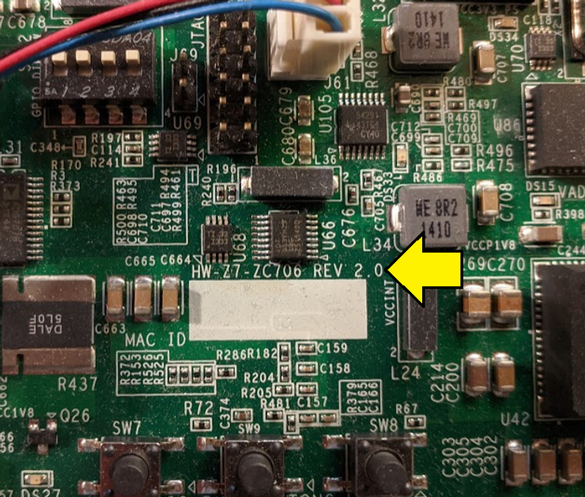

You'll notice that we only have **Version 1.4** available. From \[[<u>link</u>](https://www.xilinx.com/products/boards-and-kits/ek-z7-zc706-g.html#documentation)\] you can download the UCF and XDC files:

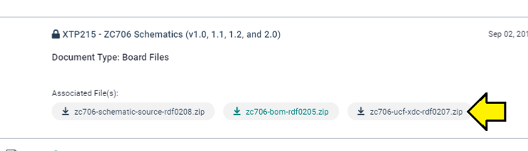

In this archive it says in the **readme.txt:**

**"**No XDC or UCF changes from Revision 1.0 through Revision 2.0.**"**

So the fact that it only lists 1.4 is not a problem since the XDC and UCF files are what change when you update the version.

Here are some pictures of the rest of the columns:

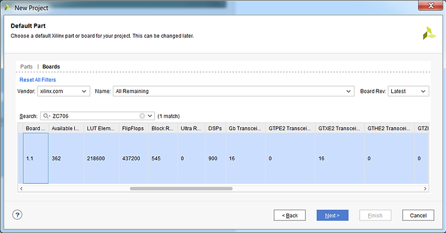

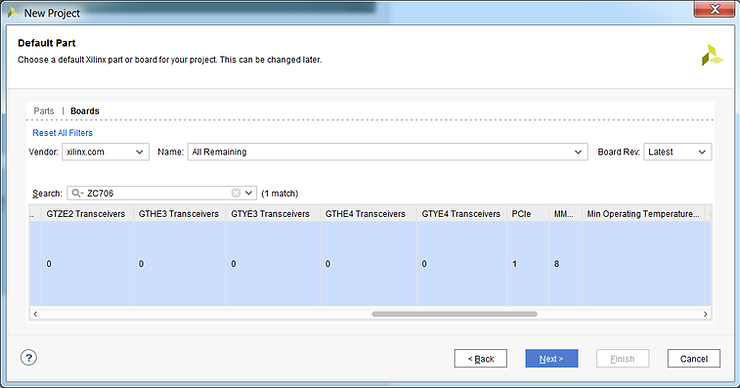

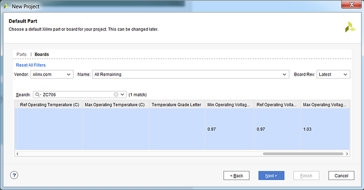

Step 8: Click **Finish** on the **New Project Summary** page

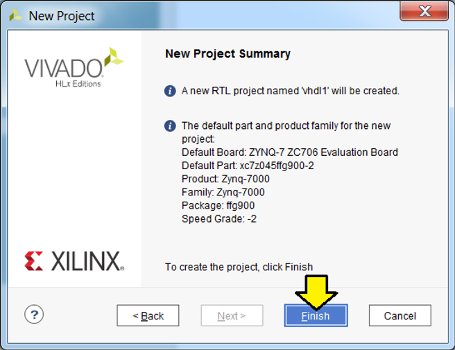

You should see:

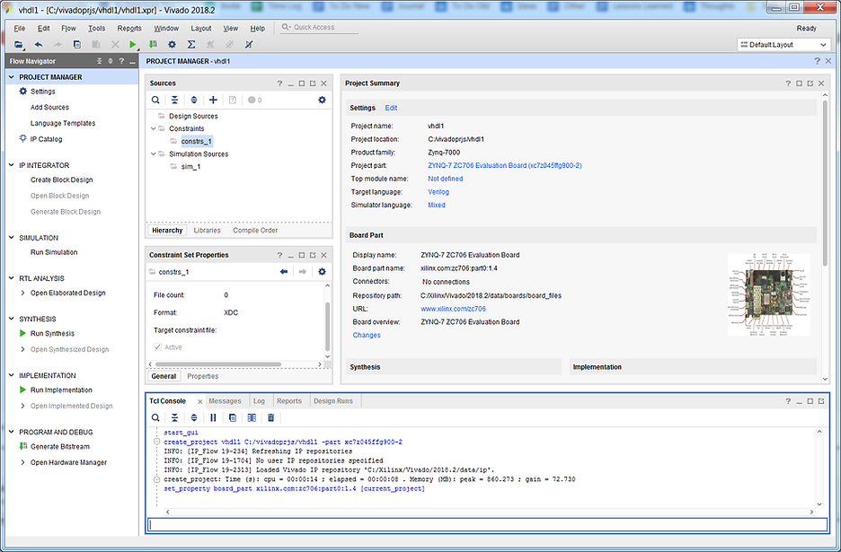

**<u>Reference</u>**

Xilinx logo from https://twitter.com/xilinxinc