# Create a ZCU102 PS in Vivado 2019.1

This post shows how to create a ZCU102 PS (Processor Subsystem) in Vivado 2019.1 that allows you to "run code" on the Zynq UltraScale+ MPSoC.

**<u>Steps</u>**

Step [#1](https://www.centennialsoftwaresolutions.com/blog/hashtags/1): Install Vivado 2019.1 with the SDK option

Follow the steps at \[[<u>link</u>](https://www.centennialsoftwaresolutions.com/post/install-the-2019-1-vivado-hl-design-edition-and-xilinx-sdk)\]

Step [#2](https://www.centennialsoftwaresolutions.com/blog/hashtags/2): Start Vivado

On Windows 7: (A) click **Start**, (B) click **All Programs**

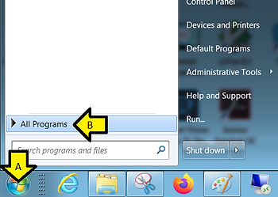

(C) click **Xilinx Design Tools**, (D) click **Vivado 2019.1**, and (E) click **Vivado 2019.1**

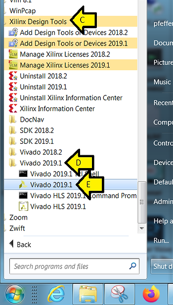

Step [#3](https://www.centennialsoftwaresolutions.com/blog/hashtags/3): Click **Create Project**

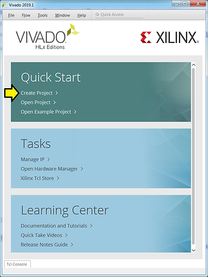

Step [#4](https://www.centennialsoftwaresolutions.com/blog/hashtags/4): Click **Next >**

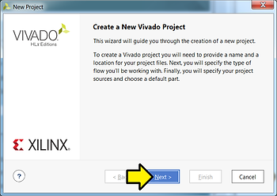

Step [#5](https://www.centennialsoftwaresolutions.com/blog/hashtags/5): Set the Project Name and Location

A) Project name: **ps**

B) Project location **C:/vivadoprjs**

C) Leave checked: **Create project subdirectory**

D) Click **Next >**

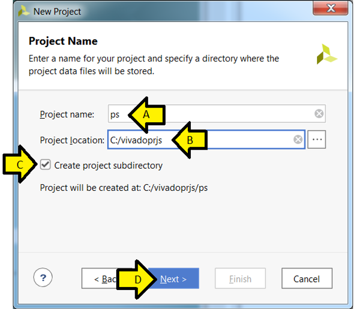

Step [#6](https://www.centennialsoftwaresolutions.com/blog/hashtags/6): Specify the Project Type

A) Leave **RTL Project** selected

B) Leave **Do not specify sources at this time** selected

C) Click **Next >**

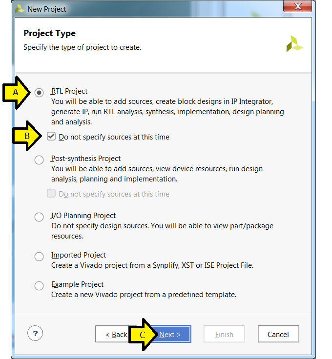

Step [#7](https://www.centennialsoftwaresolutions.com/blog/hashtags/7): Specify the board

A) Click **Boards**

B) Type **ZCU102**

C) Click inside the **Zynq UltraScale+ ZCU102 Evaluation Board** box (so it turns blue)

D) Click **Next >**

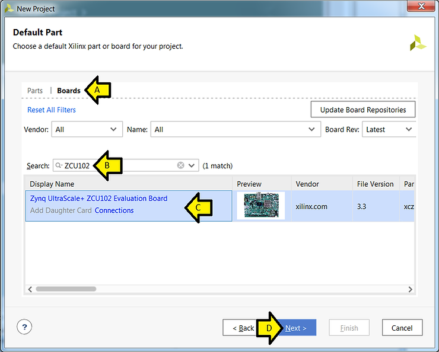

Step [#8](https://www.centennialsoftwaresolutions.com/blog/hashtags/8): Click **Finish**

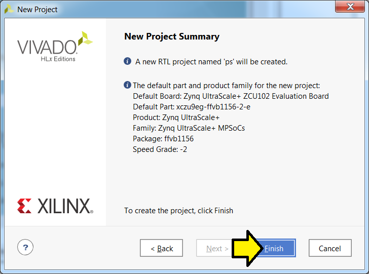

Note: Here is the text of this window:

The default part and product family for the new project:
Default Board: Zynq UltraScale+ ZCU102 Evaluation Board
Default Part: xczu9eg-ffvb1156-2-e
Product: Zynq UltraScale+
Family: Zynq UltraScale+ MPSoCs
Package: ffvb1156 
Speed Grade: -2

_Related docs_: See \[[<u>link</u>](https://www.xilinx.com/support/documentation/user_guides/ug1075-zynq-ultrascale-pkg-pinout.pdf#page128)\] for package info, see \[[<u>link</u>](https://www.xilinx.com/support/documentation/selection-guides/zynq-ultrascale-plus-product-selection-guide.pdf#page=6)\] for part selection

Step [#9](https://www.centennialsoftwaresolutions.com/blog/hashtags/9): Create a Block Design

A) Click **Create Block Design**

B) Use default Design name: **design\_1**

C) Click **OK**

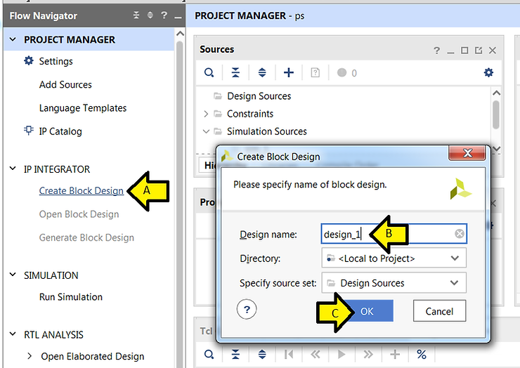

Step [#10](https://www.centennialsoftwaresolutions.com/blog/hashtags/10): Add the Zynq UltraScale+ MPSoC to the Block Design

A) Click **+**

B) Type **zynq**

C) Double-click **Zynq UltraScale+ MPSoC**

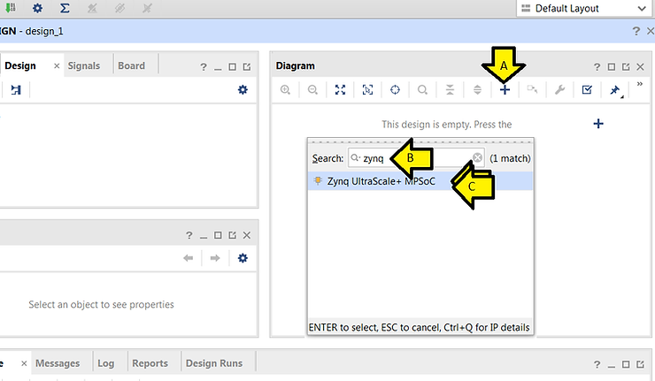

Step [#11](https://www.centennialsoftwaresolutions.com/blog/hashtags/11): Click Run Block Automation

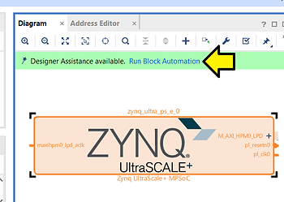

Step [#12](https://www.centennialsoftwaresolutions.com/blog/hashtags/12): 

A) Leave **All Automation** and **zynq\_ultra\_ps\_e\_0** checked

B) Leave **Apply Board Preset** checked

C) Click **OK**

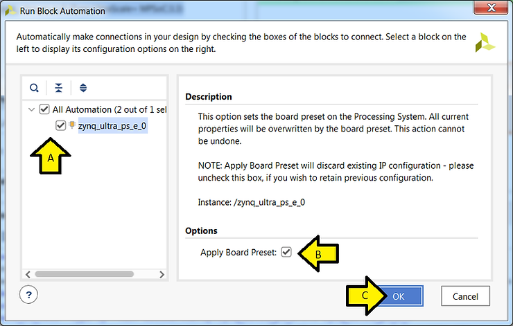

Step [#13](https://www.centennialsoftwaresolutions.com/blog/hashtags/13): 

A) Double click the **Zynq UltraScale+ MPSoC** block

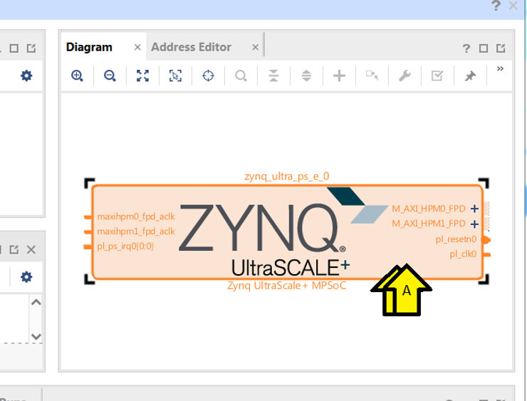

B) Click **PS-PL Configuration**

C) Expand **PS-PL Interfaces**

D) Expand **Master Interface**

E) Uncheck **AXI HPM0 FPD**

F) Uncheck **AXI HPM1 FPD**

G) Click **OK**

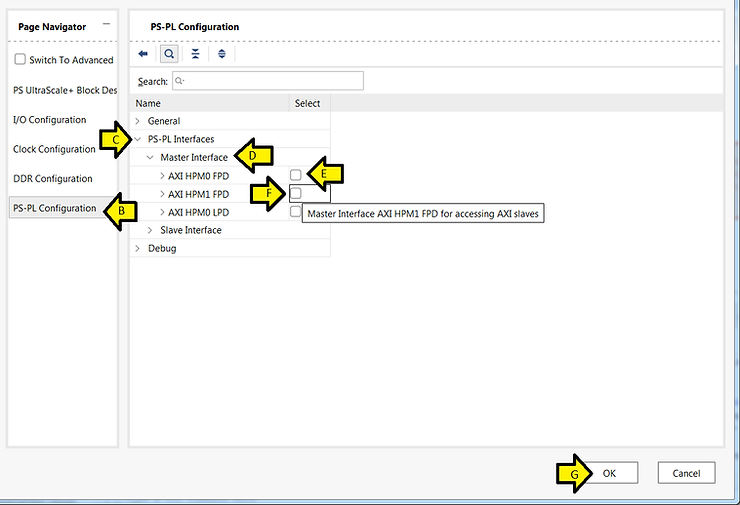

Step [#14](https://www.centennialsoftwaresolutions.com/blog/hashtags/14): Create an HDL Wrapper

A) Right-click **design\_1 (design\_1.bd)**

B) Click **Create HDL Wrapper...**

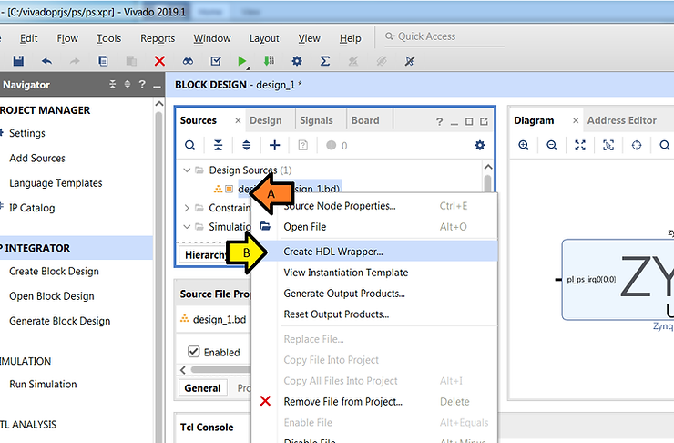

C) Leave **Let Vivado manage wrapper and auto-update** selected

D) Click **OK**

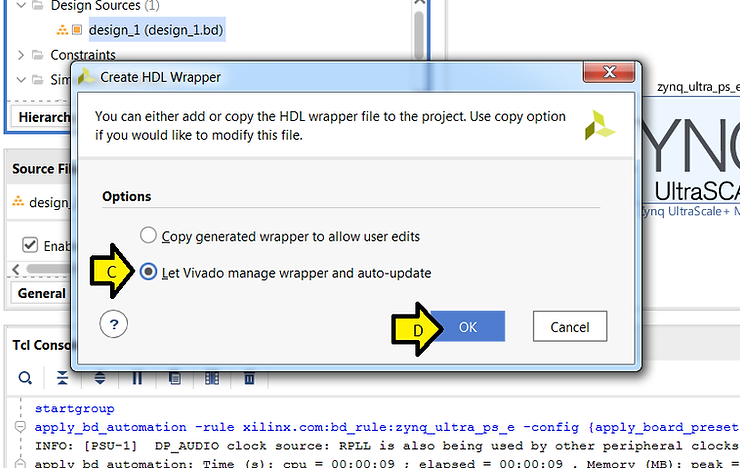

Step [#15](https://www.centennialsoftwaresolutions.com/blog/hashtags/15): Generate Output Products

A) Expand **design\_1\_wrapper (design\_1)wrapper.v) (1)**

B) Right-click **design\_1\_i : design\_1 (design\_1.bd) (1)**

C) Click **Generate Output Products...**

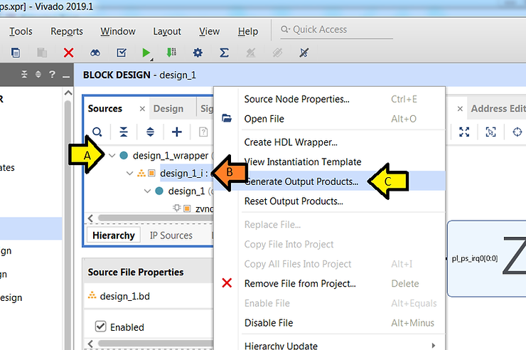

D) Click **Generate**

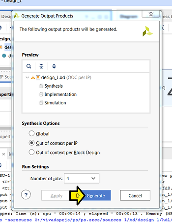

You should see:

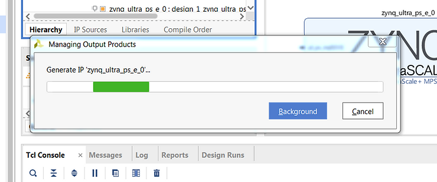

E) Observe Generate Output Products status

F) Click OK

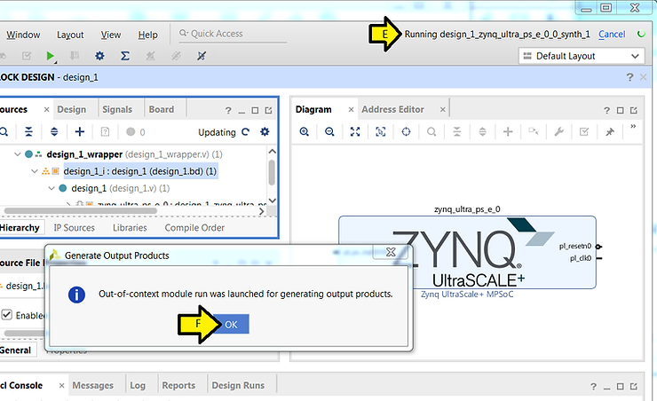

G) Wait until the status says **Ready**

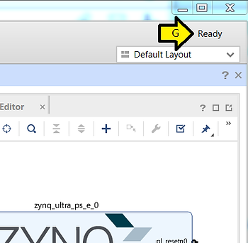

Step [#16](https://www.centennialsoftwaresolutions.com/blog/hashtags/16): Export the hardware to the SDK

A) Click **File**

B) Click **Export**

C) Click **Export Hardware...**

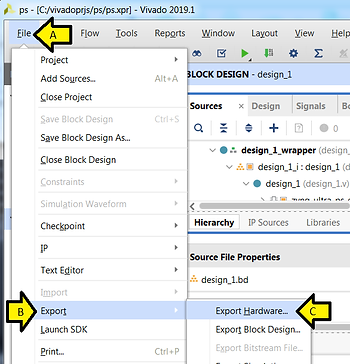

D) Leave **Include bitstream** unchecked

E) Click **OK**

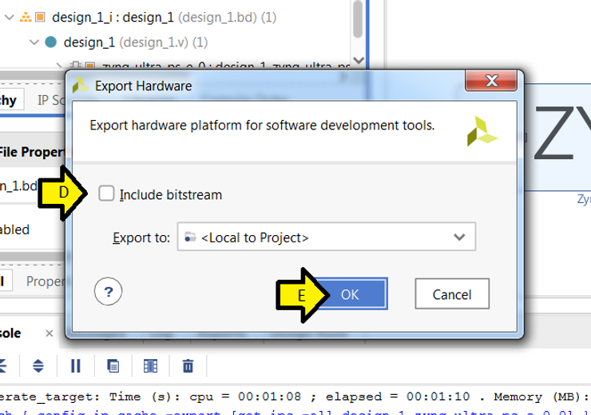

Step [#17](https://www.centennialsoftwaresolutions.com/blog/hashtags/17): Launch the SDK

A) Click **File**

B) Click **Launch SDK**

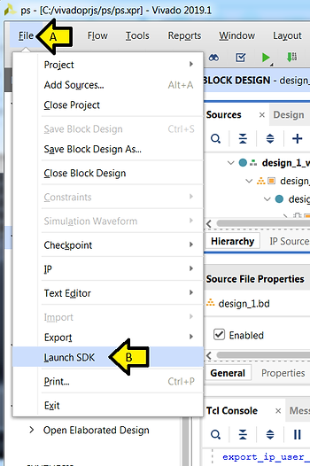

C) Click **OK**

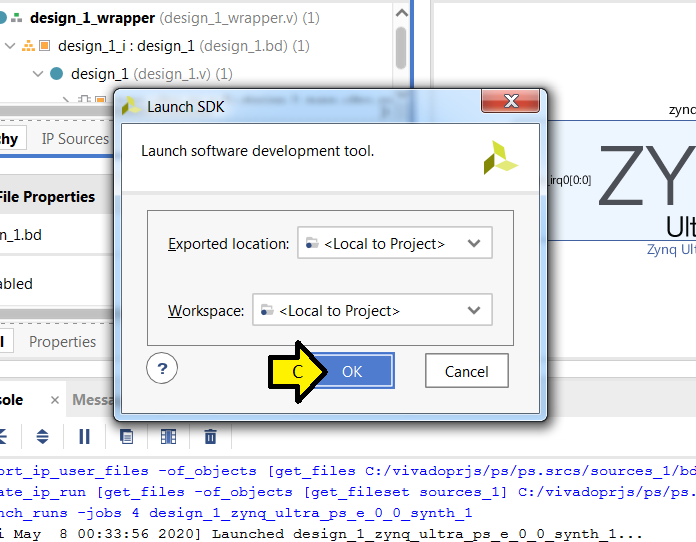

You should see:

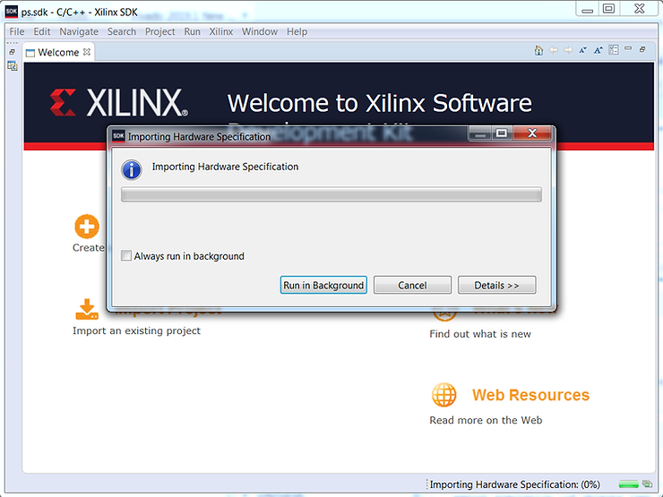

Followed by:

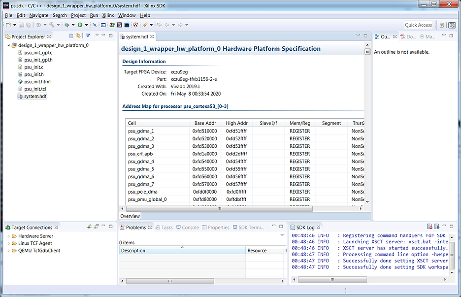

**<u>References</u>**

-   Zynq UltraScale+ MPSoC: Embedded Design Tutorial (UG1209) @ \[[link](https://www.xilinx.com/support/documentation/sw_manuals/xilinx2019_1/ug1209-embedded-design-tutorial.pdf)\]
    
-   Xilinx logo found via \[[link](https://twitter.com/xilinxinc)\]