# Create an Android Project and Run the Project with Android Studio

This post runs through the online guides from Google to **Create an Android project** and **Run your app**.

**<u>Create an Android Project</u>**

1\. Start **Android Studio**

2\. (A) Click **File**, (B) **New** and (C) **New Project...**

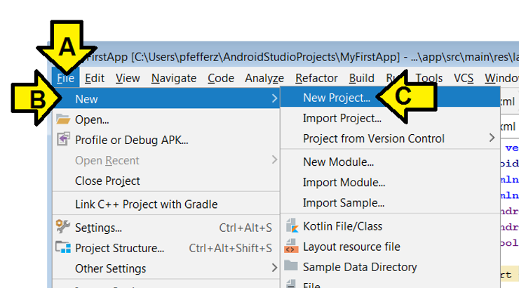

3\. Use:

Application name: **My First App**

Company domain: [**example.com**](http://example.com/)

...leave all other settings and click **Next**

4\. (A) Select **API 28: Android 9.0 (Pie)** and (B) click **Next**

5\. (A) Leave **Empty Activity** selected and (B) click **Next**

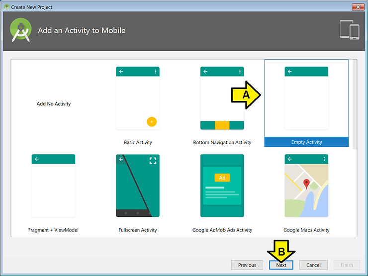

6\. Leave the settings in the **Configure Activity** screen and click **Next**

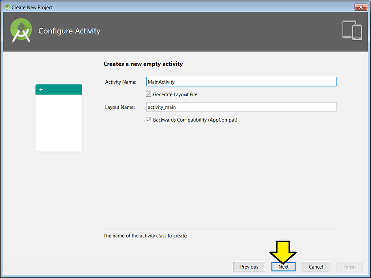

7\. Click **Finish**

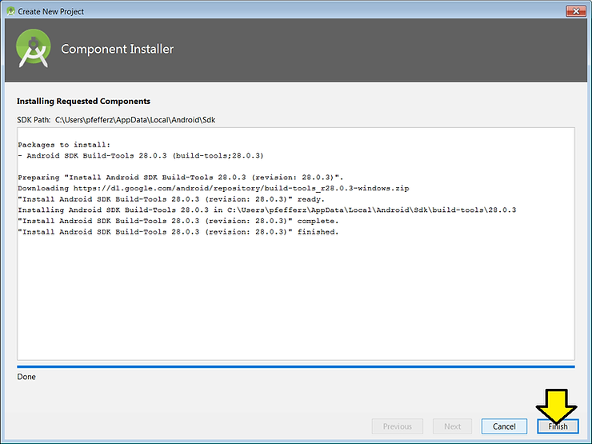

You'll see some processing:

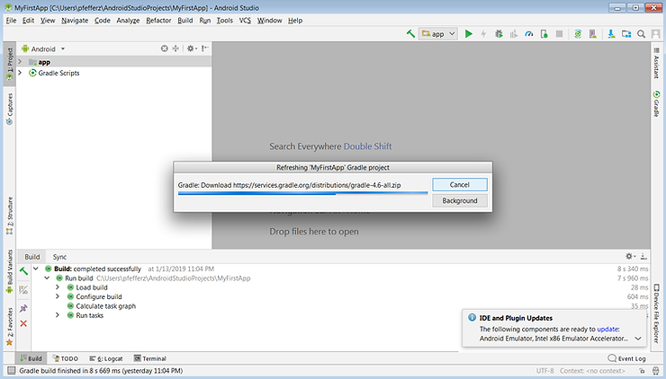

...and

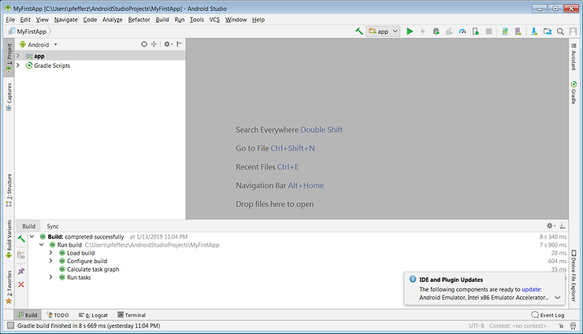

8\. (A) Click **View**, (B) click **Tool Windows** and (C) click **Project** (or press Alt+1)

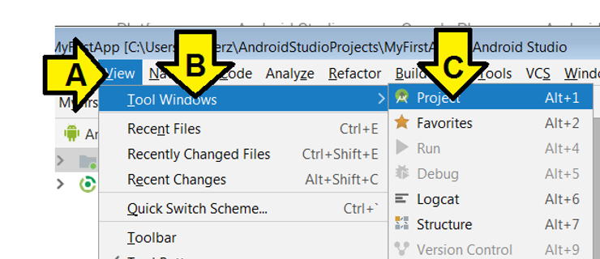

9\. Find **app > manifests > AndroidManifest.xml**

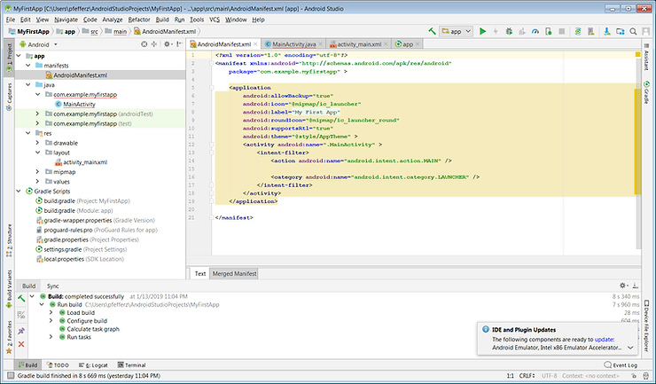

10\. Find **app > java > com.example.myfirstapp > MainActivity**

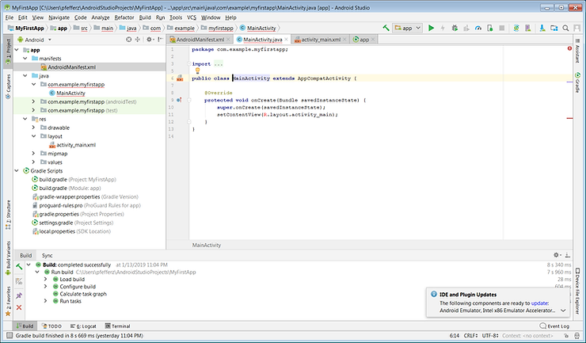

11\. Find **app > res > layout > activity\_main.xml**

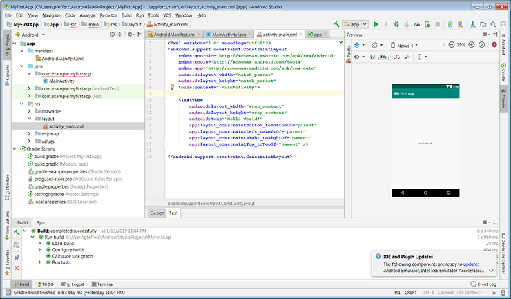

12\. Find **Gradle Scripts > build.gradle (Module: app)**

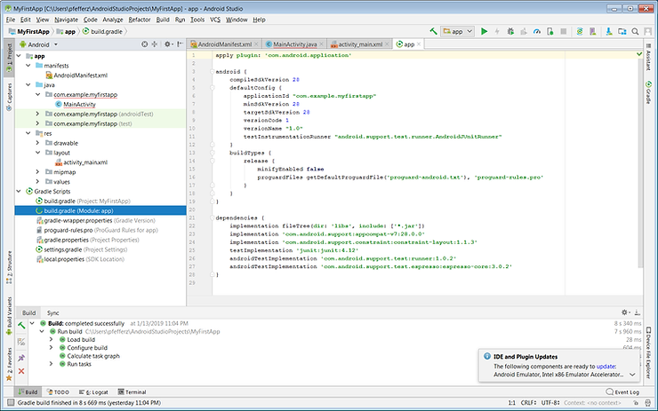

**<u>Run the App on an Emulator</u>**

1\. (A) Click **Run** then (B) click **Run 'app'**

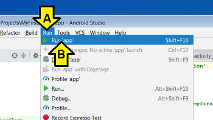

2\. Click **Create New Virtual Device**

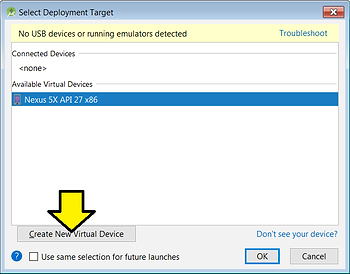

3\. (A) Click **Pixel** and (B) **Next**

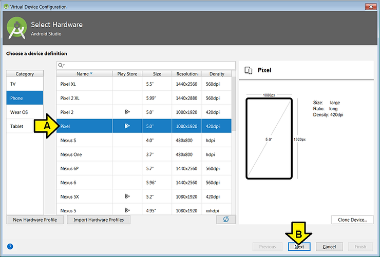

4\. Click **Download** by Pie

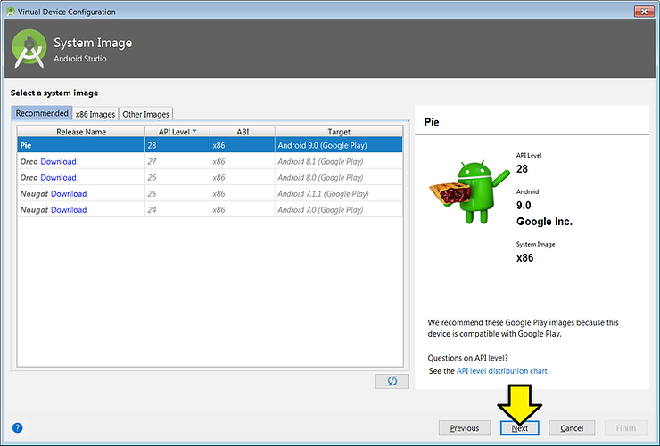

You'll see:

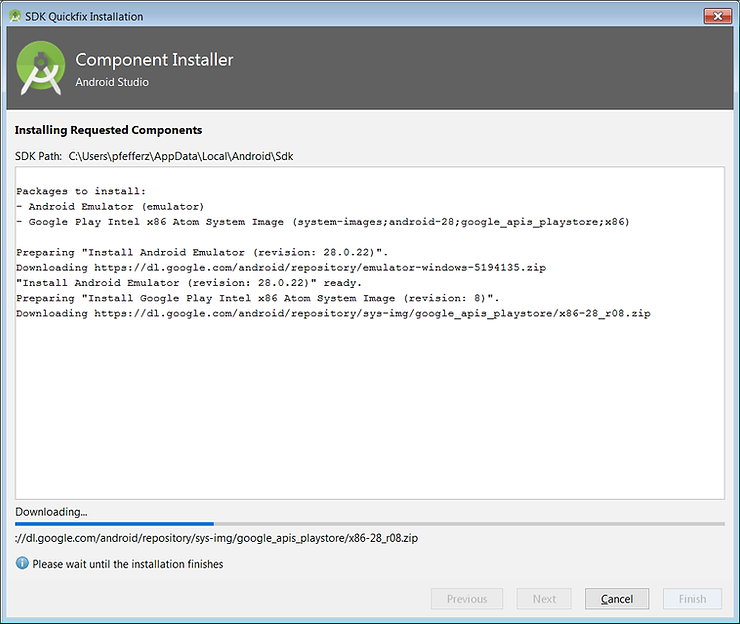

5\. Click **Finish**

6\. Click **Next**

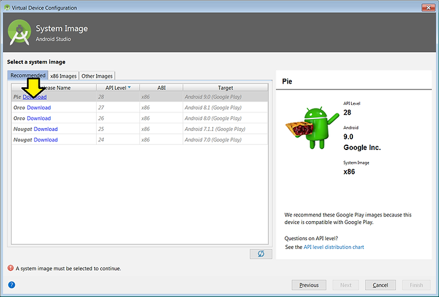

7\. Leave the defaults and click **Finish**

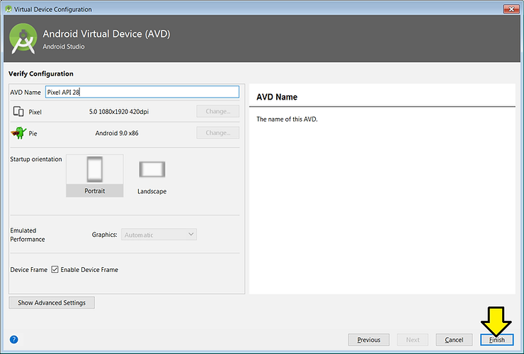

8\. With **Pixel API 28** selected click **OK**

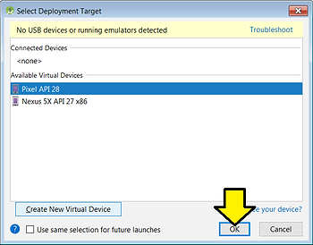

After a (long) bit you'll see:

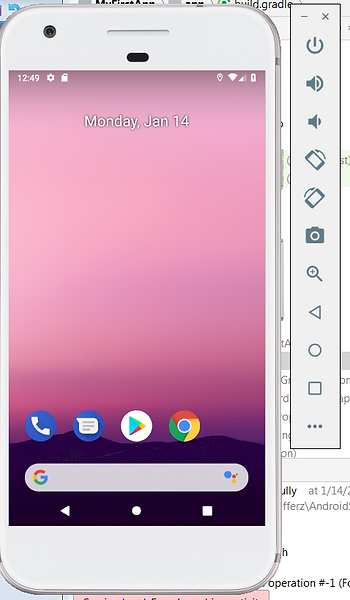

9\. Click, hold and pull up

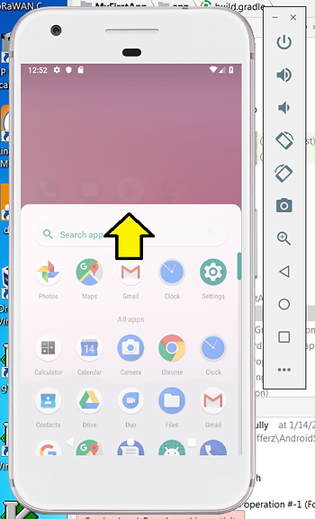

10\. Click on **My First A...**

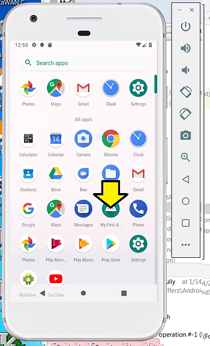

After some time you'll see:

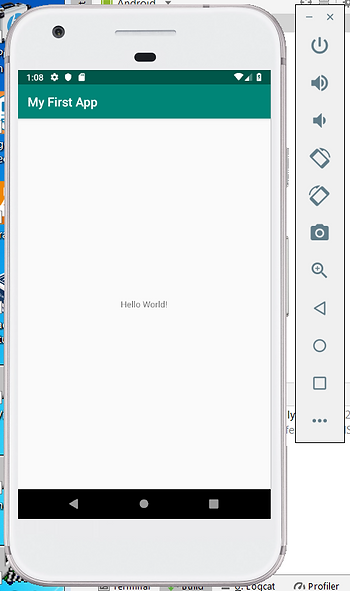

**<u>References</u>**

-   Create an Android project at \[[<u>link</u>](https://developer.android.com/training/basics/firstapp/creating-project)\]
    
-   Run on an emulator at \[[<u>link</u>](https://developer.android.com/training/basics/firstapp/running-app)\]
    
-   Android Studio icon from \[[<u>link</u>](https://upload.wikimedia.org/wikipedia/commons/thumb/3/34/Android_Studio_icon.svg/500px-Android_Studio_icon.svg.png)\]