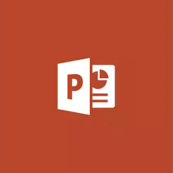
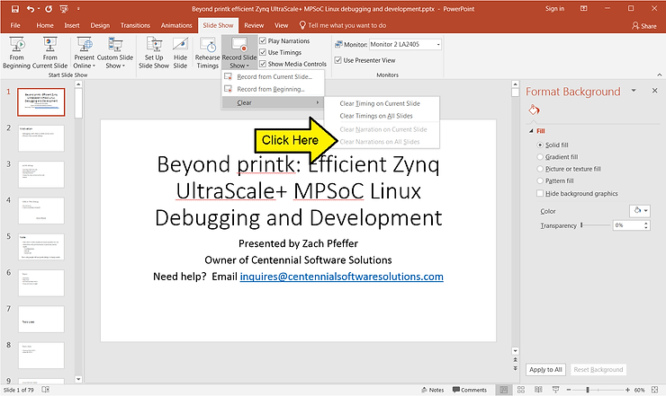

# Delete narration on all slides

This post shows how to delete narrations on all slides in Power Point 2016.

**Click on Slide Show > Record Slide Show > Clear and Clear Narrations on All Slides**

**Reference**

-   Power Point logo from screen shot at [microsoft.com](http://www.microsoft.com/en-us/p/powerpoint-2016/cfq7ttc0k5ct?activetab=pivot%3aoverviewtab)
    
-   "Remove the audio narration from a PowerPoint presentation" answer posted on [superuser](http://superuser.com/questions/462720/remove-the-audio-narration-from-a-powerpoint-presentation?utm_medium=organic&utm_source=google_rich_qa&utm_campaign=google_rich_qa)