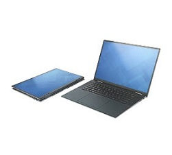

# Dell Inspiron 16 7620 2-in-1 Docs

This post links to Dell Inspiron 16 7620 2-in-1 docs in their location as of 2024-04-19 and a saved version. It was explicitly item number 210-BDFG. It also contains the price paid and a table of specifications. 

###### Docs

| **Doc**                                | **Original Link**                                            | **Saved Link**                                               |
| -------------------------------------- | ------------------------------------------------------------ | ------------------------------------------------------------ |
| Specifications                         |                                                              | [Saved](https://drive.google.com/file/d/1sk5PYj52bEHi_HlWdHEj9DhuCnD_0210/view?usp=sharing) |
| Usage and Troubleshooting Guide        | [Original](https://www.dell.com/support/kbdoc/en-us/article/lkbprint?ArticleNumber=000199145&AccessLevel=10&Lang=en) | [Saved](https://drive.google.com/file/d/1skLmPnMqdsTDo-wfjg1LfaTbZxdaS4AD/view?usp=sharing) |
| Drivers & Downloads                    | [Original](https://www.dell.com/support/home/en-us/product-support/product/inspiron-16-7620-2-in-1-laptop/drivers) |                                                              |
| Service Manual                         | [Original](https://dl.dell.com/content/manual16923540-inspiron-16-7620-2-in-1-service-manual.pdf?language=en-us) | [Saved](https://drive.google.com/file/d/1spiKB2Kg02pT5jWkJqtYvqaOZisz2-o9/view?usp=sharing) |
| Setup and Specifications               | [Original](https://dl.dell.com/content/manual17399228-inspiron-16-7620-2-in-1-setup-and-specifications.pdf?language=en-us) | [Saved](https://drive.google.com/file/d/1stY53J_rPVCq7pL9naAClPTyQCmDr3JP/view?usp=sharing) |
| Dell Active Pen PN5122W Support Center | [Original](https://www.dell.com/support/kbdoc/en-us/000197317/dell-active-pen-pn5122w-support-center) | [Saved](https://drive.google.com/file/d/1t00dgSpvq-QFJpzibgne2maGnDWpuVnm/view?usp=sharing) |
| Invoice                                |                                                              | [Saved](https://drive.google.com/file/d/1t1DjoguVoBtj5pfB0B1YCDjQsIPW29E3/view?usp=sharing) |

###### Price

Price on 2024-08-22: **$1,690.97**

###### Specifications

| **Component**                                     | **Specification**                                            | **Item number** |
| ------------------------------------------------- | ------------------------------------------------------------ | --------------- |
| Cable                                             | US Power Cord                                                | 470-AACI        |
| Color Choice                                      | Dark Green                                                   | 320-BESJ        |
| Display                                           | 16.0-inch 16:10 OLED UHD+ (3840 x 2400) Touch 400nits WVA Display with ComfortView Plus Support | 391-BGIU        |
| Documentation/Disks                               | Documentation, English/French w/ QR Code                     | 340-CYGC        |
| Driver                                            | Wireless Driver for AX201/AX211                              | 555-BHST        |
| Extended Battery Service                          | Extended Battery Service for Years 2 and 3 of System Life    | 818-3261        |
| FGA Module                                        | Fixed Hardware Configuration                                 | 998-FKVZ        |
| Hard Drive                                        | 512GB M.2 PCIe NVMe Solid State Drive                        | 400-BNGR        |
| Keyboard                                          | Carbon Black Backlit,FPR Kybd, English                       | 583-BIXX        |
| Label                                             | Regulatory Label                                             | 389-EDKO        |
| Labels                                            | English Palmrest Label                                       | 389-EDKS        |
| Memory                                            | 16GB, 2x8GB, DDR4, 3200MHz                                   | 370-AGHJ        |
| Microsoft Application Software                    | Office Home & Student 2021                                   | 630-ABLS        |
| Miscellaneous                                     | Get 6 mos of The Disney Bundle. Details emailed once qualifying order ships, Exp 12/31/22 | 800-BBUJ        |
| Non-Microsoft Application Software                | Additional Software                                          | 658-BCUN        |
|                                                   | Dell Cinema Color                                            | 658-BDZU        |
|                                                   | Amazon Alexa App                                             | 658-BETL        |
| Operating System                                  | Windows 11 Home, English                                     | 619-APTK        |
| Packaging                                         | Shipping Material                                            | 328-BEVB        |
| Packaging Label                                   | Retail Print On Demand Label                                 | 389-BIVH        |
| Photo & Video Editing Solutions                   | Adobe Photoshop Elements 2022 & Premiere Elements 2022 Bundle | 634-BZDI        |
| Power Supply                                      | 65W Type-C EPEAT Adapter                                     | 450-ALKH        |
| Primary Battery                                   | 6-Cell Battery, 87WHr (Integrated)                           | 451-BCWS        |
| Processor                                         | 12th Generation Intel(R) Core(TM) i7-1260P Processor (18MB Cache, up to 4.7GHz) | 338-CDGD        |
| Processor Branding                                | Intel(R) Core(TM) i7 non-vPro Processor Label                | 389-DXDV        |
| Protect your purchase - View Support offers below | Premium Support Plus: Onsite Service after Remote Diagnosis, 1 Year | 814-7217        |
|                                                   | Premium Support Plus: Accidental Damage Service, 4 Years     | 814-7233        |
|                                                   | Premium Support Plus: Onsite Service after Remote Diagnosis, 3 Years Extended | 814-7234        |
|                                                   | Premium Support Plus: 7x24 Technical Support, 4 Years        | 814-7237        |
|                                                   | Dell Limited Hardware Warranty Extended Year(s)              | 975-3461        |
|                                                   | Dell Limited Hardware Warranty Initial Year                  | 804-9418        |
| Retail Information                                | Return Label                                                 | 811-BBBC        |
|                                                   | Dell Active Pen - PN5122W                                    | 750-ADQI        |
| Security Software                                 | McAfee LiveSafe Consumer 12 Month Subscription               | 525-0033        |
|                                                   | McAfee(R) 30day Trial                                        | 658-BCCO        |
| Systems Management                                | Energy Star Label                                            | 389-DOVG        |
|                                                   | System driver for Windows                                    | 631-ADJI        |
| Video Card                                        | [NVIDIA(R) GeForce(R) MX550 with 2GB GDDR6 graphics memory](https://www.nvidia.com/en-us/geforce/gaming-laptops/mx-550/) | 490-BHOZ        |
| Wireless                                          | Intel(R) Wi-Fi 6E (6GHz) AX211 2x2 Bluetooth 5.2 Wireless Card | 555-BHGR        |

###### Benchmark

https://www.videocardbenchmark.net/video_lookup.php?gpu=GeForce+MX550&id=4493

###### GeForce MX550 Specs

| Technology                        | Version Supported |
| --------------------------------- | ----------------- |
| Memory Interface support          | GDDR6             |
| NVIDIA® Optimus® support          | Yes               |
| NVIDIA GPU Boost™ support         | Yes               |
| NVIDIA Game Ready Drivers support | Yes               |
| PCI Express 4.0 support           | Yes               |
| Microsoft DirectX 12              | Yes               |
| Vulkan API                        | 1.2               |
| OpenGL Support                    | 4.6               |
| OpenCL Support                    | 3.0               |
| Windows 10 and 11 support         | Yes               |

###### Technologies

- [NVIDIA® Optimus® technology](https://www.nvidia.com/en-us/geforce/technologies/optimus/)
- [NVIDIA GPU Boost™](https://www.nvidia.com/en-us/geforce/technologies/gpu-boost/)
- [NVIDIA® Game Ready Drivers](https://www.nvidia.com/en-us/geforce/drivers/)
- [NVIDIA® CUDA® technology](https://developer.nvidia.com/cuda-zone)
- [PCI Express 4.0](https://www.intel.com/content/www/us/en/gaming/resources/what-is-pcie-4-and-why-does-it-matter.html)
- [Microsoft DirectX® 12](https://www.nvidia.com/en-us/geforce/technologies/dx12/)
- [Vulkan 1.2 support](https://registry.khronos.org/vulkan/specs/1.2-extensions/html/vkspec.html)
- [OpenGL 4.6 support](https://registry.khronos.org/OpenGL/specs/gl/glspec46.core.pdf)
- [OpenCL™ 3.0 support](https://registry.khronos.org/OpenCL/sdk/3.0/docs/man/html/)