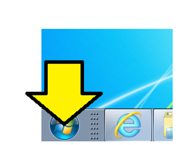
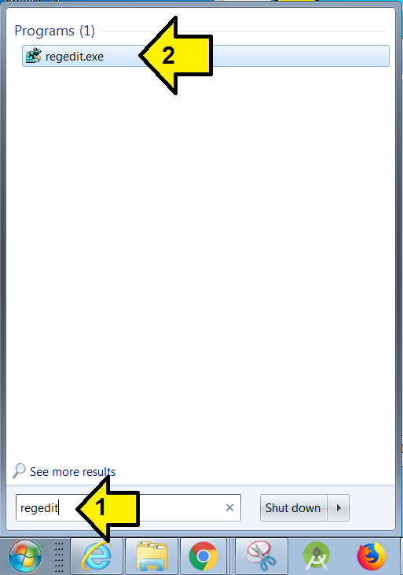
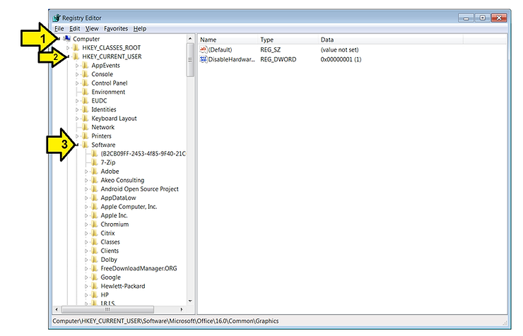
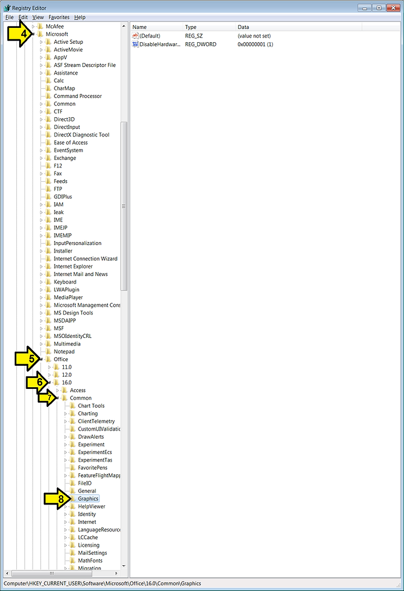
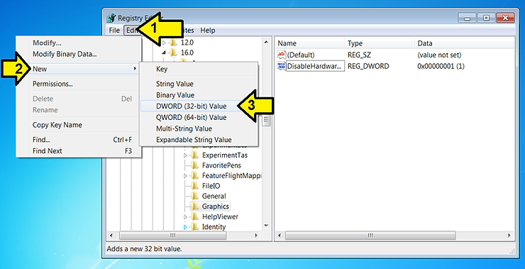
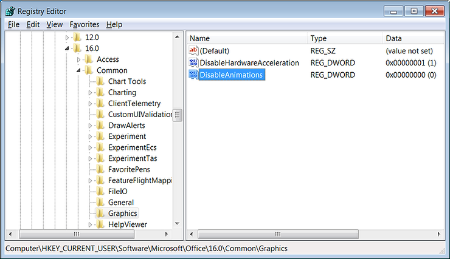
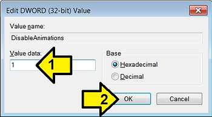

# Disable Cursor and Cell Movement Animations in Word and Excel

This post describes a method shared by an intrepid reader who did not want there name listed :) to disable Excel cell movement animations and cursor animations in Word.

It supersedes:

-   [http://www.zachpfeffer.com/single-post/2017/02/25/How-to-Disable-Animations-in-Excel-2016](http://www.zachpfeffer.com/single-post/2017/02/25/How-to-Disable-Animations-in-Excel-2016)
    
-   [http://www.zachpfeffer.com/single-post/A-Way-to-Disable-Cursor-Movement-Animation-in-Word-2016-by-Using-the-Windows-Classic-Theme](http://www.zachpfeffer.com/single-post/A-Way-to-Disable-Cursor-Movement-Animation-in-Word-2016-by-Using-the-Windows-Classic-Theme)
    

**Summary**

Add a DWORD called DisableAnimations set to 1 to Computer\\HKEY\_CURRENT\_USER\\Software\\Microsoft\\Office\\16.0\\Common\\Graphics using the Registry Editor

**Steps**

1\. Click **Start**

2\. (1) Type **regedit** and (2) click on **regedit.exe.** Click **yes** when Windows asks you to authorize running this program.

3\. (1) Expand **Computer**, (2) expand **HKEY\_CURRENT\_USER** and (3) expand **Software**

4\. Continue expanding: (4) **Microsoft**, (5) **Office**, (6) **16.0**, (7) **Common** and click on **Graphics**

5\. (1) click **Edit**, (2) **New** then (3) **DWORD (32-bit) Value**

6\. Name it **DisableAnimations**

7\. Double click on **DisableAnimations.** You'll get the window shown here. Enter 1 for **Value data**: and click **OK**

8\. Close regedit.

**Reference**

Word and Excel logos from [microsoft.com](http://www.microsoft.com/).