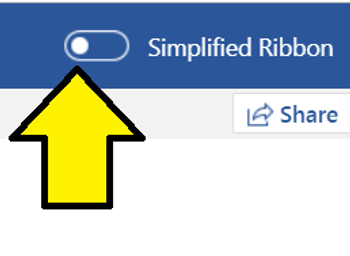
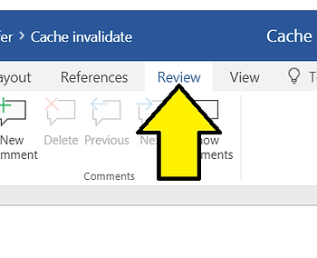
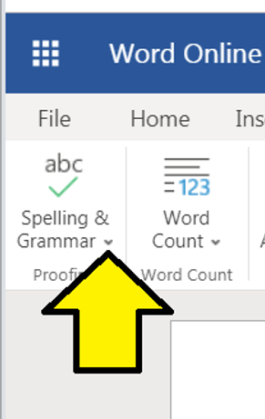
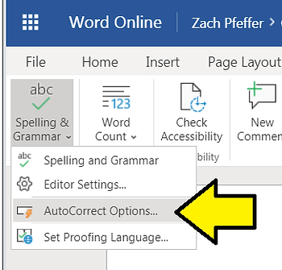
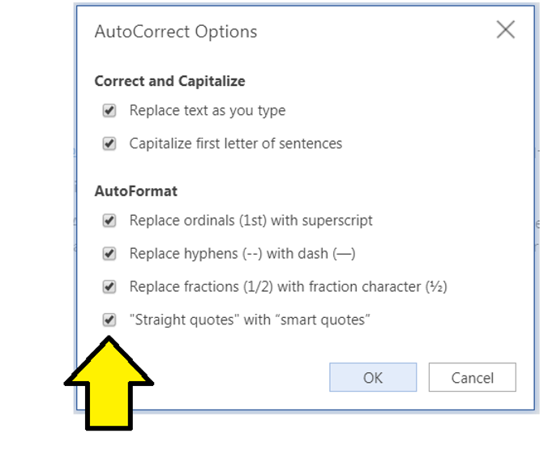

# Disable Smart Quotes in Word Online

This post shows how to disable smart quotes in Word Online.

Note: This post has been updated. Please see [https://www.zachpfeffer.com/single-post/2020/08/29/Turn-off-Curved-Quotes-in-Word-2016](http://www.zachpfeffer.com/single-post/2020/08/29/Turn-off-Curved-Quotes-in-Word-2016).

**Steps**

1\. Make sure the **Simplified Ribbon** is off by switching the slider to the left

2\. Click **Review**

3\. Click **Spelling & Grammar**

4\. Click **AutoCorrect Options...**

5\. Click the **"Straight quotes" with “smart quotes”** check box to get straight quotes

**References**

Word icon from \[[link](http://www.microsoft.com/en-us/store/d/word-2016/cfq7ttc0k5d7?activetab=pivot%3aoverviewtab)\].