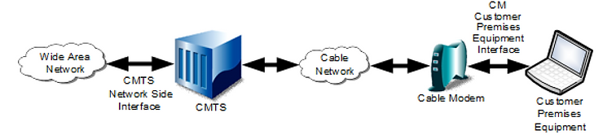
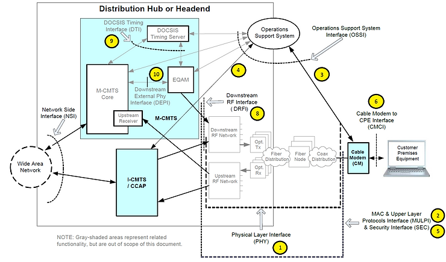

# DOCSIS 3.1 Series of Specification and Related Specifications

This post lists CableLabs links to each specification listed in Physical Layer Specification CM-SP-PHYv3.1-I17-190917. It also includes an specification annotated reference architecture.

1) SP-PHYv3.1 Physical Layer Specification [link][I17]
2) CM-SP-MULPIv3.1 MAC and Upper Layer Protocols Interface Specification [link][I20]
3) CM-SP-CM-OSSIv3.1 Cable Modem Operations Support System Interface Specification [link][I16]
4) CM-SP-CCAP-OSSIv3.1 CCAP Operations Support System Interface Specification [link][I17]
5) CM-SP-SECv3.1 Security Specification [link][I09]
6) CM-SP-CMCIv3.0 Cable Modem CPE Interface Specification [link][I03]

7) CM-SP-eDOCSIS eDOCSIS™ Specification [link][I30]
8) CM-SP-DRFI Downstream Radio Frequency Interface Specification [link][I16]
9) CM-SP-DTI DOCSIS Timing Interface Specification [link][I08]
10) CM-SP-DEPI Downstream External PHY Interface Specification [link][I14]

11) CM-SP-DSG DOCSIS Set-Top Gateway Interface Specification [link][I25]

12) CM-SP-ERMI Edge Resource Manager Interface Specification [link][C01]

13) CM-SP-L2VPN Layer 2 Virtual Private Networks Specification [link][I15]

14) CM-SP-TEI TDM Emulation Interfaces Specification [link][I06]

All specs zip \[[link](http://drive.google.com/open?id=1Hwqlhfnn3MRc-GGV9udNa9cZf-0-_6A6)\]

**References**

-   CableLabs icon from \[[link](http://twitter.com/cablelabs)\]
    
-   DOCSIS® 3.1 Physical Layer Specification CM-SP-PHYv3.1-I17-190917 \[[link](http://specification-search.cablelabs.com/CM-SP-PHYv3.1)\]