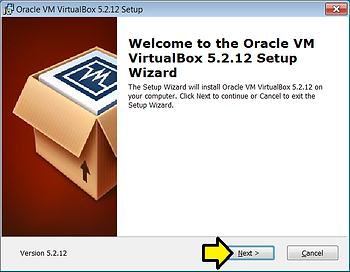
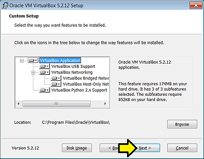
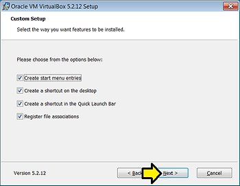
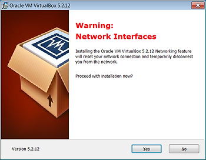
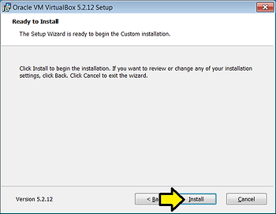
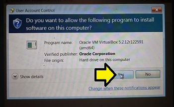
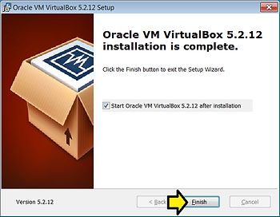
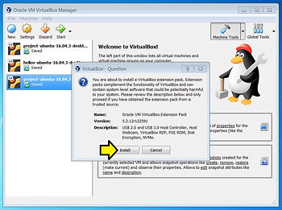
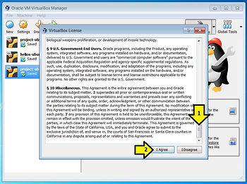
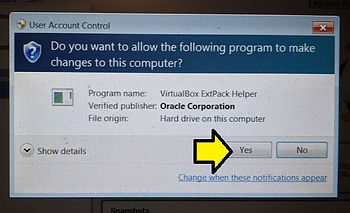

# Download and Install VirtualBox 5.2.12 and the VirtualBox Extension Pack on Windows 7 Pro SP1

This post shows you how to install VirtualBox 5.2.12 and the associated extension pack on Windows 7 Pro SP1.

**<u>Download</u>**

1\. Download VirtualBox 5.2.12 at \[[<u>link</u>](https://download.virtualbox.org/virtualbox/5.2.12/VirtualBox-5.2.12-122591-Win.exe)\] (109 MB)

2\. Download the VirtualBox extension pack for 5.2.12 at \[[<u>link</u>](https://download.virtualbox.org/virtualbox/5.2.12/Oracle_VM_VirtualBox_Extension_Pack-5.2.12.vbox-extpack)\] (19 MB)

**<u>Install VirtualBox</u>**

1\. Start installing VirtualBox by double clicking on the **VirtualBox-5.2.12-122591-Win.exe** file or click **Run**

2\. Click **Next >** on the **Oracle VM VirtualBox 5.2.12 Setup** screen

3\. Click **Next >** on the **Select the way you want features to be installed** page (accepting the defaults)

4\. Click **Next >** on the **Select the way you want features to be installed** page (accepting the defaults)

5\. Click Yes on the Warning: Network Interfaces screen

6\. Click **Install** on the **Read to Install** screen

7\. Click **Yes** on the **Do you want to allow the following program to install software on this computer** pop-up

8\. Click **Finish**

**<u>Install the Extension Pack</u>**

1\. Start installing the VirtualBox Extension Pack by double clicking on the **Oracle\_VM\_VirtualBox\_Extension\_Pack-5.2.12.vbox-extpack** file or click **Run** or click **Open**

2\. Click **Install** on the **VirtualBox - Question** pop up

3\. (1) Scroll down and (2) click **I Agree**

4\. Click **Yes** on the **Do you want to allow the following program to make changes to this computer?**

5\. Click **OK** on the **VirtualBox - Information** popup

**<u>Note</u>**

If you have existing VMs in **C:\\Users\\pfefferz\\VirtualBox VMs\\** VirtualBox will automatically populate them in the **Oracle VM VirtualBox Manager**.

**<u>Reference</u>**

VirtualBox logo from \[[<u>link</u>](https://linux.systeminside.net/como-instalar-y-configurar-virtualbox/)\]