# Edge AI Setup on ZCU102

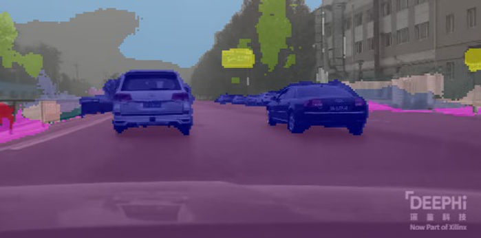

Here's a quick guide on how to get going with EdgeAI demos on the ZCU102 Xilinx evaluation board.

## Requirements

-   ZCU102 Xilinx Evaluation Kit, which can be purchased [<u><span>here</span></u>](https://www.xilinx.com/products/boards-and-kits/ek-u1-zcu102-g.html)
    
    -   Includes 64GB SD Card, ethernet cable, USB micro cable, and 60W power supply
    
-   Computer running Windows 10+, Ubuntu 16.04+, or macOS X+.
    
    -   Note that for actually setting up an Xilinx EdgeAI development environment, Linux is required, specifically one of the following flavors:
        
        -   Ubuntu 18.04, 20.04
            
        -   CentOS 7.8, 7.9, 8.1, 8.2
            
        -   RHEL 8.3, 8.4
    
-   If executing this guide from VMWare, there are configuration settings beyond the scope of this blog post to get X11 forwarding working properly
    

## Host Setup

-   For the sake of this tutorial, we are going to assume the use of Ubuntu 16.04, 18.04, or 20.04. The main difference in using Windows is the need to use Putty instead of Minicom for serial communication with the board. Minicom can still be installed on most versions of macOS using homebrew.
    
-   Install Minicom:
    

```
sudo apt update
sudo apt install minicom -y
```

-   Install balenaEtcher for writing the SD card image [<u><span>here</span></u>](https://www.balena.io/etcher/)
    

## Creating the Vitis-AI SD Card

-   Download the Vitis AI ZCU102 image from [<u><span>here</span></u>](https://www.xilinx.com/member/forms/download/design-license-xef.html?filename=xilinx-zcu102-dpu-v2021.2-v2.0.0.img.gz) (NOTE: You will need to sign up for a free Xilinx account to download the file)
    
-   Open the balenaEtcher GUI
    
-   Enter the SD card into the host machine
-   Select the Xilinx-zcu102-dpu-v2021.2-v2.0.0.img.gz, select the SD card that you would like to flash, and finally press the "Flash!" button
    

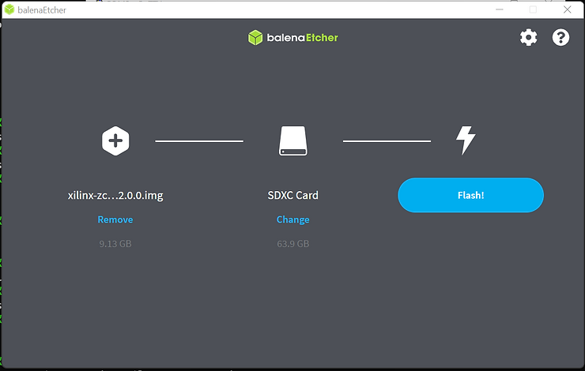

-   Once balenaEtcher has flashed and verified the SD card, you may remove the SD card from the host machine (balenaEtcher ejects the card automatically upon finishing)
    

## Connecting to the ZCU102

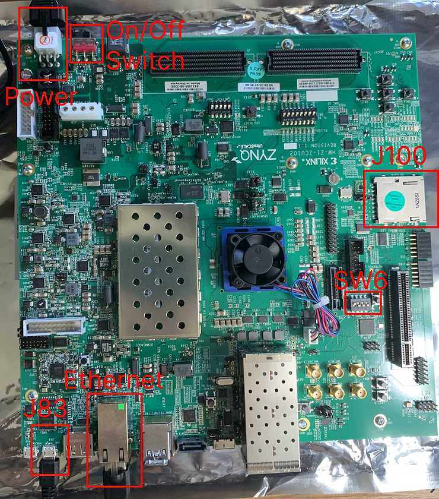

Fig. 1

-   Place the flashed SD card into J100 (see Fig. 1)
    
-   Set SW6 to 0111 (see Fig. 1). Switches facing toward the "ON" text on the ZCU102 are logical 0's. SW6 should look like this:
    

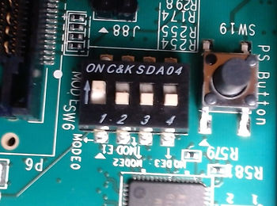

-   Plug the power supply that came with the evaluation kit into the power connector on the ZCU102 (see Fig. 1) and into wall power with the proper adapter for your region
    
-   Connect the ethernet cable to your network and the ethernet port on the ZCU102 (see Fig. 1)
    
-   Connect the USB micro cable to a USB port on your computer and connect it to the J83 (see Fig. 1)
    
-   Open up the terminal and view the boot log through your UART connection to J83
    

```
sudo minicom -D /dev/ttyUSB0
```

-   Press CTRL-A, then press Z
    

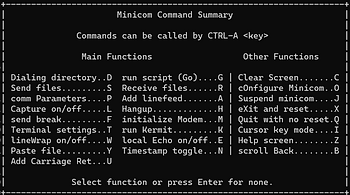

-   Press "W" and there should be a message on the bottom left that line-wrap was turned on - this will prevent the display from truncating text.
    

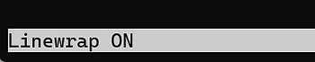

-   Press CTRL-A Z again followed by pressing the letter "O" to configure Minicom.
    
-   Arrow key down to "Serial port setup."
    

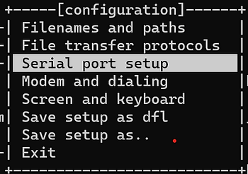

-   Press enter, and make sure that "Bps/Par/Bits" is set to 115200 8N1 and that "Hardware Flow Control" is set to "No."
    
    -   If either setting is incorrect, it can be fixed by pressing the "e" or "f" keys.
        

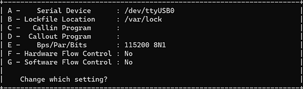

-   Hit the enter key
    
-   Arrow key down to "Save setup as dfl" and hit the enter key again
    

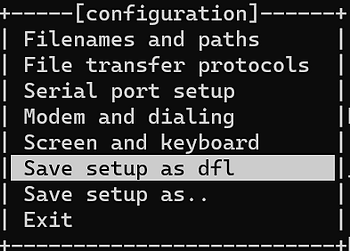

-   Arrow key down to "Exit" and press the enter key.
    
-   On the ZCU102 board, flip the on/off switch (see Fig. 1) to the position closer to the power connector.
    
    -   The fan in the middle of the evaluation board should begin to run, and the LEDs should progress from the color scheme in the left picture to the color scheme in the middle picture.
        
    -   The minicom port should display the message shown on the right and then begin to show a Linux kernel boot log.
        

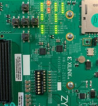


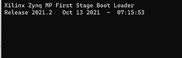

-   After about 15-30 seconds, you should see a prompt that looks like this:
    

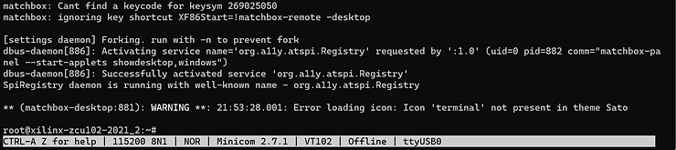

-   You have successfully logged in via UART.
    

## Connect to the ZCU102 via SSH+X11

-   From the minicom terminal prompt, get the IP address:

```
ifconfig
```

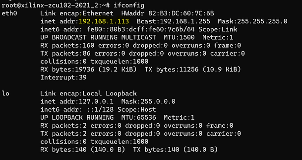

-   The IP address is the quartet of numbers separated by periods following "inet addr" in the eth0 group.
    
-   **From your host machine terminal prompt,** connect to the board via SSH with X11 forwarding enabled with your device's IP address entered in the following command
    

```
ssh -X root@<enter-device-ip-addr>
```

-   The -X option allows your host machine to display output from the target machine via X11 forwarding.
    
-   Type "yes" in response to the prompt authenticating the RSA key fingerprint and press enter
    
-   Enter the password "root" when prompted, and press enter. You should see the following messages.
    

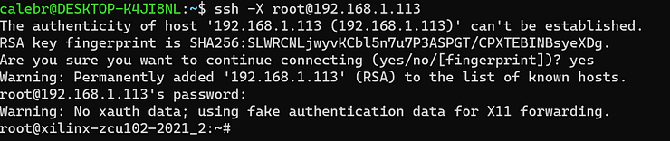

## Running a Semantic Segmentation Example

-   From the SSH connection, download the model to your home directory

```
cd ~
```

```
wget --no-check-certificate https://www.xilinx.com/bin/public/openDownload?filename=fpn-zcu102_zcu104_kv260-r2.0.0.tar.gz -O fpn-zcu102_zcu104_kv260-r2.0.0.tar.gz
```

-   Untar, the model from your home directory
    

```
tar -xzvf fpn-zcu102_zcu104_kv260-r2.0.0.tar.gz
```


-   Download and untar the test data
    

```
wget https://www.xilinx.com/bin/public/openDownload?filename=vitis_ai_runtime_r2.0.0_image_video.tar.gz -O vitis_ai_runtime_r2.0.0_image_video.tar.gz --no-check-certificate
```

```
tar -xzvf vitis_ai_runtime_r2.0.0_image_video.tar.gz -C Vitis-AI/demo/VART/
```

-   Go to the segmentation directory and run the model!
    

```
cd Vitis-AI/demo/VART/segmentation/
```

```
./segmentation ./video/traffic.webm ~/fpn/fpn.xmodel
```

-   On your host machine, you should see a screen showing traffic seen being segmented out by the CNN running on the ZCU102.
    

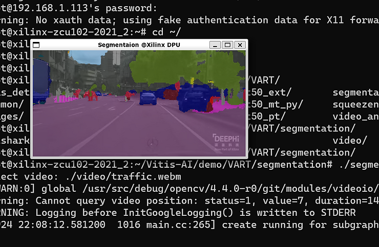

-   The demo will run through the whole video and end, but you can use CTRL+C in the terminal with the segmentation demo running to stop the process early.