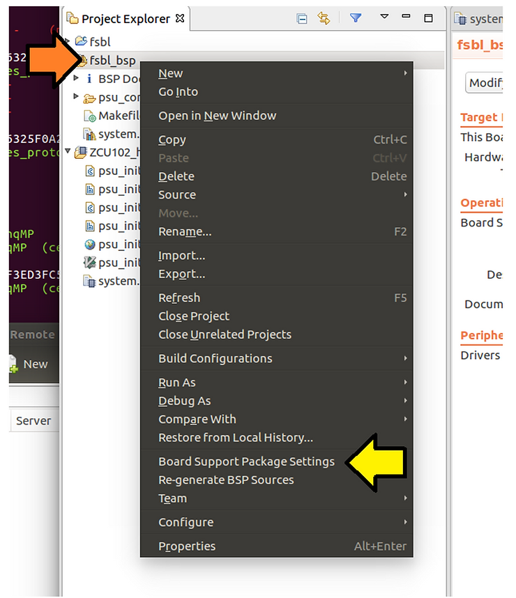
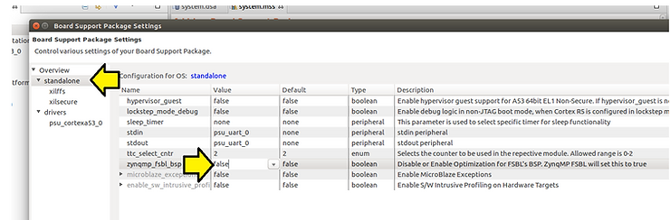
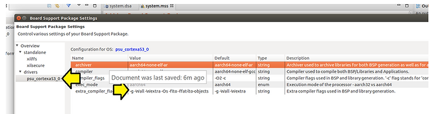
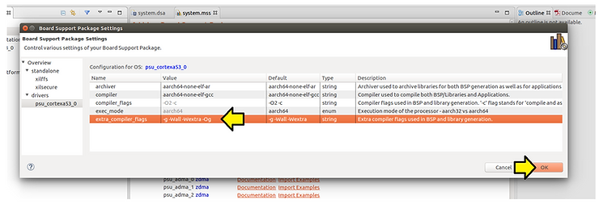
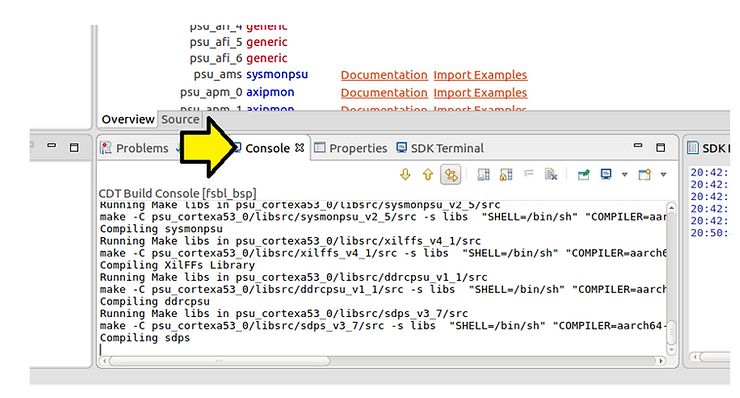
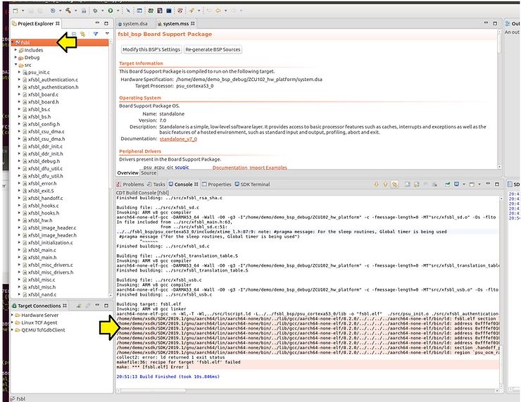
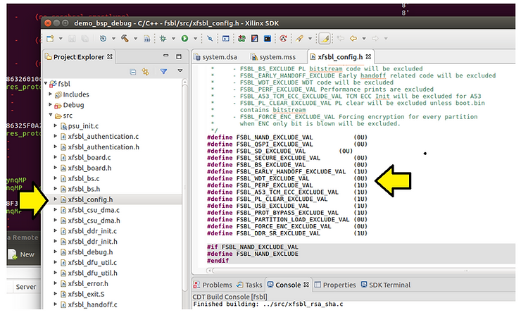
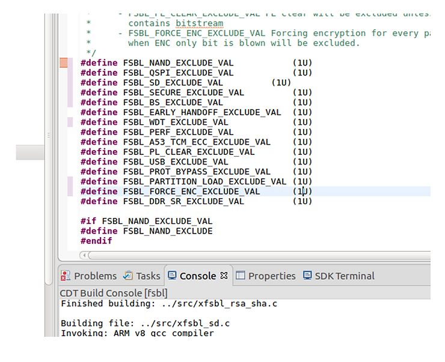
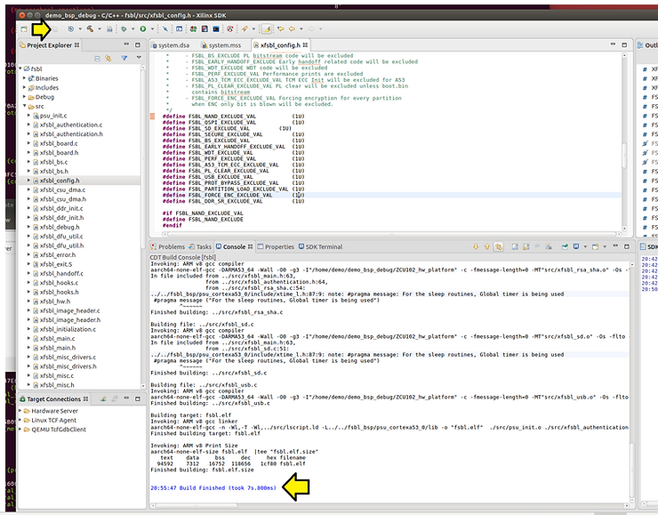
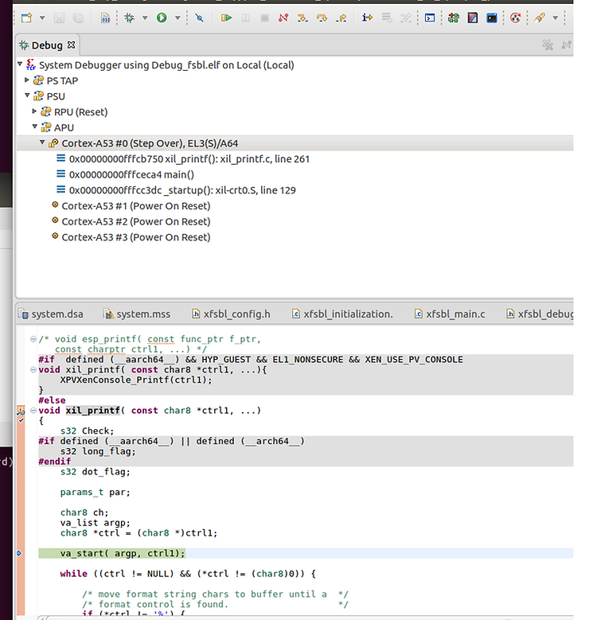

# Enable 2019.1 Xilinx SDK BSP Symbols

This post shows how to enable symbols in a 2019.1 Xilinx BSP.

Remember! You can enable syms in the fsbl or the fsbl\_bsp, but not both.

Step [#1](https://www.centennialsoftwaresolutions.com/blog/hashtags/1): Right-click on **fsbl\_bsp** and click **Board Support Package Settings**.

Step [#2](https://www.centennialsoftwaresolutions.com/blog/hashtags/2): Click **standalone** and set **zynqmp\_fsbl\_bsp** to **false**.

Step [#3](https://www.centennialsoftwaresolutions.com/blog/hashtags/3): Click **psu\_cortexta53\_0**, click on **\-g -Wall -Wextra -Os -flto -ffat-lto-objects**.

Step [#4](https://www.centennialsoftwaresolutions.com/blog/hashtags/4): Set:

**\-g -Wall -Wextra -Os -flto -ffat-lto-objects**

…to

**\-g -Wall -Wextra -Og**

...and click **OK**

You should see the BSP recompile automatically:

You should see the complete build fail if you haven't turned off features in the fsbl:

Step [#5](https://www.centennialsoftwaresolutions.com/blog/hashtags/5): Go into **xfsbl\_config.h** and set all of these:

...to **1U** to turn off code:

Step [#6](https://www.centennialsoftwaresolutions.com/blog/hashtags/6): Click **Save All**. The **FSBL** should auto recompile.

Step [#7](https://www.centennialsoftwaresolutions.com/blog/hashtags/7): To test put a breakpoint in **xil\_printf** (which is in the BSP)

**<u>References</u>**

-   The Xilinx graphic is from \[[link](http://pbs.twimg.com/profile_images/535545777020338176/pEWdIYq__400x400.png)\]