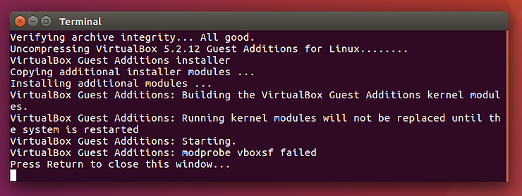

# Enable Copy/Paste and Folder Sharing Between Windows 7 and Ubuntu 16.04.3 on Oracle VM VirtualBox

This post gives the steps to enable copy/paste between Windows 7 and Ubuntu 16.04.3 on Oracle VM VirtualBox Version 5.2.12 r122591 (Qt5.6.2).

**Install Guest Additions**

1\. In Ubuntu open a terminal and type **sudo apt-get upgrade;** (note 1: size of download)

2\. Next, type **sudo apt-get install build-essential module-assistant**;

3\. In the window running the VM, click **Devices > Insert Guest Additions CD image...**

4\. In the **“VBox\_GSa\_5.2.12” contains software intended to be automatically started. Would you like to run it?** window click the **Run** button.

5\. If prompted, enter your password and click the **Authenticate** button.

You will see:

Disregard the **modeprobe vboxsf failed** message. This failure will be cleared after you reboot.

6\. Click the **gear** icon in the upper right corner and click **Shut Down...** then click the **Restart** button.

**Enable and Test Copy/Paste**

1\. In the window around Ubuntu, click **_Devices > Shared Clipboard > Bidirectional_**

2\. Open a Terminal and type **nano**

3\. Type **Testing 1,2,3** into the editor

4\. Select **Testing 1,2,3** with your mouse, right click **Copy**

5\. Open _Notepad_ in Windows

6\. Right click in _Notepad_ and select **Paste**

7\. In _Notepad_ type **4,5,6**

8\. Select **4,5,6** with your mouse, right click and select **Copy**

9\. Back in _nano_, right click in the editor and select **Paste**

10\. Type Control-X then type 'n' to exit nano

**Enable and Test Shared Folders**

1\. In Windows create C:\\winshare

_2._ In the window around Ubuntu, click **_Devices > Shared Folders > Shared Folders Settings..._**

3\. Click the **Folder with a +** icon

4\. For the _Folder Path_ browse to **C:\\winshare**

5\. For the Folder Name: use **share**

6\. Leave all checkbox unchecked and click **OK** and click **OK** again

7\. Open a terminal in Ubuntu and type **cd**

8\. Type **mkdir share**

9\. Type **sudo mount -t vboxsf share share** (copy/paste works so you can copy paste this in)

Note on this step: you may need to use an absolute path for the second share, e.g. **sudo mount -t vboxsf share /mnt/winshare**

10\. Type **cd share**

11\. Type **touch test.txt**

12\. Back in Windows look for C:\\winshare\\test.txt

13\. In Windows create a file called test2.txt

14\. Back in Ubuntu type ls, you should see test.txt and test2.txt

15\. Type **sudo umount ~/share** to unmount the directory

**Notes**

1\. **sudo apt-get upgrade;** downloads 365 MB on a fresh Ubuntu 16.04.3 image where "download updates during install" was not checked.

**Reference**

VirtualBox logo from \[[<u>link</u>](https://www.virtualbox.org/)\]