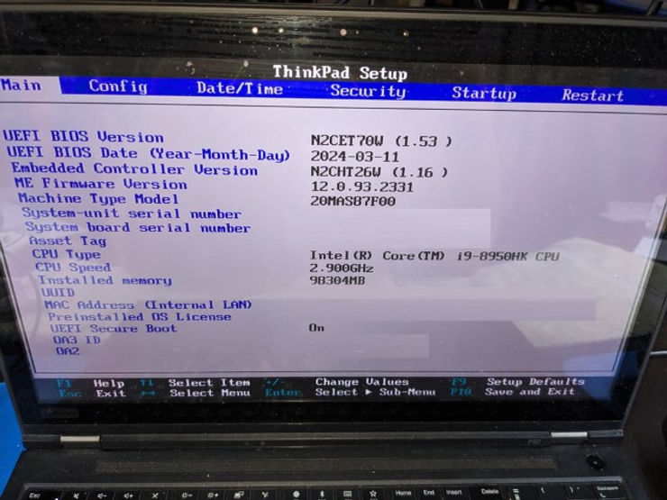
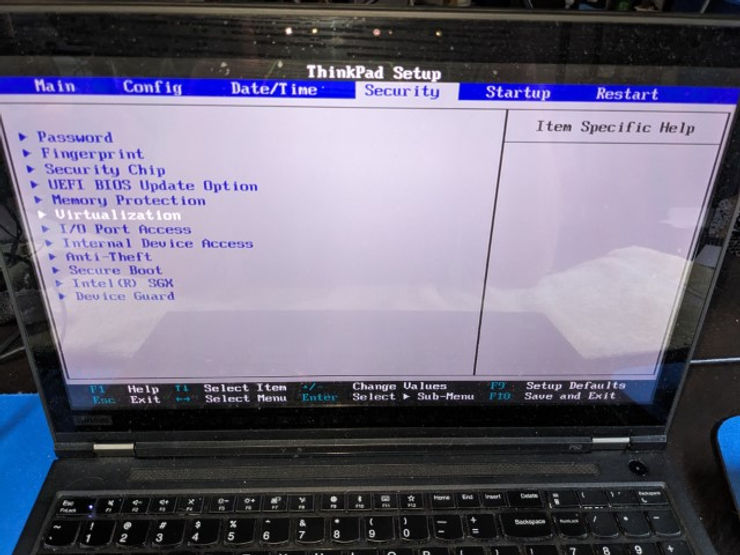
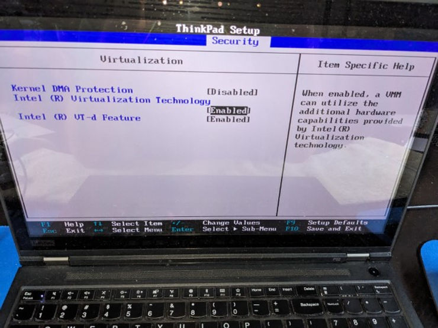
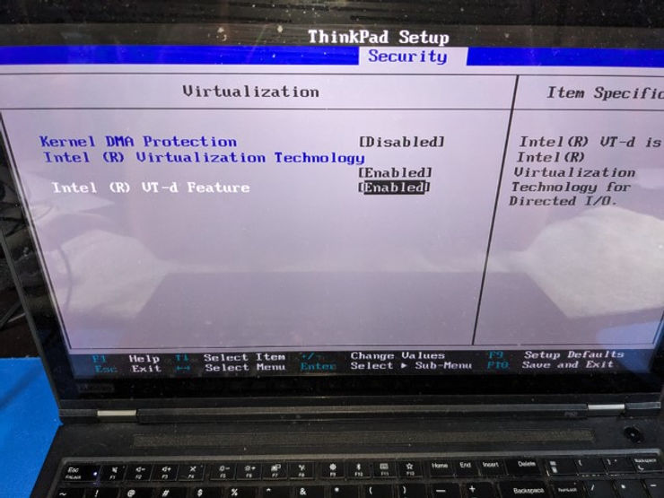
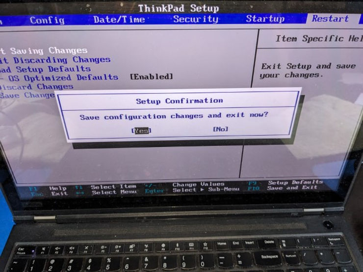

# Enable Intel Virtualization in UEFI BIOS N2CET70W (1.53) Running on a Lenovo 20MAS87F00

This post shows how to enable Intel virtualization on a Lenovo 20MAS87F00 Running UEFI BIOS N2CET70W (1.53).

## Enable Intel Virtualization in UEFI BIOS

1\. Restart your computer and repeatedly press F1.

You should see:

2\. **Arrow Key** to **Security** and press **Enter**

3\. **Arrow Key** to enable **Intel (R) Virtualization Technology**

4\. **Arrow Key** to enable **Intel (R) VT-d Feature**

5\. **Arrow Key** to **Restart** and **Arrow Key** to **Exit Saving Changes**

6\. Press **Enter** to save and restart

